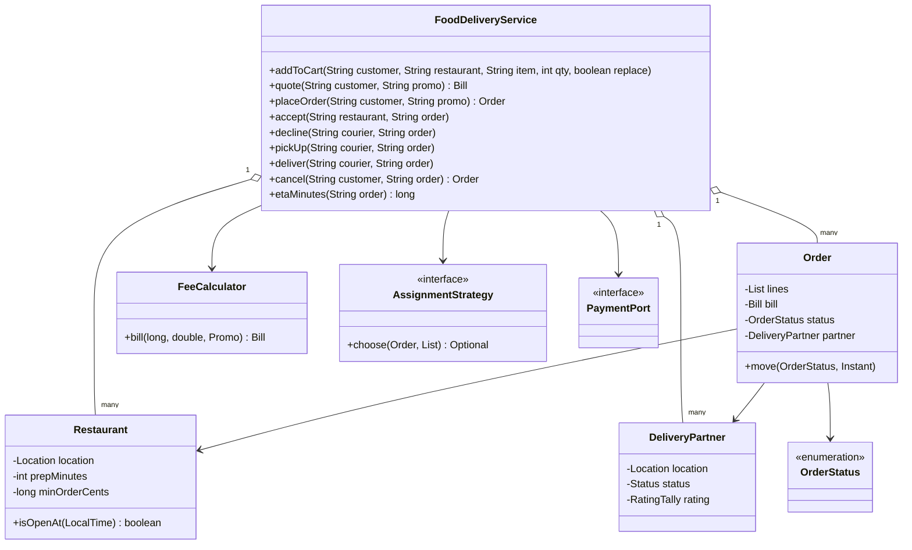
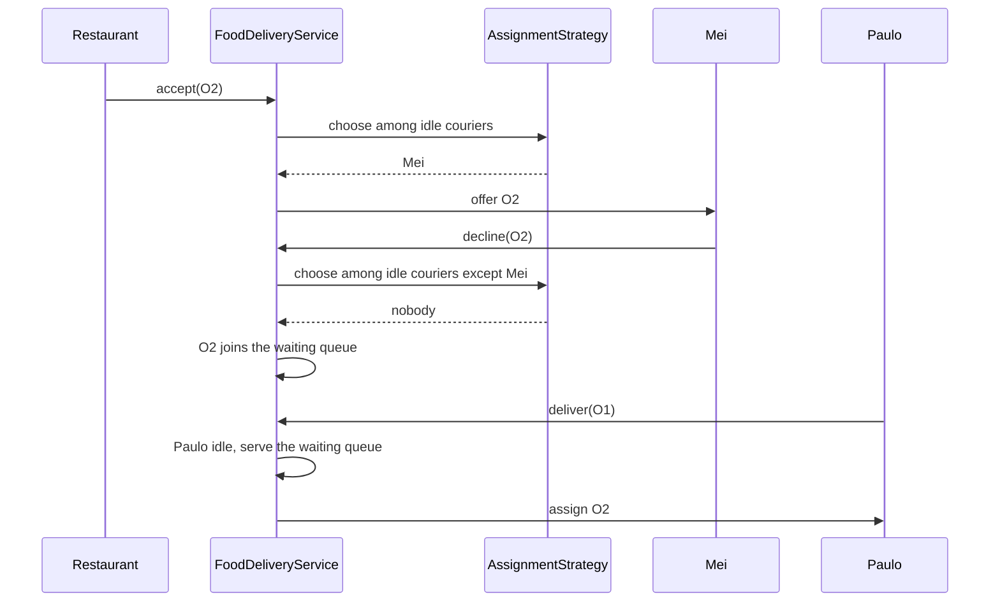
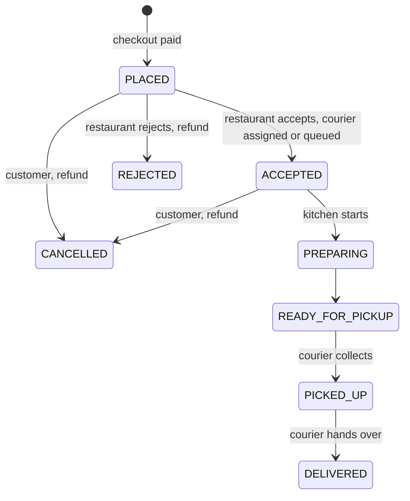

# 🍜 Design an Online Food Delivery Service — Low Level Design (Java)


> Think DoorDash, Swiggy or Deliveroo: three parties (customer, restaurant, courier) moving one order
> through a shared state machine. The interview is about **checkout rules** (one restaurant per cart,
> opening hours, minimum order, delivery radius, fees and promos), **dispatch** (which courier, what if
> they decline, what if nobody is free) and **who may do what, when** (cancel before cooking, rate after
> delivery).

> 📚 **Credit:** Problem inspired by
> [AlgoMaster — Design Online Food Delivery Service](https://algomaster.io/learn/lld/design-online-food-delivery-service)
> (premium lesson, **not** accessed). Everything here is my own original work, based on how public
> food-delivery apps behave. Fees are illustrative. See [References & Credits](#-references--credits).

---

## 📑 On this page

1. [Scoping the Problem](#1-scoping-the-problem)
2. [Finding the Building Blocks](#2-finding-the-building-blocks)
3. [Object Model](#3-object-model)
   - [3.1 Class Responsibilities](#31-class-responsibilities)
   - [3.2 Patterns in Play](#32-patterns-in-play)
   - [3.3 UML Diagrams](#33-uml-diagrams)
   - [Practice Round](#-practice-round)
4. [Implementation Walkthrough](#4-implementation-walkthrough)
5. [Build, Run & Verify](#5-build-run--verify)
6. [Follow-up Scenarios](#6-follow-up-scenarios)
   - [6.1 Choosing a Courier](#61-choosing-a-courier)
   - [6.2 One Order, Three Actors](#62-one-order-three-actors)
   - [6.3 What the Customer Pays](#63-what-the-customer-pays)
7. [Last-Minute Revision](#7-last-minute-revision)
- [References & Credits](#-references--credits)

---

## 1. Scoping the Problem

### 🗣️ Sample conversation

| Candidate asks | Interviewer answers | Design impact |
|---|---|---|
| Can a cart mix restaurants? | No; switching asks to replace the cart. | Cart remembers its restaurant. |
| When is an order refused? | Closed or paused, sold-out item, under minimum, beyond 10 km, payment declined. | Checkout validation, nothing half-created. |
| Fees? | Base delivery + per km beyond 2 km, small-order fee, promo, tax. | `FeeCalculator`, `Promo`. |
| When is a courier assigned? | When the restaurant accepts. | Dispatch at ACCEPTED. |
| Which courier? | Nearest idle one (configurable). | `AssignmentStrategy`. |
| Courier declines / nobody free? | Try the next; otherwise wait in a queue. | Declined set + FIFO waiting queue. |
| Cancel? | Free until the kitchen starts. | Allowed in PLACED / ACCEPTED only. |
| Tracking? | Status pushes and an ETA. | Observer + ETA formula. |

### ✅ Functional requirements

1. Restaurants (menu, hours, prep time, minimum order, pause, sold-out items); customers; couriers online/offline.
2. Cart per customer for one restaurant; quote; checkout with validation and payment.
3. Order lifecycle driven by restaurant (accept/reject/prepare/ready) and courier (decline/pick up/deliver).
4. Dispatch on acceptance; declines move to the next courier; waiting queue served when couriers free up.
5. Customer cancellation before cooking (full refund); restaurant rejection refunds.
6. ETA; ratings for restaurant and courier once per delivered order.

### ⚙️ Non-functional requirements

- A courier carries at most one order at a time; no order is lost when nobody is free.
- Money in cents; every refund matches the charge.
- Status updates pushed to the customer on every change.

---

## 2. Finding the Building Blocks

| Noun / verb | Becomes |
|---|---|
| restaurant, menu | `Restaurant`, `MenuItem` |
| customer, courier | `Customer`, `DeliveryPartner` |
| cart, order, bill | cart maps, `Order` (+ `Line`), `Bill` |
| order states | `OrderStatus` (transition table) |
| fees, promos | `FeeCalculator`, `Promo` |
| choose a courier | `AssignmentStrategy` |
| pay / refund | `PaymentPort` (`FakePayments`) |
| the app | `FoodDeliveryService` (facade) |

---

## 3. Object Model

### 3.1 Class Responsibilities

#### `FoodDeliveryService`
- Cart and checkout, restaurant actions, courier actions, cancellation, ratings, ETA.
- Dispatch: strategy over idle couriers who didn't decline; otherwise FIFO waiting queue.

#### `Order` + `OrderStatus`
- Lines, bill, payment reference, courier, history; `move()` validates the transition.

#### `FeeCalculator`
- Delivery fee by started km, small-order fee, promo on items, tax on the discounted subtotal.

#### `AssignmentStrategy`
- `nearest()` (distance to restaurant, then rating, then id); `bestRatedWithin(km)`.

### 3.2 Patterns in Play

| Pattern | Where | Why |
|---|---|---|
| **State (table-driven)** | `OrderStatus.next()` | Three actors, one legal order of events. |
| **Strategy** | `AssignmentStrategy`, `FeeCalculator` | Dispatch and pricing vary by market. |
| **Observer** | status listeners | Push notifications, live tracking. |
| **Facade** | `FoodDeliveryService` | Single API for three apps. |
| **Queue** | waiting-for-courier deque | Fairness when couriers are scarce. |

**SOLID check**

- **S**: fees, dispatch and state live in separate classes.
- **O**: batching two orders per courier would be a new strategy + courier capacity.
- **L**: any `AssignmentStrategy` returning an idle courier works.
- **I**: listeners get `(order, status)` only.
- **D**: depends on strategy, fee calculator, payment port and `Clock`.

### 3.3 UML Diagrams

#### Class diagram



#### Sequence: accept, decline, wait, serve



#### Order lifecycle



### 🧠 Practice Round

1. Why assign the courier when the restaurant accepts rather than at checkout?
   <details><summary>Hint</summary>The restaurant may reject; a courier tied up for a rejected order is wasted capacity.</details>
2. A courier declines. Why must you remember that?
   <details><summary>Hint</summary>Otherwise the strategy may pick them again immediately (they're still nearest).</details>
3. No courier is free. What happens to the order?
   <details><summary>Hint</summary>It waits in a FIFO queue; whenever a courier becomes free (online, delivered, declined elsewhere, cancellation) the queue is served.</details>
4. How is the ETA computed before pickup?
   <details><summary>Hint</summary>max(kitchen time left, courier's time to the restaurant) + ride to the customer.</details>
5. Tax on the full subtotal or after the promo?
   <details><summary>Hint</summary>A policy decision; here tax applies to the discounted item subtotal and fees are untaxed.</details>

---

## 4. Implementation Walkthrough

### 📁 Project structure

```
FoodDelivery/
├── pom.xml
└── src/
    ├── main/java/com/lld/booking/food/
    │   ├── FoodDeliveryApp.java            # a lunch rush
    │   ├── model/                          # Location, Restaurant, MenuItem, Customer, DeliveryPartner, RatingTally,
    │   │                                   # Order, OrderStatus, Bill, Promo, FoodException
    │   ├── dispatch/                       # AssignmentStrategy
    │   ├── pricing/                        # FeeCalculator
    │   └── service/                        # FoodDeliveryService, PaymentPort, FakePayments, ManualClock
    └── test/java/com/lld/booking/food/
        └── FoodDeliveryServiceTest.java
```

### 🧾 The bill

```java
long extraKm = ceil(max(0, distance - 2));
long delivery = 199 + extraKm * 50;
long small = subtotal < 1500 ? 150 : 0;
long discount = promo == null ? 0 : min(maxDiscount, subtotal * percent / 100)   // if subtotal >= min
long tax = round((subtotal - discount) * 5 / 100);
total = subtotal + delivery + small - discount + tax;
```

### 🛵 Dispatch

```java
idle = couriers AVAILABLE and not in order.declinedBy();
chosen = strategy.choose(order, idle);
if (chosen present) { courier BUSY; order.assign(courier); }
else waitingForCourier.addLast(order);
// served again on: goOnline, deliver, decline (the decliner may suit another order), cancel
```

### ⏱️ ETA

```java
before pickup: round(max(kitchenMinutesLeft, courierToRestaurantMinutes) + restaurantToCustomerMinutes)
after pickup:  courierToCustomerMinutes            // at 20 km/h
```

### ⏱️ Complexity

| Operation | Cost |
|---|---|
| checkout | O(cart lines) |
| dispatch | O(couriers) per attempt; O(queue × couriers) when serving the queue |
| ETA | O(1) |

---

## 5. Build, Run & Verify

### With Maven

```bash
cd Booking-and-Reservation/FoodDelivery
mvn test
mvn compile exec:java
```

### Without Maven (plain JDK 17+)

```bash
cd Booking-and-Reservation/FoodDelivery
javac -d out $(find src/main -name "*.java")
java -cp out com.lld.booking.food.FoodDeliveryApp
```

### Demo output

```
> Cart rules
   [refused] Your cart has items from Tandoor House; replace it?
   quote with LUNCH20: items $31.00 + delivery $3.49 + small-order $0.00 - promo $5.00 + tax $1.30 = $30.79

> Ana orders; the restaurant accepts; the nearest courier is assigned
   [push to Ana] O1 PLACED
   [push to Ana] O1 ACCEPTED
   O1 Ana from Tandoor House 30.79 [ACCEPTED, Paulo], ETA 35 min

> Raj orders too; Mei declines; nobody else is free, so the order waits
   [push to Raj] O2 PLACED
   [push to Raj] O2 ACCEPTED
   assigned to Mei
   after Mei declines: O2 Raj from Tandoor House 18.79 [ACCEPTED], waiting: [O2 Raj from Tandoor House 18.79 [ACCEPTED]]

> The kitchen cooks, Paulo delivers Ana's order and then picks up Raj's
   [push to Ana] O1 PREPARING
   [refused] The kitchen already started on O1; it can't be cancelled
   [push to Ana] O1 READY_FOR_PICKUP
   [push to Ana] O1 PICKED_UP
   [push to Ana] O1 DELIVERED
   Raj's order now: O2 Raj from Tandoor House 18.79 [ACCEPTED, Paulo], ETA 19 min

> Refused orders
   [refused] Tandoor House doesn't deliver that far (28.3 km)
   [refused] Sushi Bar is not taking orders right now
   [refused] Mango lassi is sold out

> Raj cancels before cooking starts: full refund, Paulo is freed
   [push to Raj] O2 CANCELLED
   O2 Raj from Tandoor House 18.79 [CANCELLED]; Paulo is AVAILABLE
   payments net: $30.79
```

### ✅ What the tests cover

| Area | Tests |
|---|---|
| Checkout | 6 parameterised bills (distance steps, small-order fee, promo cap and minimum, tax); one restaurant per cart; every checkout refusal (empty, closed, minimum, distance, sold out, paused, unknown promo, declined card) and cart cleared after success |
| Dispatch | nearest courier at acceptance (not before); declines move on and are remembered, new courier serves the waiting order; FIFO queue after a delivery; best-rated-within-radius strategy; couriers can't go offline mid-delivery or pick up unready food |
| Lifecycle | full journey with ETAs at each stage and pushed events; illegal transitions and rejection refund; cancellation window (placed, accepted, not after preparing) with refunds and courier freed; rating once after delivery |
| Concurrency | 30 orders accepted in parallel with 5 couriers → 5 assigned (all different), 25 waiting |

**18 tests, all passing.**

---

## 6. Follow-up Scenarios

### 6.1 Choosing a Courier

- Nearest by straight line is a start; real systems use road ETA, courier heading, and **batching**
  (one courier, two orders from the same restaurant).
- Offer with a timeout: unanswered offers count as a decline after N seconds.
- At scale, couriers live in a geo index (see the ride-sharing design in this folder) and dispatch
  solves a small assignment problem every few seconds instead of first-come-first-served.

### 6.2 One Order, Three Actors

- A transition table keeps restaurant, courier and customer actions consistent.
- Every change is an event: tracking pages, push notifications and analytics subscribe to it.
- Late events (courier marks picked up before restaurant marks ready) are rejected, not guessed.

### 6.3 What the Customer Pays

- Fees by distance, small-order fee, promos with caps and minimums, tax: all in integer cents.
- Surge fees when couriers are scarce; tips added at or after delivery.
- Partial refunds for missing items would add refund lines to the order.

### 🚀 More follow-ups to practice

1. **Scheduled orders** (deliver at 19:30).
2. **Group orders** with split payment.
3. **Courier earnings** (per trip, distance, surge, tips) and payouts.
4. **Restaurant capacity**: auto-pause when too many orders are in the kitchen.
5. **Live location streaming** to the customer.

---

## 7. Last-Minute Revision

- Cart = one restaurant; checkout validates hours, pause, stock, minimum, distance, payment.
- Bill: delivery by started km, small-order fee, promo (cap, minimum), tax on discounted items.
- Status table: PLACED → ACCEPTED → PREPARING → READY → PICKED_UP → DELIVERED; REJECTED; CANCELLED before cooking.
- Dispatch at acceptance; strategy over idle, non-declined couriers; FIFO queue otherwise.
- ETA = max(kitchen left, courier to restaurant) + ride.
- One courier, one order; ratings once after delivery.

---

## 📚 References & Credits

| Resource | How it was used |
|---|---|
| [AlgoMaster.io — Design Online Food Delivery Service (LLD)](https://algomaster.io/learn/lld/design-online-food-delivery-service) | Inspiration for the **problem choice** only. The lesson is premium and was **not** accessed. |
| [Vehicle routing problem — Wikipedia](https://en.wikipedia.org/wiki/Vehicle_routing_problem) | Public background for dispatch follow-ups. |
| [Refactoring.Guru — State](https://refactoring.guru/design-patterns/state), [Strategy](https://refactoring.guru/design-patterns/strategy), [Observer](https://refactoring.guru/design-patterns/observer) | Public pattern definitions. |
| [Mermaid](https://mermaid.js.org/) | Diagrams rendered by GitHub. |
| [JUnit 5 User Guide](https://junit.org/junit5/docs/current/user-guide/) | Testing. |

**Originality statement**

- This repository is a **personal learning project** for LLD interview preparation.
- The AlgoMaster lesson is premium content that I have not accessed. No text, code, diagrams,
  headings or other material from it (or any paid source) is reproduced here.
- All headings, source code, explanations, tables, diagrams, tests and exercises were written
  independently from publicly known behaviour and the public references above.
- Restaurants and people in the demo are fictional. This project is **not affiliated with or endorsed by**
  AlgoMaster.io or any delivery company.
- For the original lesson, please support the author at [algomaster.io](https://algomaster.io).

---

> ⭐ Try the Practice Round before reading the code, then compare your design with this one.
