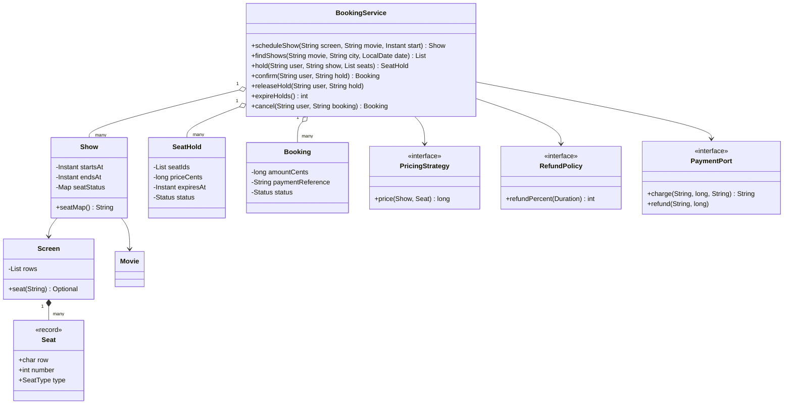
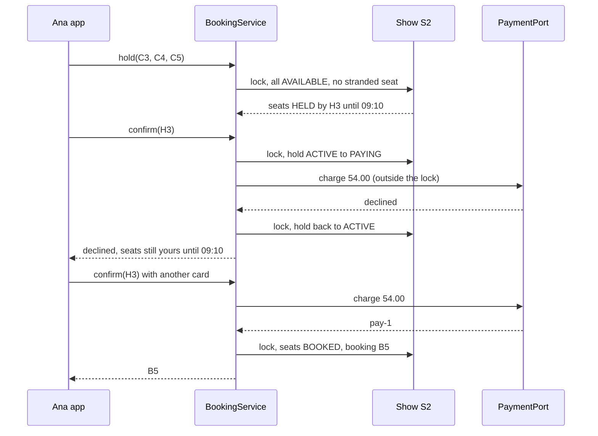
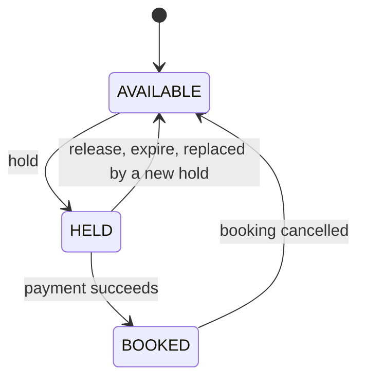

# 🎬 Design a Movie Ticket Booking System — Low Level Design (Java)


> Think BookMyShow or Fandango. The catalogue is simple; the interview is about the **seat**: two people
> click C5 at the same moment, one person picks seats and walks away, a card is declined, the app retries
> after a timeout, someone cancels 3 hours before the show. The answer is a **two-phase booking**
> (hold → pay → confirm) guarded by a **per-show lock**.

> 📚 **Credit:** Problem inspired by
> [AlgoMaster — Design Movie Booking System](https://algomaster.io/learn/lld/design-movie-booking-system)
> (premium lesson, **not** accessed). Everything here is my own original work, based on how public
> ticketing sites behave. See [References & Credits](#-references--credits).

---

## 📑 On this page

1. [Scoping the Problem](#1-scoping-the-problem)
2. [Finding the Building Blocks](#2-finding-the-building-blocks)
3. [Object Model](#3-object-model)
   - [3.1 Class Responsibilities](#31-class-responsibilities)
   - [3.2 Patterns in Play](#32-patterns-in-play)
   - [3.3 UML Diagrams](#33-uml-diagrams)
   - [Practice Round](#-practice-round)
4. [Implementation Walkthrough](#4-implementation-walkthrough)
5. [Build, Run & Verify](#5-build-run--verify)
6. [Follow-up Scenarios](#6-follow-up-scenarios)
   - [6.1 One Seat, Many Clicks](#61-one-seat-many-clicks)
   - [6.2 Holds, Payments and Timeouts](#62-holds-payments-and-timeouts)
   - [6.3 Selling the Whole Room](#63-selling-the-whole-room)
7. [Last-Minute Revision](#7-last-minute-revision)
- [References & Credits](#-references--credits)

---

## 1. Scoping the Problem

### 🗣️ Sample conversation

| Candidate asks | Interviewer answers | Design impact |
|---|---|---|
| What is booked? | Specific seats for a show (movie + screen + time). | Seat state lives on the `Show`. |
| Seat types? | Regular, premium, recliner at different prices. | `SeatType`; `PricingStrategy`. |
| Peak pricing? | Evenings and weekends cost more. | Multipliers in the strategy. |
| How long can seats be held? | 10 minutes to pay. | `SeatHold` with expiry. |
| Card declined? | Keep the seats until the hold expires. | Hold returns to ACTIVE. |
| App retries confirm? | Must not charge twice. | Confirm is idempotent per hold. |
| Cancellation? | ≥24h full refund, 2–24h half, <2h nothing. | `RefundPolicy`. |
| Scheduling? | No overlapping shows on a screen; 15 min cleaning. | Overlap check with a gap. |
| Seat gaps? | Don't leave a single seat stranded. | Optional lone-seat rule. |

### ✅ Functional requirements

1. Cinemas, screens (row layouts), movies; schedule shows without overlap (+ cleaning gap).
2. Find shows by movie, city and date; seat map and availability.
3. Hold 1–10 seats; one live hold per user per show; lone-seat rule (optional).
4. Confirm = pay; idempotent; declined payment keeps the hold; expired holds release seats.
5. Cancel with a time-based refund; not after the show starts.

### ⚙️ Non-functional requirements

- A seat can never be sold twice; nobody pays for seats they didn't get.
- Holds can't expire in the middle of a payment.
- Shows are independent: different shows book in parallel.

---

## 2. Finding the Building Blocks

| Noun / verb | Becomes |
|---|---|
| cinema, screen, seat | `Cinema`, `Screen` (`Row`s), `Seat`, `SeatType` |
| movie, screening | `Movie`, `Show` (seat statuses) |
| "keep these for me" | `SeatHold` |
| tickets | `Booking` |
| prices, refunds | `PricingStrategy`, `RefundPolicy` |
| payments | `PaymentPort` (`FakePayments`) |
| box office | `BookingService` (facade) |

---

## 3. Object Model

### 3.1 Class Responsibilities

#### `BookingService`
- Scheduling with overlap check; search; hold / confirm / release / expire / cancel.
- Synchronises on the `Show` for every seat change; calls payments outside that lock.

#### `Show`
- Movie, screen, start/end, and each seat's status (AVAILABLE / HELD / BOOKED) with its owner.

#### `SeatHold`
- Seats, price, expiry; ACTIVE → PAYING → CONFIRMED, or RELEASED / EXPIRED.

#### `Booking`
- Paid seats, payment reference; CONFIRMED → CANCELLED with the refunded amount.

### 3.2 Patterns in Play

| Pattern | Where | Why |
|---|---|---|
| **Facade** | `BookingService` | One API for the box office and apps. |
| **Strategy** | `PricingStrategy`, `RefundPolicy` | Cinemas differ on prices and refunds. |
| **Ports & Adapters** | `PaymentPort` | Any payment provider; fake in tests. |
| **State (enums)** | seat status, hold status, booking status | Explicit lifecycles. |
| **Lock per aggregate** | `synchronized (show)` | Correct and parallel across shows. |

**SOLID check**

- **S**: shows hold seat state, strategies price, the service coordinates.
- **O**: a "student discount" is a new `PricingStrategy` decorator.
- **L**: any `RefundPolicy` works.
- **I**: payments only need `charge` and `refund`.
- **D**: depends on ports, strategies and `Clock`.

### 3.3 UML Diagrams

#### Class diagram



#### Sequence: hold, declined card, retry



#### Seat lifecycle



### 🧠 Practice Round

1. Why not book seats directly when the customer clicks them?
   <details><summary>Hint</summary>Payment takes time and can fail. A short hold reserves the seats without selling them; abandoned holds free up automatically.</details>
2. Why is the payment call made outside the show's lock?
   <details><summary>Hint</summary>A slow payment would block everyone booking that show. Mark the hold PAYING (so it can't expire), release the lock, pay, then lock again to finalise.</details>
3. The app times out and calls confirm again. What prevents a second charge?
   <details><summary>Hint</summary>Keep hold → booking; a confirmed hold returns its booking without charging.</details>
4. What is a "lone seat" and how do you detect it?
   <details><summary>Hint</summary>A free seat whose both sides are taken or a wall, created by this selection. Check only neighbours of the selected seats.</details>
5. How do you make "two users, one seat" safe across many servers?
   <details><summary>Hint</summary>Conditional updates in the database (`UPDATE seat SET status='HELD' WHERE show=? AND seat IN (...) AND status='AVAILABLE'` + row count), or a distributed lock/Redis `SETNX` per seat with TTL.</details>

---

## 4. Implementation Walkthrough

### 📁 Project structure

```
MovieBooking/
├── pom.xml
└── src/
    ├── main/java/com/lld/booking/movie/
    │   ├── MovieBookingApp.java            # a Friday at a small cinema
    │   ├── model/                          # Cinema, Screen, Seat, SeatType, Movie, Show, SeatHold, Booking, BookingException
    │   ├── pricing/                        # PricingStrategy, RefundPolicy
    │   ├── payment/                        # PaymentPort, FakePayments
    │   └── service/                        # BookingService, ManualClock
    └── test/java/com/lld/booking/movie/
        └── BookingServiceTest.java
```

### 🪑 Hold

```java
synchronized (show) {
    expireHoldsOf(show);                                   // lazy expiry
    validate 1..10 distinct seats, show not started;
    release this user's previous ACTIVE hold on the show;
    every seat AVAILABLE?  price += pricing.price(show, seat) + fee;
    if (noLoneSeats && loneSeatLeft(show, wanted) != null) throw ...;
    mark seats HELD by the new hold (expires in 10 min);
}
```

### 💳 Confirm (lock, pay outside, lock)

```java
synchronized (show) { if already confirmed return booking; require ACTIVE; hold.setStatus(PAYING); }
reference = payments.charge(...);            // on decline: lock, back to ACTIVE, throw
synchronized (show) { create Booking; seats BOOKED; hold CONFIRMED; }
```

### ↩️ Cancel

```java
refund = amount * refundPolicy.refundPercent(timeUntilShow) / 100;   // 100 / 50 / 0
seats back to AVAILABLE; payments.refund(reference, refund);
```

### ⏱️ Complexity

| Operation | Cost |
|---|---|
| hold | O(k) seats + O(H) holds on the show for lazy expiry |
| confirm / cancel | O(k) |
| schedule | O(shows on the screen) |

---

## 5. Build, Run & Verify

### With Maven

```bash
cd Booking-and-Reservation/MovieBooking
mvn test
mvn compile exec:java
```

### Without Maven (plain JDK 17+)

```bash
cd Booking-and-Reservation/MovieBooking
javac -d out $(find src/main -name "*.java")
java -cp out com.lld.booking.movie.MovieBookingApp
```

### Demo output

```
> Scheduling (130 min film + 15 min cleaning)
   [refused] Screen 1 is busy with The Long Orbit until 2027-09-10T16:25:00Z
   The Long Orbit in Lisbon today: [S1 The Long Orbit @ Screen 1 2027-09-10T14:00:00Z, S2 The Long Orbit @ Screen 1 2027-09-10T19:00:00Z]

> Ana holds three premium seats for the evening show (evening price x1.25)
   H3 [C3, C4, C5] $54.00 until 2027-09-10T09:10:00Z [ACTIVE]
   [refused] Seat C5 is already taken
   [refused] That would leave seat C6 stranded on its own; shift your selection
   (C7 would strand C6 between Ana's seats and Ben's)
   [refused] That would leave seat C8 stranded on its own; shift your selection
   (C6+C7 would strand C8 at the end of the row)
      A ........  REGULAR
      B ........  REGULAR
      C ..hhhhhh  PREMIUM
      D ....  RECLINER

> Paying
   [refused] Payment declined; your seats stay held until 2027-09-10T09:10:00Z
   B5 ana [C3, C4, C5] $54.00 [CONFIRMED]
   retry after a network error returns the same booking: B5

> Ben walks away; his hold expires after 10 minutes
   [refused] Hold H4 is EXPIRED; please select seats again
      A ........  REGULAR
      B ........  REGULAR
      C ..XXX...  PREMIUM
      D ....  RECLINER

> Cancellations follow the refund policy
   B7 cara [D1, D2] $51.00 [CANCELLED, refunded $25.50]  (6h50 before: 50%)
   [refused] The show has started; tickets can't be cancelled
   evening seats free: 25, payments net: $100.50
```

### ✅ What the tests cover

| Area | Tests |
|---|---|
| Scheduling | overlap with the cleaning gap at the exact boundary (before and after), other screens independent; search by city/date, only future shows; 6 peak-pricing cases (weekday/weekend × day/evening, 18:00 boundary) |
| Holds | held seats blocked, price with fees; validation (empty, duplicates, unknown, >10, started); new hold replaces the old one; expiry at exactly 10 min and explicit release; lone-seat rule (middle and edge), filling a whole house legally, rule switched off |
| Paying | confirm owner-only and idempotent (one charge); declined card keeps the hold; 5 refund-window cases (100/100/50/50/0) with seats freed and net money checked; no cancel twice or after start |
| Concurrency | 50 users racing for the same two seats → exactly one booking and one charge |

**22 tests, all passing.**

---

## 6. Follow-up Scenarios

### 6.1 One Seat, Many Clicks

- In one process: lock per show (here). Across servers: the database is the referee — conditional
  update of seat rows (optimistic), or `SELECT ... FOR UPDATE` on the show's seats in seat-id order.
- Redis per-seat keys with TTL (`SET seat:S2:C5 hold:H3 NX EX 600`) make holds expire by themselves.

### 6.2 Holds, Payments and Timeouts

- The hold's TTL must outlive the payment; the PAYING state prevents expiry mid-payment.
- Idempotency: the hold id is the natural idempotency key for the payment provider too.
- If payment succeeds but the confirmation crashes, a reconciliation job completes or refunds it.

### 6.3 Selling the Whole Room

- The lone-seat rule avoids unsellable gaps; "best available" seat suggestions pick contiguous blocks
  near the centre.
- Dynamic pricing (demand-based), memberships, group bookings, and wheelchair spaces with companion seats.

### 🚀 More follow-ups to practice

1. **Waitlists** for sold-out shows, notified when seats free up.
2. **Food and beverage add-ons** in the same order.
3. **Gift cards and loyalty points** as payment methods.
4. **Seat map streaming** (live updates to all viewers of a show).
5. **Multi-city search** with caching of show listings.

---

## 7. Last-Minute Revision

- Show owns seat statuses: AVAILABLE → HELD → BOOKED (and back).
- Hold 1–10 seats for 10 minutes; one live hold per user per show; lone-seat rule.
- Confirm: lock → PAYING → pay outside lock → lock → BOOKED; idempotent; decline keeps the hold.
- Cancel: refund 100 / 50 / 0 % by time to show; seats freed.
- Scheduling: no overlap including the cleaning gap.
- Money in cents; peak multipliers in basis points.

---

## 📚 References & Credits

| Resource | How it was used |
|---|---|
| [AlgoMaster.io — Design Movie Booking System (LLD)](https://algomaster.io/learn/lld/design-movie-booking-system) | Inspiration for the **problem choice** only. The lesson is premium and was **not** accessed. |
| [Two-phase commit / reservation patterns — Wikipedia](https://en.wikipedia.org/wiki/Two-phase_commit_protocol) | Public background on reserve-then-confirm. |
| [Redis SET with NX and EX](https://redis.io/docs/latest/commands/set/) | Public reference for TTL-based seat holds (follow-up). |
| [Mermaid](https://mermaid.js.org/) | Diagrams rendered by GitHub. |
| [JUnit 5 User Guide](https://junit.org/junit5/docs/current/user-guide/) | Testing. |

**Originality statement**

- This repository is a **personal learning project** for LLD interview preparation.
- The AlgoMaster lesson is premium content that I have not accessed. No text, code, diagrams,
  headings or other material from it (or any paid source) is reproduced here.
- All headings, source code, explanations, tables, diagrams, tests and exercises were written
  independently from publicly known behaviour and the public references above.
- Cinemas and movies in the demo are fictional. This project is **not affiliated with or endorsed by**
  AlgoMaster.io or any ticketing company.
- For the original lesson, please support the author at [algomaster.io](https://algomaster.io).

---

> ⭐ Try the Practice Round before reading the code, then compare your design with this one.
