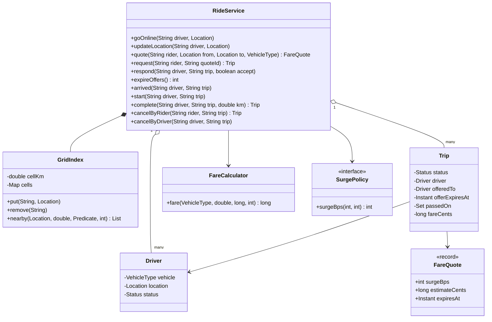
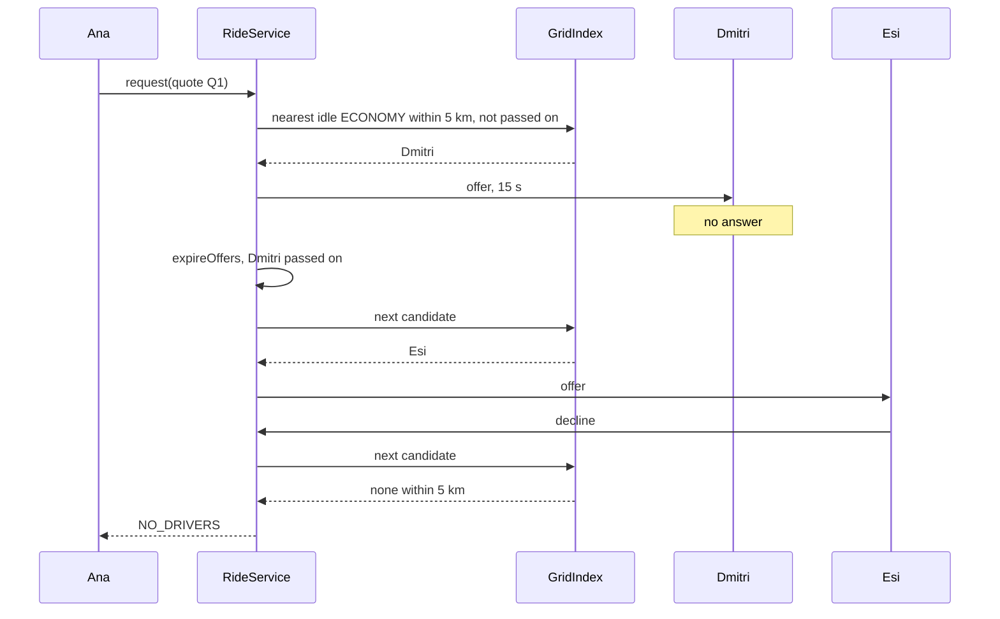
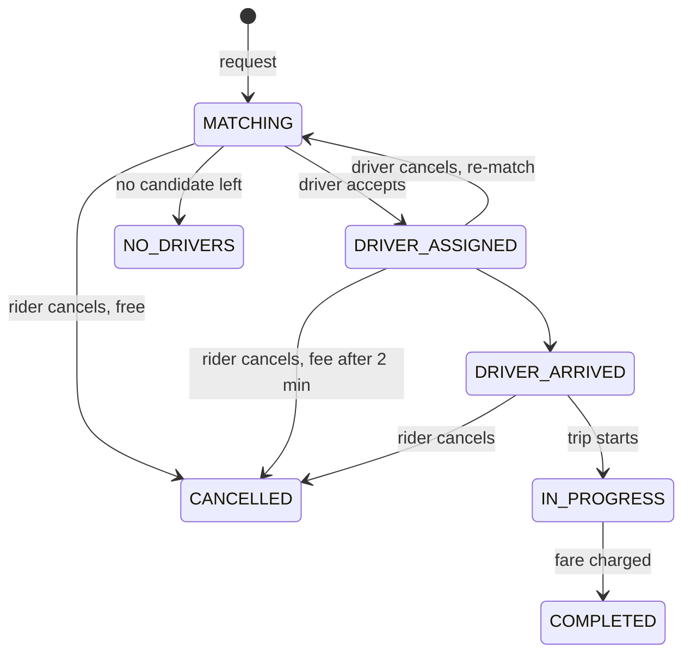

# 🚕 Design a Ride-Sharing Service (Uber) — Low Level Design (Java)


> Riders want a car now; drivers are moving dots on a map. The interview is about **finding nearby
> drivers fast** (a spatial index, not a scan of every driver), **offering a trip to one driver at a
> time** without ever double-booking them, **what happens on decline, timeout or cancellation**, and
> **pricing** (upfront quote, surge when demand beats supply, final fare from the real trip).

> 📚 **Credit:** Problem inspired by
> [AlgoMaster — Design Uber](https://algomaster.io/learn/lld/design-uber)
> (premium lesson, **not** accessed). Everything here is my own original work, based on how public
> ride-hailing apps behave and standard spatial-indexing ideas. Tariffs are illustrative.
> See [References & Credits](#-references--credits).

---

## 📑 On this page

1. [Scoping the Problem](#1-scoping-the-problem)
2. [Finding the Building Blocks](#2-finding-the-building-blocks)
3. [Object Model](#3-object-model)
   - [3.1 Class Responsibilities](#31-class-responsibilities)
   - [3.2 Patterns in Play](#32-patterns-in-play)
   - [3.3 UML Diagrams](#33-uml-diagrams)
   - [Practice Round](#-practice-round)
4. [Implementation Walkthrough](#4-implementation-walkthrough)
5. [Build, Run & Verify](#5-build-run--verify)
6. [Follow-up Scenarios](#6-follow-up-scenarios)
   - [6.1 Finding Drivers Fast](#61-finding-drivers-fast)
   - [6.2 One Driver, One Offer](#62-one-driver-one-offer)
   - [6.3 Pricing Honestly](#63-pricing-honestly)
7. [Last-Minute Revision](#7-last-minute-revision)
- [References & Credits](#-references--credits)

---

## 1. Scoping the Problem

### 🗣️ Sample conversation

| Candidate asks | Interviewer answers | Design impact |
|---|---|---|
| Ride products? | Economy, Premium, XL with their own tariffs. | `VehicleType` with base/km/min/minimum. |
| Price before booking? | Yes, an upfront estimate valid 2 minutes. | `FareQuote` locking the surge. |
| Surge? | When nearby requests exceed idle drivers. | `SurgePolicy` on local demand/supply. |
| How far do we look? | 5 km for drivers. | Grid index search radius. |
| Several drivers at once? | No: one offer at a time, 15 s to answer. | OFFERED status + timeout. |
| Decline / no answer? | Next nearest driver; if none, "no drivers". | Passed-on set; NO_DRIVERS. |
| Cancellation? | Free within 2 minutes of assignment, then a fee; driver cancel → re-match. | Rules in the service. |
| Final fare? | Real distance and time, quote's surge. | `FareCalculator` at completion. |
| Ratings? | Both ways, once per trip. | `RatingTally` on rider and driver. |

### ✅ Functional requirements

1. Drivers go online/offline and send locations; idle drivers are searchable by location.
2. Quote: distance, estimated minutes, surge, estimate; valid 2 minutes.
3. Request with a valid quote (one active trip per rider); offer to the nearest idle driver of the product within 5 km.
4. Accept / decline / timeout; next candidate or NO_DRIVERS.
5. Arrive → start → complete (fare from real km and started minutes × locked surge, charged).
6. Rider cancel (free while matching or ≤ 2 min after assignment, else fee; not once started); driver cancel before arrival → re-match.
7. Two-way ratings after completion.

### ⚙️ Non-functional requirements

- A driver is never offered or assigned two trips at once.
- Nearby search touches only nearby cells, not all drivers.
- Deterministic results (distance, then id) for tests and fairness.

---

## 2. Finding the Building Blocks

| Noun / verb | Becomes |
|---|---|
| rider, driver, car type | `Rider`, `Driver` (+ `Status`), `VehicleType` |
| place | `Location` |
| price before booking | `FareQuote` |
| ride | `Trip` (+ `Status`) |
| "who is near?" | `GridIndex` |
| tariff, surge | `FareCalculator`, `SurgePolicy` |
| pay | `PaymentPort` (`FakePayments`) |
| the platform | `RideService` (facade) |

---

## 3. Object Model

### 3.1 Class Responsibilities

#### `RideService`
- Driver presence and the idle-driver index; quotes with surge; requests and sequential offers;
  trip steps; cancellations; ratings. One lock for dispatch state.

#### `GridIndex`
- Cells of fixed size → ids; `nearby(center, radius, filter, limit)` scans the (2r+1)² cells around
  the centre, filters by exact distance, sorts nearest first.

#### `Trip`
- Quote, driver, current offer and its expiry, passed-on drivers, timestamps, fare, fee, history.

#### `FareCalculator` / `SurgePolicy`
- `max(minimum, (base + km·perKm + min·perMin) × surge)`; surge from demand/supply ratio, 0.1 steps, cap 2.5.

### 3.2 Patterns in Play

| Pattern | Where | Why |
|---|---|---|
| **State (table-driven)** | `Trip.Status`, `Driver.Status` | Legal steps only; OFFERED blocks double offers. |
| **Strategy** | `SurgePolicy`, `FareCalculator` | Pricing varies by city. |
| **Spatial index** | `GridIndex` | O(nearby) search instead of O(all drivers). |
| **Facade** | `RideService` | One API for rider and driver apps. |
| **Ports & Adapters** | `PaymentPort` | Payment provider independent. |

**SOLID check**

- **S**: index finds, calculator prices, service decides.
- **O**: a "prefer highly rated drivers" matcher can replace the nearest filter.
- **L**: any `SurgePolicy` works.
- **I**: payments expose charge/refund only.
- **D**: depends on policy, calculator, port and `Clock`.

### 3.3 UML Diagrams

#### Class diagram



#### Sequence: timeout, decline, accept



#### Trip lifecycle



### 🧠 Practice Round

1. How do you find the nearest drivers without checking all of them?
   <details><summary>Hint</summary>Bucket drivers into grid cells (geohash/S2/H3 in production); look only at the cells within the radius; sort those few by exact distance.</details>
2. Why offer a trip to one driver at a time?
   <details><summary>Hint</summary>Broadcasting makes several drivers race and most of them lose; one offer with a short timeout is fair and avoids double assignment. (Some systems batch-assign instead.)</details>
3. What stops two riders being offered the same driver?
   <details><summary>Hint</summary>The driver becomes OFFERED under the dispatch lock; the index filter only accepts AVAILABLE drivers.</details>
4. Surge goes up after Ana saw her quote. What does she pay?
   <details><summary>Hint</summary>The quote's surge, if she books before the quote expires: the multiplier is locked into the quote.</details>
5. Why charge a cancellation fee only after two minutes?
   <details><summary>Hint</summary>Mistakes are free; cancelling after the driver has been driving to you for a while costs them time.</details>

---

## 4. Implementation Walkthrough

### 📁 Project structure

```
RideSharing/
├── pom.xml
└── src/
    ├── main/java/com/lld/booking/ride/
    │   ├── RideSharingApp.java             # an evening of rides
    │   ├── model/                          # Location, Rider, Driver, VehicleType, FareQuote, Trip, RatingTally, RideException
    │   ├── geo/                            # GridIndex
    │   ├── pricing/                        # FareCalculator, SurgePolicy
    │   └── service/                        # RideService, PaymentPort, FakePayments, ManualClock
    └── test/java/com/lld/booking/ride/
        └── RideServiceTest.java
```

### 🗺️ Grid search

```java
Cell c = cellOf(center);
long rings = ceil(radiusKm / cellKm);
for (dx in -rings..rings) for (dy in -rings..rings)
    for (id in cells[c.cx + dx, c.cy + dy]) if (distance(id) <= radius && filter(id)) found.add(id);
sort found by distance, then id; take limit
```

### 📨 Offer loop

```java
next = index.nearby(pickup, 5 km, AVAILABLE && same vehicle && not passedOn, 1);
if (next.isEmpty()) trip → NO_DRIVERS;
else { driver → OFFERED; trip.offer(driver, now + 15 s); }
// decline / timeout: passedOn.add(driver); driver → AVAILABLE; offer next
// accept: driver → ON_TRIP (removed from the index); trip → DRIVER_ASSIGNED
```

### 💵 Surge and fare

```java
ratio = requestsNearbyLast5Min / max(1, idleDriversNearby);
surge = ratio <= 1 ? 1.0 : min(2.5, round10(1 + 0.5 * (ratio - 1)));
fare  = max(minimum, (base + perKm * km + perMin * minutes) * surge);
```

### ⏱️ Complexity

| Operation | Cost |
|---|---|
| index put/remove | O(1) |
| nearby | O(cells in radius + drivers there · log) |
| request / respond | O(nearby) |
| expireOffers | O(open trips) |

---

## 5. Build, Run & Verify

### With Maven

```bash
cd Booking-and-Reservation/RideSharing
mvn test
mvn compile exec:java
```

### Without Maven (plain JDK 17+)

```bash
cd Booking-and-Reservation/RideSharing
javac -d out $(find src/main -name "*.java")
java -cp out com.lld.booking.ride.RideSharingApp
```

### Demo output

```
> Ana gets a quote and requests; the nearest economy driver gets the offer
   Q1 ECONOMY 10.0 km ~20 min, surge x1.00, estimate $19.50 (valid until 2027-11-05T18:02:00Z)
   offered to Dmitri (ECONOMY) (nearest ECONOMY car; Farah drives PREMIUM)

> Dmitri doesn't answer in 15 s; Esi declines; Goran is too far, so...
   expired offers: 1, now offered to Esi (ECONOMY)
   after Esi declines: T2 Ana ECONOMY [NO_DRIVERS]

> Ana tries again once Dmitri is back on his phone
   T4 Ana ECONOMY [DRIVER_ASSIGNED, Dmitri]  2027-11-05T18:00:15Z DRIVER_ASSIGNED (Dmitri, 3 min away)
   [refused] Ana already has an active trip

> Ride
   T4 Ana ECONOMY [COMPLETED, Dmitri, fare $20.23] (quoted $19.50)
   [refused] Can't rate this driver

> Rush hour: many requests near the office, few drivers -> surge
   Ben's quote: Q12 ECONOMY 10.0 km ~20 min, surge x2.50, estimate $48.75 (valid until 2027-11-05T18:26:15Z)
   Ben cancels 3 minutes after assignment: T13 Ben ECONOMY [CANCELLED, Dmitri, fee $5.00]

> A driver drops an accepted trip; the rider is re-matched
   d1 cancelled -> T15 Ana ECONOMY [MATCHING], now offered to Goran (ECONOMY)

   payments net: $25.23; Dmitri rated 5.0
```

### ✅ What the tests cover

| Area | Tests |
|---|---|
| Geo | grid search vs **brute force** on 400 drivers with moves and removals, 50 random queries (radius, order, limit) |
| Pricing | 6 fare cases (minimum, products, surge); 7 surge cases (no surge, ratio steps, rounding, cap); surge locked by the quote, demand window expiry |
| Matching | nearest idle driver of the product within the radius; decline → next; timeout boundary (14 s vs 15 s) → NO_DRIVERS and rider freed; late accept rejected; assigned driver leaves the index; quote ownership/expiry, one active trip, offline/online rules |
| Trip | full trip fare from real km and started minutes, charged, driver back in the index at drop-off; cancellation free/fee boundary at 2 minutes, not after start, not someone else's; driver cancel re-matches excluding them; ratings once each after completion |
| Concurrency | 20 simultaneous requests, 5 drivers → 5 trips offered to 5 different drivers, 15 NO_DRIVERS |

**25 tests, all passing.**

---

## 6. Follow-up Scenarios

### 6.1 Finding Drivers Fast

- Fixed grid (here) → **geohash / S2 / H3** cells, sharded by region; drivers send a location every few
  seconds and are re-bucketed only when they change cells.
- Road ETA instead of straight-line distance (routing engine), and the driver's heading.

### 6.2 One Driver, One Offer

- OFFERED state + timeout; offers are sequential per trip, and a driver has at most one offer.
- At scale, dispatch runs in **batches** every few seconds and solves an assignment problem (minimise
  total pickup time) instead of greedy nearest-first.
- Partitioning dispatch by city/region keeps a single writer per area.

### 6.3 Pricing Honestly

- Quote locks price inputs for a short window; the final fare uses the real trip but the same surge.
- Surge per geo cell, recomputed every minute from recent requests vs idle drivers.
- Fraud checks: detours (actual ≫ estimated distance) trigger a fare review.

### 🚀 More follow-ups to practice

1. **Shared rides** (pool): matching riders along the same route.
2. **Scheduled rides**.
3. **Driver earnings and payouts** with a ledger.
4. **Live tracking** via location streams to the rider.
5. **Safety features**: trip sharing, SOS, route deviation alerts.

---

## 7. Last-Minute Revision

- Idle drivers live in a spatial index; search = nearby cells, exact distance, nearest first.
- Quote = estimate + locked surge, 2-minute validity; one active trip per rider.
- Offer to one driver at a time (OFFERED, 15 s); decline/timeout → next; none → NO_DRIVERS.
- Trip: MATCHING → ASSIGNED → ARRIVED → IN_PROGRESS → COMPLETED; driver cancel → MATCHING.
- Fare = max(minimum, (base + km + minutes) × locked surge); cancel fee after 2 minutes.
- Ratings both ways, once, after completion.

---

## 📚 References & Credits

| Resource | How it was used |
|---|---|
| [AlgoMaster.io — Design Uber (LLD)](https://algomaster.io/learn/lld/design-uber) | Inspiration for the **problem choice** only. The lesson is premium and was **not** accessed. |
| [Geohash — Wikipedia](https://en.wikipedia.org/wiki/Geohash) | Public background for cell-based spatial indexes. |
| [H3: Uber's hexagonal hierarchical spatial index (Uber Engineering blog)](https://www.uber.com/blog/h3/) | Public background for the follow-up. |
| [Assignment problem — Wikipedia](https://en.wikipedia.org/wiki/Assignment_problem) | Public background on batch dispatch. |
| [Mermaid](https://mermaid.js.org/) | Diagrams rendered by GitHub. |
| [JUnit 5 User Guide](https://junit.org/junit5/docs/current/user-guide/) | Testing. |

**Originality statement**

- This repository is a **personal learning project** for LLD interview preparation.
- The AlgoMaster lesson is premium content that I have not accessed. No text, code, diagrams,
  headings or other material from it (or any paid source) is reproduced here.
- All headings, source code, explanations, tables, diagrams, tests and exercises were written
  independently from publicly known behaviour and the public references above.
- "Uber" is used only as the common name of this interview problem; this project is not affiliated
  with Uber Technologies, Inc. or with AlgoMaster.io.
- For the original lesson, please support the author at [algomaster.io](https://algomaster.io).

---

> ⭐ Try the Practice Round before reading the code, then compare your design with this one.
