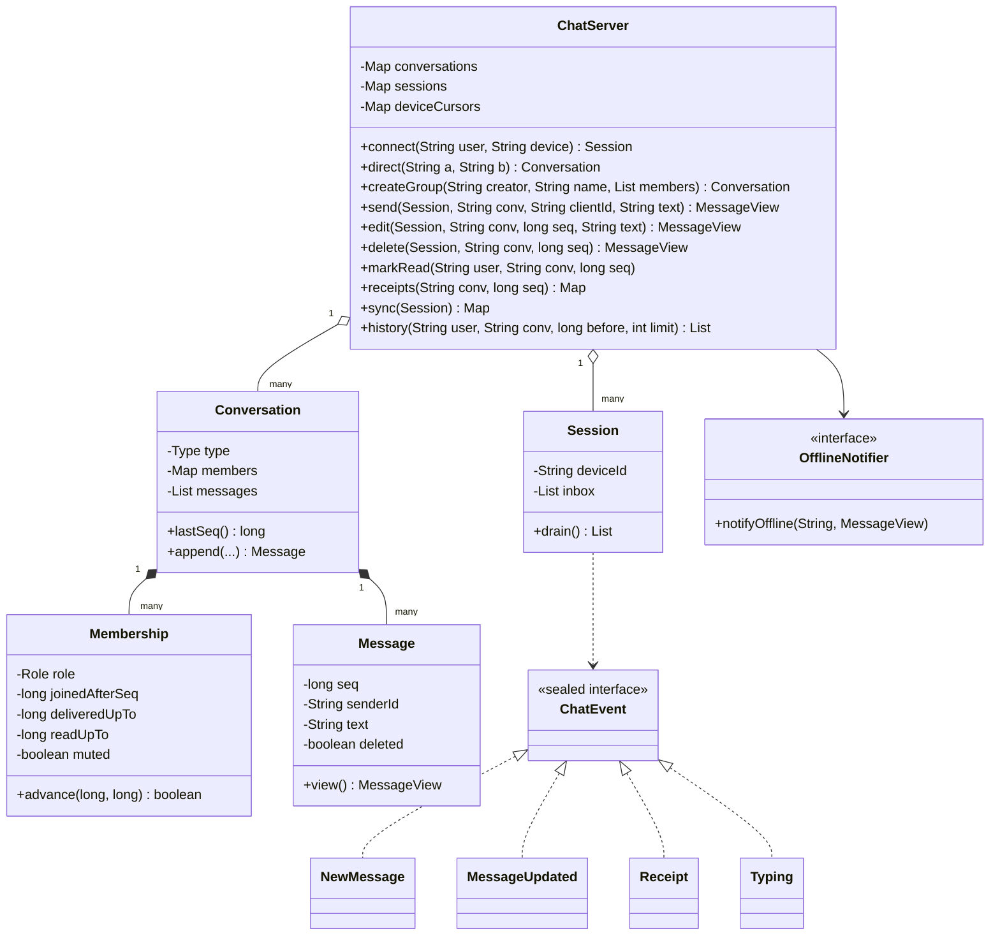
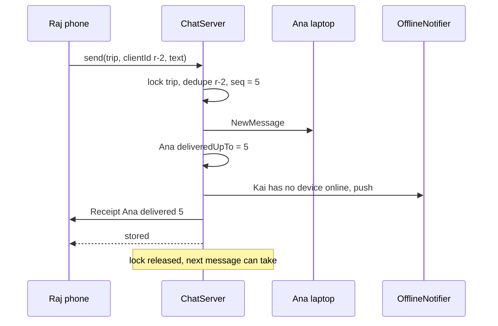
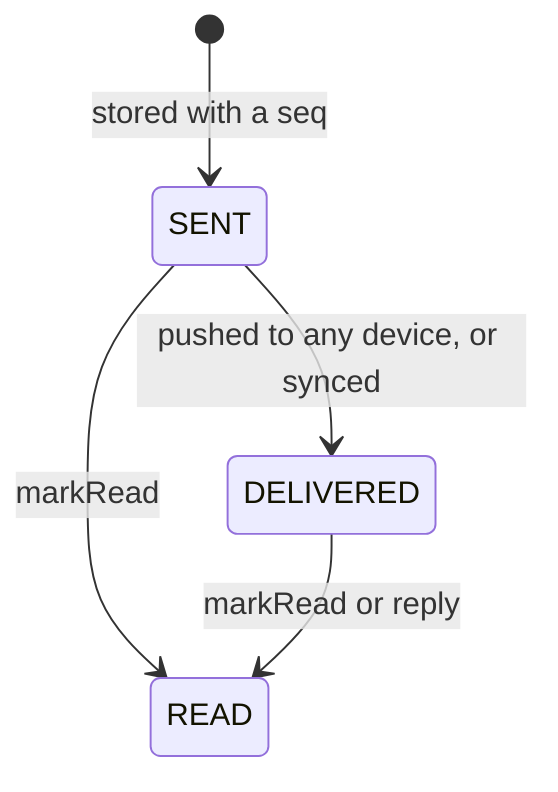

# 💭 Design a Chat Application — Low Level Design (Java)


> WhatsApp/Slack in one class diagram. Storing messages is easy; the interview is about
> **order** (everyone sees the same sequence), **delivery** (online push, offline catch-up, ticks),
> **multiple devices per user**, **retries without duplicates**, and **group rules** (admins, who can
> see what, what happens when the last admin leaves).

> 📚 **Credit:** Problem inspired by
> [AlgoMaster — Design Chat Application](https://algomaster.io/learn/lld/design-chat-application)
> (premium lesson, **not** accessed). Everything here is my own original work, based on how common
> messaging apps behave and publicly known design patterns. See [References & Credits](#-references--credits).

---

## 📑 On this page

1. [Scoping the Problem](#1-scoping-the-problem)
2. [Finding the Building Blocks](#2-finding-the-building-blocks)
3. [Object Model](#3-object-model)
   - [3.1 Class Responsibilities](#31-class-responsibilities)
   - [3.2 Patterns in Play](#32-patterns-in-play)
   - [3.3 UML Diagrams](#33-uml-diagrams)
   - [Practice Round](#-practice-round)
4. [Implementation Walkthrough](#4-implementation-walkthrough)
5. [Build, Run & Verify](#5-build-run--verify)
6. [Follow-up Scenarios](#6-follow-up-scenarios)
   - [6.1 One Order for Everyone](#61-one-order-for-everyone)
   - [6.2 Ticks Without a Row per Message](#62-ticks-without-a-row-per-message)
   - [6.3 Offline, Many Devices, Flaky Networks](#63-offline-many-devices-flaky-networks)
7. [Last-Minute Revision](#7-last-minute-revision)
- [References & Credits](#-references--credits)

---

## 1. Scoping the Problem

### 🗣️ Sample conversation

| Candidate asks | Interviewer answers | Design impact |
|---|---|---|
| One-to-one and groups? | Both; groups up to N members with admins. | `Conversation` (DIRECT / GROUP), `Membership` with roles. |
| Ordering? | Everyone must see messages in the same order. | Per-conversation **sequence number** assigned under a lock. |
| Multiple devices? | Phone and laptop at the same time. | `Session` per device; messages go to all devices. |
| Offline users? | Push notification now, messages when they reconnect. | `OfflineNotifier` + `sync` from a per-device cursor. |
| Ticks? | Sent, delivered, read. | Two pointers per member: `deliveredUpTo`, `readUpTo`. |
| Retries on bad networks? | Must not create duplicates. | Client-generated message id (idempotency). |
| Edit / delete? | Edit within 15 minutes; delete for everyone leaves "message deleted". | Edit window; tombstones. |
| New group member sees old messages? | No. | `joinedAfterSeq` hides earlier history. |
| Presence, typing, mute, block? | Yes; typing is not stored. | Presence from sessions; ephemeral events; flags. |

### ✅ Functional requirements

1. Users connect devices; presence = any open device; last seen when the last one closes.
2. Direct chat is unique per pair; groups have admins who add/remove/promote; last admin leaving promotes the oldest member.
3. Send (with optional reply), idempotent per client message id; blocked senders are refused in direct chats.
4. Push to all devices of all members except the sending device; offline members get a push notification unless muted.
5. Delivered when any device receives it; read when the user marks it; group status = slowest member.
6. Edit (sender, within window), delete for everyone (sender or group admin).
7. History pages, search, unread counts; reconnect sync from the device's cursor.

### ⚙️ Non-functional requirements

- Same order on every device, no gaps, even with concurrent senders.
- Conversations independent (parallel); per-conversation operations atomic.
- Receipts O(1) per update.

---

## 2. Finding the Building Blocks

| Noun / verb | Becomes |
|---|---|
| person | `User` |
| device connection | `Session` (event inbox + cursor) |
| chat, group | `Conversation` (+ `Type`) |
| member, admin, ticks | `Membership` (role, joinedAfterSeq, deliveredUpTo, readUpTo, muted) |
| message | `Message` (stored) / `MessageView` (snapshot sent to clients) |
| server pushes | `ChatEvent` (NewMessage, MessageUpdated, Receipt, Typing) |
| ticks | `DeliveryStatus` |
| phone notification | `OfflineNotifier` |
| backend | `ChatServer` (facade) |

---

## 3. Object Model

### 3.1 Class Responsibilities

#### `ChatServer` (facade)
- Users, sessions, presence, blocks; direct/group lifecycle; send/edit/delete/typing; receipts; history/search/sync.
- Every conversation operation runs inside `synchronized (conversation)`.

#### `Conversation`
- Members in join order, messages in an array (index = seq − 1), client-id index for deduplication.

#### `Membership`
- Role, visibility boundary, receipt pointers that only move forward, mute flag.

#### `Session`
- A device: receives `ChatEvent`s; its cursor (last seq per conversation) is kept by the server per device id, so reconnecting resumes where it stopped.

### 3.2 Patterns in Play

| Pattern | Where | Why |
|---|---|---|
| **Facade** | `ChatServer` | One API for clients. |
| **Observer** | sessions receiving `ChatEvent`s, `OfflineNotifier` | Push model; notification bridge. |
| **Sealed event hierarchy** | `ChatEvent` | Exhaustive handling on the client side. |
| **Idempotency key** | client message id | Safe retries. |
| **Sequencer** | per-conversation seq under lock | Total order per conversation. |
| **Tombstone** | deleted messages | Keep positions stable for sync. |
| **Watermarks** | `deliveredUpTo` / `readUpTo` | O(1) receipts. |

**SOLID check**

- **S**: `Conversation` stores, `Membership` tracks a member, `ChatServer` enforces rules.
- **O**: new event types extend the sealed interface; new notifiers plug in.
- **L**: any `OfflineNotifier` works.
- **I**: clients only handle `ChatEvent`s; notifiers see one method.
- **D**: time via `Clock`; notifications via an interface.

### 3.3 UML Diagrams

#### Class diagram



#### Sequence: send to an online and an offline member



#### Message ticks as seen by the sender



### 🧠 Practice Round

1. Two people send at the same instant. How does every device end up with the same order?
   <details><summary>Hint</summary>The server, not the clients, decides order: take the conversation lock, assign the next seq, push, release. Client clocks are never trusted for ordering.</details>
2. The app sends a message, the connection drops before the reply, and it retries. What stops a duplicate?
   <details><summary>Hint</summary>The app generates an id per message; the server keeps (sender, client id) → message and returns the stored one on a repeat.</details>
3. How do you store "read" for a 200-member group without 200 rows per message?
   <details><summary>Hint</summary>A read pointer per member: "read everything up to #n". A message is read by a member iff its seq ≤ their pointer.</details>
4. Raj's phone was offline for an hour. How does it catch up without downloading everything?
   <details><summary>Hint</summary>Each device remembers the last seq it saw per conversation; sync returns only newer messages.</details>
5. Why does "delete for everyone" keep the message slot?
   <details><summary>Hint</summary>Clients sync by seq; removing it would look like a gap. The tombstone also shows "message deleted" to others.</details>

---

## 4. Implementation Walkthrough

### 📁 Project structure

```
ChatApplication/
├── pom.xml
└── src/
    ├── main/java/com/lld/messaging/chat/
    │   ├── ChatApp.java                    # three friends, a DM and a group
    │   ├── model/                          # User, Conversation, Membership, Message, MessageView,
    │   │                                   # ChatEvent, DeliveryStatus, ChatException
    │   └── server/                         # ChatServer, Session, OfflineNotifier, ManualClock
    └── test/java/com/lld/messaging/chat/
        └── ChatServerTest.java
```

### ✉️ Send: dedupe, sequence, fan-out, all under the conversation lock

```java
synchronized (c) {
    Membership sender = requireMember(c, from.userId());
    Optional<Message> duplicate = c.byClientId(from.userId(), clientMessageId);
    if (duplicate.isPresent()) return duplicate.get().view();         // retry
    // blocked? reply target visible?
    Message m = c.append(from.userId(), text, now, replyToSeq, false); // seq = lastSeq + 1
    c.rememberClientId(from.userId(), clientMessageId, m);
    sender.advance(m.seq(), m.seq());                                 // you've read your own message
    fanOut(c, m, from);                                              // push in seq order
}
```

### 📬 Fan-out

```java
for (Membership member : c.members()) {
    for (Session s : sessions of member) if (s != origin) s.push(new NewMessage(..., silent = muted || isSender));
    if (isSender) continue;
    if (member has a device online) member.advance(delivered = seq)  -> Receipt event
    else if (!member.muted()) offlineNotifier.notifyOffline(member, view);
}
```

### 🔄 Sync after reconnect

```java
long after = Math.max(session.lastSeq(conv), membership.joinedAfterSeq());
List<MessageView> missed = c.range(after, c.lastSeq());
session.seen(conv, c.lastSeq());
membership.advance(c.lastSeq(), 0);                                   // delivered now
```

### ⏱️ Complexity

| Operation | Cost |
|---|---|
| send | O(M + D) members and devices |
| markRead / receipts | O(1) update / O(M) to list |
| history page | O(limit) |
| sync | O(conversations + missed) |

---

## 5. Build, Run & Verify

### With Maven

```bash
cd Communications-and-Messaging/ChatApplication
mvn test
mvn compile exec:java
```

### Without Maven (plain JDK 17+)

```bash
cd Communications-and-Messaging/ChatApplication
javac -d out $(find src/main -name "*.java")
java -cp out com.lld.messaging.chat.ChatApp
```

### Demo output

```
> Direct chat: Ana texts Raj from her phone
   stored #1 ana: Hi Raj! Free on Saturday?; ticks: {raj=DELIVERED}
   Raj's phone <- #1 ana: Hi Raj! Free on Saturday?
   Ana's laptop (same account, other device) <- #1 ana: Hi Raj! Free on Saturday? (silent)
   Raj opens the chat; ticks: {raj=READ}
   #1 ana: Hi Raj! Free on Saturday?
   (network retry with the same client id returned the stored #1, no duplicate)

> Group: Ana creates 'Lisbon trip' with Raj; Kai is offline
   [push notification to kai] #5 raj: Welcome Kai! Hotel or apartment?
   [refused] Raj is not an admin of Lisbon trip

> Kai connects and syncs (sees only what came after he joined)
   G2 #4 * Ana added Kai
   G2 #5 raj: Welcome Kai! Hotel or apartment?
   Kai: #6 kai: Apartment, definitely [reply to #5]
   Raj's question #5 ticks: {ana=DELIVERED, kai=READ}

> Edits, deletes and their limits
   [refused] Only the sender can edit #7
   [refused] #7 can only be edited within 15 minutes
   #2 raj: (message deleted)
   #6 kai: (message deleted) [reply to #5]
   (Ana is an admin, so she may remove any message in her group)

> Raj goes offline, then comes back on the same phone
   Raj online? false, last seen 2027-01-15T18:25:00Z
   [push notification to raj] #8 kai: Booked the apartment!
   catch-up D1 #2 ana: (muted chat: no push for this one)
   catch-up G2 #8 kai: Booked the apartment!
   unread for Raj: dm=1, trip=2

> Last admin leaves the group
   #8 kai: Booked the apartment!
   #9 * Ana left
   #10 * Raj is now an admin

> Blocking
   [refused] Kai is not accepting your messages
```

### ✅ What the tests cover

| Area | Tests |
|---|---|
| Direct | one conversation per pair; other devices get it, sending device doesn't; client-id dedup; one-way blocking; validation (empty, too long, bad reply, non-member, closed session) |
| Receipts | SENT → DELIVERED (on sync) → READ with clamping and receipt events; group status = slowest; read pointer never moves back, unread ignores own and deleted; muted = silent + no push |
| Groups | admin-only management, size limit, direct chats have no admins; new members can't see, reply to or search older history; removed members stop receiving; last admin leaving promotes the oldest member |
| Editing | sender-only, window boundary (15:00 ok, 15:01 not); tombstones keep seq, admins moderate, deleted not searchable; history pages backwards |
| Presence & sync | multi-device presence and last seen; reconnect syncs only missed, new device gets all; typing not stored |
| Concurrency | 3 senders × 200 messages: 601 seqs, a watcher receives all 600 in order with no gaps |

**20 tests, all passing.**

---

## 6. Follow-up Scenarios

### 6.1 One Order for Everyone

- The server assigns a **per-conversation sequence number**; clients sort by it and detect gaps.
- One process: a lock per conversation (this design). Many servers: route each conversation to one
  owner (consistent hashing) or use an atomic counter / partitioned log keyed by conversation id
  (see the Pub-Sub System in this folder).
- Client clocks are only for display; show "sending…" locally, replace with the server's seq on ack.

### 6.2 Ticks Without a Row per Message

- Per-member **watermarks**: delivered-up-to and read-up-to. Status of message *n* for a member is
  derived. Group status = minimum over members.
- Read receipts can be batched ("read up to #57") and are cheap to sync across the reader's devices.
- Privacy option: users disable read receipts → only report delivered.

### 6.3 Offline, Many Devices, Flaky Networks

- Every device keeps a **cursor** per conversation; reconnect = "give me everything after #n".
- **Idempotent send** with client ids makes retries safe; the ack carries the server seq.
- Offline users get a push through a notification service (see the Notification System in this folder);
  muted chats skip it.
- End-to-end encryption changes where fan-out happens (per-device encryption), not the ordering model.

### 🚀 More follow-ups to practice

1. **Attachments**: upload to blob storage, message holds a reference and thumbnail.
2. **Reactions** and **threads** (replies grouped under a parent message).
3. **Message retention / disappearing messages** with a TTL per conversation.
4. **Large channels** (100k members): fan-out on read instead of on write.
5. **Spam and rate limits** per sender.

---

## 7. Last-Minute Revision

- Conversation = members + messages with server-assigned seq under a per-conversation lock.
- Direct chat unique per pair; groups with admins; last admin leaving promotes the oldest member.
- Client message id → idempotent send.
- Fan-out to every device except the sender's; offline → push notification (unless muted).
- Receipts = per-member watermarks; group tick = slowest member.
- New members see only messages after they joined; deletions are tombstones; edits within a window.
- Reconnect sync from a per-device cursor; typing events are never stored.

---

## 📚 References & Credits

| Resource | How it was used |
|---|---|
| [AlgoMaster.io — Design Chat Application (LLD)](https://algomaster.io/learn/lld/design-chat-application) | Inspiration for the **problem choice** only. The lesson is premium and was **not** accessed. |
| [WebSocket — Wikipedia](https://en.wikipedia.org/wiki/WebSocket) | Public background on persistent client connections. |
| [Idempotence — Wikipedia](https://en.wikipedia.org/wiki/Idempotence) | Public background for safe retries. |
| [Refactoring.Guru — Observer](https://refactoring.guru/design-patterns/observer), [Facade](https://refactoring.guru/design-patterns/facade) | Public pattern definitions. |
| [Mermaid](https://mermaid.js.org/) | Diagrams rendered by GitHub. |
| [JUnit 5 User Guide](https://junit.org/junit5/docs/current/user-guide/) | Testing. |

**Originality statement**

- This repository is a **personal learning project** for LLD interview preparation.
- The AlgoMaster lesson is premium content that I have not accessed. No text, code, diagrams,
  headings or other material from it (or any paid source) is reproduced here.
- All headings, source code, explanations, tables, diagrams, tests and exercises were written
  independently from publicly known behaviour and the public references above.
- This project is **not affiliated with or endorsed by** AlgoMaster.io. "AlgoMaster" is the
  property of its respective owner.
- For the original lesson, please support the author at [algomaster.io](https://algomaster.io).

---

> ⭐ Try the Practice Round before reading the code, then compare your design with this one.
