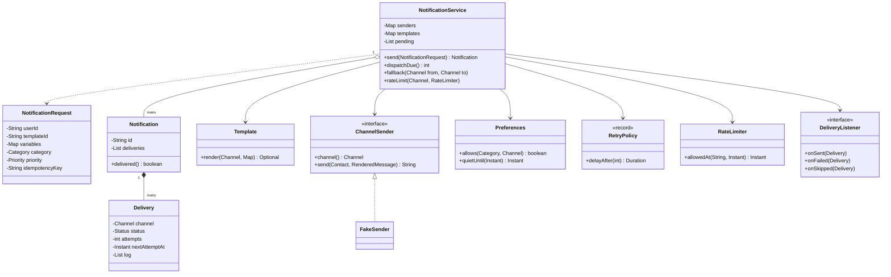
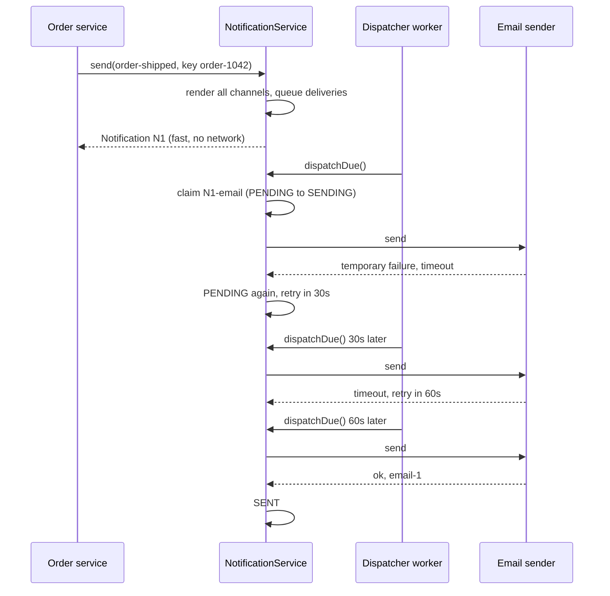
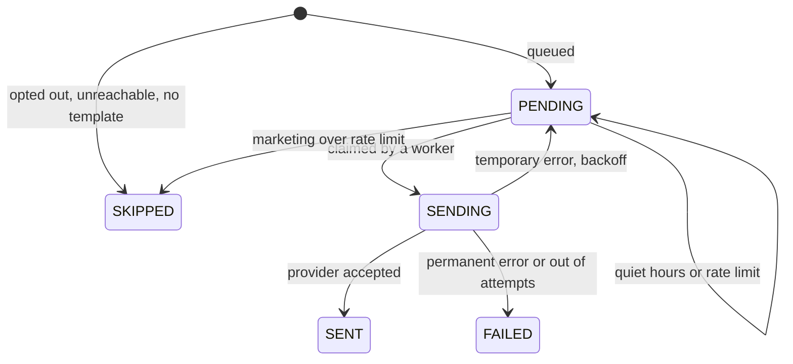

# 🔔 Design a Notification System — Low Level Design (Java)


> "Send the user an e-mail" is one line. A notification **platform** is the part that decides
> **which channels** (and whether the user even wants them), turns a template into text for each channel,
> keeps going when a provider is **down** (retries with backoff, fallback channels), respects
> **quiet hours** and **rate limits**, and never sends the same message twice when a caller retries.

Other services (orders, auth, marketing) ask: "notify user X using template Y with these values". The
system fans that out to e-mail, SMS, push and in-app, one **delivery** per channel, and a pool of
dispatcher workers sends them.

> 📚 **Credit:** Problem inspired by
> [AlgoMaster — Design Notification System](https://algomaster.io/learn/lld/design-notification-system)
> (premium lesson, **not** accessed). Everything here is my own original work, based on publicly known
> messaging practice and design patterns. See [References & Credits](#-references--credits).

---

## 📑 On this page

1. [Scoping the Problem](#1-scoping-the-problem)
2. [Finding the Building Blocks](#2-finding-the-building-blocks)
3. [Object Model](#3-object-model)
   - [3.1 Class Responsibilities](#31-class-responsibilities)
   - [3.2 Patterns in Play](#32-patterns-in-play)
   - [3.3 UML Diagrams](#33-uml-diagrams)
   - [Practice Round](#-practice-round)
4. [Implementation Walkthrough](#4-implementation-walkthrough)
5. [Build, Run & Verify](#5-build-run--verify)
6. [Follow-up Scenarios](#6-follow-up-scenarios)
   - [6.1 When a Provider Fails](#61-when-a-provider-fails)
   - [6.2 Respecting the User](#62-respecting-the-user)
   - [6.3 Exactly Once Is a Promise You Can't Keep](#63-exactly-once-is-a-promise-you-cant-keep)
7. [Last-Minute Revision](#7-last-minute-revision)
- [References & Credits](#-references--credits)

---

## 1. Scoping the Problem

### 🗣️ Sample conversation

| Candidate asks | Interviewer answers | Design impact |
|---|---|---|
| Which channels? | E-mail, SMS, push, in-app. More later (WhatsApp). | `ChannelSender` adapter per provider. |
| Who writes the text? | Templates with variables, a version per channel. | `Template`, rendered at intake. |
| Can users opt out? | Of marketing yes; security alerts never. | `Preferences` per user and `Category`. |
| Night-time? | Users set quiet hours; non-urgent messages wait until morning. | Delivery postponed, not dropped. |
| Providers fail? | Timeouts happen; some errors are permanent (dead push token). | Retry with exponential backoff; permanent = stop; fallback channel. |
| Spam protection? | Max 2 SMS per user per hour. | Sliding-window `RateLimiter`. |
| Callers retry on timeouts? | Yes. | Idempotency key. |
| Priority? | Security first, then transactional, then marketing. | `Priority`; dispatcher orders by it. |

### ✅ Functional requirements

1. Accept a request (user, template, variables, category, optional priority/channels/idempotency key).
2. Validate and render all channels up front; reject the whole request if anything is missing.
3. One delivery per channel; skip channels the user opted out of, can't be reached on, or have no template.
4. Dispatch by priority; retry temporary errors with backoff; stop on permanent errors; fall back to another channel.
5. Quiet hours hold non-urgent deliveries; rate limits drop marketing and delay the rest; security bypasses both.
6. Delivery log per attempt; listeners for sent / failed / skipped.

### ⚙️ Non-functional requirements

- **Fast intake**: `send` never waits on a provider.
- **No double sends** from parallel workers or retried callers.
- **Isolation**: a failing SMS provider doesn't delay e-mails.
- **Pluggable** providers, templates and policies; deterministic tests with an injected clock.

---

## 2. Finding the Building Blocks

| Noun / verb | Becomes |
|---|---|
| request from another service | `NotificationRequest` (builder) |
| one request, accepted | `Notification` |
| one channel of it | `Delivery` (status, attempts, next attempt, log) |
| e-mail, SMS, push, in-app | `Channel`; `ChannelSender` adapters (`FakeSender` here) |
| message text | `Template` → `RenderedMessage` |
| user details, choices | `Contact`, `Preferences` (+ quiet hours) |
| retry rules, limits | `RetryPolicy`, `RateLimiter` |
| send, dispatch | `NotificationService` (facade) |
| metrics, audit | `DeliveryListener` |

---

## 3. Object Model

### 3.1 Class Responsibilities

#### `NotificationService` (facade)
- `send`: idempotency check → contact/template lookup → render all channels → skip rules → quiet hours → queue deliveries.
- `dispatchDue`: pick due deliveries (priority, then time), rate limit, **claim** them under the lock,
  call providers **outside** the lock, then record the outcome (sent / retry later / failed + fallback).

#### `Delivery`
- The unit of work and of failure. Own status machine and an attempt log.

#### `Template`
- Per-channel subject/body with `{placeholders}`; fails on missing variables and SMS over 160 chars.

#### `Preferences`, `RetryPolicy`, `RateLimiter`
- User choices; backoff maths; sliding-window counting.

#### `ChannelSender`
- `send(contact, message)` returns a provider reference or throws `SendFailure(temporary|permanent)`.

### 3.2 Patterns in Play

| Pattern | Where | Why |
|---|---|---|
| **Facade** | `NotificationService` | Callers see one method. |
| **Adapter** | `ChannelSender` | Hides SMTP/SMS/APNs/FCM APIs behind one interface. |
| **Builder** | `NotificationRequest.Builder`, `Template` | Many optional fields, readable calls. |
| **Observer** | `DeliveryListener` | Metrics, audit, alerting on provider outages. |
| **Strategy** | `RetryPolicy`, `RateLimiter` | Tunable policies. |
| **Idempotency key** | `send` | Safe caller retries. |
| **Work queue + claim** | `dispatchDue` | Many workers, each delivery sent once. |

**SOLID check**

- **S**: templates render, senders send, policies decide, the service orchestrates.
- **O**: WhatsApp = a new `Channel` value + sender; nothing else changes.
- **L**: any `ChannelSender` either returns or throws `SendFailure`.
- **I**: listeners implement only what they need.
- **D**: the service depends on the `ChannelSender` interface and `Clock`.

### 3.3 UML Diagrams

#### Class diagram



#### Sequence: timeout, backoff, success



#### Delivery lifecycle



### 🧠 Practice Round

1. Why render templates in `send` and not when dispatching?
   <details><summary>Hint</summary>A missing variable is a caller bug: reject the request immediately instead of discovering it minutes later after other channels already went out.</details>
2. Why one `Delivery` per channel instead of one job per notification?
   <details><summary>Hint</summary>Each channel fails, retries, is rate limited and postponed independently. A slow SMS gateway must not delay the e-mail.</details>
3. Two workers see the same due delivery. What prevents a double send?
   <details><summary>Hint</summary>The claim (PENDING → SENDING) happens under the lock; the second worker no longer sees it as due.</details>
4. Which errors are worth retrying?
   <details><summary>Hint</summary>Timeouts, 5xx, throttling: yes, with backoff. Invalid number, unregistered device, hard bounce: no; try a fallback channel instead.</details>
5. A marketing SMS hits the rate limit; so does an order receipt. Same treatment?
   <details><summary>Hint</summary>No: drop the promo, delay the receipt until the window has room. Security alerts ignore the limit.</details>

---

## 4. Implementation Walkthrough

### 📁 Project structure

```
NotificationSystem/
├── pom.xml
└── src/
    ├── main/java/com/lld/messaging/notification/
    │   ├── NotificationApp.java            # an evening and a morning of notifications
    │   ├── model/                          # Channel, Category, Priority, Contact, NotificationRequest,
    │   │                                   # Notification, Delivery, NotificationException
    │   ├── template/                       # Template, RenderedMessage
    │   ├── channel/                        # ChannelSender, SendFailure, FakeSender
    │   ├── policy/                         # Preferences, RetryPolicy, RateLimiter
    │   └── core/                           # NotificationService, DeliveryListener, ManualClock
    └── test/java/com/lld/messaging/notification/
        └── NotificationServiceTest.java
```

### 📥 Intake: validate everything, then queue

```java
Set<Channel> channels = request.channels() != null ? request.channels()
        : preferences.get(userId).channelsFor(request.category());
for (Channel c : channels) rendered.put(c, template.render(c, request.variables()));   // may throw
Instant start = holdForQuietHours(contact, request, now);
for (Channel c : channels) {
    Delivery d = newDelivery(...);
    String skip = skipReason(contact, category, c, hasTemplate);    // opted out? reachable? template?
    if (skip != null) d.skip(now, skip); else pending.add(d);
}
```

### 🚚 Dispatch: claim under the lock, send outside it

```java
synchronized (lock) {
    due = pending that are due, sorted by priority desc, nextAttemptAt, sequence;
    for (Delivery d : due) if (admitByRateLimit(d, now)) { d.claim(); claimed.add(d); }
}
for (Delivery d : claimed) attempt(d);          // provider call without holding the lock
```

### 🔁 Outcome

```java
if (failure == null)                                   d.sent(...);
else if (failure.permanent() || !retry.canRetry(n))    { d.fail(...); queueFallback(d); }
else                                                   d.retryAt(now, now.plus(retry.delayAfter(n)), error);
```

### ⏱️ Complexity

| Operation | Cost |
|---|---|
| send | O(C) channels |
| dispatchDue | O(P log P) over pending (see 6.1 for a scalable queue) |
| rate limit check | amortised O(1) per key |

---

## 5. Build, Run & Verify

### With Maven

```bash
cd Communications-and-Messaging/NotificationSystem
mvn test
mvn compile exec:java
```

### Without Maven (plain JDK 17+)

```bash
cd Communications-and-Messaging/NotificationSystem
javac -d out $(find src/main -name "*.java")
java -cp out com.lld.messaging.notification.NotificationApp
```

### Demo output

```
> 21:30 order shipped for Asha (email provider times out twice)
   [sent]    N1-sms SMS to Asha [SENT] after 1 attempt(s)
   [sent]    N1-push PUSH to Asha [SENT] after 1 attempt(s)
   [sent]    N1-in_app IN_APP to Asha [SENT] after 1 attempt(s)
   order service retries its call: same notification? true
   ... 30s later
   ... 60s later
   [sent]    N1-email EMAIL to Asha [SENT] after 3 attempt(s)

> 21:32 Ben's push token is dead: fall back to SMS (but Ben has no phone)
   [failed]  N2-push PUSH to Ben [FAILED]: attempt 1 failed for good: device not registered
   [skipped] N2-sms SMS to Ben [SKIPPED]: skipped: fallback: no SMS contact for Ben

> 21:33 three SMS promos to Asha (limit 2 SMS/hour, the shipment SMS used one); Ben opted out
   [skipped] N6-email EMAIL to Ben [SKIPPED]: skipped: user opted out of MARKETING on EMAIL
   [skipped] N4-sms SMS to Asha [SKIPPED]: skipped: rate limit reached for SMS
   [skipped] N5-sms SMS to Asha [SKIPPED]: skipped: rate limit reached for SMS
   [sent]    N3-sms SMS to Asha [SENT] after 1 attempt(s)

> 22:15 Asha: two login alerts (security skips quiet hours and limits) and a shipment SMS
   [sent]    N7-sms SMS to Asha [SENT] after 1 attempt(s)
   [sent]    N8-sms SMS to Asha [SENT] after 1 attempt(s)
   still pending: [N9-sms SMS to Asha [PENDING]] until 2026-11-03T07:00:00Z

> 07:00 next morning
   [sent]    N9-sms SMS to Asha [SENT] after 1 attempt(s)

> Missing variable is rejected up front
   [refused] Template sale needs variable 'percent'

> Delivery log of N1 email
   2026-11-02T21:30:00Z attempt 1 failed: SMTP timeout, retry at 2026-11-02T21:30:30Z
   2026-11-02T21:30:30Z attempt 2 failed: SMTP timeout, retry at 2026-11-02T21:31:30Z
   2026-11-02T21:31:30Z attempt 3 sent (email-1)
```

### ✅ What the tests cover

| Area | Tests |
|---|---|
| Intake | preferences per category; skips for opt-out, no contact, no template version; bad user/template/variable queue nothing; SMS length; idempotency key; security can't be disabled and ignores opt-outs |
| Retries | backoff 10s → 20s with "not due yet" check; 4 cap cases; give up after max attempts; permanent error stops and falls back; no fallback if another channel succeeded; missing sender |
| Policies | quiet hours hold normal but not HIGH/security; 6 window cases (midnight crossing, boundaries); priority order; rate limit drops marketing, delays transactional (not counted as an attempt), ignores security; sliding window |
| Concurrency | 6 workers, 300 deliveries: each sent exactly once; 50 parallel identical requests: one notification |

**27 tests, all passing.**

---

## 6. Follow-up Scenarios

### 6.1 When a Provider Fails

- **Temporary vs permanent** errors decide retry vs stop. Backoff doubles the wait up to a cap;
  add **jitter** so thousands of retries don't hit the recovering provider at the same second.
- **Circuit breaker** per provider: after many failures, stop calling for a while and fail fast or
  route to a **second provider** (e.g. two SMS gateways).
- **Dead-letter queue**: failed deliveries kept for inspection and manual replay.
- At scale the pending list becomes a durable queue per channel (Kafka/SQS) with a **delay queue** for
  retries, and workers scale per channel.

### 6.2 Respecting the User

- Preferences per category and channel; **security can't be turned off**.
- **Quiet hours** in the user's time zone (UTC here for brevity); urgent messages bypass.
- **Rate limits / frequency caps** per user and channel; marketing dropped, service messages delayed.
- **Digesting**: merge many low-priority events into one daily summary.
- Unsubscribe links in every marketing e-mail update `Preferences`.

### 6.3 Exactly Once Is a Promise You Can't Keep

- Providers may accept a message and time out before answering: you can't know if it was sent.
  Realistic goal: **at-least-once** delivery with **deduplication**:
  - caller → service: idempotency key;
  - service → provider: send our delivery id as the provider's idempotency key where supported;
  - device: in-app/push clients drop duplicates by notification id.

### 🚀 More follow-ups to practice

1. **Scheduling**: "send at 9 am local time" (a `notBefore` on the delivery).
2. **Localization**: template per language, chosen from the user's locale.
3. **Tracking**: opens/clicks via webhooks updating delivery status.
4. **Bulk campaigns**: millions of users, batched rendering, provider throughput limits.
5. **Priority lanes**: separate queues/workers so a marketing blast never delays OTP codes.

---

## 7. Last-Minute Revision

- Request → Notification → one **Delivery per channel**.
- Render everything at intake; reject bad requests before anything is queued.
- Skip: opted out (except security), unreachable, no template version.
- Dispatcher: priority order, **claim under lock**, provider call outside the lock.
- Temporary error → backoff retry; permanent/out of attempts → FAILED → fallback channel.
- Quiet hours postpone; rate limit drops marketing, delays others; security bypasses both.
- Idempotency key for caller retries; at-least-once + dedup in real systems.

---

## 📚 References & Credits

| Resource | How it was used |
|---|---|
| [AlgoMaster.io — Design Notification System (LLD)](https://algomaster.io/learn/lld/design-notification-system) | Inspiration for the **problem choice** only. The lesson is premium and was **not** accessed. |
| [Exponential backoff — Wikipedia](https://en.wikipedia.org/wiki/Exponential_backoff) | Public background on retry timing. |
| [Idempotence — Wikipedia](https://en.wikipedia.org/wiki/Idempotence) | Public background for safe retries. |
| [Refactoring.Guru — Adapter](https://refactoring.guru/design-patterns/adapter), [Builder](https://refactoring.guru/design-patterns/builder), [Observer](https://refactoring.guru/design-patterns/observer) | Public pattern definitions. |
| [Mermaid](https://mermaid.js.org/) | Diagrams rendered by GitHub. |
| [JUnit 5 User Guide](https://junit.org/junit5/docs/current/user-guide/) | Testing. |

**Originality statement**

- This repository is a **personal learning project** for LLD interview preparation.
- The AlgoMaster lesson is premium content that I have not accessed. No text, code, diagrams,
  headings or other material from it (or any paid source) is reproduced here.
- All headings, source code, explanations, tables, diagrams, tests and exercises were written
  independently from publicly known behaviour and the public references above.
- This project is **not affiliated with or endorsed by** AlgoMaster.io. "AlgoMaster" is the
  property of its respective owner.
- For the original lesson, please support the author at [algomaster.io](https://algomaster.io).

---

> ⭐ Try the Practice Round before reading the code, then compare your design with this one.
