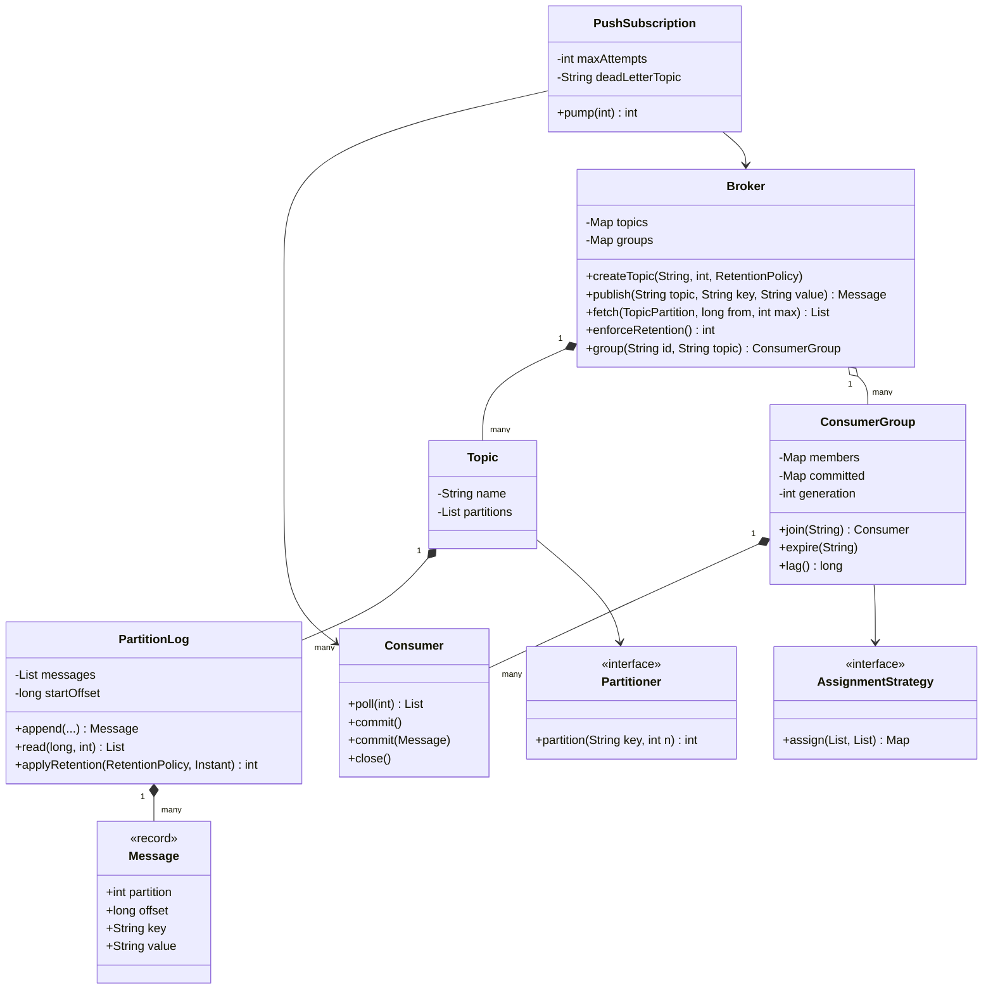
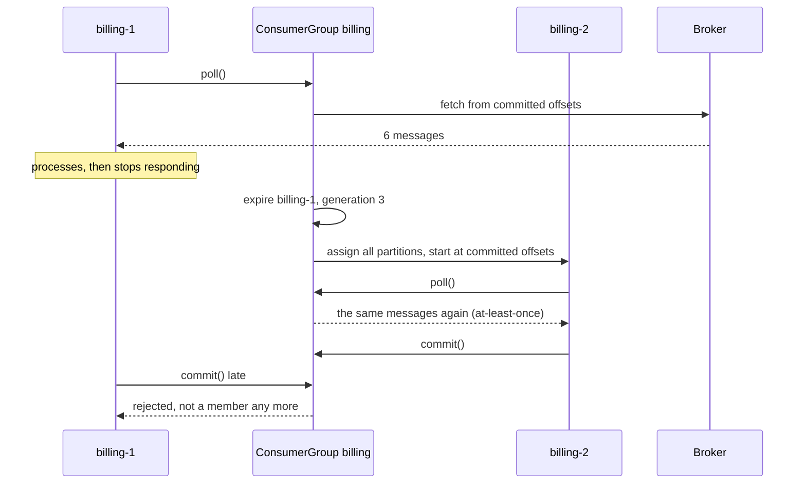
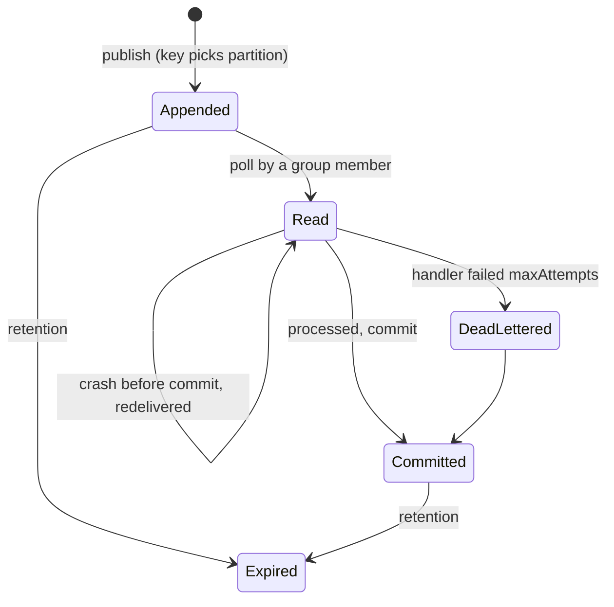

# 📣 Design a Pub-Sub System — Low Level Design (Java)


> The textbook answer ("a map from topic to a list of callbacks") breaks the moment someone asks:
> *what happens if a subscriber is down? can two instances share the work? is order kept? what if a
> message always crashes the handler?* This design is a small **log-based broker** (the model behind
> Kafka, Pulsar and Kinesis): topics split into **partitions**, messages kept by **offset**,
> **consumer groups** for fan-out and load balancing, **committed offsets** for at-least-once delivery,
> and a **dead-letter topic** for poison messages.

> 📚 **Credit:** Problem inspired by
> [AlgoMaster — Design Pub-Sub System](https://algomaster.io/learn/lld/design-pub-sub)
> (premium lesson, **not** accessed). Everything here is my own original work, based on publicly
> documented messaging concepts and design patterns. See [References & Credits](#-references--credits).

---

## 📑 On this page

1. [Scoping the Problem](#1-scoping-the-problem)
2. [Finding the Building Blocks](#2-finding-the-building-blocks)
3. [Object Model](#3-object-model)
   - [3.1 Class Responsibilities](#31-class-responsibilities)
   - [3.2 Patterns in Play](#32-patterns-in-play)
   - [3.3 UML Diagrams](#33-uml-diagrams)
   - [Practice Round](#-practice-round)
4. [Implementation Walkthrough](#4-implementation-walkthrough)
5. [Build, Run & Verify](#5-build-run--verify)
6. [Follow-up Scenarios](#6-follow-up-scenarios)
   - [6.1 Delivery Guarantees](#61-delivery-guarantees)
   - [6.2 Ordering vs Parallelism](#62-ordering-vs-parallelism)
   - [6.3 Push or Pull?](#63-push-or-pull)
7. [Last-Minute Revision](#7-last-minute-revision)
- [References & Credits](#-references--credits)

---

## 1. Scoping the Problem

### 🗣️ Sample conversation

| Candidate asks | Interviewer answers | Design impact |
|---|---|---|
| Several independent subscribers per topic? | Yes: billing, e-mail, analytics each need every event. | **Consumer groups**: fan-out between groups. |
| Can a subscriber run as several instances? | Yes, to share the load. | Partitions split among a group's members. |
| Ordering? | Events of one order must stay in order. | **Partition by key**; one reader per partition. |
| Subscriber offline for a while? | It must catch up, not lose messages. | Messages stay in a **log**; readers track offsets. |
| Crash while processing? | Don't lose the message; a duplicate is acceptable. | **Commit after processing** = at-least-once. |
| A message that always fails? | Don't block everyone behind it. | Retries, then a **dead-letter topic**. |
| Storage limits? | Keep a week or N messages per partition. | `RetentionPolicy`. |
| Filtering? | A subscriber may ignore some events. | Filter predicate on push subscriptions. |

### ✅ Functional requirements

1. Create topics with N partitions and a retention policy; publish with an optional key and headers.
2. Same key → same partition; keyless → round-robin.
3. Consumer groups: join/leave/expire; partitions assigned (range or round-robin); rebalance on change.
4. `poll` from assigned partitions; `commit` progress; new owners resume from the committed offset.
5. Reject commits from evicted members or for partitions no longer owned (fencing).
6. Start position for new groups: earliest or latest.
7. Push subscriptions: handler + filter + retries + dead-letter topic.
8. Retention by count and age; readers below the retained range jump to the oldest message.

### ⚙️ Non-functional requirements

- Publishers to different partitions don't block each other; offsets are unique and gapless.
- No message lost to crashes (at-least-once); ordering per partition.
- Adding groups costs nothing on the publish path (the log is shared).

---

## 2. Finding the Building Blocks

| Noun / verb | Becomes |
|---|---|
| topic, partition, log | `Topic`, `PartitionLog` (append-only, offsets) |
| message | `Message` record (topic, partition, offset, key, value, headers, time) |
| where a message goes | `Partitioner` |
| how long it stays | `RetentionPolicy` |
| subscriber service | `ConsumerGroup` |
| one running instance | `Consumer` |
| who reads which partition | `AssignmentStrategy` (range, round-robin) |
| callback style + DLQ | `PushSubscription` |
| the server | `Broker` (facade) |

---

## 3. Object Model

### 3.1 Class Responsibilities

#### `Broker`
- Creates topics, routes publishes through the partitioner, serves fetches by offset, applies retention, creates groups.

#### `PartitionLog`
- `append` (synchronised, assigns the next offset), `read(from, max)`, `startOffset`/`endOffset`, `applyRetention` (drops from the head).

#### `ConsumerGroup`
- Members, **generation**, committed offsets. `rebalance()` on join/leave/expire.
- `poll` for a member (fair rotation over its partitions), `commit` with fencing checks, `lag()`.

#### `Consumer`
- Thin handle: `poll`, `commit()` / `commit(message)`, `assignment`, `close`.

#### `PushSubscription`
- Pull loop + handler; retry N times; on exhaustion publish to the DLQ with error headers; commit per message.

### 3.2 Patterns in Play

| Pattern | Where | Why |
|---|---|---|
| **Publish–Subscribe** | whole system | Publishers don't know subscribers. |
| **Append-only log** | `PartitionLog` | Many readers at their own pace; replay; cheap fan-out. |
| **Strategy** | `Partitioner`, `AssignmentStrategy` | Routing and balancing policies. |
| **Observer (push adapter)** | `PushSubscription.Handler` | Callback API on top of pull. |
| **Facade** | `Broker` | One entry point for publishers and groups. |
| **Fencing token** | group generation | Stops zombies from overwriting progress. |
| **Dead-letter channel** | `orders.dlq` | Isolates poison messages. |

**SOLID check**

- **S**: logs store, groups coordinate, strategies decide, subscriptions adapt.
- **O**: a sticky assignor or a custom partitioner plugs in without edits.
- **L**: any `AssignmentStrategy` that returns a full plan works.
- **I**: publishers only need `publish`; consumers only `poll`/`commit`.
- **D**: groups depend on the strategy interface; time comes from `Clock`.

### 3.3 UML Diagrams

#### Class diagram



#### Sequence: crash, rebalance, redelivery



#### Message path



### 🧠 Practice Round

1. Why store messages in a log instead of deleting them once a subscriber has read them?
   <details><summary>Hint</summary>Different groups read at different speeds; each just keeps an offset. Deleting per subscriber means copying the message per subscriber.</details>
2. How do you keep "created → paid → shipped" in order for one order while processing orders in parallel?
   <details><summary>Hint</summary>Use the order id as the key: all its events go to one partition, read by one group member at a time. Different orders run on different partitions in parallel.</details>
3. A consumer crashes between processing and committing. What happens?
   <details><summary>Hint</summary>The next owner starts at the last committed offset and processes those messages again: handlers must be idempotent.</details>
4. A paused ("zombie") member wakes up and commits after its partitions moved. Why is that dangerous and how is it stopped?
   <details><summary>Hint</summary>It could move the committed offset backwards or skip the new owner's work. Commits carry the generation and ownership is checked.</details>
5. What limits the parallelism of a consumer group?
   <details><summary>Hint</summary>The partition count: extra members are idle.</details>

---

## 4. Implementation Walkthrough

### 📁 Project structure

```
PubSub/
├── pom.xml
└── src/
    ├── main/java/com/lld/messaging/pubsub/
    │   ├── PubSubApp.java                  # order events to billing, e-mail and analytics
    │   ├── model/                          # Message, TopicPartition, PubSubException
    │   ├── broker/                         # Broker, Topic, PartitionLog, Partitioner, RetentionPolicy, ManualClock
    │   └── consumer/                       # ConsumerGroup, Consumer, AssignmentStrategy, PushSubscription
    └── test/java/com/lld/messaging/pubsub/
        └── PubSubTest.java
```

### 🧾 Append = next offset

```java
synchronized Message append(String key, String value, Map<String, String> headers, Instant at) {
    Message m = new Message(topic, partition, endOffset(), key, value, headers, at);
    messages.add(m);
    return m;
}
```

### ⚖️ Rebalance

```java
generation++;
Map<String, List<TopicPartition>> plan = strategy.assign(broker.partitions(topic), sortedMemberIds);
for (Consumer c : members.values()) {
    c.generation = generation;
    c.assignment = plan.get(c.id());
    c.positions = for each partition: committed offset, else earliest/latest;
}
```

### 🛡️ Fencing on commit

```java
requireMember(c);                                             // evicted? rejected
if (memberGeneration != generation) throw ...;                // committed across a rebalance
if (!c.assignment.contains(tp)) throw ...;                   // partition moved away
committed.putAll(offsets);
```

### ☠️ Poison messages

```java
for (int attempt = 1; attempt <= maxAttempts; attempt++) { try { handler.handle(m); ok; break; } catch (...) { } }
if (still failing) broker.publish(deadLetterTopic, m.key(), m.value(), headers + dlq.source/error/attempts);
consumer.commit(m);                                           // move on either way
```

### ⏱️ Complexity

| Operation | Cost |
|---|---|
| publish | O(1) amortised |
| poll(max) | O(max + P) for P assigned partitions |
| rebalance | O(P + M) |
| retention | O(dropped) + list shift |

---

## 5. Build, Run & Verify

### With Maven

```bash
cd Communications-and-Messaging/PubSub
mvn test
mvn compile exec:java
```

### Without Maven (plain JDK 17+)

```bash
cd Communications-and-Messaging/PubSub
javac -d out $(find src/main -name "*.java")
java -cp out com.lld.messaging.pubsub.PubSubApp
```

### Demo output

```
> Publish: the key (order id) picks the partition, so each order's events stay in order
   orders-1@0 o-1=created
   orders-2@0 o-2=created
   orders-1@1 o-1=paid
   orders-0@0 o-3=created
   orders-2@1 o-2=paid
   orders-1@2 o-1=shipped
   orders-0@1 o-3=cancelled
   orders-1@3 o-4=created

> Fan-out: 'billing' and 'email' are different groups, so both see every event
   billing-1 read 8, email-1 read 8

> Load balancing inside a group: a second billing instance joins, partitions are split
   generation 2 assignments {billing-1=[orders-0, orders-1], billing-2=[orders-2]}

> At-least-once: billing-1 processed but crashed before committing
   billing-1 re-reads from the committed offset: 6 messages orders-0@0 orders-0@1 orders-1@0 orders-1@1 orders-1@2 orders-1@3
   coordinator evicts billing-1 (missed heartbeats): {billing-2=[orders-0, orders-1, orders-2]}
   zombie billing-1 tries to commit: [rejected] billing-1 is not a member of group billing any more
   billing-2 now owns everything, processes 8 and commits; lag = 0

> Push subscription with a poison message and a dead-letter topic
   analytics handled orders-1@4 o-7=created
   analytics handled orders-2@4 o-8=created
   delivered 2, filtered 1, dead-lettered 1 (analytics started at LATEST, so o-5/o-6 are not its business)
   DLQ: orders.dlq-0@0 o-7={broken {dlq.source=orders-1@5, dlq.attempts=3, dlq.error=cannot parse '{broken'}

> Retention: 8 days later old messages are gone; a slow group jumps to the oldest kept offset
   dropped 15 messages
   email-1 never read o-5..o-9 before they expired; it resumes at the oldest kept offset: [orders-1@6 o-10=created]
```

(Header order in the DLQ line may vary: headers are a map.)

### ✅ What the tests cover

| Area | Tests |
|---|---|
| Publishing | consecutive offsets and sticky keys; keyless round-robin; per-key order seen by readers; topic errors; custom partitioner |
| Groups | fan-out to every group; one owner per partition, idle extra members, full coverage after leaves; range vs round-robin plans; uncommitted messages redelivered after a crash; committed progress survives membership; fencing of evicted/stale members; LATEST reset; fair polling across partitions |
| Retention | by count and by age, clamped reads, offsets never reused |
| Push | retry then succeed, poison to DLQ with error header, filter, order kept, lag 0 |
| Concurrency | 2,000 parallel publishes: unique, gapless offsets; 4 members on threads consume 1,000 messages exactly once |

**17 tests, all passing.**

---

## 6. Follow-up Scenarios

### 6.1 Delivery Guarantees

| Guarantee | How | Cost |
|---|---|---|
| At-most-once | commit **before** processing | crash = message lost |
| At-least-once (here) | commit **after** processing | crash = duplicate; handlers must be idempotent |
| Effectively-once | at-least-once + dedup by message id, or transactional writes of output + offset together | more storage/coordination |

Durability on the broker side means replicating each partition to several brokers and acknowledging
a publish only after enough replicas have it.

### 6.2 Ordering vs Parallelism

- Order is guaranteed **within a partition** only. Choose the key so that "things that must be ordered"
  share it (order id, account id).
- Hot keys make hot partitions; more partitions don't help a single key.
- Retrying a message inline keeps order but blocks the partition; the DLQ bounds that delay.
  Alternatives: retry topics with delays (keeps the main flow moving, loses strict order for that key).

### 6.3 Push or Pull?

- **Pull** (this core): consumers control their pace; natural back-pressure; batching.
- **Push** (webhooks, in-process callbacks): lower latency, but the broker must track per-subscriber
  delivery, retries and rate limits. `PushSubscription` shows push semantics built on pull.
- Simple in-process event buses (Observer) are fine inside one service; they lose messages on crash.

### 🚀 More follow-ups to practice

1. **Sticky / cooperative rebalancing**: move as few partitions as possible on membership changes.
2. **Log compaction**: keep only the latest value per key (changelog topics).
3. **Wildcard subscriptions**: groups subscribed to `orders.*`.
4. **Delayed messages** and scheduled delivery.
5. **Schema registry**: validate message formats on publish.
6. **Consumer lag alerts** from `lag()`.

---

## 7. Last-Minute Revision

- Topic = partitions = append-only logs; messages addressed by offset.
- Key → partition → ordering per key; keyless → round-robin.
- Groups: fan-out **between**, load balancing **within** (one owner per partition).
- Committed offset per (group, partition); commit after processing = **at-least-once**.
- Rebalance bumps the **generation**; stale or evicted members' commits are **fenced**.
- New group: EARLIEST or LATEST. Retention moves the start offset; offsets are never reused.
- Poison messages: retry N times, then **dead-letter topic**, commit, move on.

---

## 📚 References & Credits

| Resource | How it was used |
|---|---|
| [AlgoMaster.io — Design Pub-Sub System (LLD)](https://algomaster.io/learn/lld/design-pub-sub) | Inspiration for the **problem choice** only. The lesson is premium and was **not** accessed. |
| [Apache Kafka documentation — Design](https://kafka.apache.org/documentation/#design) | Public background on partitioned logs, consumer groups and offsets. |
| [Publish–subscribe pattern — Wikipedia](https://en.wikipedia.org/wiki/Publish%E2%80%93subscribe_pattern) | Public background. |
| [Enterprise Integration Patterns — Dead Letter Channel](https://www.enterpriseintegrationpatterns.com/patterns/messaging/DeadLetterChannel.html) | Public pattern description. |
| [Mermaid](https://mermaid.js.org/) | Diagrams rendered by GitHub. |
| [JUnit 5 User Guide](https://junit.org/junit5/docs/current/user-guide/) | Testing. |

**Originality statement**

- This repository is a **personal learning project** for LLD interview preparation.
- The AlgoMaster lesson is premium content that I have not accessed. No text, code, diagrams,
  headings or other material from it (or any paid source) is reproduced here.
- All headings, source code, explanations, tables, diagrams, tests and exercises were written
  independently from publicly known behaviour and the public references above.
- This project is **not affiliated with or endorsed by** AlgoMaster.io. "AlgoMaster" is the
  property of its respective owner.
- For the original lesson, please support the author at [algomaster.io](https://algomaster.io).

---

> ⭐ Try the Practice Round before reading the code, then compare your design with this one.
