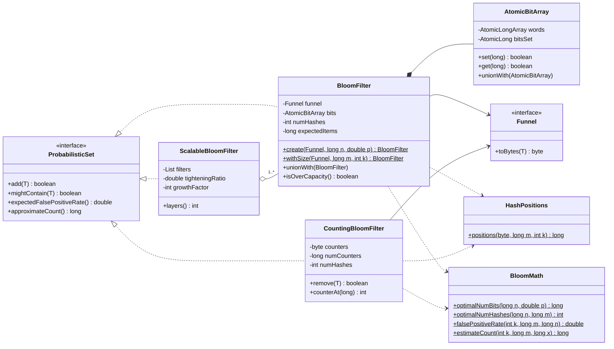
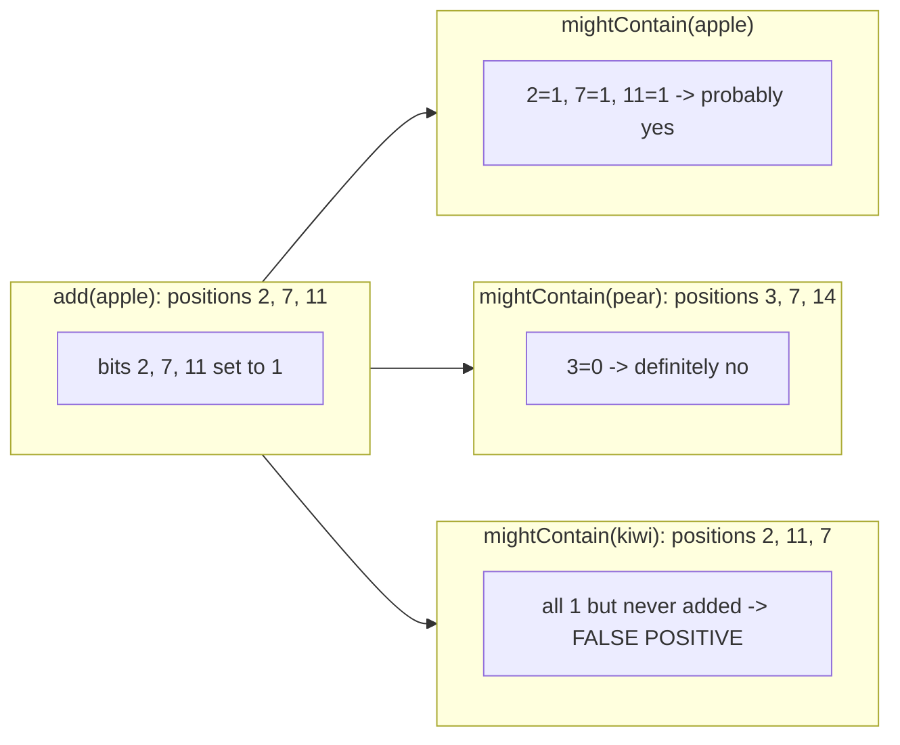
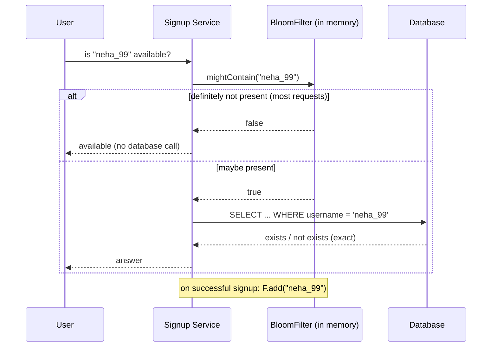

# 🌸 Design a Bloom Filter — Low Level Design (Java)


> "Have we seen this before?" answered in **about 1 MB for a million items**, with **no false negatives**
> and a false positive rate you choose. Interviewers use it to check that you understand
> **probabilistic data structures**, can **size one with the formulas**, and know its limits
> (no deletion, fixed capacity) and the variants that fix them.

A Bloom filter is a bit array plus *k* hash functions. **Adding** an item sets its *k* bits.
**Checking** an item looks at its *k* bits: if any is 0 the item was **definitely never added**;
if all are 1 it was **probably added**, but other items may have set those bits by chance.

> 📚 **Credit:** Suggested as the next problem in this repo's *Data Structures and Search*
> category. Everything here is my own original work, based on widely known computer-science
> material. See [References & Credits](#-references--credits).

---

## 📑 On this page

1. [Scoping the Problem](#1-scoping-the-problem)
2. [Finding the Building Blocks](#2-finding-the-building-blocks)
3. [Object Model](#3-object-model)
   - [3.1 Class Responsibilities](#31-class-responsibilities)
   - [3.2 Patterns in Play](#32-patterns-in-play)
   - [3.3 UML Diagrams](#33-uml-diagrams)
   - [Practice Round](#-practice-round)
4. [Implementation Walkthrough](#4-implementation-walkthrough)
5. [Build, Run & Verify](#5-build-run--verify)
6. [Follow-up Scenarios](#6-follow-up-scenarios)
   - [6.1 Sizing: Choosing m and k](#61-sizing-choosing-m-and-k)
   - [6.2 Deleting Items: Counting Bloom Filter](#62-deleting-items-counting-bloom-filter)
   - [6.3 Unknown Size: Scalable Bloom Filter](#63-unknown-size-scalable-bloom-filter)
7. [Last-Minute Revision](#7-last-minute-revision)
8. [References & Credits](#-references--credits)

---

## 1. Scoping the Problem

### 🗣️ Sample conversation

| Candidate asks | Interviewer answers | Design impact |
|---|---|---|
| What is it for? | Skip expensive lookups: "is this username taken?", "has the crawler visited this URL?" | A cheap pre-check in front of a database or disk. |
| Are false positives OK? | Yes, about 1%. False negatives are **not**. | Bloom filter. A "maybe" still gets checked against the real store. |
| How many items? | About 1 million, known in advance. | Size from `n` and `p` with the standard formulas. |
| What item types? | Strings mostly; keep it generic. | `BloomFilter<T>` + `Funnel<T>` (item → bytes). |
| Do we need to delete? | Sometimes. | `CountingBloomFilter` (4-bit counters). |
| What if the count is unknown? | Might grow 100x. | `ScalableBloomFilter` (chain of growing filters). |
| Concurrent writers? | Yes. | Lock-free bit array with CAS. |
| Combine filters from shards? | Nice to have. | `unionWith` (bitwise OR). |

### ✅ Functional requirements

1. `create(funnel, expectedItems, falsePositiveRate)` sizes the filter automatically.
2. `add(item)`, `mightContain(item)`, and no false negatives, ever.
3. `expectedFalsePositiveRate()` and `approximateCount()` from the current fill.
4. `unionWith(other)` for filters of the same shape.
5. Variants: deletion (counting) and unbounded growth (scalable).

### ⚙️ Non-functional requirements

- **Memory**: about 9.6 bits per item at 1%, far below storing the items themselves.
- **Speed**: O(k) per operation, hashing the bytes **once**.
- **Accuracy**: measured false positive rate matches the formula (tested at 10%, 3%, 1% and 0.1%).
- **Thread-safe** adds and reads without locks.

---

## 2. Finding the Building Blocks

| Candidate | Keep? | Reasoning |
|---|---|---|
| **Bit array** (`AtomicBitArray`) | ✅ | The whole filter. Packed into 64-bit words; CAS for concurrent sets. |
| **Hash positions** (`HashPositions`) | ✅ | k positions from **two** base hashes (double hashing) instead of k separate hash functions. |
| **Funnel\<T\>** | ✅ strategy | Deterministic item → bytes. `hashCode()` differs between JVM runs and is only 32 bits. |
| **BloomMath** | ✅ | Sizing and estimation formulas in one place. |
| **BloomFilter** | ✅ | The classic structure. |
| **CountingBloomFilter** | ✅ | Counters instead of bits, so deletion works. |
| **ScalableBloomFilter** | ✅ | Grows by adding filters, keeping the error bounded. |
| `HashSet<T>` | ❌ as the solution | Exact, but stores every item: tens of MB for 1M strings. Here it's the **test oracle**. |
| Storing the items | ❌ | The filter never stores items, so it can't list them or return them. That's by design. |

---

## 3. Object Model

### 3.1 Class Responsibilities

#### Interface — `ProbabilisticSet<T>`
`add(item)` (true if the filter changed), `mightContain(item)`, `expectedFalsePositiveRate()`, `approximateCount()`.

#### `BloomFilter<T>`
| Member | Purpose |
|---|---|
| `create(funnel, n, p)` | m = optimal bits, k = optimal hashes. |
| `withSize(funnel, m, k)` | Manual sizing for experiments. |
| `add` / `mightContain` | Set / test the k bits. |
| `unionWith(other)` | OR the bit arrays (same m and k required). |
| `isOverCapacity()` | Warns when more items were added than planned. |
| `numBits`, `numHashes`, `bitsSet`, `memoryBytes` | Introspection. |

#### `CountingBloomFilter<T>`
4-bit counters (two per byte). `add` increments, `remove` decrements, and `mightContain` checks that all counters are above 0.
Counters stick at 15, and removing an absent item is refused.

#### `ScalableBloomFilter<T>`
List of `BloomFilter`s. Capacity grows ×`growthFactor` per layer, and the error rate shrinks ×`tighteningRatio`.

#### Helpers
`BloomMath` (formulas), `HashPositions` (FNV-1a + SplitMix64 finaliser, double hashing),
`Funnel` (`STRING`, `LONG`, `INTEGER`), `AtomicBitArray` (lock-free bits).

### 3.2 Patterns in Play

| Pattern | Where | Why here |
|---|---|---|
| **Strategy** | `Funnel<T>` | Any item type plugs in by describing how to turn it into bytes. |
| **Static factory** | `BloomFilter.create(...)` / `withSize(...)` | Callers say *what* they need (n, p); the factory works out *how* (m, k). |
| **Composite-like chaining** | `ScalableBloomFilter` | Many filters behave like one `ProbabilisticSet`. |
| **Program to an interface** | `ProbabilisticSet<T>` | Callers don't care which variant they use. |
| **Lock-free concurrency** | `AtomicBitArray` | Bits only ever go 0 → 1, so CAS without locks is safe and simple. |

**SOLID:** hashing, bit storage, maths and the filter logic are separate classes (**S**); new item
types need only a new `Funnel` (**O**); all variants honour the `ProbabilisticSet` contract (**L**);
filters depend on the `Funnel` abstraction (**D**).

### 3.3 UML Diagrams

**Class diagram**



**Add and check with m = 16 bits, k = 3**



**Where it sits in a real request**



### 🧠 Practice Round

1. **Derive k**: why is `k = (m/n) · ln 2` optimal? What happens with too few or too many hash functions?
2. **Half full**: show that at the optimal k, about **50%** of the bits end up set. (The demo shows 51.8%.)
3. **Intersection**: the AND of two filters is *not* the filter of the intersection. Why is it still useful?
4. **Distributed crawler**: 20 machines each keep a filter of visited URLs. How do you merge them nightly?
5. **Cuckoo filter**: it supports deletion with less memory than a counting Bloom filter. What does it store instead of bits?
6. **Serialization**: persist a filter and load it in another service. What must both sides agree on?

<details>
<summary>💡 Hints for #1 and #2</summary>

The false positive rate `(1 − e^(−kn/m))^k` is minimised when `e^(−kn/m) = ½`, meaning each bit has a
50% chance of being 0. Solving gives `k = (m/n)·ln 2`. Too few hashes means each lookup tests too few
bits; too many fills the array too fast. Both raise the error.
</details>

<details>
<summary>💡 Hints for #6</summary>

Both sides must agree on the bit count, the number of hashes, **the exact hash algorithm and seeds**,
and the funnel (e.g. UTF-8 for strings). Change any of them and every lookup gives wrong answers,
which is why `hashCode()` is never used.
</details>

---

## 4. Implementation Walkthrough

### 📁 Project structure

```
BloomFilter/
├── pom.xml
├── README.md
└── src
    ├── main/java/com/lld/ds/bloomfilter
    │   ├── BloomFilterApp.java             # sizing table + live measurements
    │   ├── core/    ProbabilisticSet, Funnel, BloomMath
    │   ├── hash/    HashPositions          # FNV-1a + SplitMix64, double hashing
    │   └── filter/  AtomicBitArray, BloomFilter, CountingBloomFilter, ScalableBloomFilter
    └── test/java/com/lld/ds/bloomfilter
        └── BloomFilterTest.java            # 22 tests: maths, measured error, concurrency, variants
```

### 🔢 Sizing from n and p

```java
public static <T> BloomFilter<T> create(Funnel<T> funnel, long expectedItems, double falsePositiveRate) {
    long m = (long) Math.ceil(-expectedItems * Math.log(falsePositiveRate) / (LN2 * LN2));
    int  k = Math.max(1, (int) Math.round((double) m / expectedItems * LN2));
    return new BloomFilter<>(funnel, m, k, expectedItems, falsePositiveRate);
}
```

### #️⃣ k positions from one hash (double hashing)

```java
long h1 = mix64(fnv1a64(bytes));             // hash the bytes once
long h2 = mix64(h1 ^ GOLDEN_GAMMA) | 1L;     // second hash, forced odd
for (int i = 0; i < k; i++) {
    out[i] = Math.floorMod(h1 + i * h2, m);  // g_i = h1 + i·h2  (mod m)
}
```
Kirsch & Mitzenmacher showed that this gives the same error rate as *k* independent hash functions.
The test `measuredFalsePositiveRateMatchesTheTarget` confirms it in practice.

### ⚛️ Lock-free bit setting

```java
boolean set(long index) {
    int word = (int) (index >>> 6);
    long mask = 1L << index;                 // low 6 bits pick the bit inside the word
    while (true) {
        long current = words.get(word);
        if ((current & mask) != 0) return false;                       // already set
        if (words.compareAndSet(word, current, current | mask)) {       // retry if another thread won
            bitsSet.incrementAndGet();
            return true;
        }
    }
}
```

### 🔁 add / mightContain

```java
public boolean add(T item) {
    boolean changed = false;
    for (long p : positionsOf(item)) changed |= bits.set(p);
    return changed;
}

public boolean mightContain(T item) {
    for (long p : positionsOf(item)) if (!bits.get(p)) return false;   // one zero = definitely absent
    return true;
}
```

👉 Browse the full source in [`src/main/java`](src/main/java/com/lld/ds/bloomfilter).

### ⏱️ Complexity

| Operation | Time | Notes |
|---|---|---|
| `add` / `mightContain` | O(k + item size) | Bytes hashed once; k is 7 at 1% |
| `unionWith` | O(m / 64) | Word-wise OR |
| `approximateCount`, `expectedFalsePositiveRate` | O(1) | Uses the maintained `bitsSet` counter |
| Memory (plain) | m bits ≈ 1.44 · log₂(1/p) bits per item | 9.6 bits/item at 1% |
| Memory (counting) | 4 · m bits | 4× plain |

---

## 5. Build, Run & Verify

### With Maven

```bash
cd Data-Structures-and-Search/BloomFilter
mvn test                 # 22 tests
mvn compile exec:java    # demo
```

### Without Maven (plain JDK 17+)

```bash
cd Data-Structures-and-Search/BloomFilter
javac -d out $(find src/main -name "*.java")
java -cp out com.lld.ds.bloomfilter.BloomFilterApp
```

### Demo output

```
1) Sizing for 1,000,000 items
   target fpp     bits        memory     hashes   bits/item
   10.0%         4,792,530       585 KB      3       4.8
   1.0%          9,585,059     1,170 KB      7       9.6
   0.1%         14,377,588     1,755 KB     10      14.4
   0.01%        19,170,117     2,340 KB     13      19.2
   (a HashSet<String> of 1M short usernames needs roughly 60-100 MB)

2) "Is this username taken?": 1,000,000 registered, target 1%
   BloomFilter[m=9,585,059 bits (1,170 KB), k=7, fill=51.8%, ~1,000,244 items, fpp~1.0051%]
   false negatives:            0 (always 0)
   false positives measured:   1.005% of 1,000,000 unused names
   false positives predicted:  1.005%
   -> on "maybe taken", check the database; on "not taken", skip the database entirely.

3) Counting Bloom filter (supports delete)
   contains session-a? true
   remove session-a:   true
   contains session-a? false
   contains session-b? true  (untouched)
   remove never-added: false  (refused, protects other items)

4) Scalable Bloom filter: starts with room for 1,000, target 1%, receives 100,000
   after   1,000 items: 1 layers,      1 KB, fpp bound 0.507%
   after  10,000 items: 4 layers,     26 KB, fpp bound 0.873%
   after 100,000 items: 7 layers,    284 KB, fpp bound 0.981%
   measured false positives: 0.956% (stays under the 1% target)
```

Points to notice: each 10× lower error costs only about **4.8 extra bits per item**; the filter is
**51.8% full**, as theory predicts for the optimal k; the item-count estimate (1,000,244) is within
0.03% of the truth, computed from nothing but the fill.

### ✅ What the tests cover

| Test | Verifies |
|---|---|
| `sizingMatchesTheTextbookNumbers` | 1M at 1% → 9,585,059 bits, k = 7; about 4.8 bits per 10× accuracy. |
| `invalidParametersAreRejected` | n < 1, p outside (0, 1), k < 1, null items. |
| **`neverAFalseNegative`** / `…EvenWhenOverfilled` | Every added item is always found, even at 100× capacity. |
| `emptyFilterContainsNothing` / `addReportsWhetherTheFilterChanged` | Edge cases. |
| **`measuredFalsePositiveRateMatchesTheTarget`** (10%, 3%, 1%, 0.1%) | 400,000 probes each: measured rate within 25% of target *and* of the live estimate. |
| `fillAndCountEstimateFollowTheory` | Fill = `1 − e^(−kn/m)`; count estimate within 2%. |
| `hashPositionsAreDeterministicAndSpread` | Same input → same positions; 100k items spread evenly over 100 buckets. |
| `unionContainsBothSides` / `unionRequiresSameShape` | Merge semantics and safety. |
| **`concurrentAddsLoseNothing`** | 8 threads × 50,000 adds: nothing lost, and the same bit count as a single-threaded build. |
| `countingFilter…` (5 tests) | Remove, refusing absent items, duplicates, 60,000 random ops against a `HashSet`, sticky saturated counters. |
| `scalableFilter…` (2 tests) | 200× growth keeps measured error < 1.2% and the bound ≤ 1%; repeated adds don't grow it. |

---

## 6. Follow-up Scenarios

### 6.1 Sizing: Choosing m and k

**Ask:** "We expect 10 million items and can accept 0.1% false positives. How much memory?"

```
m = −n · ln p / (ln 2)²  = −10,000,000 · ln(0.001) / 0.4805 ≈ 143.8 million bits ≈ 17.1 MiB
k = (m / n) · ln 2       ≈ 14.38 · 0.693 ≈ 10 hash functions
```

Handy rules of thumb:

| p | bits per item | k |
|---|---|---|
| 10% | 4.8 | 3 |
| 1% | 9.6 | 7 |
| 0.1% | 14.4 | 10 |
| 0.01% | 19.2 | 13 |

If more items than `n` are added, the error grows quickly (the test shows over 50% at 100× capacity).
`isOverCapacity()` warns early, and the scalable variant (6.3) avoids the problem entirely.

### 6.2 Deleting Items: Counting Bloom Filter

**Ask:** "Users can delete their accounts. Can we remove a name from the filter?"

Clearing bits in a plain Bloom filter would also clear bits shared with other items, causing **false
negatives**. So replace each bit with a small counter:

- `add` → increment the k counters; `remove` → decrement them; `mightContain` → all k counters > 0.
- **4-bit counters** (0–15) are the usual choice: overflow is very unlikely at the optimal k.
- **Saturation rule**: a counter that reached 15 is never decremented again, because it might stand for more than 15 items.
- **Only remove what you added**: `remove` refuses items the filter says are absent, since
  decrementing someone else's counters would create false negatives.
- The cost is 4× the memory. A **cuckoo filter** is the modern alternative (Practice Round #5).

### 6.3 Unknown Size: Scalable Bloom Filter

**Ask:** "We don't know if we'll see 10 thousand or 10 million URLs."

Start small and add bigger filters as each fills up:

```
layer i: capacity = n0 · s^i           (s = growth factor, 2 here)
         error    = p0 · r^i           (r = tightening ratio, 0.5 here)
overall error ≤ p0 · (1 + r + r² + …) = p0 / (1 − r)
choose p0 = target · (1 − r)  →  overall error ≤ target
```

Lookups check every layer (O(layers · k)); adds go to the newest layer. The demo grows from room for
1,000 items to 100,000 items in 7 layers and still measures 0.956% against the 1% target.

### 🚀 More follow-ups to practice

| Follow-up | Design move |
|---|---|
| Distributed / sharded | Same m, k and hash on every shard; `unionWith` to merge (bitwise OR). |
| Persist / ship to clients | Serialise `(m, k, hash version, words)`; version the hash scheme. |
| Time-bounded "seen recently" | Rotate two filters (current + previous) every period; query both. |
| Cache "one-hit wonders" (CDNs) | Only cache an object the second time it's requested: check the filter first. |
| Databases (LSM trees) | One filter per SSTable to skip disk reads for missing keys. |
| Deletions with less memory | Cuckoo filter or quotient filter. |

---

## 7. Last-Minute Revision

```
1. What      → bit array + k hashes; add sets k bits; check tests k bits
               NO false negatives; false positives with probability p
2. Sizing    → m = −n·ln p / (ln 2)²   k = (m/n)·ln 2   (~9.6 bits/item @ 1%, k = 7)
               optimal filter is ~50% full; fpp = (1 − e^(−kn/m))^k
3. Hashing   → hash bytes once; double hashing g_i = h1 + i·h2; never use hashCode()
4. Limits    → cannot delete, cannot list items, error grows past capacity
5. Variants  → counting (4-bit counters, delete, 4x memory, sticky saturation)
               scalable (layers with ×s capacity and ×r error; bound p0/(1−r))
6. Concurrency → bits only go 0 → 1 → lock-free CAS on 64-bit words
7. Use cases → username/URL/email "seen?", DB/SSTable pre-check, CDN one-hit-wonder, malicious-URL lists
8. Testing   → HashSet as oracle; measure fpp vs formula; never a false negative
```

---

## 📚 References & Credits

| Resource | How it was used |
|---|---|
| [Bloom filter — Wikipedia](https://en.wikipedia.org/wiki/Bloom_filter) | Public background: formulas, counting and scalable variants. |
| Kirsch & Mitzenmacher, *"Less Hashing, Same Performance: Building a Better Bloom Filter"* (2006) | Public paper behind the double-hashing technique. |
| Almeida et al., *"Scalable Bloom Filters"* (2007) | Public paper behind the layered, growing design. |
| [Fowler–Noll–Vo hash](https://en.wikipedia.org/wiki/Fowler%E2%80%93Noll%E2%80%93Vo_hash_function) | Public definition of FNV-1a. |
| [Mermaid](https://mermaid.js.org/) | Diagrams rendered by GitHub. |
| [JUnit 5 User Guide](https://junit.org/junit5/docs/current/user-guide/) | Unit and parameterized testing. |

**Originality statement**

- This repository is a **personal learning project** for LLD interview preparation.
- No text, code, diagrams or other material from any paid course is reproduced here.
- All headings, source code, explanations, tables, diagrams, tests and exercises were written
  independently from widely known computer-science material and the public references above.

---

> ⭐ Try the Practice Round before reading the code, then compare your design with this one.
