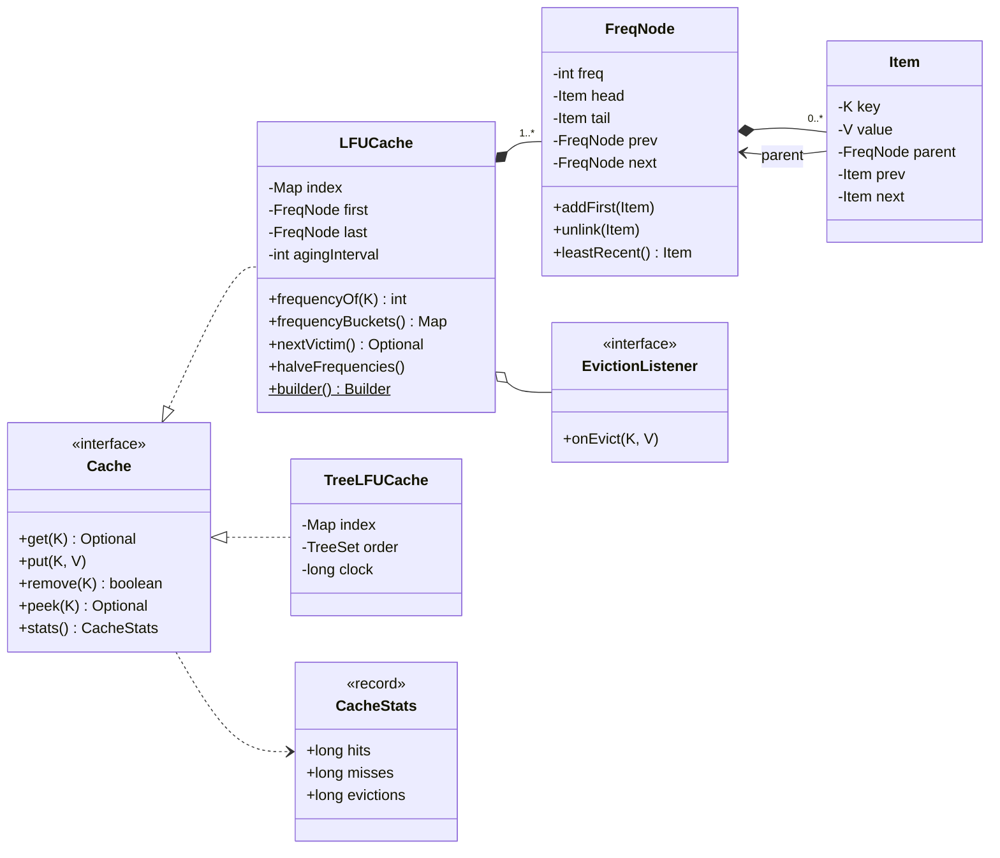
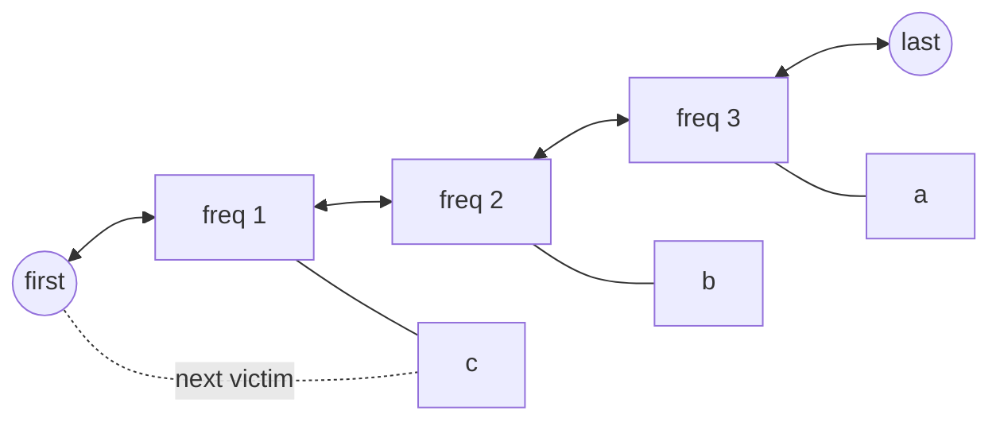
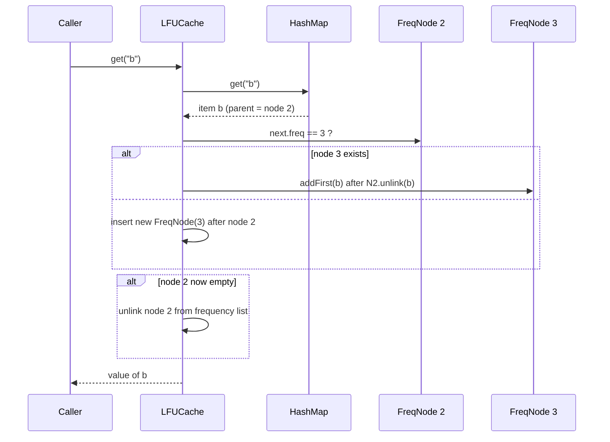

# 📊 Design an LFU Cache — Low Level Design (Java)


-success)

> The harder sibling of the [LRU Cache](../LRUCache/README.md). LRU only needs to know **when** a
> key was last used; LFU must know **how often**, and must still answer in **O(1)**. Interviewers
> use it to see whether you can go from an obvious O(log n) solution to a clever O(1) one, and
> whether you know LFU's weak spot (**stale popularity**) and how to fix it.

A cache holds a limited number of key → value pairs. When it is full, **LFU (Least Frequently
Used)** evicts the key that has been used the **fewest times**. If several keys share that lowest
count, the **least recently used** of them goes (the standard tie-break).

> 📚 **Credit:** Problem inspired by
> [AlgoMaster — Design LFU Cache](https://algomaster.io/learn/lld/design-lfu-cache) (premium
> lesson, **not** accessed). Everything here is my own original work, based on widely known
> computer-science material. See [References & Credits](#-references--credits).

---

## 📑 On this page

1. [Scoping the Problem](#1-scoping-the-problem)
2. [Finding the Building Blocks](#2-finding-the-building-blocks)
3. [Object Model](#3-object-model)
   - [3.1 Class Responsibilities](#31-class-responsibilities)
   - [3.2 Patterns in Play](#32-patterns-in-play)
   - [3.3 UML Diagrams](#33-uml-diagrams)
   - [Practice Round](#-practice-round)
4. [Implementation Walkthrough](#4-implementation-walkthrough)
5. [Build, Run & Verify](#5-build-run--verify)
6. [Follow-up Scenarios](#6-follow-up-scenarios)
   - [6.1 From O(log n) to O(1)](#61-from-olog-n-to-o1)
   - [6.2 The minFreq Shortcut and Its Pitfall](#62-the-minfreq-shortcut-and-its-pitfall)
   - [6.3 Stale Popularity and Frequency Aging](#63-stale-popularity-and-frequency-aging)
7. [Last-Minute Revision](#7-last-minute-revision)
8. [References & Credits](#-references--credits)

---

## 1. Scoping the Problem

### 🗣️ Sample conversation

| Candidate asks | Interviewer answers | Design impact |
|---|---|---|
| Operations? | `get`, `put`; `remove` is a bonus. | Same `Cache<K,V>` contract as the LRU problem. |
| Complexity? | Start with anything correct, then **O(1)**. | Present the TreeSet version, then the frequency-list version. |
| Tie-break when frequencies are equal? | Least recently used. | Each frequency keeps its keys in recency order. |
| Does `put` on an existing key count as a use? | Yes. | Update the value **and** increment the frequency. |
| What frequency does a new key start at? | 1. | New keys are the first eviction candidates, which is correct for LFU. |
| Should old popularity last forever? | Good question: no, it should fade. | Optional **aging** (halve all counts periodically). |
| Thread safety? | Mention it. | Same decorator approach as the LRU cache. |

### ✅ Functional requirements

1. `get(key)`: return the value and increase its use count.
2. `put(key, value)`: insert with count 1, or update the value and increase the count.
3. When full, evict the key with the **lowest count**; among equals, the **least recently used**.
4. `remove`, `peek` (no count change), `size`, `capacity`, `clear`, stats, eviction callback.
5. Optional aging: every *N* operations, halve all counts (minimum 1).

### ⚙️ Non-functional requirements

- **O(1)** `get`, `put` and `remove`, including removing the *current minimum*, which trips up many implementations.
- Deterministic eviction order that can be verified against a brute-force oracle.

---

## 2. Finding the Building Blocks

The main insight: **frequencies only ever change by +1**. An item at count *f* moves to count *f + 1*,
which is either the very next frequency in use or doesn't exist yet. So if we keep the used frequencies
in a **linked list**, the next bucket is always a neighbour, and we never need to search or sort.

| Candidate | Keep? | Reasoning |
|---|---|---|
| **`Map<K, Item>` index** | ✅ | O(1) lookup of any key. |
| **Item** (key, value, parent, prev, next) | ✅ | Knows its frequency node, so moving it is O(1). |
| **FreqNode** (freq, item list, prev, next) | ✅ | One per frequency *in use*, linked in ascending order. The first node is always the minimum. |
| **Sentinel nodes** | ✅ | Dummy first/last frequency nodes and dummy head/tail items remove all null checks. |
| `TreeSet<(freq, lastUsed)>` | ✅ as the **baseline** | Obvious O(log n) solution, kept as `TreeLFUCache` for comparison and testing. |
| `PriorityQueue` | ❌ | Updating an element's priority is O(n) (remove + re-add). |
| `Map<freq, List>` + `minFreq` | ⚠️ | Common interview version, but has a removal pitfall ([6.2](#62-the-minfreq-shortcut-and-its-pitfall)). |

---

## 3. Object Model

### 3.1 Class Responsibilities

#### `LFUCache<K, V>`, the O(1) design
| Member | Purpose |
|---|---|
| `Map<K, Item> index` | Key → item. |
| `FreqNode first, last` | Sentinels. `first.next` is the lowest frequency in use. |
| `increment(item)` | Move to the `f + 1` node: reuse `current.next` if its freq is `f + 1`, else insert a new node right after. Drop the old node if it became empty. |
| `evict()` | Victim = `first.next.leastRecent()`. |
| `detach(item)` | Unlink; drop the node if empty. The minimum updates itself automatically. |
| `halveFrequencies()` | Aging: rebuild the node list with `max(1, f / 2)`. |
| `frequencyOf`, `frequencyBuckets`, `nextVictim` | Inspection (no side effects). |
| `Builder` | `capacity`, `agingEvery(n)`, `evictionListener`. |

#### `TreeLFUCache<K, V>`, the O(log n) baseline
`HashMap` + `TreeSet` ordered by `(freq, lastUsed)`. Every access = `remove`, update, `add`.

#### Shared contracts
`Cache<K, V>` (get / put / remove / peek / containsKey / size / capacity / clear / stats),
`CacheStats` record, and `EvictionListener` (Observer).

### 3.2 Patterns in Play

| Pattern | Where | Why here |
|---|---|---|
| **Composite data structure** | HashMap + list of frequency nodes + per-frequency item lists | Each structure answers one question in O(1): *where is the key*, *what is the next frequency*, *who is least recent*. |
| **Sentinel nodes** | Both list levels | Removes every "first/last/empty" special case. |
| **Builder** | `LFUCache.builder()` | Optional aging and listener without telescoping constructors. |
| **Observer** | `EvictionListener` | Write-back, logging and metrics on eviction. |
| **Program to an interface** | `Cache<K, V>` | O(1) and O(log n) versions are interchangeable, so the same tests run against both. |

### 3.3 UML Diagrams

**Class diagram**



**The structure after `put a, put b, put c, get a, get a, get b`**



**What happens on `get("b")` when b has frequency 2**



### 🧠 Practice Round

1. **Code the TreeSet version first** (10 minutes), then the O(1) version (25 minutes).
2. **FIFO tie-break**: among equal frequencies, evict the *oldest inserted* key instead of the least
   recently used one. What single line changes in each implementation?
3. **LFU with dynamic aging (LFU-DA)**: priority = `freq + L`, where `L` is the priority of the last
   evicted item. Why does this age the cache without a periodic O(n) pass?
4. **Window TinyLFU** (used by the Caffeine library): what problem does admitting new keys through a
   small LRU "window" solve?
5. **Thread-safe LFU**: can you use a read lock for `get`? Why not?

<details>
<summary>💡 Hints for #2</summary>

O(1) version: when an item moves to `f + 1`, add it at the **tail** of the new node's list (so it
keeps its original insertion rank) instead of the head. Tree version: set `lastUsed` only on insert,
not on access. The oracle in the tests would change in the same way.
</details>

<details>
<summary>💡 Hints for #5</summary>

No. `get` **moves the item** to another frequency node, which is a structural write. Use an exclusive
lock (or shard the cache by key hash), exactly as in the LRU problem's `SynchronizedCache`.
</details>

---

## 4. Implementation Walkthrough

### 📁 Project structure

```
LFUCache/
├── pom.xml
├── README.md
└── src
    ├── main/java/com/lld/ds/lfucache
    │   ├── LFUCacheApp.java              # interactive console, shows the buckets live
    │   ├── cache/  Cache, CacheStats, EvictionListener
    │   ├── lfu/    LFUCache              ← O(1) frequency-list design (+ aging, builder)
    │   └── tree/   TreeLFUCache          ← O(log n) baseline
    └── test/java/com/lld/ds/lfucache
        └── LFUCacheTest.java             # behaviour ×2 impls, aging, brute-force oracle
```

### ⚙️ The O(1) increment

```java
private void increment(Item<K, V> item) {
    FreqNode<K, V> current = item.parent;
    int nextFreq = current.freq + 1;
    FreqNode<K, V> target = current.next.freq == nextFreq
            ? current.next                        // bucket f+1 already exists: it's the neighbour
            : insertAfter(current, nextFreq);     // otherwise create it right after f
    current.unlink(item);
    target.addFirst(item);                        // most recent within its frequency
    if (current.isEmpty()) {
        removeNode(current);                      // keep only frequencies in use
    }
}
```

### 🎯 Eviction is always the first node's tail

```java
private void evict() {
    FreqNode<K, V> lowest = first.next;           // lowest frequency in use, always
    Item<K, V> victim = lowest.leastRecent();     // LRU among them (tie-break)
    index.remove(victim.key);
    detach(victim);                               // may drop the node; the next one becomes the minimum
    evictionListener.onEvict(victim.key, victim.value);
}
```

### 🌳 The O(log n) baseline

```java
private void touch(Entry<K, V> e) {
    order.remove(e);          // must remove BEFORE changing the fields the comparator reads
    e.freq++;
    e.lastUsed = ++clock;
    order.add(e);
}
// victim = order.pollFirst()   → lowest freq, then least recent
```

> ⚠️ **Classic bug:** changing `freq` while the entry is still inside the `TreeSet` corrupts the
> tree, because it can no longer find the entry. Always remove, mutate, then re-add.

👉 Browse the full source in [`src/main/java`](src/main/java/com/lld/ds/lfucache).

### ⏱️ Complexity

| Operation | `LFUCache` | `TreeLFUCache` |
|---|---|---|
| `get` (hit) | **O(1)** | O(log n) |
| `put` (new, with eviction) | **O(1)** | O(log n) |
| `put` (update) | **O(1)** | O(log n) |
| `remove` | **O(1)** | O(log n) |
| Aging pass | O(n), every *N* ops → **O(1) amortised** if *N* ≥ capacity | — |
| Memory | O(capacity) + O(distinct frequencies) | O(capacity) |

---

## 5. Build, Run & Verify

### With Maven

```bash
cd Data-Structures-and-Search/LFUCache
mvn test                                        # 19 tests
mvn compile exec:java -Dexec.args="3"           # capacity 3, no aging
mvn compile exec:java -Dexec.args="3 10"        # capacity 3, halve every 10 ops
```

### Without Maven (plain JDK 17+)

```bash
cd Data-Structures-and-Search/LFUCache
javac -d out $(find src/main -name "*.java")
java -cp out com.lld.ds.lfucache.LFUCacheApp 3
```

### Sample session (capacity 3)

```
Buckets are shown as f=<frequency> [most recent ... least recent]
> put a 1
  f=1 [a]   (next victim: a)
> put b 2
  f=1 [b, a]   (next victim: a)
> put c 3
  f=1 [c, b, a]   (next victim: a)
> get a
  1
  f=1 [c, b]  f=2 [a]   (next victim: b)
> get a
  1
  f=1 [c, b]  f=3 [a]   (next victim: b)
> get b
  2
  f=1 [c]  f=2 [b]  f=3 [a]   (next victim: c)
> put d 4
  evicted c=3
  f=1 [d]  f=2 [b]  f=3 [a]   (next victim: d)
> age
  f=1 [a, b, d]   (next victim: d)
> stats
  hits=3 misses=0 evictions=1 hitRate=100.0%
```

Notice the empty `f=2` bucket vanished after the second `get a`, and after `age` the three
buckets merged into one while keeping their ranking (`d` is still evicted first).

### ✅ What the tests cover

| Test | Verifies |
|---|---|
| `evictsLeastFrequentlyUsed` / `tieBrokenByLeastRecentlyUsed` / `updatingAValueCountsAsAUse` / `newKeyIsTheFirstCandidateForEviction` / `removingTheOnlyLowFrequencyKeyThenEvicting` / `capacityOneAlwaysKeepsTheNewest` / `peekDoesNotCountAsUse` / `invalidInput` | Core rules, **each run against both implementations**. |
| `frequencyBucketsShowTheStructure` / `emptyFrequencyNodesAreRemoved` | Internal structure matches the diagram. |
| `statsAndEvictionListener` / `clearResetsEverything` | Observability and reset. |
| `halvingKeepsRankingAndMinimumOfOne` / `halvingMergesBucketsWithLowerOriginalFrequencyEvictedFirst` | Aging arithmetic and ordering. |
| **`agingLetsOldPopularityFade`** | Shows the stale-popularity problem **and** the fix side by side. |
| **`bothImplementationsMatchTheBruteForceOracle`** (capacity 1, 2, 5, 50) | 100,000 random ops each: same `get` results, same removals, same size, the **same eviction sequence** and the same final frequencies as an independent O(n) brute-force LFU. |

---

## 6. Follow-up Scenarios

### 6.1 From O(log n) to O(1)

**Ask:** "Your TreeSet solution is O(log n). Can you make it O(1)?"

The reasoning to say out loud:

1. The sorted set is only needed to find the **minimum** and to **re-position** an entry after its count changes.
2. A count only changes by **+1**, so an entry moves from bucket *f* to bucket *f + 1*.
3. If buckets are a **linked list in ascending order**, bucket *f + 1* is either `f.next` or doesn't
   exist, and creating it right after *f* keeps the list sorted. No searching is needed.
4. The minimum is always the **first** bucket. Inside a bucket, a recency-ordered list gives the LRU tie-break.

### 6.2 The minFreq Shortcut and Its Pitfall

The version most often written in interviews is:

```
Map<K, Node> nodes;  Map<Integer, LinkedHashSet<K>> buckets;  int minFreq;
get:  move key f → f+1; if bucket f empty and f == minFreq → minFreq++
put:  new key → bucket 1, minFreq = 1
evict: first key of buckets[minFreq]
```

It's O(1) for `get`/`put`/`evict`. But after an **arbitrary `remove(key)`** that empties the
`minFreq` bucket, the true new minimum is unknown. It could be `minFreq + 1` or `minFreq + 5000`.
Implementations then either scan upwards (O(max frequency)) or scan all buckets. The linked list of
frequency nodes used here has no such gap: after removing a node, `first.next` **is** the new
minimum. That's why this project uses it (and tests `removingTheOnlyLowFrequencyKeyThenEvicting`).

### 6.3 Stale Popularity and Frequency Aging

**Ask:** "Yesterday's viral article was read 1 million times. Today nobody reads it. What happens?"

With pure LFU it **never leaves**: its count dwarfs everything new, so fresh items keep getting
evicted instead. This is called *cache pollution*.

Fixes:

| Technique | Idea | Trade-off |
|---|---|---|
| **Periodic halving** (implemented: `agingEvery(n)`) | Every *n* operations, `freq = max(1, freq / 2)` | Simple; O(n) pass, amortised O(1) when *n* ≥ capacity |
| **LFU-DA** (dynamic aging) | Priority = `freq + L`, where `L` rises with each eviction | No periodic pass; needs a priority structure |
| **Window TinyLFU** | Small LRU window + frequency *sketch* to decide admission | Production grade (Caffeine); more complex |

The test `agingLetsOldPopularityFade` runs the same workload on both caches: without aging the stale key
stays forever, and with `agingEvery(20)` it's evicted once the new keys overtake it.

### 🚀 More follow-ups to practice

| Follow-up | Design move |
|---|---|
| Thread safety | Exclusive lock or sharding, **not** a read lock, since `get` restructures the lists. |
| TTL | Wrap as in the LRU project: store `(value, expiresAt)` and drop entries when they are read. |
| Size-aware eviction | Weight per entry; evict from `first.next` until `totalWeight ≤ max`. |
| Count overflow | Counts saturate at `Integer.MAX_VALUE - 1` here; aging keeps them small in practice. |
| Pick LRU vs LFU | LRU for recency-driven data (sessions, feeds); LFU for stable popularity (catalogue, CDN assets). |

---

## 7. Last-Minute Revision

```
1. Clarify    → tie-break (LRU)? put counts as use? new key freq = 1? aging? O(1)?
2. Baseline   → HashMap + TreeSet ordered by (freq, lastUsed): O(log n); remove → mutate → re-add
3. O(1) key   → counts change by +1 only → keep frequencies in a LINKED LIST (ascending)
                item → parent FreqNode; next bucket = current.next or insert right after
                min = first.next; victim = its least-recent item; drop empty FreqNodes
4. Pitfall    → Map<freq,..> + minFreq breaks on arbitrary remove (unknown new minimum)
5. Weakness   → stale popularity; fix with aging (halve counts), LFU-DA, or W-TinyLFU
6. Patterns   → composite structure + sentinels, Builder, Observer, program to interface
7. Testing    → both impls vs an independent brute-force oracle; compare eviction SEQUENCES
```

---

## 📚 References & Credits

| Resource | How it was used |
|---|---|
| [AlgoMaster.io — Design LFU Cache (LLD)](https://algomaster.io/learn/lld/design-lfu-cache) | Inspiration for the **problem choice** only. The lesson is premium and was **not** accessed. |
| Shah, Mitra & Matani, *"An O(1) algorithm for implementing the LFU cache eviction scheme"* (2010) | Public paper describing the linked list of frequency nodes. |
| [Cache replacement policies — Wikipedia](https://en.wikipedia.org/wiki/Cache_replacement_policies) | Public background on LFU, LFU-DA and TinyLFU. |
| [Mermaid](https://mermaid.js.org/) | Diagrams rendered by GitHub. |
| [JUnit 5 User Guide](https://junit.org/junit5/docs/current/user-guide/) | Testing. |

**Originality statement**

- This repository is a **personal learning project** for LLD interview preparation.
- The AlgoMaster lesson is premium content that I have not accessed. No text, code, diagrams,
  headings or other material from it (or any paid source) is reproduced here.
- All headings, source code, explanations, tables, diagrams, tests and exercises were written
  independently from widely known computer-science material and the public references above.
- This project is **not affiliated with or endorsed by** AlgoMaster.io. "AlgoMaster" is the
  property of its respective owner.
- For the original lesson, please support the author at [algomaster.io](https://algomaster.io).

---

> ⭐ Try the Practice Round before reading the code, then compare your design with this one.
