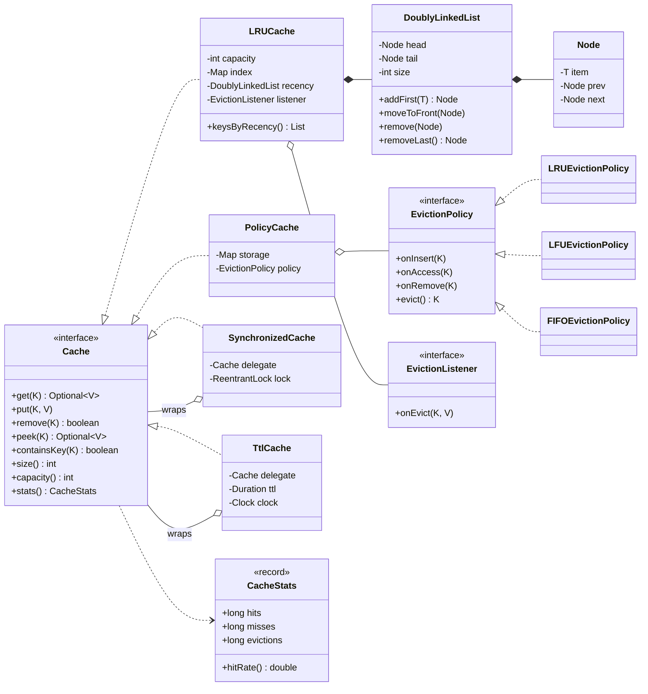
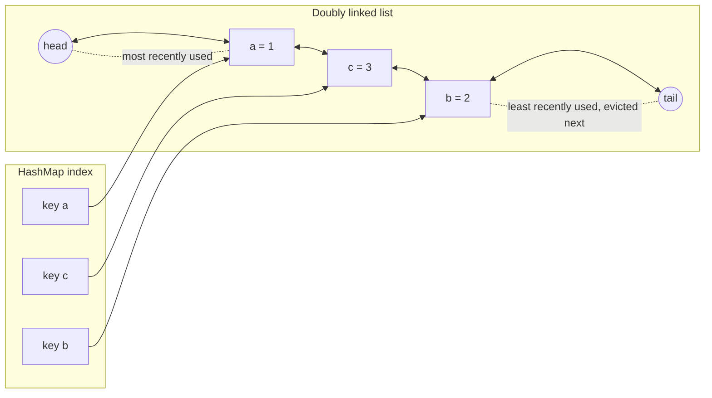
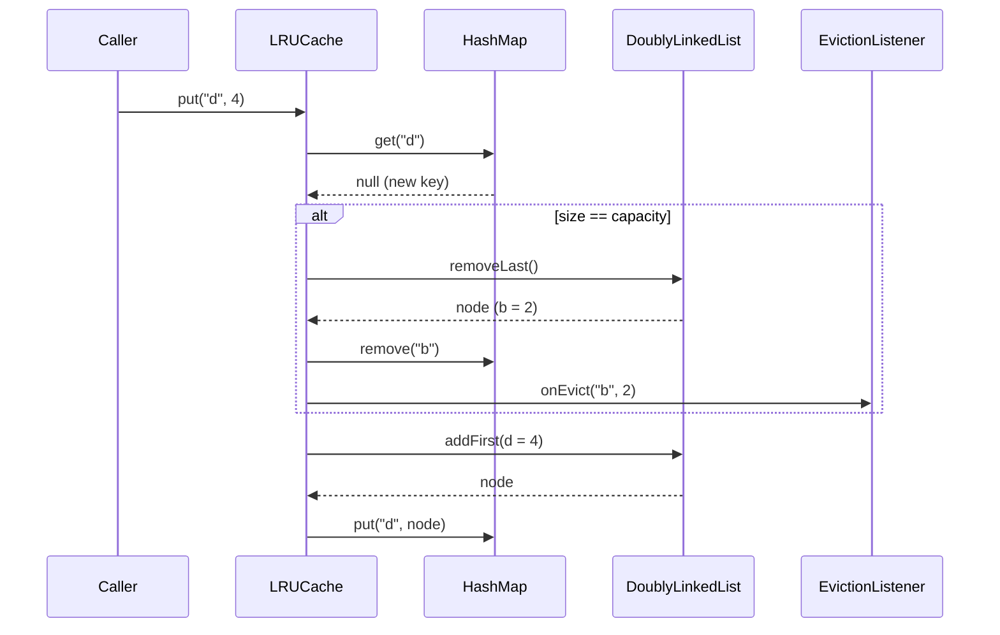

# 🗄️ Design an LRU Cache — Low Level Design (Java)


> The most frequently asked "data structure design" question. The core answer, **HashMap +
> doubly linked list = O(1) get and put**, fits on a whiteboard. The follow-ups separate strong
> candidates: **thread safety**, **other eviction policies** and **expiry**.

A cache keeps a limited number of key → value pairs in fast memory. When it is full and a new key
arrives, one entry must go. **LRU (Least Recently Used)** evicts the entry that hasn't been read
or written for the longest time, on the bet that recently used data will be used again soon.

> 📚 **Credit:** Problem inspired by
> [AlgoMaster — Design LRU Cache](https://algomaster.io/learn/lld/design-lru-cache) (premium
> lesson, **not** accessed). Everything here is my own original work, based on widely known
> computer-science material. See [References & Credits](#-references--credits).

---

## 📑 On this page

1. [Scoping the Problem](#1-scoping-the-problem)
2. [Finding the Building Blocks](#2-finding-the-building-blocks)
3. [Object Model](#3-object-model)
   - [3.1 Class Responsibilities](#31-class-responsibilities)
   - [3.2 Patterns in Play](#32-patterns-in-play)
   - [3.3 UML Diagrams](#33-uml-diagrams)
   - [Practice Round](#-practice-round)
4. [Implementation Walkthrough](#4-implementation-walkthrough)
5. [Build, Run & Verify](#5-build-run--verify)
6. [Follow-up Scenarios](#6-follow-up-scenarios)
   - [6.1 Making It Thread-Safe](#61-making-it-thread-safe)
   - [6.2 Swapping the Eviction Policy (LFU, FIFO)](#62-swapping-the-eviction-policy-lfu-fifo)
   - [6.3 Expiring Entries with a TTL](#63-expiring-entries-with-a-ttl)
7. [Last-Minute Revision](#7-last-minute-revision)
8. [References & Credits](#-references--credits)

---

## 1. Scoping the Problem

### 🗣️ Sample conversation

| Candidate asks | Interviewer answers | Design impact |
|---|---|---|
| What operations? | `get(key)` and `put(key, value)`; remove is a bonus. | `Cache<K, V>` interface. |
| Required complexity? | **O(1)** for both. | Rules out scanning or sorting. HashMap + linked list. |
| Fixed capacity by entry count? | Yes, set at construction. | `capacity` field; evict on insert when full. |
| Does `put` on an existing key count as "use"? | Yes, it refreshes recency and doesn't evict. | Update in place + move to front. |
| Null keys or values? | Not allowed. | Reject early; `Optional.empty()` always means "absent". |
| Multiple threads? | Start single-threaded; I'll ask. | Keep the core lock-free; add a decorator. |
| Other policies (LFU)? Expiry? | Possible follow-ups. | `EvictionPolicy` strategy; `TtlCache` decorator. |
| Metrics? | Nice to have. | Hit/miss/eviction counters + eviction listener. |

### ✅ Functional requirements

1. `get(key)` returns the value if present and marks the key as most recently used.
2. `put(key, value)` inserts or updates and marks the key as most recently used.
3. When inserting a **new** key into a full cache, evict the **least recently used** key first.
4. `remove(key)`, `size()`, `capacity()`, `clear()`.
5. `peek` / `containsKey` that do **not** change recency (for monitoring and debugging).
6. Stats (hits, misses, evictions, hit rate) and a callback when an entry is evicted.

### ⚙️ Non-functional requirements

- **O(1)** `get`, `put` and `remove`.
- **Generic** over key and value types.
- **Extensible** to other policies, thread safety and TTL, **without modifying** the core class.
- **Verifiably correct**: cross-checked against a trusted reference implementation.

---

## 2. Finding the Building Blocks

The main insight is that **no single standard structure** gives O(1) for both requirements:

| Need | HashMap | Linked list | Array / heap |
|---|---|---|---|
| Find a key | **O(1)** ✅ | O(n) ❌ | O(n) / O(log n) |
| Move an entry to "most recent" | no order ❌ | **O(1) given the node** ✅ | O(n) / O(log n) |
| Remove the oldest entry | no order ❌ | **O(1)** at the tail ✅ | O(n) / O(log n) |

**Combine them:** the map stores `key → list node`, and the list keeps nodes in recency order.
The map finds the node in O(1), and the list moves or removes it in O(1).

| Candidate | Keep? | Reasoning |
|---|---|---|
| **Cache\<K,V\>** | ✅ interface | One contract for LRU, LFU, FIFO, synchronized and TTL caches. |
| **LRUCache** | ✅ class | The classic O(1) implementation. |
| **DoublyLinkedList + Node** | ✅ class | *Doubly* linked so a node can unlink itself in O(1) (it knows its `prev`). |
| **Entry (key, value)** | ✅ nested class | The list node must hold the **key** so eviction can also delete the map entry. |
| **EvictionPolicy** | ✅ interface | Which key to evict is a separate, swappable decision. |
| **CacheStats**, **EvictionListener** | ✅ | Observability. |
| **SynchronizedCache**, **TtlCache** | ✅ decorators | Add concurrency and expiry *around* any cache. |

> 💡 **Interview tip:** Say out loud *why* the list is doubly linked and why the node stores the key.
> Those are the two details interviewers check.

---

## 3. Object Model

### 3.1 Class Responsibilities

#### Interface — `Cache<K, V>`
```java
Optional<V> get(K key);          // counts as use
void put(K key, V value);        // counts as use; may evict
boolean remove(K key);
Optional<V> peek(K key);         // no reordering, no stats
default boolean containsKey(K key) { return peek(key).isPresent(); }
int size(); int capacity(); void clear(); CacheStats stats();
```

#### `DoublyLinkedList<T>`
| Member | Purpose |
|---|---|
| `head`, `tail` sentinels | Dummy nodes, so there are **no null checks** for "first" or "last" node. |
| `addFirst(item)` → `Node` | Insert as most recent. Returns the node so the caller can store it in the map. |
| `moveToFront(node)` | Unlink and relink after `head`. O(1). |
| `remove(node)` / `removeLast()` | O(1). |

#### `LRUCache<K, V>`
| Member | Purpose |
|---|---|
| `Map<K, Node<Entry<K,V>>> index` | Key → node. |
| `DoublyLinkedList<Entry<K,V>> recency` | Front = MRU, back = LRU. |
| `get` | Look up → move to front → hit, or miss. |
| `put` | Existing key: update + move to front. New key: evict the tail if full, then add at the front. |
| `EvictionListener`, counters | Callback + stats. |

#### Strategy — `EvictionPolicy<K>` + `PolicyCache<K, V>`
`onInsert`, `onAccess`, `onRemove`, `evict()`. Implementations: `LRUEvictionPolicy`,
`LFUEvictionPolicy` (O(1)), `FIFOEvictionPolicy`. `PolicyCache` = `HashMap` storage + any policy.

#### Decorators
| Class | Adds |
|---|---|
| `SynchronizedCache` | One `ReentrantLock` around every call. |
| `TtlCache` | Stores `(value, expiresAt)` in the inner cache and drops expired entries when they are read. |

### 3.2 Patterns in Play

| Pattern | Where | Why here |
|---|---|---|
| **Composite data structure** | `LRUCache` = HashMap + doubly linked list | The textbook way to get O(1) lookup **and** O(1) ordering. |
| **Strategy** | `EvictionPolicy` → LRU / LFU / FIFO | Change *which* key is evicted without touching storage code. |
| **Decorator** | `SynchronizedCache`, `TtlCache` | Stack features: `new SynchronizedCache<>(new TtlCache<>(new LRUCache<>(1000), ttl, clock))`. |
| **Observer** | `EvictionListener` | Write-back, metrics or logging when data leaves the cache. |
| **Program to an interface** | `Cache<K, V>` | Callers don't care which implementation or which decorators are in use. |

**SOLID mapping**

- **S**: the list only links nodes, `LRUCache` only does LRU logic, and locking and expiry live in decorators.
- **O**: new policies and features are new classes; `LRUCache` never changes.
- **L**: every decorator *is a* `Cache` and can be used anywhere a `Cache` is expected.
- **I**: `EvictionListener` is a single-method functional interface.
- **D**: `PolicyCache` depends on the `EvictionPolicy` abstraction.

### 3.3 UML Diagrams

**Class diagram**



**Memory layout**



**What happens on `put("d", 4)` when full**



### 🧠 Practice Round

1. **Write it from memory in 15 minutes**, including the sentinel nodes. Then compare with `LRUCache.java`.
2. **LinkedHashMap version**: implement LRU in 10 lines using `LinkedHashMap(cap, 0.75f, true)` +
   `removeEldestEntry`. When would an interviewer *not* accept this?
3. **Size-based eviction**: capacity in bytes rather than entries, where each value reports its size.
   What changes in `put`?
4. **Write-back cache**: dirty entries must be saved to a database before eviction. Where does that hook in?
5. **Sharded cache**: 16 independent LRU caches chosen by `hash(key) % 16`. What do you gain and
   what exactly do you lose?
6. **LRU-K / 2Q**: protect the cache from a one-time scan of many keys that would flush it.

<details>
<summary>💡 Hints for #2</summary>

```java
class LinkedLru<K, V> extends LinkedHashMap<K, V> {
    private final int capacity;
    LinkedLru(int capacity) { super(16, 0.75f, true); this.capacity = capacity; }   // accessOrder = true
    @Override protected boolean removeEldestEntry(Map.Entry<K, V> e) { return size() > capacity; }
}
```
This is fine in production, but interviewers usually want to see *you* build the map + list.
This repo uses exactly this class as the **reference** in its randomized tests.
</details>

<details>
<summary>💡 Hints for #5</summary>

You gain less lock contention: threads touching different shards don't block each other. You lose
**global** LRU order: each shard evicts its own oldest key, which may be newer than the true global
LRU key. Most production caches accept this trade-off.
</details>

---

## 4. Implementation Walkthrough

### 📁 Project structure

```
LRUCache/
├── pom.xml
├── README.md
└── src
    ├── main/java/com/lld/ds/lrucache
    │   ├── LRUCacheApp.java                  # interactive console demo
    │   ├── cache/      Cache, CacheStats, EvictionListener
    │   ├── list/       DoublyLinkedList (+ Node)
    │   ├── lru/        LRUCache                      ← the classic answer
    │   ├── policy/     EvictionPolicy, LRU/LFU/FIFOEvictionPolicy, PolicyCache
    │   └── decorator/  SynchronizedCache, TtlCache
    └── test/java/com/lld/ds/lrucache
        ├── LRUCacheTest.java                 # incl. 200k-op cross-check vs LinkedHashMap
        └── PolicyAndDecoratorTest.java       # LFU/FIFO, TTL with a fake clock, 8-thread stress test
```

### 🧩 The whole algorithm

```java
public Optional<V> get(K key) {
    Node<Entry<K, V>> node = index.get(key);
    if (node == null) { misses++; return Optional.empty(); }
    recency.moveToFront(node);                        // now the most recently used
    hits++;
    return Optional.of(node.item().value);
}

public void put(K key, V value) {
    Node<Entry<K, V>> existing = index.get(key);
    if (existing != null) {                           // update: no eviction
        existing.item().value = value;
        recency.moveToFront(existing);
        return;
    }
    if (index.size() == capacity) {                   // full: drop the tail (LRU)
        Entry<K, V> victim = recency.removeLast().item();
        index.remove(victim.key);                     // ← why the node stores the key
        evictionListener.onEvict(victim.key, victim.value);
    }
    index.put(key, recency.addFirst(new Entry<>(key, value)));
}
```

### 🔗 Sentinels remove every edge case

```java
private final Node<T> head = new Node<>(null);   // always before the first real node
private final Node<T> tail = new Node<>(null);   // always after the last real node

public void remove(Node<T> node) {               // no "if first / if last" branches
    node.prev.next = node.next;
    node.next.prev = node.prev;
}
```

👉 Browse the full source in [`src/main/java`](src/main/java/com/lld/ds/lrucache).

### ⏱️ Complexity

| Operation | `LRUCache` | `PolicyCache` + LFU | `SynchronizedCache` |
|---|---|---|---|
| `get` | **O(1)** | O(1) | O(1) + lock |
| `put` (incl. eviction) | **O(1)** | O(1) amortised | O(1) + lock |
| `remove` | **O(1)** | O(1) | O(1) + lock |
| Memory | O(capacity) | O(capacity) | same as inner |

---

## 5. Build, Run & Verify

### With Maven

```bash
cd Data-Structures-and-Search/LRUCache
mvn test                                      # 24 tests
mvn compile exec:java -Dexec.args="3"         # interactive demo, capacity 3
```

### Without Maven (plain JDK 17+)

```bash
cd Data-Structures-and-Search/LRUCache
javac -d out $(find src/main -name "*.java")
java -cp out com.lld.ds.lrucache.LRUCacheApp 3
```

### Sample session (capacity 3)

```
> put a 1
  [MRU] a=1 [LRU]
> put b 2
  [MRU] b=2 -> a=1 [LRU]
> put c 3
  [MRU] c=3 -> b=2 -> a=1 [LRU]
> get a
  1
  [MRU] a=1 -> c=3 -> b=2 [LRU]
> put d 4
  evicted b=2 (least recently used)
  [MRU] d=4 -> a=1 -> c=3 [LRU]
> get b
  (miss)
  [MRU] d=4 -> a=1 -> c=3 [LRU]
> stats
  hits=1 misses=1 evictions=1 hitRate=50.0%
```

Reading `a` saved it: `b` was evicted instead, even though `a` was inserted first.

### ✅ What the tests cover

| Test | Verifies |
|---|---|
| `evictsLeastRecentlyUsedWhenFull` / `getRefreshesRecency` | Core LRU behaviour. |
| `putOnExistingKeyUpdatesAndRefreshesWithoutEvicting` | Updates don't evict. |
| `peekAndContainsDoNotChangeRecencyOrStats` | Monitoring reads are side-effect free. |
| `removeFreesCapacity` / `capacityOne` / `clearEmptiesTheCache` | Edge cases. |
| `statsAndEvictionListener` | Counters; explicit remove is not an eviction. |
| `invalidArgumentsAreRejected` | Capacity < 1, null key or value. |
| **`matchesLinkedHashMapReferenceOnRandomOperations`** | **200,000 random ops** compared with Java's `LinkedHashMap` (access order): same results, same size and the **same final recency order**. |
| `doublyLinkedListBasics` | List operations incl. empty `removeLast`. |
| **`lruPolicyBehavesExactlyLikeLruCache`** | The pluggable LRU policy matches the classic class over 50,000 ops (same stats). |
| `lfu…` (4 tests) / `fifoIgnoresReads` | LFU frequency, LRU tie-break, removal of the min-frequency key; FIFO ignores reads. |
| `ttlEntriesExpire` / `ttlPutRestartsTheTimer` / `ttlWorksOnTopOfLfuToo` | TTL with an **injected fake clock** (no `sleep`). |
| **`synchronizedCacheSurvivesConcurrentUse`** | 8 threads × 20,000 mixed ops; no exceptions, size ≤ capacity, every reported key is readable. |

---

## 6. Follow-up Scenarios

### 6.1 Making It Thread-Safe

**Ask:** "Many threads call the cache. What breaks and how do you fix it?"

Two threads calling `moveToFront` on neighbouring nodes can interleave pointer updates and
**corrupt the list**, for example leaving a node that links to itself. Then `get` loops forever or
`size` becomes wrong.

```java
Cache<K, V> safe = new SynchronizedCache<>(new LRUCache<>(10_000));
```

| Option | Verdict |
|---|---|
| `synchronized` / one `ReentrantLock` (used here) | Simple and correct. All operations are serialised. |
| `ReadWriteLock` | ❌ **Trap!** In LRU, `get` *modifies* the list (moves the node), so it's a write. Read locks would allow corruption. |
| `ConcurrentHashMap` + synchronized list | Still needs a lock for every list change, so little is gained. |
| **Sharding / lock striping** | N independent LRU caches chosen by `hash(key) % N`. Much less contention, but only *approximate* global LRU. |
| Buffered recency (Caffeine-style) | Record accesses in a lock-free buffer and replay them in batches. Near-lock-free reads; production grade. |

Because `SynchronizedCache` is a **decorator**, `LRUCache` stays simple and fast for
single-threaded callers. That's the Open/Closed Principle in practice.

### 6.2 Swapping the Eviction Policy (LFU, FIFO)

**Ask:** "Product wants to keep *popular* items, not just recent ones."

Extract the "which key goes?" decision into a strategy:

```java
Cache<String, Product> cache = PolicyCache.lfu(1_000);   // or .lru(...), .fifo(...)
```

**O(1) LFU**: track frequencies with buckets:

```
frequency: key → count
buckets:   count → LinkedHashSet<key>   (insertion order = LRU tie-break)
minFreq:   smallest count that has keys
access:  move key from bucket f to f+1; if bucket f was the min and is now empty → minFreq++
insert:  bucket 1, minFreq = 1
evict:   first key of bucket[minFreq]
```

| Policy | Evicts | Good for | Weakness |
|---|---|---|---|
| **LRU** | Least recently used | Recency-heavy workloads (sessions, feeds) | A one-time scan flushes useful data |
| **LFU** | Least frequently used | Stable popularity (product catalogues) | Old popular items stay forever without ageing |
| **FIFO** | Oldest inserted | Simple, predictable | Ignores usage completely |

### 6.3 Expiring Entries with a TTL

**Ask:** "Entries must expire 5 minutes after being written."

```java
Cache<String, Session> sessions =
        new TtlCache<>(new LRUCache<>(10_000), Duration.ofMinutes(5), Clock.systemUTC());
```

Design decisions:

- **Store the expiry *inside* the wrapped cache** (`Expiring<V>(value, expiresAt)`). When the inner
  LRU evicts an entry, its expiry data goes with it, so there's no second map that can leak.
- **Lazy expiry**: an entry is dropped when it's read. It's cheap, but expired entries occupy
  space until they are read or evicted. The fix is a background sweeper that scans periodically,
  or a priority queue ordered by `expiresAt`.
- **Inject a `Clock`**: tests move time forward instantly instead of calling `Thread.sleep`.
- Expired reads are counted as **misses**, so the hit rate stays honest.

### 🚀 More follow-ups to practice

| Follow-up | Design move |
|---|---|
| Distributed cache | Consistent hashing across nodes; each node runs this LRU locally. |
| Write-through / write-back | A `LoadingCache` decorator with a `CacheLoader` (read-through) and an `EvictionListener` flushing dirty entries (write-back). |
| Cache stampede | On a miss, only one thread loads the key; the others wait on the same `Future`. |
| Scan resistance | 2Q / LRU-K / W-TinyLFU admission policies. |
| Memory-bounded | Weigh entries and evict until `totalWeight ≤ maxWeight`. |

---

## 7. Last-Minute Revision

```
1. Clarify    → ops? O(1)? capacity unit? put-on-existing refreshes? nulls? threads? TTL?
2. Core       → HashMap<K, Node> + DOUBLY linked list (MRU at head, LRU at tail)
                node stores the KEY (to delete from map on eviction)
                sentinel head/tail → no edge cases
3. get        → map lookup → moveToFront → return
   put        → exists? update + moveToFront : (full? removeLast + map.remove) + addFirst + map.put
4. Patterns   → Strategy (eviction policy), Decorator (thread safety, TTL), Observer (eviction listener)
5. Threads    → get MUTATES order → exclusive lock, NOT read lock; scale with sharding
6. LFU O(1)   → freq map + freq→LinkedHashSet buckets + minFreq
7. Testing    → cross-check against LinkedHashMap(accessOrder=true); fake Clock for TTL
```

---

## 📚 References & Credits

| Resource | How it was used |
|---|---|
| [AlgoMaster.io — Design LRU Cache (LLD)](https://algomaster.io/learn/lld/design-lru-cache) | Inspiration for the **problem choice** only. The lesson is premium and was **not** accessed. |
| [Cache replacement policies — Wikipedia](https://en.wikipedia.org/wiki/Cache_replacement_policies) | Public background on LRU, LFU, FIFO and variants. |
| [`java.util.LinkedHashMap` Javadoc](https://docs.oracle.com/en/java/javase/17/docs/api/java.base/java/util/LinkedHashMap.html) | Access-order mode, used as the test reference. |
| [Mermaid](https://mermaid.js.org/) | Diagrams rendered by GitHub. |
| [JUnit 5 User Guide](https://junit.org/junit5/docs/current/user-guide/) | Testing. |

**Originality statement**

- This repository is a **personal learning project** for LLD interview preparation.
- The AlgoMaster lesson is premium content that I have not accessed. No text, code, diagrams,
  headings or other material from it (or any paid source) is reproduced here.
- All headings, source code, explanations, tables, diagrams, tests and exercises were written
  independently from widely known computer-science material and the public references above.
- This project is **not affiliated with or endorsed by** AlgoMaster.io. "AlgoMaster" is the
  property of its respective owner.
- For the original lesson, please support the author at [algomaster.io](https://algomaster.io).

---

> ⭐ Try the Practice Round before reading the code, then compare your design with this one.
