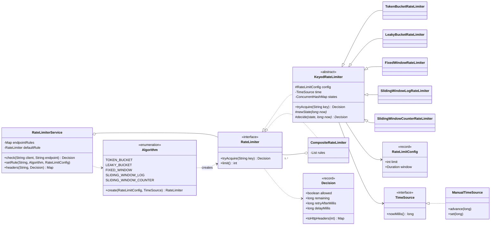
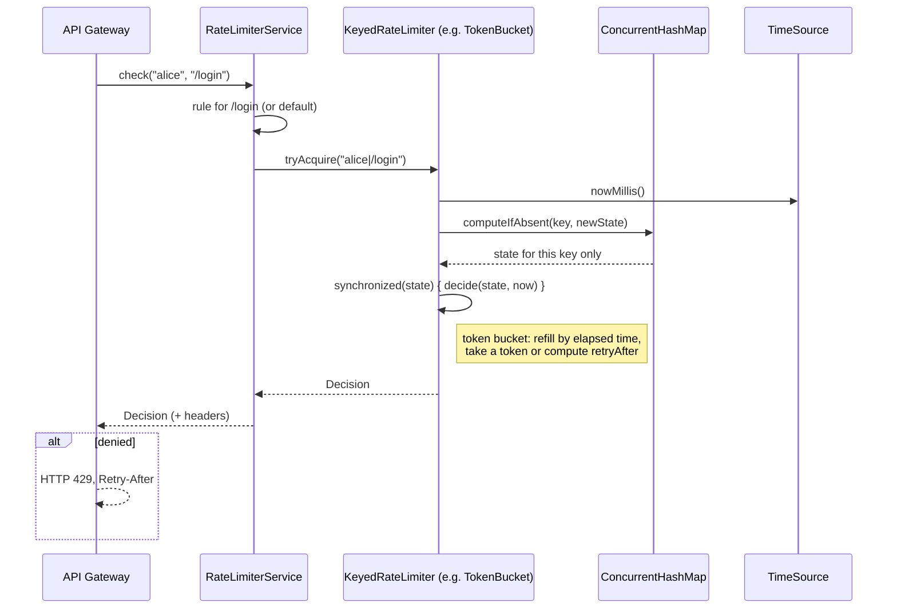
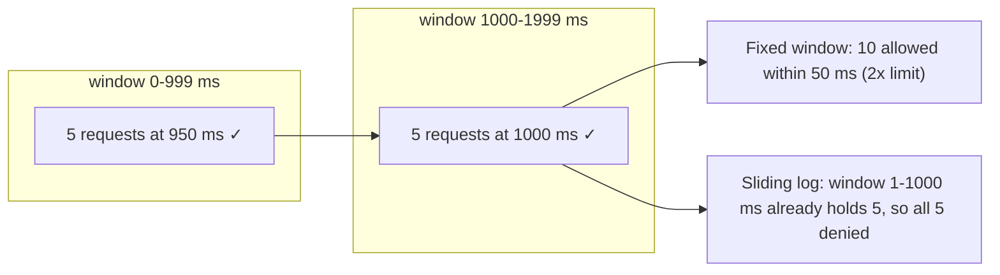

# 🚦 Design a Rate Limiter — Low Level Design (Java)


> A rate limiter protects a service by rejecting clients that send too many requests. It shows up
> in both LLD and system-design rounds. The LLD version tests whether you know **the five classic
> algorithms and their trade-offs**, can put them behind **one clean interface**, and can make them
> **thread-safe and testable without `Thread.sleep`**.

"Allow at most **N requests per T** for each client." For example 100 requests per minute per API key.
Requests over the limit are rejected (HTTP 429) with a hint about when to retry.

> 📚 **Credit:** Problem inspired by
> [AlgoMaster — Design Rate Limiter](https://algomaster.io/learn/lld/design-rate-limiter) (premium
> lesson, **not** accessed). Everything here is my own original work, based on widely known
> computer-science material. See [References & Credits](#-references--credits).

---

## 📑 On this page

1. [Scoping the Problem](#1-scoping-the-problem)
2. [Finding the Building Blocks](#2-finding-the-building-blocks)
3. [Object Model](#3-object-model)
   - [3.1 Class Responsibilities](#31-class-responsibilities)
   - [3.2 Patterns in Play](#32-patterns-in-play)
   - [3.3 UML Diagrams](#33-uml-diagrams)
   - [Practice Round](#-practice-round)
4. [Implementation Walkthrough](#4-implementation-walkthrough)
5. [Build, Run & Verify](#5-build-run--verify)
6. [Follow-up Scenarios](#6-follow-up-scenarios)
   - [6.1 Choosing an Algorithm](#61-choosing-an-algorithm)
   - [6.2 Thread Safety and Per-Key State](#62-thread-safety-and-per-key-state)
   - [6.3 Multiple Rules and Per-Endpoint Limits](#63-multiple-rules-and-per-endpoint-limits)
7. [Last-Minute Revision](#7-last-minute-revision)
8. [References & Credits](#-references--credits)

---

## 1. Scoping the Problem

### 🗣️ Sample conversation

| Candidate asks | Interviewer answers | Design impact |
|---|---|---|
| Limit per what? | Per client (user / API key / IP), optionally per endpoint. | Every call has a `key`; state is kept **per key**. |
| Which algorithm? | Your choice; explain the trade-offs. | `RateLimiter` interface + 5 interchangeable implementations. |
| Are bursts OK? | Short bursts yes, sustained overload no. | Token bucket as the default. |
| What does the client get when blocked? | 429 + how long to wait. | `Decision` with `retryAfterMillis`, plus `X-RateLimit-*` / `Retry-After` headers. |
| Different limits per endpoint? | Yes, e.g. login is stricter. | `RateLimiterService` with per-endpoint rules. |
| Several limits at once? | Yes: per second **and** per hour. | `CompositeRateLimiter`. |
| Multi-threaded? | Yes, many request threads. | Per-key locking, lock-free map. |
| Distributed across servers? | Discuss. | Follow-ups (Redis, Lua, local + global). |

### ✅ Functional requirements

1. `tryAcquire(key)` → allow or deny, with remaining quota and retry time.
2. Configurable `limit` per `window` (e.g. 5 per second, 100 per minute).
3. Five algorithms: **token bucket**, **leaky bucket**, **fixed window**, **sliding window log**, **sliding window counter**.
4. Independent budgets per key; per-endpoint rules with a default; multiple rules combined.
5. Standard HTTP rate-limit headers.

### ⚙️ Non-functional requirements

- **Low overhead**: O(1) per request (the log algorithm is O(limit) memory per key, by design).
- **Thread-safe**, with no global lock: different clients never block each other.
- **Deterministic tests**: time is injected (`TimeSource`), with no sleeping.
- **Exact retry hints**: waiting `retryAfter` always succeeds, and 1 ms earlier doesn't (tested).

---

## 2. Finding the Building Blocks

| Candidate | Keep? | Reasoning |
|---|---|---|
| **RateLimiter** | ✅ interface | `tryAcquire(key)` + `limit()`. Everything else plugs into this. |
| **Decision** | ✅ record | allowed / remaining / retryAfter / delay, and the HTTP headers. |
| **RateLimitConfig** | ✅ record | `(limit, window)` with validation. |
| **TimeSource** | ✅ interface | Injectable clock; `ManualTimeSource` for tests and the demo. |
| **KeyedRateLimiter** | ✅ abstract class | Shared per-key state map + locking; each algorithm fills in one method. |
| 5 algorithm classes | ✅ | Each is 20–40 lines of pure logic. |
| **Algorithm** enum | ✅ factory | Create a limiter by name, e.g. from a config file. |
| **CompositeRateLimiter** | ✅ | Several rules that must all pass. |
| **RateLimiterService** | ✅ facade | Endpoint → rule, key = client + endpoint. |
| Background refill thread | ❌ | Refill is computed **lazily** from elapsed time when a request arrives. No timers, no extra threads. |

---

## 3. Object Model

### 3.1 Class Responsibilities

#### The five algorithms at a glance

| Algorithm | State per key | Rule | Bursts | Accuracy |
|---|---|---|---|---|
| **Token bucket** | tokens, lastRefill | Refill `limit/window` continuously up to `limit`; each request takes 1 | ✅ up to `limit`, then steady | Exact rate over time |
| **Leaky bucket** (queue) | lastDeparture | Requests leave one every `window/limit`; queue holds `limit` | Absorbed as **delay** | Perfectly smooth output |
| **Fixed window** | windowStart, count | Counter per aligned window, reset at the boundary | ⚠️ up to **2× limit** at a boundary | Coarse |
| **Sliding window log** | deque of timestamps | Keep timestamps from the last `window`; allow if `< limit` | ❌ never more than `limit` in any window | **Exact** |
| **Sliding window counter** | prev count, current count | `prev × overlap + current < limit` | Mostly smoothed | Approximate |

#### `KeyedRateLimiter<S>` (Template Method)
| Member | Purpose |
|---|---|
| `ConcurrentHashMap<String, S> states` | One state per key, created lazily. |
| `tryAcquire(key)` (final) | Read the time once → get or create the state → `synchronized (state) { decide(...) }`. |
| `newState(now)`, `decide(state, now)` | The only two methods each algorithm writes. |
| `trackedKeys()` | Observability (memory grows with distinct keys). |

#### `Decision`
`allow(remaining)`, `allowAfter(remaining, delay)` (leaky bucket), `deny(retryAfter)`,
`toHttpHeaders(limit)` → `X-RateLimit-Limit`, `X-RateLimit-Remaining`, `Retry-After`.

#### `CompositeRateLimiter`, `RateLimiterService`
See [6.3](#63-multiple-rules-and-per-endpoint-limits).

### 3.2 Patterns in Play

| Pattern | Where | Why here |
|---|---|---|
| **Strategy** | `RateLimiter` implemented by 5 algorithms | Change the algorithm by configuration; callers never change. |
| **Template Method** | `KeyedRateLimiter.tryAcquire` → `newState` / `decide` | Per-key storage, locking and time handling are written **once**. Each algorithm is pure logic. |
| **Factory** | `Algorithm.create(config, time)` | Build a limiter from a name in a config file. |
| **Composite** | `CompositeRateLimiter` | Several limits behave like a single `RateLimiter`. |
| **Facade** | `RateLimiterService` | Gateway code asks one question: `check(client, endpoint)`. |
| **Dependency Injection** | `TimeSource` | Time is an input, so tests are exact and instant. |

**SOLID:** each algorithm class has one reason to change (its rule), and concurrency lives only in
the base class (**S**). New algorithms are new classes plus one enum line (**O**). Every limiter,
including the composite, can be used wherever a `RateLimiter` is expected (**L**). Everything depends
on `RateLimiter` and `TimeSource` abstractions (**D**).

### 3.3 UML Diagrams

**Class diagram**



**What happens on one request**



**Fixed window's boundary burst, and how the sliding log avoids it** (limit 5 per second)



### 🧠 Practice Round

1. **Implement token bucket in 10 minutes** with lazy refill. Why is no background thread needed?
2. **Prove the boundary burst**: with fixed window (limit N), what's the max number of requests in any
   window-length interval? *(2N.)* And with a sliding log? *(N.)*
3. **Sliding window counter maths**: with 8 requests in the previous window, 3 in the current one,
   and 30% of the current window elapsed, what's the estimate? *(8 × 0.7 + 3 = 8.6.)*
4. **Weighted requests**: an expensive API call costs 5 permits. Change the interface.
5. **Exact composite**: make "all rules pass or none consume" possible. What must each algorithm expose?
6. **Distributed**: 20 gateway servers share one limit per user. Sketch it with Redis.

<details>
<summary>💡 Hints for #5</summary>

Split `tryAcquire` into `canAcquire(key, now)` (read-only) and `commit(key, now)`. The composite
locks the keys in a fixed order, checks every rule, and commits only if all pass. Alternatively, add
`refund(key)` so rules that already consumed a permit can give it back when a later rule denies.
Token and fixed-window counters can refund easily; a log can remove its last timestamp.
</details>

<details>
<summary>💡 Hints for #6</summary>

Store the per-key state in Redis and update it **atomically** with a Lua script, e.g. for a token
bucket: read tokens and timestamp, refill, decide, write back, in one script so nothing can run in
between. For very high traffic, give each server a local share of the budget and sync with Redis
periodically. That's fewer network calls, but the global limit is only approximate.
</details>

---

## 4. Implementation Walkthrough

### 📁 Project structure

```
RateLimiter/
├── pom.xml
├── README.md
└── src
    ├── main/java/com/lld/ds/ratelimiter
    │   ├── RateLimiterApp.java                   # side-by-side simulation of all 5 algorithms
    │   ├── core/        RateLimiter, Decision, RateLimitConfig, TimeSource, ManualTimeSource
    │   ├── algorithm/   KeyedRateLimiter (template) + 5 algorithms + Algorithm (factory)
    │   ├── composite/   CompositeRateLimiter
    │   └── service/     RateLimiterService
    └── test/java/com/lld/ds/ratelimiter
        └── RateLimiterTest.java                  # 40 tests, most run against all 5 algorithms
```

### 🧩 The template: per-key state, per-key lock

```java
public final Decision tryAcquire(String key) {
    long now = time.nowMillis();
    S state = states.computeIfAbsent(key, k -> newState(now));   // lock-free map, one state per key
    synchronized (state) {                                        // only this key is serialised
        return decide(state, now);
    }
}
```

### 🪣 Token bucket: lazy refill

```java
protected Decision decide(Bucket b, long now) {
    b.tokens = Math.min(capacity, b.tokens + (now - b.lastRefill) * tokensPerMilli);   // refill by elapsed time
    b.lastRefill = now;
    if (b.tokens >= 1) {
        b.tokens -= 1;
        return Decision.allow((long) Math.floor(b.tokens));
    }
    return Decision.deny((long) Math.ceil((1 - b.tokens) / tokensPerMilli));         // time to the next token
}
```

### 📜 Sliding window log: exact

```java
while (!log.isEmpty() && log.peekFirst() <= now - window) log.pollFirst();   // drop old timestamps
if (log.size() < limit) { log.addLast(now); return allow(limit - log.size()); }
return deny(log.peekFirst() + window - now);                                  // when the oldest slides out
```

### ⚖️ Sliding window counter: weighted estimate

```java
double previousWeight = (double) (window - elapsedInCurrent) / window;
double estimate = previous * previousWeight + current;
if (estimate + 1 <= limit) { current++; return allow(...); }
```

### 💧 Leaky bucket: a queue without a queue

```java
double departure = Math.max(now, lastDeparture + interval);    // when this request would leave
double backlog   = departure - now;                            // how long it would wait
if (backlog > (limit - 1) * interval) return deny(...);        // queue is full
lastDeparture = departure;
return allowAfter(remaining, backlog);                         // caller waits `backlog` ms
```

👉 Browse the full source in [`src/main/java`](src/main/java/com/lld/ds/ratelimiter).

### ⏱️ Complexity (per request, per key)

| Algorithm | Time | Memory per key |
|---|---|---|
| Token bucket | O(1) | 2 numbers |
| Leaky bucket | O(1) | 1 number |
| Fixed window | O(1) | 2 numbers |
| Sliding window log | amortised O(1) | **O(limit)** timestamps |
| Sliding window counter | O(1) | 3 numbers |

---

## 5. Build, Run & Verify

### With Maven

```bash
cd Data-Structures-and-Search/RateLimiter
mvn test                 # 40 tests
mvn compile exec:java    # side-by-side simulation
```

### Without Maven (plain JDK 17+)

```bash
cd Data-Structures-and-Search/RateLimiter
javac -d out $(find src/main -name "*.java")
java -cp out com.lld.ds.ratelimiter.RateLimiterApp
```

### Demo output (limit 5 per second, simulated clock)

```
Limit: 5 per 1000 ms   (A = allowed, . = denied)

1) Burst: 10 requests at t=0 ms, then 10 more at t=500 ms
  TOKEN_BUCKET            AAAAA.....AA........  allowed  7/20
  LEAKY_BUCKET            AAAAA.....AA........  allowed  7/20
  FIXED_WINDOW            AAAAA...............  allowed  5/20
  SLIDING_WINDOW_LOG      AAAAA...............  allowed  5/20
  SLIDING_WINDOW_COUNTER  AAAAA...............  allowed  5/20

2) Window boundary: 10 requests at t=900..990 ms, 10 at t=1000..1090 ms
  TOKEN_BUCKET            AAAAA...............  allowed  5/20
  LEAKY_BUCKET            AAAAA...............  allowed  5/20
  FIXED_WINDOW            AAAAA.....AAAAA.....  allowed 10/20    ← boundary burst: 2x the limit
  SLIDING_WINDOW_LOG      AAAAA...............  allowed  5/20
  SLIDING_WINDOW_COUNTER  AAAAA...............  allowed  5/20

3) Steady: one request every 150 ms for 3 s
  TOKEN_BUCKET            AAAAAAAAAAAAAAAAA.AA  allowed 19/20
  LEAKY_BUCKET            AAAAAAAAAAAAAAAAA.AA  allowed 19/20
  FIXED_WINDOW            AAAAA..AAAAA..AAAAA.  allowed 15/20
  SLIDING_WINDOW_LOG      AAAAA..AAAAA..AAAAA.  allowed 15/20
  SLIDING_WINDOW_COUNTER  AAAAA...A.AAA.AA.A.A  allowed 13/20

Leaky bucket delays (traffic shaping), 7 requests at t=0:
  request 1: ALLOW (4 left)
  request 2: ALLOW (3 left, wait 200 ms)
  request 3: ALLOW (2 left, wait 400 ms)
  request 4: ALLOW (1 left, wait 600 ms)
  request 5: ALLOW (0 left, wait 800 ms)
  request 6: DENY (retry in 200 ms)
  request 7: DENY (retry in 200 ms)
```

What to notice:
- **Scenario 1**: token and leaky buckets gain ~2.5 permits in 500 ms (rate = 5/s); window
  algorithms wait for the window to move.
- **Scenario 2**: fixed window lets **10 requests through within about 150 ms** (900–940 ms and 1000–1040 ms). Every other algorithm holds the line.
- **Scenario 3**: traffic is 6.7/s against a 5/s limit. Buckets allow the initial burst plus the
  steady rate; the windows enforce exactly 5 per window; the counter is the most conservative here.

### ✅ What the tests cover

| Test | Verifies |
|---|---|
| `allowsUpToTheLimitThenDenies` ×5 | Basic contract for every algorithm. |
| `keysAreIndependent` ×5 | Per-key budgets. |
| `recoversAfterAFullWindow` ×5 | Budget comes back. |
| **`retryAfterIsExact` ×5** | 200 random configs each: after `retryAfter − 1` ms still denied, after `retryAfter` allowed. |
| `neverAllowsMoreThanLimitPlusBurstOverLongRuns` ×5 | Long-run rate bounds (not too loose, not too strict). |
| `tokenBucketAllowsBurstThenSteadyRate` / `…NeverExceedsCapacityAfterLongIdle` | Burst, fractional refill, capacity cap. |
| `fixedWindowHasTheBoundaryBurst` | Documents the known weakness (2× the limit). |
| **`slidingWindowLogIsExactForEveryWindowPosition`** | Brute force: no 1 s window anywhere contains more than the limit. |
| `slidingWindowCounterSmoothsTheBoundary` | Weighted estimate at 100% and 50% overlap. |
| `leakyBucketShapesTrafficIntoEvenSpacing` | Delays 0/250/500/750 ms, queue full, draining. |
| `compositeRequiresEveryRule` | Per-second + per-minute rules. |
| `serviceAppliesPerEndpointRulesPerClient` | Endpoint rules, client isolation, default rule. |
| `httpHeaders` / `invalidConfigurationIsRejected` | Headers; validation. |
| **`concurrentCallersNeverExceedTheLimit` ×5** | 8 threads × 500 requests on one key with frozen time: **exactly** 1000 allowed (no lost updates). |

---

## 6. Follow-up Scenarios

### 6.1 Choosing an Algorithm

| If you need… | Choose | Why |
|---|---|---|
| A sensible default for APIs | **Token bucket** | Allows short bursts, O(1) memory, simple (AWS and Stripe describe using it). |
| Smooth output to a fragile downstream | **Leaky bucket** | Constant outflow; bursts become waiting time, not errors. |
| Absolute simplicity or a daily quota | **Fixed window** | One counter; the boundary burst rarely matters for "1000 per day". |
| Strict correctness (security, login) | **Sliding window log** | No window ever exceeds the limit; memory O(limit) per key. |
| Near-exact at scale | **Sliding window counter** | O(1) memory, avoids most of the boundary burst. |

### 6.2 Thread Safety and Per-Key State

**Ask:** "Thousands of threads call `tryAcquire`. What can go wrong?"

- **Lost updates**: two threads read `tokens = 1`, both take it, and two requests pass instead of one.
  The read-modify-write must be atomic **per key**.
- **A global lock** would serialise all clients, a bottleneck for no reason.
- **Solution here:** `ConcurrentHashMap.computeIfAbsent` gives exactly one state object per key
  (lock-free for existing keys), and `synchronized (state)` serialises only requests for **the same
  key**. The test `concurrentCallersNeverExceedTheLimit` proves exactly `limit` requests pass under
  contention, for all five algorithms.
- **Memory**: each distinct key keeps a small state forever. In production, evict idle keys
  (e.g. an LRU or TTL cache, like the [LRU Cache](../LRUCache/README.md) problem), or store state in Redis with an expiry.
- **Lock-free alternative**: pack the token-bucket state into one `AtomicLong` and update it with a CAS loop.

### 6.3 Multiple Rules and Per-Endpoint Limits

**Ask:** "Login: 5 per minute. Search: 100 per second. Also a global 10,000 per hour per user."

```java
RateLimiterService service = new RateLimiterService(Algorithm.TOKEN_BUCKET, RateLimitConfig.perSecond(100), time);
service.setRule("/login", Algorithm.SLIDING_WINDOW_LOG, RateLimitConfig.perMinute(5));
service.setRule("/search", CompositeRateLimiter.of(
        Algorithm.TOKEN_BUCKET.create(RateLimitConfig.perSecond(100), time),
        Algorithm.SLIDING_WINDOW_COUNTER.create(new RateLimitConfig(10_000, Duration.ofHours(1)), time)));

Decision d = service.check(userId, "/search");
```

- The key is `client|endpoint`, so hammering `/search` doesn't use up `/login`.
- `CompositeRateLimiter` requires **every** rule to allow. Rules checked before a denial have
  already counted the attempt, which is conservative and common. Practice Round #5 shows how to make it exact.

### 🚀 More follow-ups to practice

| Follow-up | Design move |
|---|---|
| Distributed limit across servers | Redis + Lua for atomic check-and-update; or local shares synced periodically. |
| Clock skew across servers | Use the Redis server's time (`TIME`) inside the script, not each gateway's clock. |
| Weighted requests (cost > 1) | `tryAcquire(key, permits)`; each algorithm consumes `permits` instead of 1. |
| Client tiers (free / pro) | Rule lookup by `(tier, endpoint)`; tier from the API key. |
| Soft limits / shadow mode | Log would-be denials without blocking, to tune limits safely. |
| Blocking callers instead of rejecting | `acquire()` that sleeps `retryAfter` (Guava-style `RateLimiter.acquire`). |

---

## 7. Last-Minute Revision

```
1. Clarify    → limit per what (user/IP/key/endpoint)? bursts OK? response on deny? multiple rules? distributed?
2. Interface  → Decision tryAcquire(key)   (allowed, remaining, retryAfter)
3. Algorithms → token bucket (burst + steady, O(1))       leaky bucket (smooth output, delays)
                fixed window (simple, 2x boundary burst)  sliding log (exact, O(limit) memory)
                sliding counter (prev x overlap + current, O(1), approximate)
4. Tricks     → lazy refill from elapsed time (no timers); inject the clock; exact retryAfter
5. Concurrency→ ConcurrentHashMap per key + synchronized(state) → no lost updates, no global lock
6. Patterns   → Strategy, Template Method, Factory (enum), Composite, Facade
7. Scale      → Redis + Lua (atomic), local + global budgets, evict idle keys
```

---

## 📚 References & Credits

| Resource | How it was used |
|---|---|
| [AlgoMaster.io — Design Rate Limiter (LLD)](https://algomaster.io/learn/lld/design-rate-limiter) | Inspiration for the **problem choice** only. The lesson is premium and was **not** accessed. |
| [Token bucket — Wikipedia](https://en.wikipedia.org/wiki/Token_bucket) / [Leaky bucket — Wikipedia](https://en.wikipedia.org/wiki/Leaky_bucket) | Public background on the bucket algorithms and virtual scheduling (GCRA). |
| [RFC 6585 §4 — 429 Too Many Requests](https://www.rfc-editor.org/rfc/rfc6585#section-4) | Public HTTP status and `Retry-After` usage. |
| [Mermaid](https://mermaid.js.org/) | Diagrams rendered by GitHub. |
| [JUnit 5 User Guide](https://junit.org/junit5/docs/current/user-guide/) | Unit and parameterized testing. |

**Originality statement**

- This repository is a **personal learning project** for LLD interview preparation.
- The AlgoMaster lesson is premium content that I have not accessed. No text, code, diagrams,
  headings or other material from it (or any paid source) is reproduced here.
- All headings, source code, explanations, tables, diagrams, tests and exercises were written
  independently from widely known computer-science material and the public references above.
- This project is **not affiliated with or endorsed by** AlgoMaster.io. "AlgoMaster" is the
  property of its respective owner.
- For the original lesson, please support the author at [algomaster.io](https://algomaster.io).

---

> ⭐ Try the Practice Round before reading the code, then compare your design with this one.
