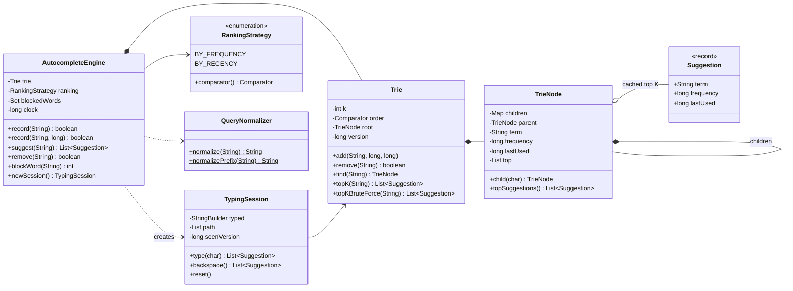
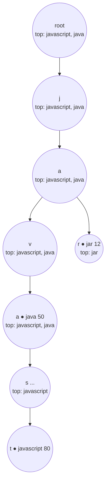
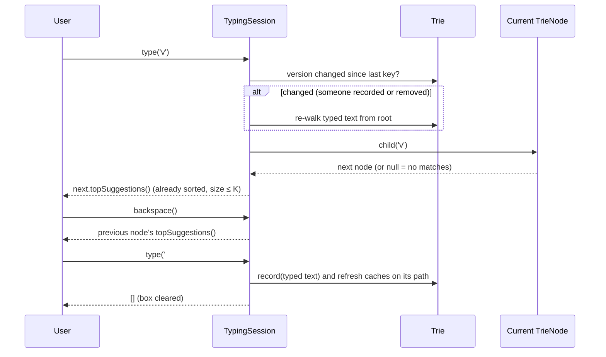

# 🔎 Design a Search Autocomplete System — Low Level Design (Java)


> Type "jav" and the search box offers *javascript*, *java*, *java interview questions*. This question
> tests one data structure (the **trie**), one important optimisation (**pre-computed top-K per
> node**), and whether you can reason about the read/write trade-off when **every keystroke is a query**.

As the user types, the system shows the **K best previous searches that start with the typed
prefix**. "Best" usually means most frequently searched, with a deterministic tie-break. When the
user submits a search, it's recorded, and its popularity grows.

> 📚 **Credit:** Problem inspired by
> [AlgoMaster — Design Search Autocomplete System](https://algomaster.io/learn/lld/design-search-autocomplete-system)
> (premium lesson, **not** accessed). Everything here is my own original work, based on widely known
> computer-science material. See [References & Credits](#-references--credits).

---

## 📑 On this page

1. [Scoping the Problem](#1-scoping-the-problem)
2. [Finding the Building Blocks](#2-finding-the-building-blocks)
3. [Object Model](#3-object-model)
   - [3.1 Class Responsibilities](#31-class-responsibilities)
   - [3.2 Patterns in Play](#32-patterns-in-play)
   - [3.3 UML Diagrams](#33-uml-diagrams)
   - [Practice Round](#-practice-round)
4. [Implementation Walkthrough](#4-implementation-walkthrough)
5. [Build, Run & Verify](#5-build-run--verify)
6. [Follow-up Scenarios](#6-follow-up-scenarios)
   - [6.1 Caching Top-K in Every Node](#61-caching-top-k-in-every-node)
   - [6.2 Keystroke Sessions and Backspace](#62-keystroke-sessions-and-backspace)
   - [6.3 Removing and Blocking Queries](#63-removing-and-blocking-queries)
7. [Last-Minute Revision](#7-last-minute-revision)
8. [References & Credits](#-references--credits)

---

## 1. Scoping the Problem

### 🗣️ Sample conversation

| Candidate asks | Interviewer answers | Design impact |
|---|---|---|
| Where do suggestions come from? | Past searches, with counts. | Store `(query, frequency)`; submitting a search increments it. |
| How many suggestions? | Top 3 (configurable). | `k` parameter. |
| Ranking and ties? | By frequency, ties alphabetical. Recency would be nice. | `RankingStrategy` (frequency / recency). |
| Case, extra spaces? | Case-insensitive; "Java  Streams" = "java streams". | `QueryNormalizer` for stored terms *and* prefixes. |
| Suggest on every keystroke? | Yes, so it must be fast. | Cache the top-K in each trie node, plus a session that moves one node per key. |
| Can queries be deleted or banned? | Yes: remove one, or block offensive words. | `remove`, `blockWord`, trie pruning. |
| Empty input? | Show nothing. | `suggest("")` → empty. |
| Distributed, spell-correction? | Out of scope; discuss. | See follow-ups. |

### ✅ Functional requirements

1. `record(query)` / `record(query, count)`: store a search or increase its count.
2. `suggest(prefix)`: return up to **K** stored queries starting with the prefix, ranked.
3. Normalise case and whitespace consistently.
4. A **typing session**: suggestions after each character, **backspace**, and `'#'` to submit.
5. `remove(query)` and `blockWord(word)` (existing matching queries are deleted and future ones ignored).
6. Ranking by **frequency** (ties alphabetical) or by **recency**.

### ⚙️ Non-functional requirements

- **Reads dominate**: a 10-letter query is 10 reads and 1 write. Optimise `suggest`.
- `suggest` in **O(L + K)** (L = prefix length), independent of how many queries match.
- Always correct: the fast answer must equal the brute-force answer (tested).

---

## 2. Finding the Building Blocks

| Candidate | Keep? | Reasoning |
|---|---|---|
| **Trie** | ✅ | Every node represents a prefix; all queries sharing it live in its subtree. |
| **TrieNode** | ✅ | Children, the term that ends here (if any), its frequency/recency, and the **cached top-K**. |
| **Suggestion** | ✅ record | `(term, frequency, lastUsed)`, the thing we rank and return. |
| **RankingStrategy** | ✅ enum-strategy | Comparator for frequency or recency ordering. |
| **AutocompleteEngine** | ✅ facade | Normalisation, block list, recording, suggestions, sessions. |
| **TypingSession** | ✅ | Per-user keystroke state; one child lookup per key. |
| **QueryNormalizer** | ✅ | One place for "what counts as the same query". |
| `HashMap<String, Long>` + scan | ❌ as the main structure | Scanning every query per keystroke is O(n · L). |
| Sorted list + binary search | ⚠️ | Finds the prefix *range* fast, but top-K inside the range still needs a scan or a heap. |

> 💡 **Interview tip:** Start with "trie + DFS the subtree + sort". Then say: *"This is O(size of
> subtree) per keystroke; for 'a' that's millions of entries. Since reads dominate, I'll pre-compute
> the answer in every node."* That's the step interviewers want to hear.

---

## 3. Object Model

### 3.1 Class Responsibilities

#### `Trie`
| Member | Purpose |
|---|---|
| `add(term, delta, tick)` | Walk or create the path, update frequency and last use, then refresh the caches **bottom-up along that path only**. |
| `remove(term)` | Clear the terminal data, **prune** now-useless nodes, refresh the caches from the lowest remaining node. |
| `topK(prefix)` | Walk L nodes, return the cached list. **O(L + K)**. |
| `topKBruteForce(prefix)` | DFS + sort: the baseline, and the test oracle. |
| `version()` | Increases on every change, so sessions know when their cached path is stale. |

#### `TrieNode`
`children`, `parent`, `ch`, `term` (null if no query ends here), `frequency`, `lastUsed`,
`top` (cached best K of the subtree).

#### `AutocompleteEngine` (facade)
`record`, `loadAll`, `suggest`, `remove`, `blockWord`, `newSession`, `frequencyOf`.

#### `TypingSession`
`type(char)`, `type(String)`, `backspace()`, `text()`, `reset()`. `'#'` submits.

#### `RankingStrategy`
| Constant | Order |
|---|---|
| `BY_FREQUENCY` | frequency ↓, then term ↑ |
| `BY_RECENCY` | lastUsed ↓, then term ↑ |

### 3.2 Patterns in Play

| Pattern | Where | Why here |
|---|---|---|
| **Trie (prefix tree)** | `Trie`, `TrieNode` | Prefix lookup in O(L), and shared prefixes share storage. |
| **Pre-computation / materialised view** | `TrieNode.top` | Move work from the hot read path to the rare write path. |
| **Strategy** | `RankingStrategy` | Swap frequency or recency ranking without touching the trie. |
| **Facade** | `AutocompleteEngine` | Callers never deal with nodes, normalisation or blocking rules. |
| **Iterator-like session state** | `TypingSession` | Remembers where the user is in the trie between keystrokes. |

**SOLID mapping:** the trie stores and ranks, the normalizer defines equality, the engine
enforces policy (blocking, empty input), and the session tracks one user's input (**S**). A new
ranking is a new enum constant (**O**). The engine depends on the comparator, not on concrete
orderings (**D**).

### 3.3 UML Diagrams

**Class diagram**



**A trie with cached top-2 lists** (data: java 50, javascript 80, jar 12)



**What happens on each keystroke in a session**



### 🧠 Practice Round

1. **Write the baseline** (trie + DFS + sort) in 15 minutes, then add `top` caching.
2. **Empty-prefix trending**: show the global top K when the box is empty. One line changes. Which?
3. **Weighted score**: `score = frequency × decay^(age)`. Why does this break the "only the path
   needs refreshing" rule, and how would you handle it? *(Hint: periodic batch rebuild.)*
4. **Personalised suggestions**: blend the global top-K with a user's own history.
5. **Typo tolerance**: suggest "javascript" for "jvaa". What structure or algorithm helps?
6. **Memory**: 10 million queries of average length 20. Estimate the trie size and the cost of caching K = 10 per node.

<details>
<summary>💡 Hints for #3</summary>

If scores decay with time, **every** term's score changes every second, not just the one being
searched, so cached lists become stale everywhere. Common fixes: rebuild the trie offline every few
minutes from aggregated logs (how large search engines do it), or store `log(frequency) + time/τ`
as a monotonic score, since adding a constant to everyone doesn't change the ranking.
</details>

<details>
<summary>💡 Hints for #6</summary>

Worst case about 200M nodes, but shared prefixes shrink that a lot. Each cached entry is a reference
to a shared `Suggestion`, so K = 10 costs about 10 references per node. The usual fixes are: cache
top-K only for short prefixes (say ≤ 4 characters, the widest ranges) and compute longer ones on the
fly; use a compressed (radix) trie; or shard by first letter.
</details>

---

## 4. Implementation Walkthrough

### 📁 Project structure

```
SearchAutocomplete/
├── pom.xml
├── README.md
└── src
    ├── main/java/com/lld/ds/autocomplete
    │   ├── AutocompleteApp.java            # console demo with sample history
    │   ├── model/    Suggestion
    │   ├── ranking/  RankingStrategy
    │   ├── trie/     Trie, TrieNode        ← cached top-K per node
    │   └── engine/   AutocompleteEngine, TypingSession, QueryNormalizer
    └── test/java/com/lld/ds/autocomplete/engine
        └── AutocompleteEngineTest.java     # behaviour + brute-force cross-check
```

### ♻️ Refreshing caches: only along one path

```java
private void refreshUpFrom(TrieNode node) {
    for (TrieNode n = node; n != null; n = n.parent) {
        recompute(n);
    }
    version++;
}

/** top(n) = best K of { n's own term } ∪ top(child) for every child */
private void recompute(TrieNode n) {
    List<Suggestion> candidates = new ArrayList<>();
    if (n.isTerminal()) candidates.add(new Suggestion(n.term, n.frequency, n.lastUsed));
    for (TrieNode child : n.children.values()) candidates.addAll(child.top);
    candidates.sort(order);
    n.top = List.copyOf(candidates.subList(0, Math.min(k, candidates.size())));
}
```

**Why merging the children's top-K is enough:** any query in the subtree's top K must be in the top K
of the child subtree it belongs to (or be the node's own term). So the best K of *(own term + every
child's top K)* is the true top K.

### ✂️ Removal with pruning

```java
node.term = null;                                              // no longer a stored query
while (node != root && !node.isTerminal() && node.children.isEmpty()) {
    node.parent.children.remove(node.ch);                      // delete dead branches
    node = node.parent;
}
refreshUpFrom(node);
```

👉 Browse the full source in [`src/main/java`](src/main/java/com/lld/ds/autocomplete).

### ⏱️ Complexity (L = query length, C = children per node, K = suggestions)

| Operation | Cached trie (this design) | Baseline (DFS + sort) |
|---|---|---|
| `suggest(prefix)` | **O(L + K)** | O(L + S log S), S = matches under prefix |
| Session keystroke | **O(1) + O(K)** | O(S log S) |
| `record(query)` | O(L · C · K log(C·K)) | O(L) |
| `remove(query)` | same as record | O(L) |
| `blockWord` | O(n) scan + removals | O(n) |
| Memory | O(total chars + nodes · K) | O(total chars) |

---

## 5. Build, Run & Verify

### With Maven

```bash
cd Data-Structures-and-Search/SearchAutocomplete
mvn test                                              # 18 tests
mvn compile exec:java -Dexec.args="3"                 # top 3, frequency ranking
mvn compile exec:java -Dexec.args="5 RECENCY"         # top 5, recency ranking
```

### Without Maven (plain JDK 17+)

```bash
cd Data-Structures-and-Search/SearchAutocomplete
javac -d out $(find src/main -name "*.java")
java -cp out com.lld.ds.autocomplete.AutocompleteApp
```

### Sample session

```
Autocomplete (top 3, BY_FREQUENCY) with 14 stored queries. Commands: type | top | search | del | block | q
> type java s
  "j"                -> [javascript (80), java (50), java interview questions (45)]
  "ja"               -> [javascript (80), java (50), java interview questions (45)]
  "jav"              -> [javascript (80), java (50), java interview questions (45)]
  "java"             -> [javascript (80), java (50), java interview questions (45)]
  "java "            -> [java interview questions (45), java streams (30)]
  "java s"           -> [java streams (30)]
> search jar file
  recorded; count is now 13
> block python
  blocked; removed 2 stored queries
> top py
  [pycharm (20)]
```

### ✅ What the tests cover

| Test | Verifies |
|---|---|
| `returnsTopKByFrequency` / `tiesAreBrokenAlphabetically` / `prefixItselfCanBeASuggestion` | Ranking, tie-break, the prefix itself counts, trailing space matters. |
| `unknownOrEmptyPrefixGivesNothing` | No match, empty or blank input. |
| `recordingChangesTheRanking` / `newTermAppearsImmediately` | Caches update on writes. |
| `recencyRanking` | Alternative strategy. |
| `queriesAreNormalized` / `emptyQueriesAreIgnored` | Case and whitespace; invalid input. |
| `removeUpdatesSuggestionsAndPrunesNodes` / `removingAPrefixTermKeepsLongerTerms` | Removal, pruning and cache repair. |
| `blockedWordsAreRemovedAndCannotComeBack` | Block list (whole words only). |
| `sessionSuggestsAfterEachKeystroke` / `sessionSubmitRecordsTheQuery` / `sessionSkipsLeadingAndDoubleSpacesLikeTheNormalizer` / `sessionSeesChangesMadeWhileTyping` | Keystrokes, backspace, submit, stale-path detection. |
| **`cachedSuggestionsAlwaysMatchBruteForce`** (both rankings) | **20,000 random records and removals**; every 50 ops, 9 prefixes are checked against a full DFS + sort. |

---

## 6. Follow-up Scenarios

### 6.1 Caching Top-K in Every Node

**Ask:** "Typing 'a' matches a million queries. How do you stay fast?"

Without caching, every keystroke walks the whole subtree: O(S log S). Storing each node's best K turns
the read into *walk L nodes + return a list*. The price is paid on writes: after recording a query, every
node on its path merges `own term + children's top-K`. For autocomplete that trade is clearly
right, because reads outnumber writes by roughly the average query length.

> ⚠️ **The rule that makes it work:** a term's rank may only depend on **its own** data (count,
> last use, text). Then recording one query changes only that query's position, and only its path is
> affected. Time-decayed scores break this rule; see Practice Round #3.

### 6.2 Keystroke Sessions and Backspace

**Ask:** "Implement `input(char c)`: return suggestions after each character, and `#` ends the query."

`TypingSession` stores the trie node reached after each character:

- **type**: one `child(c)` lookup from the last node. O(1), no re-walk.
- **backspace**: drop the last node. O(1).
- **no match**: store `null`; later characters stay `null` until backspace brings the user back.
- **submit (`#`)**: record the typed text (normalised), and reset.
- **Staleness**: another user's search may create, or a removal may prune, nodes on our path. The
  trie's `version` counter changes on every write; when it differs, the session re-walks its text once.

### 6.3 Removing and Blocking Queries

**Ask:** "Legal says a query must disappear, and offensive words must never be suggested."

- `remove(query)`: clear the terminal node, **prune** branches that no longer lead to any
  query (saves memory, keeps `find` honest), and refresh the caches from the lowest surviving node.
- `blockWord(word)`: add to a block set, delete every stored query containing that **whole word**
  (O(n), rare admin action), and ignore future searches containing it. `scampi` isn't blocked by `scam`.

### 🚀 More follow-ups to practice

| Follow-up | Design move |
|---|---|
| Scale to billions of queries | Aggregate search logs offline (e.g. hourly), rebuild tries, shard by prefix range, serve read-only replicas. |
| Low-latency frontend | Browser caches responses per prefix; debounce keystrokes; CDN for popular prefixes. |
| Trending / time decay | Batch-recompute scores; blend a short-window "trending" trie with the long-term one. |
| Personalisation | Merge the global top-K with the user's recent searches (small per-user trie or list). |
| Typos | Edit-distance search on the trie (bounded Levenshtein automaton), or a SymSpell dictionary. |
| Multi-word matching | Also index each word suffix ("streams" → "java streams"), or use an inverted index. |
| Memory | Radix (compressed) trie; cache top-K only for short prefixes. |
| Concurrency | Many readers, few writers: build a new trie and swap it atomically (copy-on-write), or use a read-write lock (`suggest` is truly read-only here, unlike LRU `get`). |

---

## 7. Last-Minute Revision

```
1. Clarify    → source of suggestions? K? ranking + tie-break? case/space? every keystroke? delete/block?
2. Structure  → trie; node = children + (term, freq, lastUsed) + CACHED top-K of its subtree
3. Read       → walk prefix O(L), return cached list O(K)
   Write      → update terminal, then recompute top-K bottom-up ALONG THE PATH ONLY
                top(n) = best K of { own term } ∪ top(child)   (correct because top-K is decomposable)
4. Rule       → rank must depend only on the term's own data (no global time decay)
5. Session    → stack of nodes per keystroke; backspace = pop; '#' = record + reset; version check
6. Remove     → clear, prune empty branches, refresh from lowest surviving node
7. Patterns   → Facade (engine), Strategy (ranking), pre-computation
8. Testing    → cached answer == DFS + sort answer after random writes and removes
```

---

## 📚 References & Credits

| Resource | How it was used |
|---|---|
| [AlgoMaster.io — Design Search Autocomplete System (LLD)](https://algomaster.io/learn/lld/design-search-autocomplete-system) | Inspiration for the **problem choice** only. The lesson is premium and was **not** accessed. |
| [Trie — Wikipedia](https://en.wikipedia.org/wiki/Trie) | Public background on prefix trees and radix trees. |
| [Mermaid](https://mermaid.js.org/) | Diagrams rendered by GitHub. |
| [JUnit 5 User Guide](https://junit.org/junit5/docs/current/user-guide/) | Testing. |

**Originality statement**

- This repository is a **personal learning project** for LLD interview preparation.
- The AlgoMaster lesson is premium content that I have not accessed. No text, code, diagrams,
  headings or other material from it (or any paid source) is reproduced here.
- All headings, source code, explanations, tables, diagrams, tests and exercises were written
  independently from widely known computer-science material and the public references above.
- This project is **not affiliated with or endorsed by** AlgoMaster.io. "AlgoMaster" is the
  property of its respective owner.
- For the original lesson, please support the author at [algomaster.io](https://algomaster.io).

---

> ⭐ Try the Practice Round before reading the code, then compare your design with this one.
