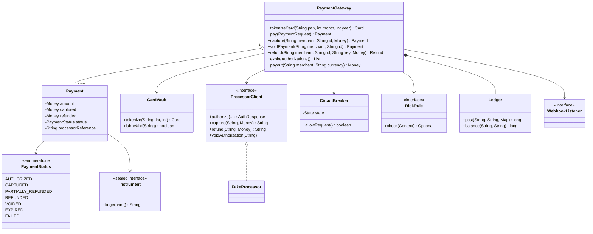
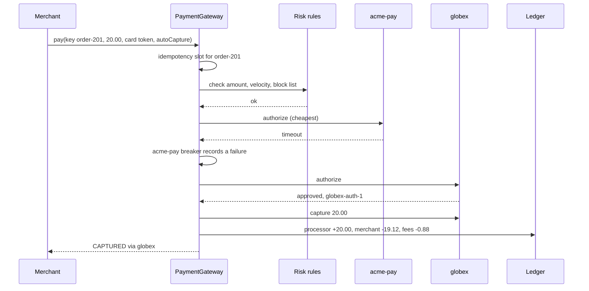
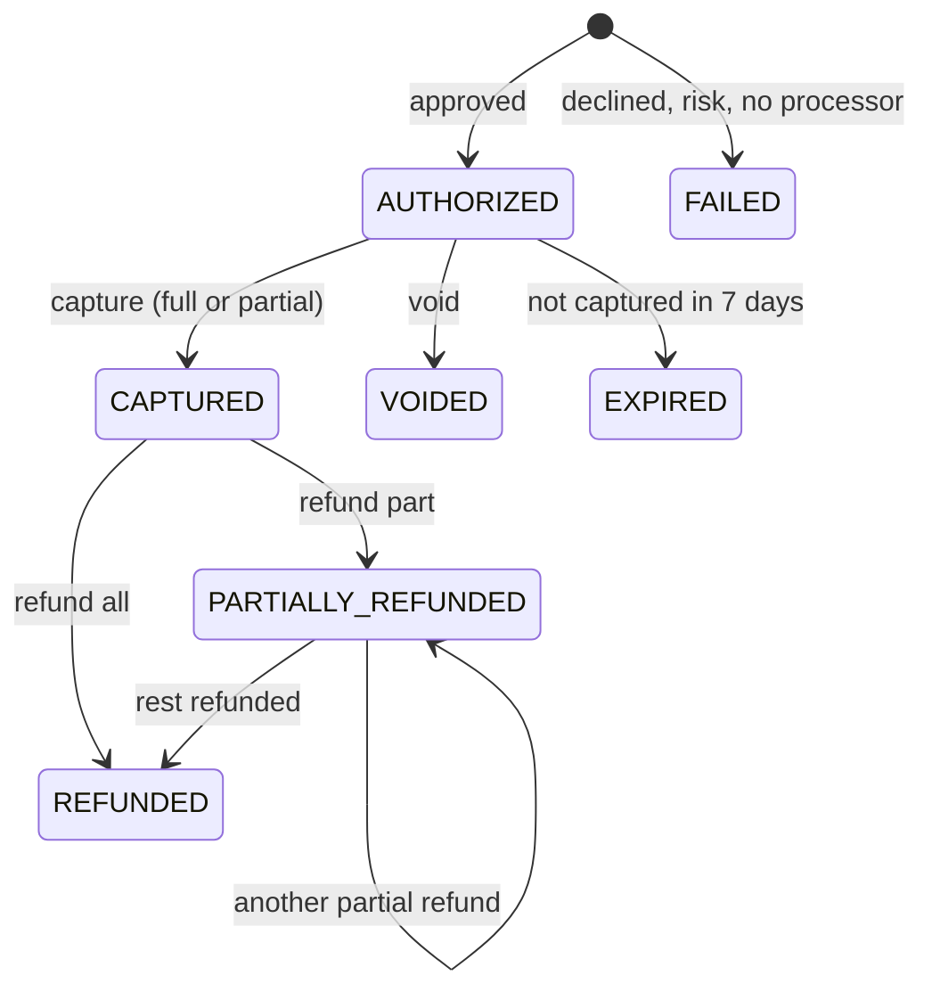

# 💳 Design a Payment Gateway — Low Level Design (Java)


> Think Stripe, Razorpay or Adyen: merchants send "charge this card", the gateway talks to banks
> through processors. Interviewers look for **never charging twice** (idempotency), a strict
> **payment state machine** (authorize → capture → refund), **never storing card numbers** outside a vault,
> surviving **processor outages** without hurting customers, and **books that always balance**.

> 📚 **Credit:** Problem inspired by
> [AlgoMaster — Design Payment Gateway](https://algomaster.io/learn/lld/design-payment-gateway)
> (premium lesson, **not** accessed). Everything here is my own original work, based on publicly
> documented payment concepts and design patterns. See [References & Credits](#-references--credits).

> ⚠️ Educational code with simulated processors and public **test** card numbers. It is not PCI-DSS
> compliant software and must not handle real card data.

---

## 📑 On this page

1. [Scoping the Problem](#1-scoping-the-problem)
2. [Finding the Building Blocks](#2-finding-the-building-blocks)
3. [Object Model](#3-object-model)
   - [3.1 Class Responsibilities](#31-class-responsibilities)
   - [3.2 Patterns in Play](#32-patterns-in-play)
   - [3.3 UML Diagrams](#33-uml-diagrams)
   - [Practice Round](#-practice-round)
4. [Implementation Walkthrough](#4-implementation-walkthrough)
5. [Build, Run & Verify](#5-build-run--verify)
6. [Follow-up Scenarios](#6-follow-up-scenarios)
   - [6.1 Charging Exactly Once](#61-charging-exactly-once)
   - [6.2 When the Bank Doesn't Answer](#62-when-the-bank-doesnt-answer)
   - [6.3 Books That Balance](#63-books-that-balance)
7. [Last-Minute Revision](#7-last-minute-revision)
- [References & Credits](#-references--credits)

---

## 1. Scoping the Problem

### 🗣️ Sample conversation

| Candidate asks | Interviewer answers | Design impact |
|---|---|---|
| Charge immediately or later? | Both: some merchants capture at shipping. | `AUTHORIZED` → `CAPTURED`; auto-capture flag; partial capture. |
| Refunds? | Partial and full, any number, never above what was captured. | `PARTIALLY_REFUNDED` / `REFUNDED`; checks under a lock. |
| Card data? | We must not spread card numbers. | `CardVault` tokenization; instruments carry tokens. |
| Several processors? | Yes, for cost and redundancy. | `ProcessorClient` adapters; cheapest-first routing; failover. |
| A processor is down? | Don't make customers wait on timeouts. | Circuit breaker per processor. |
| Merchant retries a request? | Must never double charge. | Idempotency keys (+ conflict detection). |
| Fraud? | Basic rules: amount limit, card testing, block lists. | Chain of `RiskRule`s before routing. |
| Money flow? | Fees per merchant, payouts later. | Double-entry `Ledger`; `payout`. |
| Notifications? | Webhooks. | `WebhookListener`. |

### ✅ Functional requirements

1. Tokenize cards (Luhn, expiry, brand detection); UPI as a second instrument type.
2. Pay: validate → risk rules → route to cheapest healthy processor → authorize (→ auto capture).
3. Capture (full or partial, once), void, refund (partial, many, bounded), expire stale authorizations.
4. Idempotency per merchant and operation; same key with a different body is a conflict.
5. Declines and risk blocks are FAILED payments with a reason, not API errors.
6. Double-entry ledger for captures (with fees), refunds and payouts; merchant balance.
7. Merchants can only see their own payments; webhooks for every state change.

### ⚙️ Non-functional requirements

- **Exactly-once effect** for merchant retries and concurrent duplicates.
- **Consistency**: no refund above captured, no double capture, under concurrency.
- **Resilience**: failover on outages; fast fail when a processor is known to be down.
- **Security**: card numbers only in the vault; never in logs or `toString`.

---

## 2. Finding the Building Blocks

| Noun / verb | Becomes |
|---|---|
| amount + currency | `Money` (minor units) |
| card, UPI | `Instrument` (sealed: `Card` token, `Upi`) |
| card storage | `CardVault` |
| payment, status | `Payment`, `PaymentStatus` (transition table) |
| refund | `Refund` |
| merchant, pricing | `Merchant` (bps + fixed fee) |
| bank connection | `ProcessorClient` adapter (`FakeProcessor` here), `CircuitBreaker` |
| fraud checks | `RiskRule`, `RiskRules` |
| books | `Ledger` |
| notifications | `WebhookListener` |
| the API | `PaymentGateway` (facade) |

---

## 3. Object Model

### 3.1 Class Responsibilities

#### `PaymentGateway`
- `pay`, `capture`, `voidPayment`, `refund`, `expireAuthorizations`, `payout`, `merchantBalance`.
- Idempotency wrapper; per-payment locking; routing + failover; ledger postings; webhooks.

#### `Payment` + `PaymentStatus`
- Holds amounts (authorized, captured, refunded), processor reference, history.
- Transitions validated against the table; illegal moves raise `INVALID_STATE`.

#### `CardVault`
- Luhn + expiry + brand; same card → same token; `lookup` only for the processor call.

#### `CircuitBreaker`
- CLOSED → OPEN after N consecutive failures → HALF_OPEN after a cooldown (one probe) → CLOSED/OPEN.

#### `Ledger`
- `post(reference, currency, legs)` rejects unbalanced transactions; per-account balances.

### 3.2 Patterns in Play

| Pattern | Where | Why |
|---|---|---|
| **State (table-driven)** | `PaymentStatus.next()` | Money operations must follow a legal order. |
| **Adapter** | `ProcessorClient` | Uniform API over different acquirers. |
| **Strategy** | routing (cheapest supported first) | Swap for success-rate or brand-based routing. |
| **Chain of Responsibility** | `RiskRule` list | Independent checks, first objection wins. |
| **Circuit Breaker** | `CircuitBreaker` | Fail fast instead of piling timeouts. |
| **Idempotency key** | `idempotent(...)` | Exactly-once effect for retries. |
| **Observer** | `WebhookListener` | Merchant notifications. |
| **Double-entry ledger** | `Ledger` | Money is only moved, never created. |

**SOLID check**

- **S**: vault, risk, routing, ledger and state machine are separate classes.
- **O**: a new processor or risk rule is a new class.
- **L**: any `ProcessorClient` either answers or throws `ProcessorUnavailable`.
- **I**: merchants see the facade; processors see a narrow adapter interface.
- **D**: the gateway depends on `ProcessorClient`, `RiskRule`, `Clock`.

### 3.3 UML Diagrams

#### Class diagram



#### Sequence: pay with failover



#### Payment lifecycle



### 🧠 Practice Round

1. The merchant's server times out and retries `pay`. How do you avoid a double charge? What if the retry has a different amount?
   <details><summary>Hint</summary>Store the idempotency key with a fingerprint of the request; same fingerprint → return the stored result (waiting if still in progress); different → reject as a conflict.</details>
2. A card is declined by processor A. Should you try processor B?
   <details><summary>Hint</summary>No: a decline is the issuing bank's decision. Only retry elsewhere when the processor failed to answer (timeout/outage).</details>
3. Why authorize and capture separately?
   <details><summary>Hint</summary>Hold funds at checkout, charge at shipping; capture less if items are missing; void costs nothing if the order is cancelled.</details>
4. Two refund requests for the last $30 of a $100 payment arrive together. What stops refunding $60?
   <details><summary>Hint</summary>Check "amount ≤ captured − refunded" and record the refund while holding the payment's lock.</details>
5. How do you prove the gateway didn't lose or invent money?
   <details><summary>Hint</summary>Double-entry: every transaction's legs sum to zero; the sum of all entries is always zero.</details>

---

## 4. Implementation Walkthrough

### 📁 Project structure

```
PaymentGateway/
├── pom.xml
└── src/
    ├── main/java/com/lld/finance/payments/
    │   ├── PaymentGatewayApp.java          # a day of payments with two simulated processors
    │   ├── model/                          # Money, Instrument, Payment, PaymentStatus, Refund, Merchant, PaymentException
    │   ├── processor/                      # ProcessorClient, FakeProcessor, ProcessorUnavailable, CircuitBreaker
    │   ├── risk/                           # RiskRule, RiskRules
    │   ├── ledger/                         # Ledger
    │   └── core/                           # PaymentGateway, CardVault, WebhookListener, ManualClock
    └── test/java/com/lld/finance/payments/
        └── PaymentGatewayTest.java
```

### 🔑 Idempotency, including concurrent duplicates

```java
IdempotencyRecord mine = new IdempotencyRecord(fingerprint, new CompletableFuture<>());
IdempotencyRecord existing = idempotency.putIfAbsent(slot, mine);
if (existing != null) {
    if (!existing.fingerprint().equals(fingerprint)) throw IDEMPOTENCY_CONFLICT;
    return existing.result().join();              // wait for the first call, return its result
}
T result = action.get();                          // only the first caller runs this
mine.result().complete(result);
```

### 🔀 Routing with failover and circuit breakers

```java
for (ProcessorClient proc : cheapestFirstSupporting(instrument)) {
    if (!breaker(proc).allowRequest()) continue;             // known to be down: skip, no waiting
    try {
        AuthResponse r = proc.authorize(...);
        breaker.recordSuccess();
        if (r.approved()) authorized(...); else failed("declined: " + r.declineReason());
        return;                                              // a decline is final
    } catch (ProcessorUnavailable e) {
        breaker.recordFailure();                             // try the next processor
    }
}
failed("no processor available");
```

### 📒 Capture posts a balanced transaction

```java
long fee = merchant.feeFor(amount);                          // 2.9% + 30c, rounded half up
legs.put("processor:" + p.processorId(), +amount);           // the processor will send us this
legs.put("merchant:" + merchant.id(),   -(amount - fee));    // we owe the merchant this
legs.put("fees",                        -fee);               // our revenue
ledger.post(p.id() + " capture", currency, legs);            // throws if legs don't sum to 0
```

### ⏱️ Complexity

| Operation | Cost |
|---|---|
| pay | O(R + P) risk rules and processors (+ network) |
| capture / void / refund | O(1) (+ network) |
| expireAuthorizations | O(N) payments |
| ledger post / balance | O(legs) / O(1) |

---

## 5. Build, Run & Verify

### With Maven

```bash
cd Finance-and-Payment/PaymentGateway
mvn test
mvn compile exec:java
```

### Without Maven (plain JDK 17+)

```bash
cd Finance-and-Payment/PaymentGateway
javac -d out $(find src/main -name "*.java")
java -cp out com.lld.finance.payments.PaymentGatewayApp
```

### Demo output (webhook lines omitted)

```
> Tokenize: the card number goes to the vault, the shop keeps a token
   VISA **** 4242
   [INVALID_REQUEST] Invalid card number
   [INVALID_REQUEST] Card expired

> Checkout: authorize now, capture when the order ships
   pay_1 USD 59.90 VISA **** 4242 [AUTHORIZED] via acme-pay
   customer double-clicks 'Pay': pay_1 (same payment, no second charge)
   [IDEMPOTENCY_CONFLICT] Key order-1001 was used for a different request
   one book was out of stock: captured USD 49.90 of USD 59.90

> acme-pay times out: fail over to globex
   pay_2 USD 20.00 MASTERCARD **** 4444 [CAPTURED] via globex
   pay_3 USD 20.00 MASTERCARD **** 4444 [CAPTURED] via globex
   pay_4 USD 20.00 MASTERCARD **** 4444 [CAPTURED] via globex
   acme-pay circuit: OPEN
   next payment skips acme-pay without waiting: pay_5 USD 15.00 VISA **** 4242 [CAPTURED] via globex
   30s later a probe succeeds: pay_6 USD 15.00 VISA **** 4242 [CAPTURED] via acme-pay, circuit CLOSED

> Declines and risk blocks are outcomes, not errors
   pay_7 USD 80.00 VISA **** 0002 [FAILED: declined: insufficient funds]
   pay_8 USD 9999.00 VISA **** 4242 [FAILED: blocked by risk: amount USD 9999.00 above limit]
   pay_9 USD 5.00 MASTERCARD **** 4444 [FAILED: blocked by risk: too many attempts with this instrument (3 per 10 min)]

> Refunds
   [INVALID_REQUEST] Refund must be between 0 and USD 29.90
   pay_1 USD 59.90 VISA **** 4242 [PARTIALLY_REFUNDED], refunded USD 20.00

> An authorization nobody captured expires after 7 days
   [INVALID_STATE] pay_10 is EXPIRED; can't move to CAPTURED

> Ledger and payout
   owed to the shop: USD 114.03
   paid out: USD 114.03; owed now: USD 0.00
   gateway fee revenue: USD 5.87
   sum of all ledger entries: 0 (double entry: always 0)
```

### ✅ What the tests cover

After **every** test the ledger total is checked to be zero.

| Area | Tests |
|---|---|
| Vault | 6 Luhn cases; tokens hide the number and are stable per card; brand detection; invalid number/month, expired, current month ok |
| Lifecycle | authorize → partial capture → two refunds with bound check and webhooks; illegal transitions; merchant isolation; currency mismatch; expiry boundary with void at the processor; declines don't fail over; unsupported instrument |
| Idempotency | same key → same payment and one processor call; conflict on different body; scoped per merchant and operation (refund retries); rejected requests free the key; 40 concurrent duplicates → one charge |
| Routing | failover + circuit opens, open circuit not even tried, half-open probe closes; failed probe re-opens (one probe only); all processors down; capture timeout is retryable; AMEX routed only where supported |
| Risk | amount limit, velocity window sliding, block list, blocked payments never reach a processor |
| Ledger | fee maths, refunds don't return fees, payout zeroes the balance, unbalanced posts rejected |
| Concurrency | 50 parallel refunds of 7.00 against 100.00 → exactly 14 succeed |

**28 tests, all passing.**

---

## 6. Follow-up Scenarios

### 6.1 Charging Exactly Once

- Merchant → gateway: **idempotency keys** (stored with a request fingerprint and the response, kept ~24h).
- Gateway → processor: pass our payment id as the processor's idempotency key / merchant reference, so our own retries are safe too.
- Unknown outcome (timeout after sending an authorization): mark the payment "pending", then
  **reconcile** by querying the processor or by matching its settlement file the next day.

### 6.2 When the Bank Doesn't Answer

- Distinguish **declines** (final) from **errors** (retry elsewhere or later).
- **Circuit breakers** avoid piling up timeouts; **health-based routing** prefers processors with better
  recent success rates; **timeouts** must be shorter than the merchant's own timeout.
- Asynchronous methods (UPI, bank redirects, 3-D Secure) add a `PENDING` state resolved by callbacks.

### 6.3 Books That Balance

- Every movement is a balanced transaction; balances are sums of entries (never edited in place).
- Daily **reconciliation** compares our ledger with processor settlement reports and bank statements.
- Fees, chargebacks (disputes), reserves and multi-currency FX are just more accounts and entries.

### 🚀 More follow-ups to practice

1. **Chargebacks / disputes**: a customer disputes a payment; funds are pulled back pending evidence.
2. **Saved cards and subscriptions** (merchant-initiated transactions with stored tokens).
3. **3-D Secure** step-up authentication flow.
4. **Split payments** for marketplaces (one charge, several merchants).
5. **Webhook delivery** with signatures, retries and ordering.

---

## 7. Last-Minute Revision

- Money as minor units + currency; never mix currencies.
- Vault tokenizes cards (Luhn, expiry, brand); nothing else sees the number.
- States: AUTHORIZED → CAPTURED → (PARTIALLY_)REFUNDED; VOIDED / EXPIRED / FAILED are final.
- Idempotency per merchant+operation+key; fingerprint mismatch = conflict; concurrent duplicates wait.
- Risk chain before routing; cheapest supported processor first; fail over on outages, never on declines.
- Circuit breaker: closed → open → half-open probe.
- Double-entry ledger: capture (processor +, merchant −, fees −), refund, payout; total is always zero.

---

## 📚 References & Credits

| Resource | How it was used |
|---|---|
| [AlgoMaster.io — Design Payment Gateway (LLD)](https://algomaster.io/learn/lld/design-payment-gateway) | Inspiration for the **problem choice** only. The lesson is premium and was **not** accessed. |
| [Luhn algorithm — Wikipedia](https://en.wikipedia.org/wiki/Luhn_algorithm) | Public checksum definition. |
| [Double-entry bookkeeping — Wikipedia](https://en.wikipedia.org/wiki/Double-entry_bookkeeping) | Public background for the ledger. |
| [Circuit Breaker — Martin Fowler](https://martinfowler.com/bliki/CircuitBreaker.html) | Public pattern description. |
| [Stripe docs — Testing](https://docs.stripe.com/testing) | Source of widely published **test** card numbers used in the demo and tests. |
| [Mermaid](https://mermaid.js.org/) | Diagrams rendered by GitHub. |
| [JUnit 5 User Guide](https://junit.org/junit5/docs/current/user-guide/) | Testing. |

**Originality statement**

- This repository is a **personal learning project** for LLD interview preparation.
- The AlgoMaster lesson is premium content that I have not accessed. No text, code, diagrams,
  headings or other material from it (or any paid source) is reproduced here.
- All headings, source code, explanations, tables, diagrams, tests and exercises were written
  independently from publicly known behaviour and the public references above.
- Processor names in the demo are fictional. This project is **not affiliated with or endorsed by**
  AlgoMaster.io or any payment company.
- For the original lesson, please support the author at [algomaster.io](https://algomaster.io).

---

> ⭐ Try the Practice Round before reading the code, then compare your design with this one.
