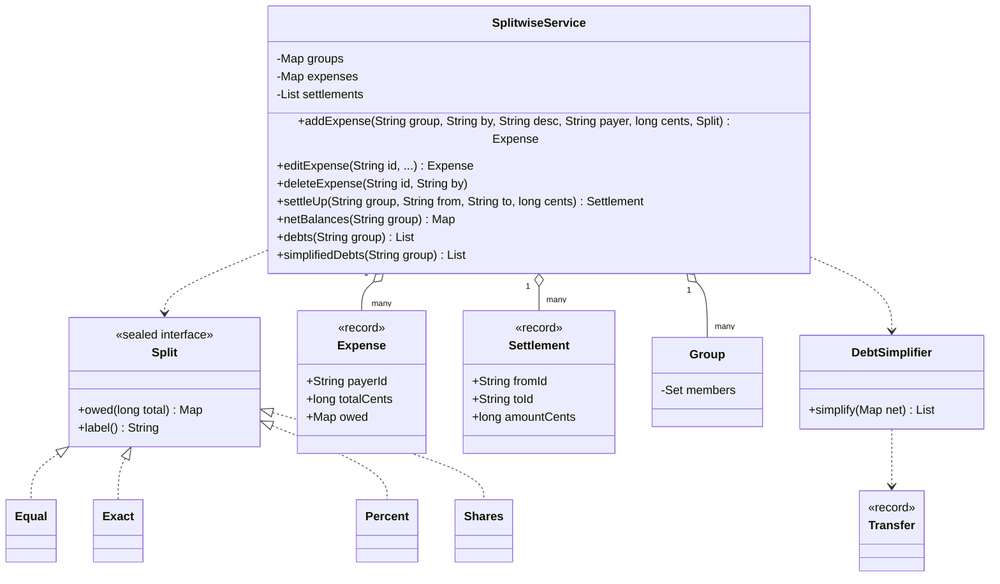
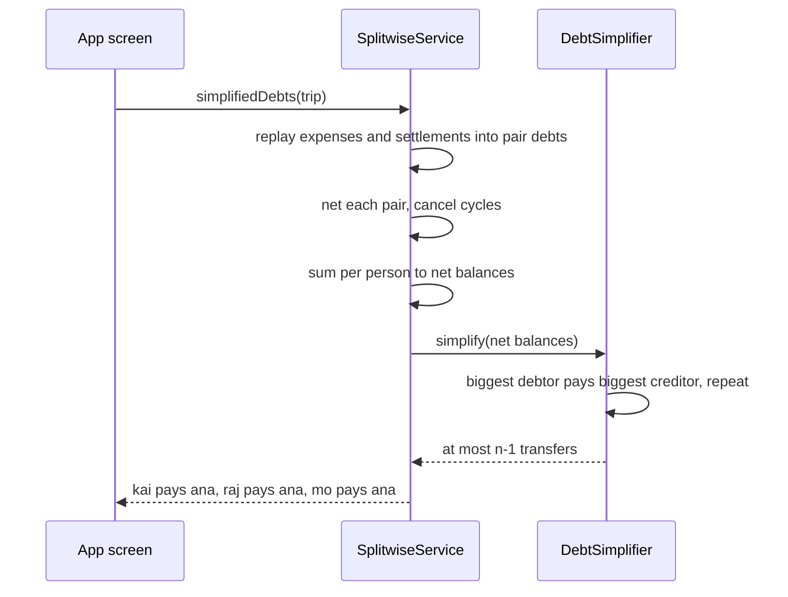
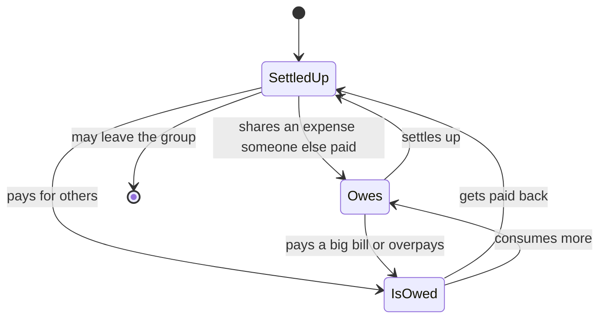

# 💸 Design Splitwise (Expense Sharing) — Low Level Design (Java)


> Friends share bills; the app tells everyone who owes whom. The interview hinges on three things:
> **splits that add up to the cent** ($100 / 3 is not 33.33 × 3), **balances that can't drift** when
> expenses are edited or deleted, and **debt simplification** (turning a web of IOUs into as few
> payments as possible).

> 📚 **Credit:** Problem inspired by
> [AlgoMaster — Design Splitwise](https://algomaster.io/learn/lld/design-splitwise)
> (premium lesson, **not** accessed). Everything here is my own original work, based on how expense
> sharing apps publicly behave and well-known algorithms. See [References & Credits](#-references--credits).

---

## 📑 On this page

1. [Scoping the Problem](#1-scoping-the-problem)
2. [Finding the Building Blocks](#2-finding-the-building-blocks)
3. [Object Model](#3-object-model)
   - [3.1 Class Responsibilities](#31-class-responsibilities)
   - [3.2 Patterns in Play](#32-patterns-in-play)
   - [3.3 UML Diagrams](#33-uml-diagrams)
   - [Practice Round](#-practice-round)
4. [Implementation Walkthrough](#4-implementation-walkthrough)
5. [Build, Run & Verify](#5-build-run--verify)
6. [Follow-up Scenarios](#6-follow-up-scenarios)
   - [6.1 Pennies Matter](#61-pennies-matter)
   - [6.2 Store Events, Derive Balances](#62-store-events-derive-balances)
   - [6.3 Fewer Payments](#63-fewer-payments)
7. [Last-Minute Revision](#7-last-minute-revision)
- [References & Credits](#-references--credits)

---

## 1. Scoping the Problem

### 🗣️ Sample conversation

| Candidate asks | Interviewer answers | Design impact |
|---|---|---|
| How can a bill be split? | Equally, exact amounts, percentages, shares. | `Split` strategy with four variants. |
| What about rounding? | Totals must match to the cent. | Integer cents + largest-remainder allocation. |
| Groups? | Yes; balances per group, plus a per-friend total. | `Group`; `balanceBetween`, `overallBalance`. |
| Edit or delete an expense? | Yes, balances must follow. | Balances derived from the expense list, never stored. |
| Paying someone back? | Record a settlement. | `Settlement`, replayed like an expense. |
| Fewer payments? | Offer "simplify debts". | Greedy on net balances; cancel debt cycles. |
| Who paid? | One payer per expense (multi-payer as a follow-up). | `payerId` + `owed` map. |
| Leaving a group? | Only when settled. | Zero-balance check. |

### ✅ Functional requirements

1. Users, groups, members; leave only with a zero balance.
2. Add / edit / delete expenses with equal, exact, percent (basis points) or share splits; validate totals.
3. Record settlements (any positive amount, including third-party payments from a simplified plan).
4. Show net balances, pairwise debts, a simplified plan, per-friend and overall balances, activity.

### ⚙️ Non-functional requirements

- Exact money: no floating point; every split sums to the total.
- Balances in a group always sum to zero; edits can't corrupt them.
- Deterministic output (same input → same plan).

---

## 2. Finding the Building Blocks

| Noun / verb | Becomes |
|---|---|
| person, group | `User`, `Group` |
| bill | `Expense` (payer, total, owed per participant) |
| split type | `Split` (sealed: `Equal`, `Exact`, `Percent`, `Shares`) |
| paying back | `Settlement` |
| "X owes Y" | `Transfer` |
| minimise payments | `DebtSimplifier` |
| the app | `SplitwiseService` (facade) |

---

## 3. Object Model

### 3.1 Class Responsibilities

#### `SplitwiseService` (facade)
- CRUD for groups/expenses/settlements with membership validation and an activity feed.
- `pairwise(group)`: replay expenses and settlements → per-pair net debts → cancel cycles.
- `netBalances`, `debts`, `simplifiedDebts`, `balanceBetween`, `overallBalance`.

#### `Split`
- `owed(total)` returns exact cents per person; `allocate` is the shared largest-remainder routine.

#### `DebtSimplifier`
- Greedy max-creditor / max-debtor matching on net balances.

### 3.2 Patterns in Play

| Pattern | Where | Why |
|---|---|---|
| **Strategy** (sealed) | `Split` | New split types without touching the service; exhaustive handling. |
| **Facade** | `SplitwiseService` | One API for the app. |
| **Event log / derived state** | expenses + settlements → balances | Edits and deletes can't leave stale totals. |
| **Greedy algorithm** | `DebtSimplifier` | ≤ n−1 payments. |
| **Graph cycle cancellation** | `cancelCycles` | Removes circular IOUs without changing anyone's net. |

**SOLID check**

- **S**: splits divide, simplifier plans, service stores and validates.
- **O**: "split by nights stayed" is a new `Split` variant.
- **L**: every `Split` returns a map summing to the total.
- **I**: callers only see `owed` and `label`.
- **D**: time comes from `Clock`.

### 3.3 UML Diagrams

#### Class diagram



#### Sequence: from expenses to a payment plan



#### Where a person stands



### 🧠 Practice Round

1. $100 split three ways. Who pays the extra cent, and why must someone?
   <details><summary>Hint</summary>10000 / 3 = 3333 r 1: one person pays 3334 or the total is wrong. Pick deterministically (first listed / largest remainder).</details>
2. Why not keep a running balance table and update it on each expense?
   <details><summary>Hint</summary>Edits and deletes would need exact reversal logic, and one bug drifts balances forever. Deriving from the list of events is always correct (cache it if needed).</details>
3. A owes B $30 and B owes C $30. How many payments are needed?
   <details><summary>Hint</summary>One: A pays C. Only net positions matter.</details>
4. After everyone pays per the simplified plan, the pairwise view still shows "A owes D". What's wrong?
   <details><summary>Hint</summary>Circular debts remain in the pair graph. Cancel cycles: subtract the smallest edge around each loop.</details>
5. How do you prove the plan is right?
   <details><summary>Hint</summary>Apply the transfers to the net balances: everyone must end at zero. The tests do this on 300 random expenses.</details>

---

## 4. Implementation Walkthrough

### 📁 Project structure

```
Splitwise/
├── pom.xml
└── src/
    ├── main/java/com/lld/finance/splitwise/
    │   ├── SplitwiseApp.java               # a weekend trip for four
    │   ├── model/                          # User, Group, Expense, Settlement, Transfer, Money, SplitwiseException
    │   ├── split/                          # Split (Equal, Exact, Percent, Shares)
    │   └── service/                        # SplitwiseService, DebtSimplifier
    └── test/java/com/lld/finance/splitwise/
        └── SplitwiseTest.java
```

### ➗ Largest remainder

```java
for (String u : order) {
    long exact = total * weights.get(u);
    out.put(u, exact / weightSum);                  // floor
    remainders.put(u, exact % weightSum);
}
// hand out the missing cents to the biggest remainders (ties: first listed)
```

### 🔁 Replay → pairwise → cancel cycles

```java
for (Expense e : expenses in group)   for each participant != payer: add(participant owes payer, share);
for (Settlement s : settlements)      add(to owes from, amount);           // paying back reverses the direction
net each pair (keep only the positive direction);
cancelCycles(net);                                                          // a->b->c->a loops removed
```

### 🤝 Greedy simplification

```java
while (!creditors.isEmpty()) {
    Party c = creditors.poll(), d = debtors.poll();            // biggest of each
    long pay = Math.min(c.amount(), d.amount());
    out.add(new Transfer(d.id(), c.id(), pay));
    re-queue whoever still has a balance;
}
```

### ⏱️ Complexity

| Operation | Cost |
|---|---|
| add / edit / delete expense | O(p) participants |
| balances (replay) | O(E·p + S) |
| cycle cancellation | O(C·(V+E)) for C cycles |
| simplify | O(n log n) |

---

## 5. Build, Run & Verify

### With Maven

```bash
cd Finance-and-Payment/Splitwise
mvn test
mvn compile exec:java
```

### Without Maven (plain JDK 17+)

```bash
cd Finance-and-Payment/Splitwise
javac -d out $(find src/main -name "*.java")
java -cp out com.lld.finance.splitwise.SplitwiseApp
```

### Demo output

```
> Expenses
   Ana created the group
   Ana added 'Villa' $400.00 paid by Ana, split equally
   Raj added 'Dinner' $100.00 paid by Raj, split equally
   Kai added 'Scooters' $90.00 paid by Kai, split by exact amounts
   Mo added 'Boat tour' $150.00 paid by Mo, split by percentage
   Ana added 'Groceries' $70.00 paid by Ana, split by shares
   Dinner split 3 ways: {ana=3334, raj=3333, kai=3333} (cents, adds up to 10000)

> Bad input is refused
   [refused] Exact amounts add up to 2000c, not 3000c
   [refused] Percentages must be non-negative and add up to 100% (got 90.0%)

> Balances
   ana gets back $289.16
   raj owes $90.83
   kai owes $130.83
   mo owes $67.50
   pairwise debts (5 payments): [kai -> ana $120.00, kai -> raj $10.83, mo -> ana $82.50, raj -> ana $86.66, raj -> mo $15.00]
   simplified (3 payments): [kai -> ana $130.83, raj -> ana $90.83, mo -> ana $67.50]

> Raj notices the dinner was $120, not $100
   ana gets back $282.50
   raj owes $77.50
   kai owes $137.50
   mo owes $67.50

> Everyone settles with the simplified plan
   kai paid ana $137.50
   raj paid ana $77.50
   mo paid ana $67.50
   ana is settled up
   raj is settled up
   kai is settled up
   mo is settled up
   Mo is settled and leaves the group
```

### ✅ What the tests cover

| Area | Tests |
|---|---|
| Splits | 6 parameterised equal splits (sum exact, spread ≤ 1 cent); leftover cents order; percent largest remainder and validation; shares; exact must match; distinct participants |
| Balances | one expense; opposing debts net per pair; middleman removed by simplification; **circular debts cancel**; edit and delete reflow; settling via the plan zeroes everyone (pairwise too); overpaying flips direction; balances across groups |
| Rules | payer/participants must be members, positive amounts, valid settlements, leave only when settled |
| Properties | 300 random expenses (all split types) + random settlements: balances sum to 0, plan has ≤ n−1 payments, the plan settles everyone, and moves no more money than the pairwise view |

**22 tests, all passing.**

---

## 6. Follow-up Scenarios

### 6.1 Pennies Matter

- Store integer minor units (`long` cents); convert only for display.
- Largest remainder keeps splits fair (spread ≤ 1 cent) and exact.
- Percentages as basis points (1/100 of a percent) avoid 33.333…% problems.
- Multiple currencies: keep balances per currency; convert only when settling, at a recorded rate.

### 6.2 Store Events, Derive Balances

- Expenses and settlements are the **source of truth**; balances are a view.
- At scale, keep a cached balance per (group, user) updated transactionally with each event, and a
  periodic job that recomputes from events to detect drift.
- Deleting keeps an audit trail (soft delete) in a real system.

### 6.3 Fewer Payments

- Minimum number of payments is NP-hard (it relates to partitioning people into zero-sum subsets);
  greedy gives ≤ n−1 and is what products use.
- Simplifying may make someone pay a person they never dealt with: make it opt-in per group.
- Cycle cancellation is the safe middle ground: it only removes loops, never introduces new pairs.

### 🚀 More follow-ups to practice

1. **Multiple payers** for one bill (two people split the card payment).
2. **Recurring expenses** (rent every month).
3. **Itemised receipts**: split per item, then tax and tip proportionally.
4. **Reminders** for people who owe money for a long time.
5. **Payments integration**: "settle up" triggers a real payment (see Payment Gateway in this folder).

---

## 7. Last-Minute Revision

- Money in cents; splits: equal, exact, percent (bps), shares; largest remainder for leftovers.
- Expense = payer + total + owed map (sums to total).
- Balances derived from expenses + settlements; group nets sum to zero.
- Pairwise debts: netted per pair, cycles cancelled.
- Simplify: greedy on nets, ≤ n−1 transfers; verify by applying the plan.
- Leave a group only when settled.

---

## 📚 References & Credits

| Resource | How it was used |
|---|---|
| [AlgoMaster.io — Design Splitwise (LLD)](https://algomaster.io/learn/lld/design-splitwise) | Inspiration for the **problem choice** only. The lesson is premium and was **not** accessed. |
| [Largest remainder method — Wikipedia](https://en.wikipedia.org/wiki/Largest_remainder_method) | Public background on fair rounding. |
| [Greedy algorithm — Wikipedia](https://en.wikipedia.org/wiki/Greedy_algorithm) | Public background for debt simplification. |
| [Refactoring.Guru — Strategy](https://refactoring.guru/design-patterns/strategy), [Facade](https://refactoring.guru/design-patterns/facade) | Public pattern definitions. |
| [Mermaid](https://mermaid.js.org/) | Diagrams rendered by GitHub. |
| [JUnit 5 User Guide](https://junit.org/junit5/docs/current/user-guide/) | Testing. |

**Originality statement**

- This repository is a **personal learning project** for LLD interview preparation.
- The AlgoMaster lesson is premium content that I have not accessed. No text, code, diagrams,
  headings or other material from it (or any paid source) is reproduced here.
- All headings, source code, explanations, tables, diagrams, tests and exercises were written
  independently from publicly known behaviour and the public references above.
- "Splitwise" is used only as the common name of this interview problem; this project is not
  affiliated with Splitwise, Inc. or with AlgoMaster.io.
- For the original lesson, please support the author at [algomaster.io](https://algomaster.io).

---

> ⭐ Try the Practice Round before reading the code, then compare your design with this one.
