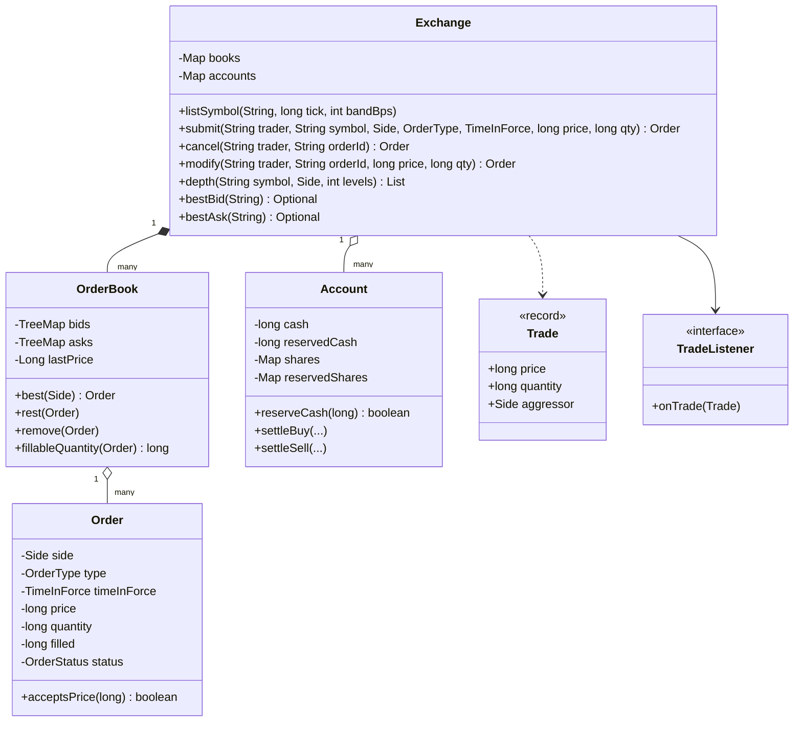
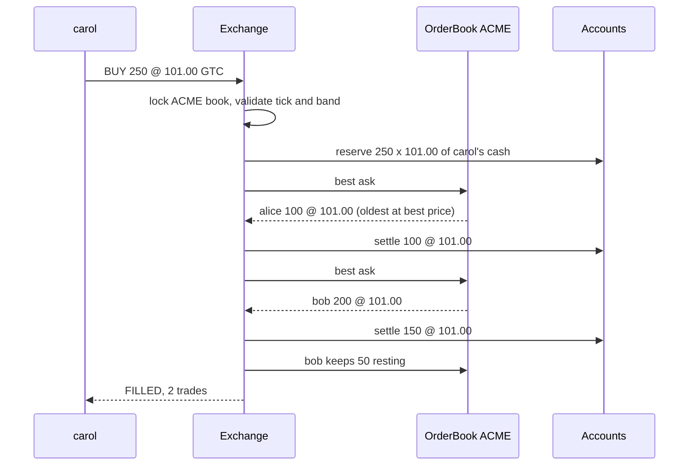
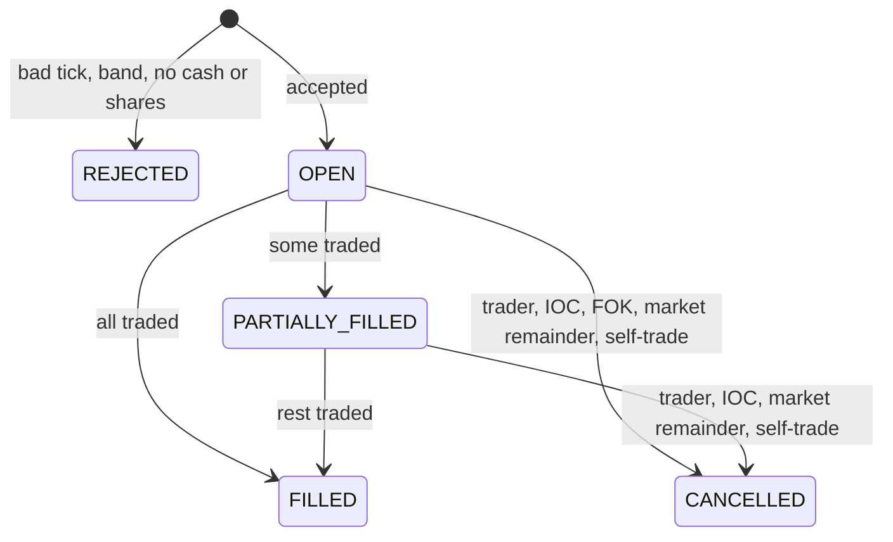

# 📈 Design an Online Stock Exchange — Low Level Design (Java)


> The heart of an exchange is the **matching engine**: an order book per stock that pairs buyers and
> sellers fairly and deterministically. The interview is about **price-time priority**, **which price a
> trade happens at**, order types (**limit / market**, **GTC / IOC / FOK**), **cancel/modify** rules,
> **self-trade prevention**, and making sure nobody can spend the same dollar or share twice.

> 📚 **Credit:** Problem inspired by
> [AlgoMaster — Design Online Stock Exchange](https://algomaster.io/learn/lld/design-online-stock-exchange)
> (premium lesson, **not** accessed). Everything here is my own original work, based on publicly
> documented market-microstructure concepts. See [References & Credits](#-references--credits).

> ⚠️ Educational simulation with a fictional stock "ACME". Not trading software and not investment advice.

---

## 📑 On this page

1. [Scoping the Problem](#1-scoping-the-problem)
2. [Finding the Building Blocks](#2-finding-the-building-blocks)
3. [Object Model](#3-object-model)
   - [3.1 Class Responsibilities](#31-class-responsibilities)
   - [3.2 Patterns in Play](#32-patterns-in-play)
   - [3.3 UML Diagrams](#33-uml-diagrams)
   - [Practice Round](#-practice-round)
4. [Implementation Walkthrough](#4-implementation-walkthrough)
5. [Build, Run & Verify](#5-build-run--verify)
6. [Follow-up Scenarios](#6-follow-up-scenarios)
   - [6.1 Fair and Deterministic Matching](#61-fair-and-deterministic-matching)
   - [6.2 Order Book Data Structures](#62-order-book-data-structures)
   - [6.3 Risk Before the Trade](#63-risk-before-the-trade)
7. [Last-Minute Revision](#7-last-minute-revision)
- [References & Credits](#-references--credits)

---

## 1. Scoping the Problem

### 🗣️ Sample conversation

| Candidate asks | Interviewer answers | Design impact |
|---|---|---|
| Who goes first when prices are equal? | Whoever arrived first. | Price levels with FIFO queues. |
| At what price do they trade? | The resting order's price. | Trade price = maker's limit. |
| Order types? | Limit and market; GTC, IOC, FOK. | `OrderType`, `TimeInForce`. |
| Can orders be changed? | Cancel any time; modify. Shrinking keeps priority. | `modify`: reduce in place vs cancel/replace. |
| Can a trader trade with themselves? | No (wash trades). | Self-trade prevention: cancel the incoming. |
| Money checks? | You can't buy without cash or sell without shares. | Reservations on accept; settlement per trade. |
| Price sanity? | Tick size 0.05; reject orders far from the last price. | Tick check + price band. |
| Several stocks? | Yes, independent. | One book and one lock per symbol. |
| Market data? | Best bid/ask, depth, last price, trade feed. | `depth`, `TradeListener`. |

### ✅ Functional requirements

1. List symbols (tick size, price band); open accounts with cash; deposit shares.
2. Submit limit/market orders with GTC/IOC/FOK; match with price-time priority at resting prices.
3. Rest unfilled GTC limit remainders; cancel IOC/market remainders; FOK all-or-nothing.
4. Cancel; modify (quantity decrease keeps priority, anything else is cancel/replace and may trade).
5. Reject: bad tick, non-positive values, outside price band, insufficient cash/shares.
6. Self-trade prevention; settlement moves cash and shares immediately.
7. Market data: best bid/ask, depth per level, last price, trade feed.

### ⚙️ Non-functional requirements

- **Deterministic**: same input sequence → same trades.
- **Consistency**: cash and shares are conserved; reservations always equal open orders' needs.
- **Throughput**: symbols match in parallel; each book is single-writer under its lock.

---

## 2. Finding the Building Blocks

| Noun / verb | Becomes |
|---|---|
| order, side, type, time in force | `Order`, `Side`, `OrderType`, `TimeInForce`, `OrderStatus` |
| execution | `Trade` |
| book, price level | `OrderBook` (+ `Level`) |
| trader's money and stock | `Account` (with reservations) |
| exchange, engine | `Exchange` (facade + matching) |
| feed | `TradeListener` |

---

## 3. Object Model

### 3.1 Class Responsibilities

#### `Exchange`
- Accept → validate → reserve → (FOK pre-check) → match → rest or cancel remainder → publish trades.
- `cancel`, `modify`, market-data queries. One monitor per `OrderBook`.

#### `OrderBook`
- `TreeMap<price, Deque<Order>>` for bids (descending) and asks (ascending).
- `best(side)`, `rest`, `remove`, `fillableQuantity` (for FOK), `depth`, last price.

#### `Account`
- Cash and shares, each with a reserved part. `reserve*`/`release*` on order accept/cancel,
  `settleBuy`/`settleSell` on each trade.

#### `Order`
- Quantity, filled, status, reason; `acceptsPrice(p)`; sequence for time priority.

### 3.2 Patterns in Play

| Pattern | Where | Why |
|---|---|---|
| **Facade** | `Exchange` | One entry point for traders. |
| **Observer** | `TradeListener` | Market data, clearing, surveillance. |
| **Price-time priority** | `TreeMap` + FIFO `Deque` | Fair, deterministic matching. |
| **Reservation (escrow)** | `Account` | No double spending across open orders and symbols. |
| **Single-writer per book** | per-symbol lock | Sequenced events, parallel symbols. |

**SOLID check**

- **S**: the book stores and orders; the exchange decides; accounts hold money.
- **O**: a new time-in-force (e.g. "good till date") is a new branch in `finish` + enum value.
- **L**: any `TradeListener` can consume the feed.
- **I**: traders see submit/cancel/modify and market data only.
- **D**: time via `Clock`.

### 3.3 UML Diagrams

#### Class diagram



#### Sequence: an aggressive buy walks the book



#### Order lifecycle



### 🧠 Practice Round

1. A resting ask at 100 and an incoming bid at 102 match. At what price?
   <details><summary>Hint</summary>100: the resting order was there first and set the price. The buyer's limit is only a maximum.</details>
2. Why a `TreeMap` of queues instead of one priority queue of orders?
   <details><summary>Hint</summary>Cancels need to find and remove orders quickly; aggregated depth per price is a natural view; FIFO per price gives time priority for free.</details>
3. How does FOK avoid partially executing and then rolling back?
   <details><summary>Hint</summary>Check fillable quantity before matching, under the same lock; only then execute.</details>
4. A trader has $10,000 and places two $6,000 buy orders in different stocks. What should happen?
   <details><summary>Hint</summary>The second is rejected: open orders reserve cash at accept time, across all symbols.</details>
5. Why does increasing an order's quantity lose its queue position but decreasing doesn't?
   <details><summary>Hint</summary>Otherwise traders could park a tiny order early and grow it later, jumping everyone who came in between.</details>

---

## 4. Implementation Walkthrough

### 📁 Project structure

```
StockExchange/
├── pom.xml
└── src/
    ├── main/java/com/lld/finance/exchange/
    │   ├── StockExchangeApp.java           # one session in a fictional stock
    │   ├── model/                          # Order, Trade, Side, OrderType, TimeInForce, OrderStatus, Prices, ExchangeException
    │   ├── book/                           # OrderBook
    │   ├── account/                        # Account
    │   └── core/                           # Exchange, TradeListener
    └── test/java/com/lld/finance/exchange/
        └── ExchangeTest.java
```

### ⚖️ The matching loop

```java
while (in.remaining() > 0) {
    Order resting = book.best(in.side().opposite());               // best price, oldest first
    if (resting == null || !in.acceptsPrice(resting.price())) return;
    if (resting.traderId().equals(in.traderId())) { in.cancel("self-trade prevented"); return; }
    long qty = Math.min(in.remaining(), resting.remaining());
    // market buys: also limited by available cash
    settle(buyer, seller, qty, resting.price());                   // trade at the resting price
    in.fill(qty); resting.fill(qty);
    if (resting.remaining() == 0) book.remove(resting);
}
```

### 🧾 After matching

```java
if (in.remaining() == 0) return;
if (cancelled by self-trade or cash) release(remaining);
else if (LIMIT && GTC)             book.rest(in);
else                               { release(remaining); in.cancel("IOC / market remainder"); }
```

### 💵 Reservations make settlement safe

```java
// accept:    BUY limit reserves qty * limit; SELL reserves qty shares
// per trade: buyer.cash -= qty * tradePrice; buyer.reserved -= qty * limit  (price improvement is freed)
//            seller.shares -= qty; seller.reservedShares -= qty; seller.cash += qty * tradePrice
// cancel:    release remaining reservation
```

### ⏱️ Complexity

| Operation | Cost |
|---|---|
| submit (no match) | O(log L) to find/create the level |
| each fill | O(log L) best level + O(1) queue |
| cancel | O(log L + k) (k orders at that level; see 6.2) |
| depth(n) | O(n) |

---

## 5. Build, Run & Verify

### With Maven

```bash
cd Finance-and-Payment/StockExchange
mvn test
mvn compile exec:java
```

### Without Maven (plain JDK 17+)

```bash
cd Finance-and-Payment/StockExchange
javac -d out $(find src/main -name "*.java")
java -cp out com.lld.finance.exchange.StockExchangeApp
```

### Demo output

```
> Sellers post asks, buyers post bids (nothing crosses yet)
        ask   102.50 x  300 (1)
        ask   101.00 x  300 (2)
        --------------------
        bid   100.00 x  150 (1)
        bid    99.50 x  100 (1)

> Carol buys 250 at up to 101.00: alice's 100 first (earlier), then 150 of bob's
   [trade] T1 ACME 100 @ 101.00 (buyer carol, seller alice, aggressor BUY)
   [trade] T2 ACME 150 @ 101.00 (buyer carol, seller bob, aggressor BUY)
   O6 carol BUY 250 ACME @ 101.00 GTC filled 250/250 [FILLED]

> Dan sends a market buy for 200: sweeps bob's last 50 at 101.00, then 150 at 102.50
   [trade] T3 ACME 50 @ 101.00 (buyer dan, seller bob, aggressor BUY)
   [trade] T4 ACME 150 @ 102.50 (buyer dan, seller alice, aggressor BUY)
   O7 dan BUY 200 ACME @ MKT IOC filled 200/200 [FILLED]

> Time in force
   O8 carol BUY 500 ACME @ 102.50 FOK filled 0/500 [CANCELLED: fill-or-kill: only 150 available]
   [trade] T5 ACME 150 @ 102.50 (buyer carol, seller alice, aggressor BUY)
   O9 carol BUY 500 ACME @ 102.50 IOC filled 150/500 [CANCELLED: immediate-or-cancel: 350 unfilled]

> Self-trade prevention: bob's buy would hit his own ask
   O11 bob BUY 50 ACME @ 103.00 GTC filled 0/50 [CANCELLED: self-trade prevented: would trade with own O10]

> Validation and risk checks
   O12 dan BUY 10 ACME @ 102.53 GTC filled 0/10 [REJECTED: price must be a positive multiple of the tick size 0.05]
   O13 dan BUY 10 ACME @ 80.00 GTC filled 0/10 [REJECTED: price 80.00 is outside the band around last 102.50]
   O14 carol SELL 1000 ACME @ 103.00 GTC filled 0/1000 [REJECTED: not enough ACME shares (400 available)]
   O15 dan BUY 10000 ACME @ 100.00 GTC filled 0/10000 [REJECTED: not enough cash: needs 1000000.00, has 69625.00]

> Modify: shrinking keeps queue priority; growing or repricing goes to the back
   queue at 100.50 after carol shrinks: [O16(carol 60), O17(dan 100)]
   carol grows to 80 -> new order O18, queue: [O17(dan 100), O18(carol 80)]

> Accounts after the session
   alice  cash    140850.00 (available    140850.00)  ACME   600 (available   600)
   bob    cash    120200.00 (available    120200.00)  ACME   800 (available   750)
   carol  cash     59375.00 (available     36335.00)  ACME   400 (available   400)
   dan    cash     79575.00 (available     69625.00)  ACME   200 (available   200)
   last price 102.50, trades 5
```

Total cash is still 4 × $100,000 and total ACME shares still 2,000: trading only moves them.

### ✅ What the tests cover

After **every** test a hook checks: cash and shares conserved, every account's reserved cash/shares
equal exactly what its resting orders need, no negative availability, and no book left crossed.

| Area | Tests |
|---|---|
| Matching | price then time priority, trades at resting prices, surplus reservation released; resting and partial rests; sell aggressor hits the highest bid |
| Order types | market sweep never rests; market buy stops when cash runs out; IOC keeps fills; FOK all-or-nothing; market can't be GTC |
| Rules | self-trade prevention; tick/quantity/price/cash/shares validation; price band edges; reservations across two symbols |
| Cancel & modify | owner-only, releases, no double cancel; shrink keeps priority, grow/reprice lose it; repricing can trade |
| Properties | 3,000 random orders (limit/market/IOC/FOK/cancel) keep every invariant; no self trades |
| Concurrency | 8 threads trading two symbols in parallel: all invariants hold |

**17 tests, all passing.**

---

## 6. Follow-up Scenarios

### 6.1 Fair and Deterministic Matching

- Real engines process each symbol's orders **sequentially** (one thread / core per book) from a
  sequenced input log, so a replay of the log reproduces every trade exactly.
- Gateways assign timestamps; the sequencer decides order; the engine never looks at wall clocks.
- Other matching rules exist: **pro-rata** (futures), auctions at open/close (single clearing price).

### 6.2 Order Book Data Structures

- Here: `TreeMap<price, ArrayDeque>`; cancel scans a level (O(k)).
- Production: per-level intrusive doubly-linked lists + `orderId → node` map for O(1) cancel; price
  levels in arrays indexed by ticks around the current price for cache-friendly O(1) best-price updates.
- Market data: publish incremental updates (level changed) instead of full snapshots.

### 6.3 Risk Before the Trade

- Reservations prevent over-commitment; brokers add margin, position and order-rate limits.
- **Price bands / circuit breakers** halt trading or reject orders on sudden moves.
- **Self-trade prevention** variants: cancel newest (here), cancel oldest, cancel both, decrement.

### 🚀 More follow-ups to practice

1. **Stop orders** (trigger a market order when the last price crosses a level).
2. **Iceberg orders** (show a small visible quantity, refill from a hidden reserve).
3. **Opening auction** that computes a single price maximising matched volume.
4. **Trading halts** and resuming with an auction.
5. **Clearing and settlement T+1** instead of instant settlement.

---

## 7. Last-Minute Revision

- One book per symbol: bids high→low, asks low→high, FIFO per price → price-time priority.
- Trade price = resting order's price; incoming order is the aggressor.
- LIMIT GTC rests; IOC/market remainders cancel; FOK pre-checks fillable quantity.
- Self-trade prevention cancels the incoming remainder.
- Accept = validate (tick, band, quantity) + reserve (cash for buys at limit, shares for sells).
- Settle per trade; release unused reservation on fill (price improvement) and on cancel.
- Modify: shrink keeps priority; grow/reprice = cancel + new order.
- Invariants: conservation, reservations = open needs, book never crossed.

---

## 📚 References & Credits

| Resource | How it was used |
|---|---|
| [AlgoMaster.io — Design Online Stock Exchange (LLD)](https://algomaster.io/learn/lld/design-online-stock-exchange) | Inspiration for the **problem choice** only. The lesson is premium and was **not** accessed. |
| [Order book — Wikipedia](https://en.wikipedia.org/wiki/Order_book) | Public background on bids, asks and depth. |
| [Order matching system — Wikipedia](https://en.wikipedia.org/wiki/Order_matching_system) | Public background on price-time priority. |
| [Time in force — Investopedia](https://www.investopedia.com/terms/t/timeinforce.asp) | Public definitions of GTC / IOC / FOK. |
| [Mermaid](https://mermaid.js.org/) | Diagrams rendered by GitHub. |
| [JUnit 5 User Guide](https://junit.org/junit5/docs/current/user-guide/) | Testing. |

**Originality statement**

- This repository is a **personal learning project** for LLD interview preparation.
- The AlgoMaster lesson is premium content that I have not accessed. No text, code, diagrams,
  headings or other material from it (or any paid source) is reproduced here.
- All headings, source code, explanations, tables, diagrams, tests and exercises were written
  independently from publicly known behaviour and the public references above.
- The stock and traders in the demo are fictional. This project is **not affiliated with or endorsed
  by** AlgoMaster.io or any exchange, and is not financial advice.
- For the original lesson, please support the author at [algomaster.io](https://algomaster.io).

---

> ⭐ Try the Practice Round before reading the code, then compare your design with this one.
