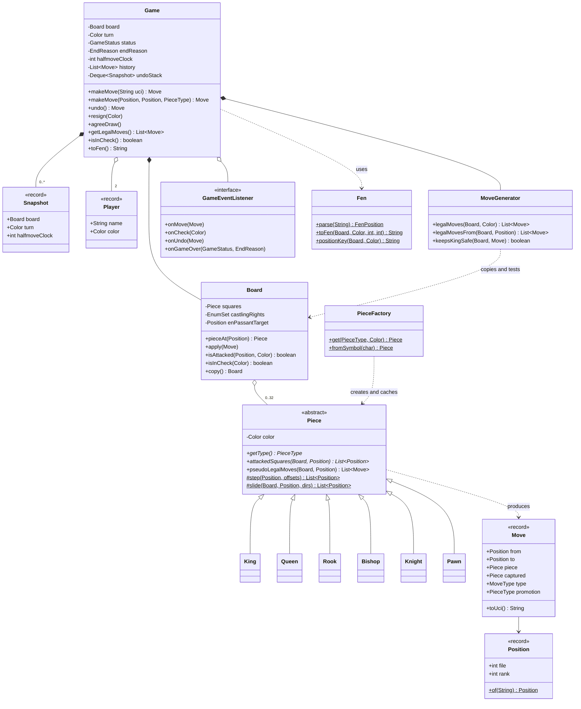
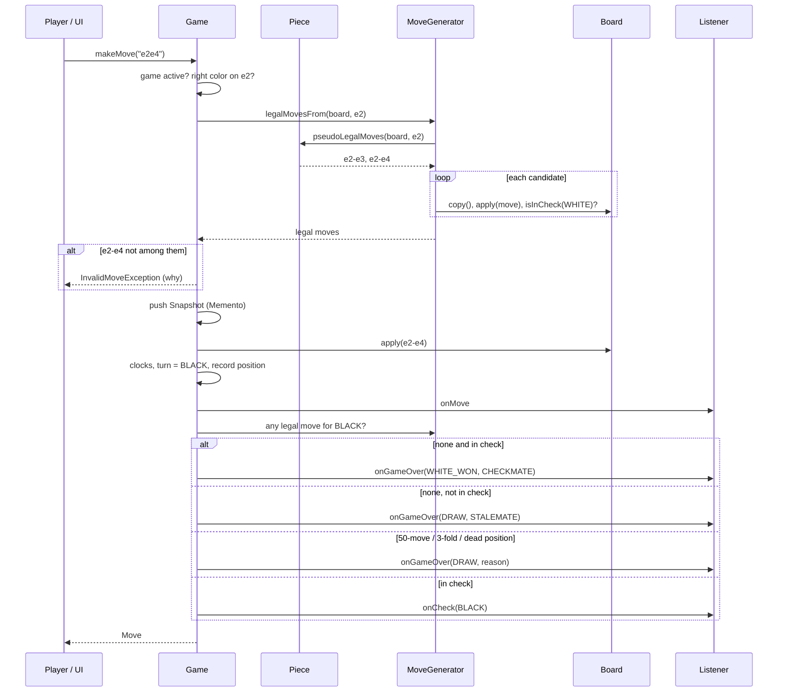
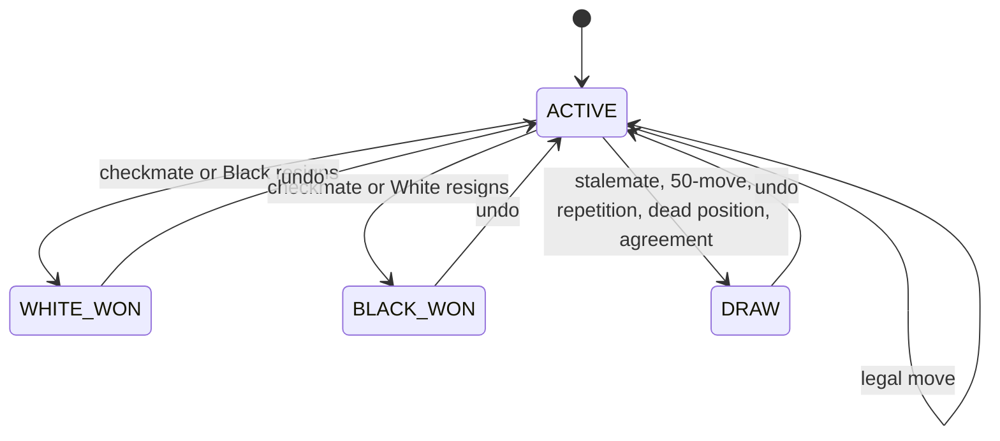

# ♟️ Design a Chess Game — Low Level Design (Java)


> The "boss level" of game LLD questions. It tests whether you can keep a **rule-heavy domain**
> organised: polymorphic pieces, one central legality rule, special moves that touch more than one
> square, and several ways a game can end. Solved end-to-end the way you'd do it in a 45–60 minute
> LLD round: **clarify → entities → classes → patterns → code → test → extend**.

Chess is a two-player game on an 8×8 board. Each side starts with 16 pieces (king, queen, two
rooks, two bishops, two knights, eight pawns). Players alternate moves. A move is **legal** only if
it follows the piece's movement rules **and** doesn't leave the mover's own king attacked. You win
by **checkmate**: the opponent's king is attacked and they have no legal move. If the side to move
has no legal move but is *not* in check, it's **stalemate**, a draw.

> 📚 **Credit:** Problem inspired by
> [AlgoMaster — Design Chess Game](https://algomaster.io/learn/lld/design-chess-game) (premium
> lesson, **not** accessed). Everything here is my own original work, based on the public
> rules of chess. See [References & Credits](#-references--credits).

---

## 📑 On this page

1. [Scoping the Problem](#1-scoping-the-problem)
2. [Finding the Building Blocks](#2-finding-the-building-blocks)
3. [Object Model](#3-object-model)
   - [3.1 Class Responsibilities](#31-class-responsibilities)
   - [3.2 Patterns in Play](#32-patterns-in-play)
   - [3.3 UML Diagrams](#33-uml-diagrams)
   - [Practice Round](#-practice-round)
4. [Implementation Walkthrough](#4-implementation-walkthrough)
5. [Build, Run & Verify](#5-build-run--verify)
6. [Follow-up Scenarios](#6-follow-up-scenarios)
   - [6.1 Special Moves: Castling, En Passant, Promotion](#61-special-moves-castling-en-passant-promotion)
   - [6.2 Every Way a Game Can End](#62-every-way-a-game-can-end)
   - [6.3 Undo and Move History](#63-undo-and-move-history)
7. [Last-Minute Revision](#7-last-minute-revision)
8. [References & Credits](#-references--credits)

---

## 1. Scoping the Problem

Chess has a lot of rules, and implementing all of them in 45 minutes is unrealistic.
**Agree on scope first**, then design so that the rules you skip can be added later.

### 🗣️ Sample conversation

| Candidate asks | Interviewer answers | Design impact |
|---|---|---|
| Two humans on one machine, or online / vs computer? | Two humans, local. Keep it open for AI and online play. | `Player` is separate from `Color`. Game exposes `getLegalMoves()` for a future AI. |
| Do we need full legality, including pins and check? | Yes. You must not be able to leave your king in check. | One central rule: "try the move, is my king attacked?" |
| Special moves: castling, en passant, promotion? | Yes, all three. | A `MoveType` on each `Move`. Castling rights and the en passant square live on `Board`. |
| How does the game end? | Checkmate, stalemate, resignation. Draws are a bonus. | `GameStatus` (who won) + `EndReason` (why). |
| Which draw rules? | Nice to have: 50-move, repetition, insufficient material, agreement. | Half-move clock, position counter, material check. |
| Undo? | Yes, take back moves. | **Memento**: snapshot before each move. |
| Clocks / time control? | Out of scope; mention how. | Observer: a clock listener. |
| Input format? | Anything reasonable. | UCI text (`e2e4`, `e7e8q`) plus `Position` objects. |
| Load a position (puzzles, tests)? | Would be nice. | **FEN** parser and writer. |

### ✅ Functional requirements

1. Standard 8×8 start position. White moves first and the players alternate.
2. Each piece moves by its own rules; only knights jump over pieces.
3. A move is rejected if it's not the player's turn, the piece can't move that way, or it would
   leave the mover's own king in check (pins, moving into check, ignoring check).
4. Support **castling**, **en passant** and **promotion** (queen by default, under-promotion allowed).
5. Detect **check**, **checkmate** and **stalemate**.
6. Detect draws: **50-move rule**, **threefold repetition**, **insufficient material**, **agreement**.
7. Support **resignation** and **undo**.
8. Show the board, list the legal moves of a piece, and export the position as FEN.

### ⚙️ Non-functional requirements

- **Correct**: verified against published perft counts, not just hand-written cases.
- **Extensible**: new variants (Chess960), AI players, clocks and online play without rewriting the core.
- **Separation of concerns**: pieces know how they move, the generator knows what's legal,
  the game knows turns and results, the renderer knows how to draw.
- **Readable**: a reviewer should be able to find every rule quickly.

---

## 2. Finding the Building Blocks

| Candidate | Keep? | Reasoning |
|---|---|---|
| **Game** | ✅ class | Turns, status, history, undo; the facade. |
| **Board** | ✅ class | 64 squares + castling rights + en passant target. Applies moves mechanically. |
| **Piece** (abstract) → King, Queen, Rook, Bishop, Knight, Pawn | ✅ classes | Classic polymorphism: each subtype has its own movement rules. |
| **Move** | ✅ record | from, to, piece, captured, type, promotion. Immutable; used for history and undo. |
| **Position** | ✅ record | `(file, rank)` value object with `"e4"` parsing. |
| **Player** | ✅ record | Name + color. The place to add rating or an AI flag later. |
| **Color**, **PieceType**, **MoveType**, **CastlingRight** | ✅ enums | Closed sets of values. `Color` also stores the pawn direction and home ranks. |
| **GameStatus**, **EndReason** | ✅ enums | *Who* won vs *why* the game ended: two separate questions. |
| **MoveGenerator** | ✅ class | The legality rule, kept in one place. |
| **Cell / Square** | ❌ | A square holds nothing but "which piece?", so `Piece[8][8]` is enough. |
| **Spot / Tile with color** | ❌ | Square color is derived: `(file + rank) % 2`. |

> 💡 **Interview tip:** Many candidates give each `Piece` a `position` field *and* keep a board
> array, so the two copies drift apart. Here pieces are **position-free and immutable**. The board
> is the only record of where things are, and that makes the Flyweight pattern possible
> (see 3.2).

---

## 3. Object Model

### 3.1 Class Responsibilities

#### Abstract class — `Piece`
| Member | Purpose |
|---|---|
| `Color color` | Owner. |
| `abstract PieceType getType()` | KING, QUEEN, … |
| `abstract List<Position> attackedSquares(Board, Position from)` | Squares this piece attacks, based on its movement rules only. |
| `List<Move> pseudoLegalMoves(Board, Position from)` | Default: attacked squares that are empty or hold an enemy. Overridden by `Pawn` and `King`. |
| `step(...)`, `slide(...)` (protected helpers) | Shared logic for step pieces (K, N) and sliding pieces (Q, R, B). |

| Subclass | Movement |
|---|---|
| `King` | `step(ALL)` + **castling** in `pseudoLegalMoves`. |
| `Queen` | `slide(ALL)` |
| `Rook` | `slide(ORTHOGONAL)` |
| `Bishop` | `slide(DIAGONAL)` |
| `Knight` | `step(KNIGHT)`, which can jump over pieces |
| `Pawn` | Custom: 1 or 2 forward, captures diagonally, **en passant**, **promotion** ×4. |

> "Pseudo-legal" means the move follows the piece's own rules but might still leave the king in
> check. Pieces don't need to know about check; that is handled in one place, `MoveGenerator`.

#### `PieceFactory`
`get(type, color)` returns one of **12 shared instances**. It is used by setup, FEN parsing and promotion.

#### `Board`
| Member | Purpose |
|---|---|
| `Piece[8][8] squares` | Placement. |
| `EnumSet<CastlingRight>` | Which castlings are still allowed (lost when the king or that rook moves). |
| `Position enPassantTarget` | The square a pawn skipped over on the last move, if any. |
| `apply(Move)` | Makes the move, including side effects: moves the rook when castling, removes the captured pawn en passant, swaps in the promoted piece, updates rights and the en passant square. |
| `isAttacked(Position, Color by)` | **Reverse lookup** from the square outward. Fast. |
| `isInCheck(Color)` | `isAttacked(kingSquare, enemy)`. |
| `copy()` | 64 references + 2 fields, cheap enough to copy for each "try this move". |

#### `MoveGenerator`
```java
List<Move> legalMoves(Board, Color side)
List<Move> legalMovesFrom(Board, Position from)
boolean keepsKingSafe(Board, Move)   // copy → apply → !isInCheck
```

#### `Game`
| Member | Purpose |
|---|---|
| `makeMove("e2e4")` / `makeMove(from, to, promotion)` | Validate → snapshot → apply → update clocks → evaluate result → notify. |
| `undo()` | Pop the snapshot (Memento). |
| `resign(Color)`, `agreeDraw()` | Non-move endings. |
| `getLegalMoves()`, `getLegalMovesFrom(pos)`, `isInCheck()` | Queries for UIs and AIs. |
| `GameStatus status` + `EndReason endReason` | Result. |
| `halfmoveClock`, `repetitions` | Used by the 50-move and threefold-repetition rules. |
| `toFen()` | Exports the position. |

#### Enums
- `Color { WHITE, BLACK }`, which also stores `pawnDirection`, `homeRank`, `pawnStartRank` and `promotionRank`,
  so there are **no `if (white)` branches** scattered through the code.
- `MoveType { NORMAL, DOUBLE_PAWN_PUSH, EN_PASSANT, CASTLE_KINGSIDE, CASTLE_QUEENSIDE, PROMOTION }`
- `GameStatus { ACTIVE, WHITE_WON, BLACK_WON, DRAW }`
- `EndReason { CHECKMATE, RESIGNATION, STALEMATE, FIFTY_MOVE_RULE, THREEFOLD_REPETITION, INSUFFICIENT_MATERIAL, DRAW_AGREED }`

### 3.2 Patterns in Play

| Pattern | Where | Why here |
|---|---|---|
| **Inheritance + polymorphism (Template-style)** | `Piece` → six subclasses | Each piece supplies `attackedSquares`; the base class turns them into moves. Special pieces override `pseudoLegalMoves`. |
| **Factory** | `PieceFactory` | The only place that maps `PieceType` to a class. Used by FEN parsing and promotion. |
| **Flyweight** | `PieceFactory` cache | Pieces are immutable and position-free, so 12 objects serve every board and every copy. `Board.copy()` stays cheap. |
| **Facade** | `Game` | Callers only use `makeMove`, `undo`, `resign`, and never touch generators, clocks or snapshots. |
| **Memento** | `Game.Snapshot` | Undo that is correct for every special move without writing an "unmake" for each one. |
| **Observer** | `GameEventListener` | Clocks, move-list UIs, sound effects and network sync plug in from outside. |
| **Value Object** | `Position`, `Move`, `Player` records | Immutable, hashable, safe to share and store in history. |

**SOLID mapping**

- **S**: `Piece` = movement, `MoveGenerator` = legality, `Board` = state + mechanics,
  `Game` = turns and results, `Fen` = notation, `ConsoleBoardRenderer` = display.
- **O**: a new fairy piece (e.g. an Archbishop) is one new subclass plus one line in the factory.
- **L**: every `Piece` subtype is used through the base type by the generator and the board.
- **I**: listeners implement only the events they need (`default` methods).
- **D**: `Game` and `MoveGenerator` work with `Piece`, never with `if (piece instanceof Rook)`.

### 3.3 UML Diagrams

**Class diagram**



**What happens on `makeMove("e2e4")`**



**Game lifecycle**



### 🧠 Practice Round

Try these before reading the code (15–20 minutes each):

1. **Chess clock**: 5 minutes per side, with a 3-second increment. Where does the clock live, and what
   ends the game on time? *(Hint: a listener on `onMove` + a new `EndReason.TIMEOUT`.)*
2. **PGN export**: produce `1. e4 e5 2. Bc4 Nc6 …`. Which data do you already have? *(Hint: `getHistory()`.)*
3. **Standard algebraic notation (SAN)**: `Nf3` rather than `Ng1-f3`. How do you decide when a move needs
   disambiguation (`Nbd2`)? *(Hint: look for other legal moves of the same piece type to the same square.)*
4. **Random-move AI**: an `AiPlayer` that picks from `getLegalMoves()`. What interface would a
   `HumanPlayer` share with it?
5. **Chess960**: randomised back rank. Which classes change? *(Hint: the start FEN and the castling
   squares in `King`/`CastlingRight`.)*
6. **Draw offers**: offering, accepting and declining a draw, where an offer expires once a move is made.

<details>
<summary>💡 Hints for #3 (SAN disambiguation)</summary>

```java
List<Move> rivals = generator.legalMoves(board, color).stream()
    .filter(m -> m.piece().getType() == move.piece().getType()
              && m.to().equals(move.to()) && !m.from().equals(move.from()))
    .toList();
// none → "N"+to; rival on a different file → add from-file; else if different rank → from-rank; else both
```
Then add `+` if the move gives check, and `#` if it's checkmate.
</details>

<details>
<summary>💡 Hints for #4 (players)</summary>

```java
interface MoveProvider { String nextMove(Game game); }
class ConsolePlayer implements MoveProvider { /* reads stdin */ }
class RandomAiPlayer implements MoveProvider { /* picks from game.getLegalMoves() */ }
```
The game loop asks the current side's `MoveProvider` and calls `game.makeMove(...)`. This is the
Strategy pattern, and `Game` stays unchanged.
</details>

---

## 4. Implementation Walkthrough

### 📁 Project structure

```
Chess/
├── pom.xml
├── README.md
└── src
    ├── main/java/com/lld/games/chess
    │   ├── ChessApp.java                      # interactive console, two players
    │   ├── model/
    │   │   ├── Color.java  PieceType.java  MoveType.java  CastlingRight.java
    │   │   ├── Position.java  Move.java  Player.java
    │   ├── piece/
    │   │   ├── Piece.java                     # abstract: attackedSquares, pseudoLegalMoves
    │   │   ├── King.java  Queen.java  Rook.java  Bishop.java  Knight.java  Pawn.java
    │   │   ├── PieceFactory.java              # factory + flyweight cache
    │   │   └── Directions.java                # shared movement vectors
    │   ├── board/
    │   │   ├── Board.java                     # squares, rights, en passant, apply, isAttacked
    │   │   └── MoveGenerator.java             # pseudo-legal → legal
    │   ├── game/
    │   │   ├── Game.java                      # facade, memento undo, end detection
    │   │   ├── GameStatus.java  EndReason.java
    │   │   └── InsufficientMaterial.java
    │   ├── notation/Fen.java                  # parse / write FEN, repetition key
    │   ├── listener/GameEventListener.java
    │   ├── render/ConsoleBoardRenderer.java
    │   └── exception/InvalidMoveException.java
    └── test/java/com/lld/games/chess
        ├── GameTest.java                      # 31 rule-by-rule tests
        └── PerftTest.java                     # 10 reference move-count tests
```

### 🧩 Polymorphic pieces: small, focused classes

```java
public class Rook extends Piece {
    public PieceType getType() { return PieceType.ROOK; }
    public List<Position> attackedSquares(Board board, Position from) {
        return slide(board, from, Directions.ORTHOGONAL);
    }
}
```
`Bishop` and `Queen` look the same with different directions, and `Knight` and `King` use `step(...)`.
Only `Pawn` and `King` override `pseudoLegalMoves` for their special moves.

### ⚖️ The one legality rule

```java
public List<Move> legalMovesFrom(Board board, Position from) {
    List<Move> legal = new ArrayList<>();
    for (Move move : board.pieceAt(from).pseudoLegalMoves(board, from)) {
        if (keepsKingSafe(board, move)) legal.add(move);
    }
    return legal;
}

public boolean keepsKingSafe(Board board, Move move) {
    Board next = board.copy();          // cheap thanks to flyweight pieces
    next.apply(move);
    return !next.isInCheck(move.piece().getColor());
}
```

This single check covers **pins, moving into check, escaping check (block, capture, run) and the
en passant discovered-check trap**, with no special cases.

### 🎯 Fast attack detection: look outward from the square

```java
public boolean isAttacked(Position square, Color by) {
    // enemy pawn diagonally "behind" the square?
    // enemy knight a knight's jump away?
    // enemy king adjacent?
    // walk 4 straight rays → first piece an enemy rook/queen?
    // walk 4 diagonal rays → first piece an enemy bishop/queen?
}
```
The simple approach generates every enemy move and checks whether any lands on the square, which
is O(enemy moves). The reverse lookup checks at most 8 + 8 + 2 squares plus 8 rays. It's called for
every candidate move, so this speed-up matters.

### 🏰 Castling: the full set of conditions

```java
if (!board.hasCastlingRight(right) || !from.equals(new Position(4, rank))) return;   // right still held, king at home
if (rook missing from its corner) return;
if (squares between king and rook not empty) return;
for (file : kingPath)                                                                  // e,f,g  or  e,d,c
    if (board.isAttacked(new Position(file, rank), enemy)) return;                     // not in, through, or into check
moves.add(new Move(from, to, this, null, CASTLE_KINGSIDE or CASTLE_QUEENSIDE, null));
```

### 🏁 Deciding the result after every move

```java
private void evaluateStatus() {
    if (!generator.hasAnyLegalMove(board, turn)) {
        if (board.isInCheck(turn)) finish(winFor(turn.opposite()), CHECKMATE);
        else                       finish(DRAW, STALEMATE);
    } else if (halfmoveClock >= 100)                                   finish(DRAW, FIFTY_MOVE_RULE);
    else if (repetitions.get(Fen.positionKey(board, turn)) >= 3)       finish(DRAW, THREEFOLD_REPETITION);
    else if (InsufficientMaterial.isDraw(board))                       finish(DRAW, INSUFFICIENT_MATERIAL);
}
```
The order matters: checkmate on the 100th half-move is still checkmate.

👉 Browse the full source in [`src/main/java`](src/main/java/com/lld/games/chess).

### ⏱️ Complexity

Let *m* be the number of pseudo-legal moves (about 30–40 in a typical position, 218 at most).

| Operation | Cost |
|---|---|
| `isAttacked(square)` | O(1): at most 18 lookups + 8 rays of ≤ 7 squares each |
| Legality of one move | O(64) board copy + O(1) attack check |
| All legal moves | O(m · 64) |
| `makeMove` | O(m · 64) for the checkmate/stalemate test of the next side |
| `undo` | O(1): pop a snapshot |
| Memory per move in history | one board copy (64 refs) + a small map |

> 🗣️ **Follow-up you may get:** "Is copying the board fast enough for an engine?" For a UI, yes.
> An engine would switch to **make/unmake** on one board (no copies) and eventually **bitboards**
> (64-bit masks per piece type). The interface (`legalMoves`) wouldn't change, only the internals.

---

## 5. Build, Run & Verify

### Prerequisites
- JDK **17+**
- Maven 3.8+ (optional; plain `javac` works too)

### With Maven

```bash
cd Games-and-Puzzles/Chess
mvn test                 # 41 tests incl. perft
mvn compile exec:java    # play in the console
```

### Without Maven (plain JDK)

```bash
cd Games-and-Puzzles/Chess
javac -d out $(find src/main -name "*.java")
java -cp out com.lld.games.chess.ChessApp
```

### Commands

| Input | Action |
|---|---|
| `e2e4`, `e7e8n` | move (UCI; promotion letter optional, queen by default) |
| `moves g1` | list the legal moves of the piece on g1 |
| `undo` | take back the last move |
| `resign`, `draw` | resign / record an agreed draw |
| `fen` | print the position as FEN |
| `quit` | exit |

Board legend: uppercase = White, lowercase = Black, `.` = empty.

### Sample session (Scholar's Mate)

```
White to move > e2e4
Played e2-e4
Black to move > e7e5
Played e7-e5
White to move > moves g1
Ng1-h3, Ng1-e2, Ng1-f3
White to move > e1e3
! Illegal: a king cannot move e1-e3
White to move > f1c4
Played Bf1-c4
Black to move > b8c6
Played Nb8-c6
White to move > d1h5
Played Qd1-h5
Black to move > g8f6
Played Ng8-f6
White to move > h5f7
Played Qh5xf7
*** Game over: WHITE_WON by CHECKMATE ***

    a b c d e f g h
  +-----------------+
8 | r . b q k b . r | 8
7 | p p p p . Q p p | 7
6 | . . n . . n . . | 6
5 | . . . . p . . . | 5
4 | . . B . P . . . | 4
3 | . . . . . . . . | 3
2 | P P P P . P P P | 2
1 | R N B . K . N R | 1
  +-----------------+
    a b c d e f g h
Moves: e2-e4 e7-e5 Bf1-c4 Nb8-c6 Qd1-h5 Ng8-f6 Qh5xf7
```

### ✅ How correctness is verified

**1. Perft (the most important test).** Starting from a position, count every legal move sequence
to depth *n*. The expected numbers are published and have been cross-checked by many chess
engines. One wrong rule anywhere (castling through check, a missing under-promotion, an illegal en
passant) makes the count wrong.

| Position | What it stresses | Depth | Nodes | ✔ |
|---|---|---|---|---|
| Start position | basics | 1 / 2 / 3 / 4 | 20 / 400 / 8 902 / 197 281 | ✅ |
| "Kiwipete" | castling, en passant, pins, promotions | 1 / 2 / 3 | 48 / 2 039 / 97 862 | ✅ |
| Position 3 | en passant with horizontal pins, rook endgame | 4 | 43 238 | ✅ |
| Position 4 | promotions with capture, castling rights | 3 | 9 467 | ✅ |
| Position 5 | promotion to under-pieces, checks | 3 | 62 379 | ✅ |

**2. Rule-by-rule tests** in [`GameTest`](src/test/java/com/lld/games/chess/GameTest.java):

| Area | Tests |
|---|---|
| Basics | 20 opening moves; turns alternate; empty square; illegal piece movement with a clear message |
| Check | pinned piece can't move; king can't step into check; must answer check |
| Castling | both sides; not through an attacked square; not out of check; right lost after the rook moves or is captured on its corner |
| En passant | captures the right pawn; only immediately after the double push; illegal if it exposes the king |
| Promotion | defaults to queen; under-promotion to knight |
| Endings | Fool's Mate; Scholar's Mate; stalemate; 50-move rule (+ reset by a pawn move); threefold repetition; insufficient material (5 cases); resign; agreed draw |
| Undo | restores castling rights exactly; reopens a checkmated game |
| Events | move / check / game-over order |
| FEN | round-trip, en passant field after `e4`, malformed input and missing kings rejected |

---

## 6. Follow-up Scenarios

### 6.1 Special Moves: Castling, En Passant, Promotion

These three rules are what separate a toy design from a real one. Each needs **state that isn't
visible from the pieces alone**, and each changes **more than two squares** or **replaces a piece**.

| Rule | Extra state needed | Where it lives | Side effect in `Board.apply` |
|---|---|---|---|
| Castling | Has the king or that rook ever moved? | `EnumSet<CastlingRight>` on `Board` | The rook jumps too: h1→f1 or a1→d1 |
| En passant | Did a pawn just move two squares? Which square did it skip? | `enPassantTarget` on `Board` | The captured pawn is removed from **beside** the destination |
| Promotion | none | `Move.promotion` | The pawn is replaced via `PieceFactory.get(promotion, color)` |

> 🗣️ **Why not a `hasMoved` flag on each piece?** It seems natural, but it breaks the Flyweight
> (pieces would become mutable), and FEN positions don't say which pieces have moved, only which
> castling rights remain. Storing rights on the board matches how chess itself describes a position.

**Tricky cases covered by tests:**
- Castling is illegal **out of**, **through** or **into** check (`kingPath` loop).
- Capturing a rook on its corner square removes the *opponent's* castling right (`updateCastlingRights`).
- En passant is available **only on the very next move** (`enPassantTarget` is reset by every other move).
- En passant can expose your own king along the rank. The generic `keepsKingSafe` handles this without a special case.
- Reaching the last rank creates **four** separate moves (=Q, =R, =B, =N). Perft would catch it if any were missing.

### 6.2 Every Way a Game Can End

| Ending | Result | Detection |
|---|---|---|
| Checkmate | Win | Side to move has no legal move **and** is in check |
| Stalemate | Draw | No legal move, **not** in check |
| Resignation | Win for the opponent | `resign(color)` |
| Draw by agreement | Draw | `agreeDraw()` |
| 50-move rule | Draw | `halfmoveClock ≥ 100` (reset by any capture or pawn move) |
| Threefold repetition | Draw | Count of `Fen.positionKey` (placement, side, rights, *capturable* en passant square) reaches 3 |
| Insufficient material | Draw | K vs K, K+B vs K, K+N vs K, or bishops that are all on one square color |

Modelling `GameStatus` (**who**) separately from `EndReason` (**why**) avoids an explosion of enum
constants like `WHITE_WON_BY_TIMEOUT`, `BLACK_WON_BY_RESIGNATION`, and so on.

> ℹ️ **Simplification:** official FIDE rules make the 50-move and threefold draws *claimable*,
> and automatic only at 75 moves / fivefold. This implementation makes them automatic. To make them
> claimable, swap `finish(...)` for a `claimableDraw` flag and add `claimDraw()`, with no
> structural changes.

### 6.3 Undo and Move History

**Ask:** "Let players take back moves."

Two classic approaches:

| Approach | How | Trade-off |
|---|---|---|
| **Memento** (used here) | Before each move, save `{board copy, turn, clocks, repetition counts}`. Undo = restore. | Simple and always correct, even for castling, en passant, promotion and lost rights. Costs a small copy per move. |
| **Command with `unmake()`** | Each `Move` knows how to reverse itself (put back the captured piece, restore rights, …). | No copies, which is what engines do, but every special move needs hand-written reverse logic, and it's easy to get wrong. |

```java
public Move undo() {
    Snapshot s = undoStack.pop();
    board = s.board(); turn = s.turn();
    halfmoveClock = s.halfmoveClock(); fullmoveNumber = s.fullmoveNumber();
    repetitions = s.repetitions();
    status = GameStatus.ACTIVE; endReason = null;
    return history.remove(history.size() - 1);
}
```

Redo is a second stack. Undo after checkmate reopens the game (tested).

### 🚀 More follow-ups to practice

| Follow-up | Design move |
|---|---|
| Chess clock | `ClockListener` on `onMove`; `EndReason.TIMEOUT`; `Game.flagFall(color)`. |
| Play vs computer | `MoveProvider` strategy (human / random / minimax). Minimax uses `getLegalMoves()` + undo. |
| PGN import / export | `PgnWriter` from `getHistory()`; `PgnReader` → SAN parser → `makeMove`. |
| Online multiplayer | Spring Boot `GameService` with `Map<gameId, Game>`, WebSocket listener broadcasting `onMove`, one lock per game. |
| Spectators / replays | Store the start FEN + UCI move list; replay deterministically. |
| Chess960 | Random start FEN; generalise castling squares in `King` and `CastlingRight`. |
| Performance (engine) | Make/unmake instead of copies, then bitboards; the `MoveGenerator` API stays the same. |

---

## 7. Last-Minute Revision

```
1. Clarify    → local 2-player? full legality? castling / en passant / promotion? which draws? undo?
2. Entities   → Game, Board, Piece(K,Q,R,B,N,P), Move, Position, Player, MoveGenerator,
                Color, PieceType, MoveType, CastlingRight, GameStatus, EndReason
3. Key calls  → pieces are immutable and position-free (Flyweight); Board is the only source of "where"
                pieces give PSEUDO-legal moves; ONE rule makes them legal: copy → apply → king attacked?
                castling rights + en passant square are BOARD state (not piece flags)
4. Patterns   → polymorphic pieces, Factory + Flyweight, Facade, Memento (undo), Observer
5. Endings    → no legal move: in check → mate, else stalemate; 50-move; 3-fold; dead position
6. Gotchas    → castle not out of/through/into check; capture on the rook's corner kills the right;
                en passant only next move and can expose the king; 4 promotion choices
7. Testing    → perft against published counts proves the move generator
```

---

## 📚 References & Credits

| Resource | How it was used |
|---|---|
| [AlgoMaster.io — Design Chess Game (LLD)](https://algomaster.io/learn/lld/design-chess-game) | Inspiration for the **problem choice** only. The lesson is premium and was **not** accessed. |
| [FIDE Handbook — Laws of Chess](https://handbook.fide.com/) | Public rules: movement, castling, en passant, promotion, draws. |
| [Chess Programming Wiki — Perft Results](https://www.chessprogramming.org/Perft_Results) | Public reference positions and node counts used in `PerftTest`. |
| [Forsyth–Edwards Notation — Wikipedia](https://en.wikipedia.org/wiki/Forsyth%E2%80%93Edwards_Notation) | Public FEN format. |
| [Mermaid](https://mermaid.js.org/) | Class, sequence and state diagrams rendered by GitHub. |
| [JUnit 5 User Guide](https://junit.org/junit5/docs/current/user-guide/) | Unit and parameterized testing. |

**Originality statement**

- This repository is a **personal learning project** for LLD interview preparation.
- The AlgoMaster lesson is premium content that I have not accessed. No text, code, diagrams,
  headings or other material from it (or any paid source) is reproduced here.
- All headings, source code, explanations, tables, diagrams, tests and exercises were written
  independently from the public rules of chess and the public references above.
- This project is **not affiliated with or endorsed by** AlgoMaster.io. "AlgoMaster" is the
  property of its respective owner.
- For the original lesson, please support the author at [algomaster.io](https://algomaster.io).

---

> ⭐ Try the Practice Round before reading the code, then compare your design with this one.
