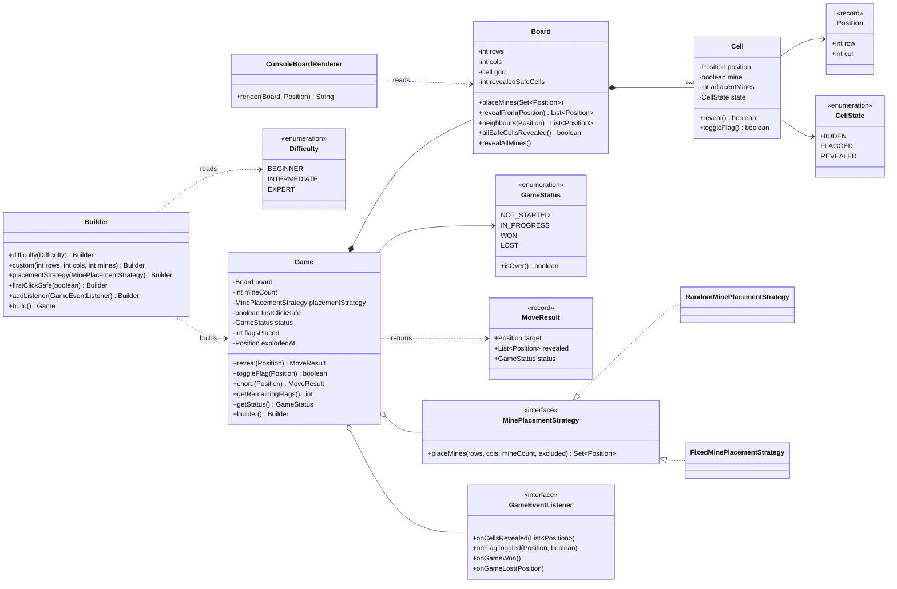
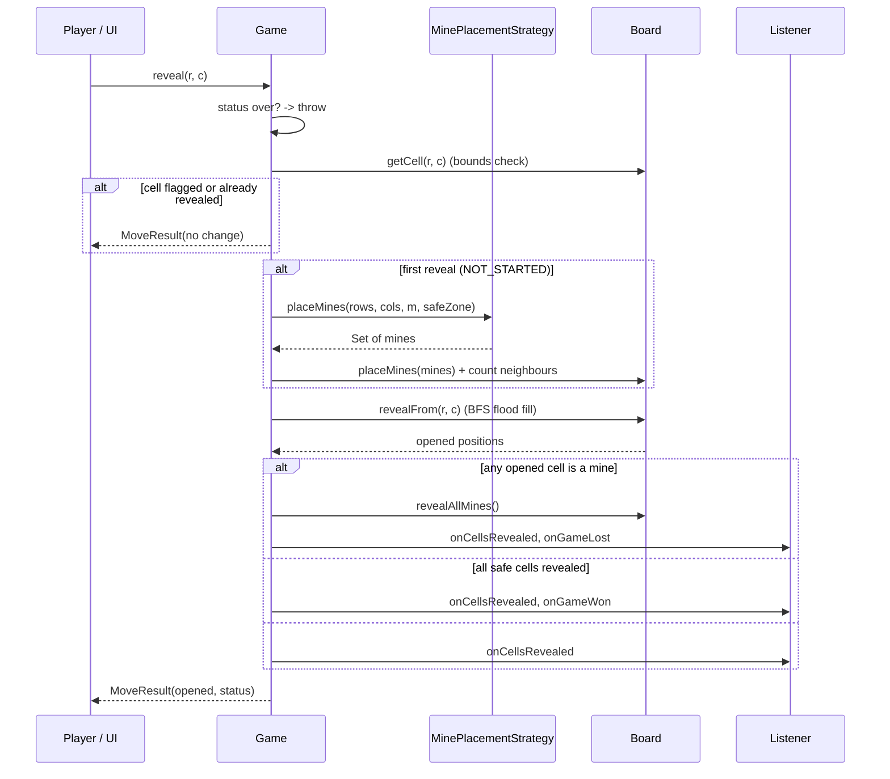
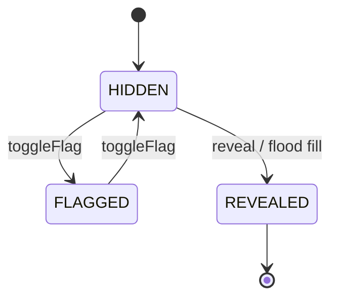

# 💣 Design Minesweeper — Low Level Design (Java)


> A grid game that looks simple but hides three classic interview traps: **flood fill without
> stack overflow**, **first-click safety**, and **cheap win detection**. Solved end-to-end the way
> you'd do it in a 45-minute LLD round: **clarify → entities → classes → patterns → code → test → extend**.

Minesweeper is a single-player puzzle on a rectangular grid. Some cells hide mines. The player
**reveals** cells one at a time: a safe cell shows how many of its 8 neighbours are mines, and a
cell with **0** automatically opens all its neighbours. The player can **flag** cells they believe
are mines. Reveal a mine and you lose; reveal every safe cell and you win.

> 📚 **Credit:** Problem inspired by
> [AlgoMaster — Design Minesweeper](https://algomaster.io/learn/lld/design-minesweeper) (premium
> lesson, **not** accessed). Everything here is my own original work, designed from the publicly
> known rules of the game. See [References & Credits](#-references--credits).

---

## 📑 On this page

1. [Scoping the Problem](#1-scoping-the-problem)
2. [Finding the Building Blocks](#2-finding-the-building-blocks)
3. [Object Model](#3-object-model)
   - [3.1 Class Responsibilities](#31-class-responsibilities)
   - [3.2 Patterns in Play](#32-patterns-in-play)
   - [3.3 UML Diagrams](#33-uml-diagrams)
   - [Practice Round](#-practice-round)
4. [Implementation Walkthrough](#4-implementation-walkthrough)
5. [Build, Run & Verify](#5-build-run--verify)
6. [Follow-up Scenarios](#6-follow-up-scenarios)
   - [6.1 A Safe First Click](#61-a-safe-first-click)
   - [6.2 Chording (Opening Around a Number)](#62-chording-opening-around-a-number)
   - [6.3 Difficulty Presets and Custom Boards](#63-difficulty-presets-and-custom-boards)
7. [Last-Minute Revision](#7-last-minute-revision)
8. [References & Credits](#-references--credits)

---

## 1. Scoping the Problem

Before drawing a single class, pin down the rules. Minesweeper has several variants, and each
answer changes the design.

### 🗣️ Sample conversation

| Candidate asks | Interviewer answers | Design impact |
|---|---|---|
| Fixed board size or configurable? | Support Beginner / Intermediate / Expert **and** custom sizes. | `Difficulty` enum + `custom(rows, cols, mines)` in a Builder. |
| Who places the mines? | Random, but I'd like to test it. | `MinePlacementStrategy`: random in prod, fixed in tests. |
| Can the first click be a mine? | No. The first click must be safe. | Place mines **lazily**, after the first reveal. |
| What happens on a cell with 0 neighbouring mines? | Open all neighbours, recursively. | Flood fill. Must handle huge boards. |
| Can players flag cells? Is there a counter? | Yes, and show "mines left". | `CellState.FLAGGED`, `remainingFlags = mines − flags`. |
| Can a flagged cell be revealed by accident? | No. Flags protect cells, even from flood fill. | Reveal and flood fill skip flagged cells. |
| How do you win? | Every non-mine cell revealed. Flags don't matter. | Counter of revealed safe cells, O(1) check. |
| Multiplayer? Timer? Leaderboard? | Out of scope; mention how you'd add them. | Observer hook for timers and stats. |
| UI? | Console is fine. Keep the model UI-agnostic. | Separate `ConsoleBoardRenderer`. |

### ✅ Functional requirements

1. Create a game from a preset difficulty or a custom `rows × cols` board with `m` mines.
2. **Reveal** a cell:
   - mine → game **lost**, all mines are shown;
   - number `1–8` → only that cell opens;
   - `0` → the empty region and its numbered border open automatically.
3. **Flag / unflag** a hidden cell. Flagged cells can't be revealed.
4. Show the number of mines left (`mines − flags`).
5. The **first reveal is never a mine** (and ideally opens a region).
6. **Win** when all safe cells are revealed.
7. No moves are accepted after the game ends.

### ⚙️ Non-functional requirements

- **Scales** to large custom boards: no recursion depth limits, O(1) win check.
- **Testable**: mine positions can be fixed for tests.
- **UI-agnostic**: the same engine can drive a console, Swing, or a web front-end.
- **Extensible**: new actions (chord), rules and listeners without rewriting the core.

---

## 2. Finding the Building Blocks

Go through the requirements and list the nouns. Keep the ones that have **state** or **behaviour**.

| Candidate | Keep? | Reasoning |
|---|---|---|
| **Game** | ✅ class | Owns status, applies rules, exposes player actions. |
| **Board** | ✅ class | Grid geometry, neighbours, mine layout, flood fill. |
| **Cell** | ✅ class | Unlike Snake & Ladder, a cell here *has real state*: mine?, count, hidden/flagged/revealed. |
| **Position** | ✅ record | `(row, col)` value object, a hashable key for sets. |
| **Cell state** | ✅ enum | `HIDDEN`, `FLAGGED`, `REVEALED`, with legal transitions. |
| **Game status** | ✅ enum | `NOT_STARTED → IN_PROGRESS → WON / LOST`. |
| **Difficulty** | ✅ enum | Presets: 9×9/10, 16×16/40, 16×30/99. |
| **Mine placement** | ✅ interface | Randomness must be swappable. |
| **Move result** | ✅ record | What changed in a move, so UIs redraw only those cells. |
| **Player** | ❌ | Single player with no state of their own. Add it only for multiplayer or leaderboards. |
| **Mine** | ❌ | It's just a boolean on `Cell`. A separate class adds nothing. |
| **Timer** | ❌ (for now) | Belongs in a listener. See follow-ups. |

> 💡 **Interview tip:** Contrast this with Snake & Ladder, where `Cell` was *not* worth a class.
> The rule is the same in both problems: **model it as a class only if it has state or behaviour**.

---

## 3. Object Model

### 3.1 Class Responsibilities

#### Record — `Position`
```java
public record Position(int row, int col) { }
```
Immutable, with `equals`/`hashCode` for free, so it works safely in a `Set<Position>`.

#### Enum — `CellState`
```
HIDDEN  ⇄ FLAGGED        (toggleFlag)
HIDDEN  → REVEALED        (reveal; terminal)
```

#### `Cell`
| Member | Purpose |
|---|---|
| `boolean mine` | Is there a mine here? |
| `int adjacentMines` | Pre-computed count of the 8 neighbours (0–8). |
| `CellState state` | What the player sees. |
| `reveal()` / `toggleFlag()` | Enforce the legal transitions. Return `false` when nothing changes. |

#### `Board`
| Member | Purpose |
|---|---|
| `Cell[][] grid` | The cells. A 2-D array gives O(1) access by `(row, col)`. |
| `placeMines(Set<Position>)` | Sets the mines once, then pre-computes every neighbour count. |
| `revealFrom(Position)` | **Iterative BFS** flood fill. Returns every opened position. |
| `neighbours(Position)` | Up to 8 in-bounds neighbours. |
| `revealedSafeCells` | Counter that makes the win check O(1). |
| `allSafeCellsRevealed()` | `revealedSafeCells == rows × cols − mines`. |

The board knows **geometry**, not **rules**: it never decides who won.

#### Interface — `MinePlacementStrategy`
```java
Set<Position> placeMines(int rows, int cols, int mineCount, Set<Position> excluded);
```
- `RandomMinePlacementStrategy`: partial **Fisher–Yates** shuffle, optional seed.
- `FixedMinePlacementStrategy`: exact positions for tests and demos.

#### `Game` (+ nested `Builder`)
| Member | Purpose |
|---|---|
| `reveal(pos)` → `MoveResult` | Main action. Starts the game on the first call. |
| `toggleFlag(pos)` → `boolean` | Flag/unflag. Updates the "mines left" counter. |
| `chord(pos)` → `MoveResult` | Open the neighbours around a satisfied number ([6.2](#62-chording-opening-around-a-number)). |
| `GameStatus status` | Lifecycle. Any move after `WON`/`LOST` throws `InvalidMoveException`. |
| `getRemainingFlags()` | `mines − flagsPlaced`. Can go negative, as in the original game. |
| `List<GameEventListener>` | Observers. |

#### Interface — `GameEventListener`
`onCellsRevealed`, `onFlagToggled`, `onGameWon`, `onGameLost`, all `default` no-ops.

#### `ConsoleBoardRenderer`
Converts a `Board` to text. Keeping it separate means `Cell` never contains `System.out` or display characters.

### 3.2 Patterns in Play

| Pattern | Where | Why here |
|---|---|---|
| **Builder** | `Game.builder().difficulty(...).placementStrategy(...).build()` | Presets vs custom sizes, optional strategy, safety flag, listeners. Validates once. |
| **Facade** | `Game.reveal / toggleFlag / chord` | Callers never touch flood fill, counters or mine placement. |
| **Strategy** | `MinePlacementStrategy` | Random vs fixed vs (future) "no-guess" boards. The key to deterministic tests. |
| **Observer** | `GameEventListener` | Timer, sounds, stats and web sockets plug in without changing `Game`. |
| **State (enum-based)** | `CellState`, `GameStatus` | Each cell guards its own transitions. `GameStatus.isOver()` gates every move. |
| **Value Object** | `Position`, `MoveResult` records | Immutable, hashable, safe to share. |

**SOLID mapping**

- **S**: `Cell` handles state transitions, `Board` handles geometry and flood fill, `Game` handles rules, the renderer handles display.
- **O**: new placement strategies and listeners are added as new classes.
- **L**: any `MinePlacementStrategy` can be substituted.
- **I**: listeners implement only the events they care about (`default` methods).
- **D**: `Game` depends on the `MinePlacementStrategy` abstraction.

### 3.3 UML Diagrams

**Class diagram**



**What happens on `reveal()`**



**Cell lifecycle**



### 🧠 Practice Round

Try these yourself before looking at the solution code (about 15 minutes each):

1. **Question marks**: add a third toggle state `?`. Which class(es) change? *(Hint: only `CellState` and `Cell.toggleFlag()`.)*
2. **Timer and best times**: record elapsed time per difficulty. *(Hint: a listener that starts on the first `onCellsRevealed` and stops on win/lose.)*
3. **Show wrong flags on loss**: mark flags placed on safe cells with a special symbol. Where does that logic belong?
4. **Hint button**: reveal one guaranteed-safe cell. What information does `Board` need to expose?
5. **Undo**: allow undoing the last reveal (not after a loss). *(Hint: `MoveResult.revealed` is exactly the list you'd need to re-hide.)*
6. **Multiplayer race**: two players on separate boards with the same seed. What can be shared?

<details>
<summary>💡 Hints for #2</summary>

```java
class TimerListener implements GameEventListener {
    private Instant start; private Duration elapsed;
    public void onCellsRevealed(List<Position> p) { if (start == null) start = Instant.now(); }
    public void onGameWon()  { elapsed = Duration.between(start, Instant.now()); }
    public void onGameLost(Position p) { elapsed = Duration.between(start, Instant.now()); }
}
```
`Game` doesn't change at all. That's the payoff of the Observer pattern.
</details>

<details>
<summary>💡 Hints for #4</summary>

A cell is guaranteed safe if it's hidden, not flagged, and not a mine. That's trivial for the
engine to find, since it knows where the mines are. The interesting part is deciding whether the hint
should reveal a cell the player *could have deduced*. That needs a constraint solver, which is a good
discussion point but out of scope for a 45-minute round.
</details>

---

## 4. Implementation Walkthrough

### 📁 Project structure

```
Minesweeper/
├── pom.xml
├── README.md
└── src
    ├── main/java/com/lld/games/minesweeper
    │   ├── MinesweeperApp.java                  # interactive console entry point
    │   ├── model/
    │   │   ├── Position.java                    # record (row, col)
    │   │   ├── CellState.java                   # HIDDEN / FLAGGED / REVEALED
    │   │   └── Cell.java                        # mine?, count, state transitions
    │   ├── board/
    │   │   ├── Board.java                       # grid, neighbours, BFS flood fill
    │   │   └── placement/
    │   │       ├── MinePlacementStrategy.java
    │   │       ├── RandomMinePlacementStrategy.java
    │   │       └── FixedMinePlacementStrategy.java
    │   ├── game/
    │   │   ├── Game.java                        # facade + builder
    │   │   ├── GameStatus.java
    │   │   ├── Difficulty.java
    │   │   └── MoveResult.java
    │   ├── listener/GameEventListener.java
    │   ├── render/ConsoleBoardRenderer.java
    │   └── exception/InvalidMoveException.java
    └── test/java/com/lld/games/minesweeper
        ├── GameTest.java
        └── BoardTest.java
```

### 🌊 Flood fill: iterative BFS, not recursion

```java
public List<Position> revealFrom(Position start) {
    List<Position> revealed = new ArrayList<>();
    Deque<Position> queue = new ArrayDeque<>();

    if (revealOne(start)) {                 // false if flagged or already open
        revealed.add(start);
        queue.add(start);
    }
    while (!queue.isEmpty()) {
        Position current = queue.poll();
        Cell cell = getCell(current);
        if (cell.isMine() || cell.getAdjacentMines() > 0) {
            continue;                        // numbers are the border of the region
        }
        for (Position n : neighbours(current)) {
            if (revealOne(n)) {              // each cell enters the queue at most once
                revealed.add(n);
                queue.add(n);
            }
        }
    }
    return revealed;
}
```

> ⚠️ **Why not recursion?** A recursive DFS on a 1000×1000 board with almost no mines can go
> ~10⁶ frames deep and throw `StackOverflowError`. The test `floodFillOnHugeEmptyBoardDoesNotOverflowStack`
> proves the BFS version handles it. Revealing a cell *before* enqueueing it means each cell is
> processed once, so the fill is **O(cells opened)**.

### 🎯 Reveal, with lazy mine placement

```java
public MoveResult reveal(Position p) {
    Cell cell = playableCell(p);                 // throws if game over / out of bounds
    if (!cell.isHidden()) {
        return MoveResult.noChange(p, status);   // flagged or already open
    }
    if (status == GameStatus.NOT_STARTED) {
        start(p);                                // mines placed NOW, avoiding p
    }
    return afterReveal(p, board.revealFrom(p));
}

private MoveResult afterReveal(Position target, List<Position> opened) {
    Optional<Position> mine = opened.stream().filter(p -> board.getCell(p).isMine()).findFirst();
    if (mine.isPresent()) {
        status = GameStatus.LOST;
        explodedAt = mine.get();
        board.revealAllMines();
    } else if (board.allSafeCellsRevealed()) {   // O(1) counter comparison
        status = GameStatus.WON;
    }
    // ... notify listeners ...
    return new MoveResult(target, opened, status);
}
```

### 🎲 Random placement: partial Fisher–Yates

```java
List<Position> candidates = /* every cell not in `excluded` */;
for (int i = 0; i < mineCount; i++) {
    int j = i + random.nextInt(candidates.size() - i);
    Collections.swap(candidates, i, j);
}
return new HashSet<>(candidates.subList(0, mineCount));
```

"Pick a random cell, retry if it's taken" is simpler but gets slow on dense boards, and its
running time has no fixed upper bound. The shuffle is **always O(rows × cols)**.

### 🏗️ Wiring it together

```java
Game game = Game.builder()
        .difficulty(Difficulty.INTERMEDIATE)                 // or .custom(20, 40, 150)
        .placementStrategy(new RandomMinePlacementStrategy(42L))
        .addListener(new GameEventListener() {
            @Override public void onGameLost(Position p) { System.out.println("BOOM at " + p); }
        })
        .build();

game.reveal(8, 8);          // always safe, usually opens an area
game.toggleFlag(0, 0);
game.chord(3, 4);
```

👉 Browse the full source in [`src/main/java`](src/main/java/com/lld/games/minesweeper).

### ⏱️ Complexity

| Operation | Time | Space |
|---|---|---|
| Place mines + neighbour counts | O(R·C) | O(R·C) |
| `reveal` on a number | O(1) | O(1) |
| `reveal` on a zero (flood fill) | O(k), k = cells opened | O(k) queue |
| `toggleFlag` | O(1) | O(1) |
| `chord` | O(8 + k) | O(k) |
| Win check | **O(1)** (counter) | O(1) |

> Naive win check = scan all R·C cells after every move. The counter turns it into a comparison.

---

## 5. Build, Run & Verify

### Prerequisites
- JDK **17+**
- Maven 3.8+ (optional; plain `javac` works too)

### With Maven

```bash
cd Games-and-Puzzles/Minesweeper
mvn test                                              # 76 tests
mvn compile exec:java -Dexec.args="BEGINNER 42"       # play: difficulty + optional seed
```

### Without Maven (plain JDK)

```bash
cd Games-and-Puzzles/Minesweeper
javac -d out $(find src/main -name "*.java")
java -cp out com.lld.games.minesweeper.MinesweeperApp EXPERT
```

### Commands

| Command | Action |
|---|---|
| `r <row> <col>` | reveal |
| `f <row> <col>` | flag / unflag |
| `c <row> <col>` | chord |
| `q` | quit |

Legend: `#` hidden · `F` flag · `.` empty · `1–8` count · `*` mine · `X` the mine you hit

### Sample session (BEGINNER, seed 42)

```
Minesweeper BEGINNER (9x9, 10 mines)
Commands: r <row> <col> | f <row> <col> | c <row> <col> | q

Mines left: 10 > r 4 4
Opened 18 cell(s)

  0 1 2 3 4 5 6 7 8
0 # # # 1 . 1 # # #
1 # # # 1 . 1 # # #
2 # # # 1 . 2 # # #
3 # # # 1 . 1 # # #
4 # # # 1 . 1 # # #
5 # # # 1 1 1 # # #
6 # # # # # # # # #
7 # # # # # # # # #
8 # # # # # # # # #

Mines left: 10 > f 99 0
! Position (99,0) is outside the 9x9 board
...
Mines left: 9 > r 1 1
Opened 1 cell(s)
*** BOOM at (1,1). Game over. ***

  0 1 2 3 4 5 6 7 8
0 # F * 1 . 1 # # #
1 # X # 1 . 1 * 2 #
2 * # # 1 . 2 # # *
3 1 2 * 1 . 1 * 2 1
4 . 1 # 1 . 1 1 1 .
5 . 1 # 1 1 1 1 . .
6 . 1 * # # * 2 . .
7 . 1 1 1 2 * 2 . .
8 . . . . 1 # 1 . .
Final status: LOST
```

### ✅ What the tests cover

| Test | Verifies |
|---|---|
| `revealingZeroFloodFillsAndCanWinInOneClick` | Flood fill + win detection. |
| `floodFillStopsAtNumberedCells` | Numbers form the region border. |
| `revealingNumberOpensOnlyThatCell` | No flood from a number. |
| `revealingMineLosesAndShowsAllMines` | Loss, `explodedAt`, mines revealed. |
| `flaggedCellCannotBeRevealed` / `floodFillDoesNotOpenFlaggedCells` | Flags protect cells. |
| `toggleFlagUpdatesRemainingCounter` / `revealedCellCannotBeFlagged` | Flag rules + counter. |
| `chordWithCorrectFlagsOpensNeighbours` / `…WrongFlagLoses` / `…WithoutEnoughFlagsDoesNothing` | Chording. |
| `firstClickIsAlwaysSafeAndOpensARegion` (×50, Expert) | First-click safety zone. |
| `firstClickSafeOnDenseBoardProtectsAtLeastTheClickedCell` | Safety fallback on a crowded board. |
| `movesAfterGameOverAreRejected` / `outOfBoundsMoveIsRejected` | Guard rails. |
| `listenersReceiveEvents` | Observer order: flag → revealed → won. |
| `builderValidatesMineCount` / `strategyReturningWrongCountIsDetected` | Config validation. |
| `seededGamesAreReproducible` | Same seed, same board. |
| `adjacentCountsAreComputed` / `neighboursRespectEdges` | Board geometry. |
| `floodFillOnHugeEmptyBoardDoesNotOverflowStack` | 1 000 000-cell BFS. |
| `cellStateTransitions` | Every legal/illegal transition. |
| `randomPlacementRespectsCountAndExclusions` / `…RejectsTooManyMines` | Strategy correctness. |
| `rendererShowsEachSymbol` | Console output. |

---

## 6. Follow-up Scenarios

### 6.1 A Safe First Click

**Ask:** "The first click should never lose, and preferably open an area."

**Approach: lazy mine placement.** Don't place mines when the game is created. Place them on the
**first reveal**, excluding the clicked cell *and its neighbours*:

```java
private void start(Position firstClick) {
    Set<Position> safeZone = new HashSet<>();
    if (firstClickSafe) {
        safeZone.add(firstClick);
        safeZone.addAll(board.neighbours(firstClick));
        if (board.getRows() * board.getCols() - safeZone.size() < mineCount) {
            safeZone = Set.of(firstClick);      // crowded board: protect just the click
        }
    }
    board.placeMines(placementStrategy.placeMines(rows, cols, mineCount, safeZone));
    status = GameStatus.IN_PROGRESS;
}
```

Why exclude the neighbours too? If only the clicked cell is safe, the first click usually shows a
lone number and the player has to guess. Excluding the 3×3 block makes the first cell a `0`, so it
always opens a region.

> 🗣️ **Alternative to mention:** place mines at construction time, and on a first-click hit *move*
> that mine to the first free cell. It works, but the counts must be recomputed and the distribution
> is less uniform. Lazy placement is cleaner.

### 6.2 Chording (Opening Around a Number)

**Ask:** "Experienced players click a number whose mines are all flagged, to open the rest at once."

```java
public MoveResult chord(Position p) {
    Cell cell = playableCell(p);
    if (!cell.isRevealed() || cell.getAdjacentMines() == 0) return MoveResult.noChange(p, status);
    long flags = board.neighbours(p).stream().filter(n -> board.getCell(n).isFlagged()).count();
    if (flags != cell.getAdjacentMines()) return MoveResult.noChange(p, status);

    List<Position> opened = new ArrayList<>();
    for (Position n : board.neighbours(p)) {
        if (board.getCell(n).isHidden()) opened.addAll(board.revealFrom(n));   // may flood
    }
    return afterReveal(p, opened);   // same win/lose logic as reveal. A wrong flag means BOOM.
}
```

Because the win/lose logic lives in one private method (`afterReveal`), the new action reuses it
without duplicating code.

### 6.3 Difficulty Presets and Custom Boards

**Ask:** "Add the standard levels, but let power users choose any size."

```java
public enum Difficulty {
    BEGINNER(9, 9, 10), INTERMEDIATE(16, 16, 40), EXPERT(16, 30, 99);
}

Game.builder().difficulty(Difficulty.EXPERT);   // preset
Game.builder().custom(30, 50, 300);             // anything else
```

`difficulty(d)` simply delegates to `custom(d.rows, d.cols, d.mines)`, so there is one code path.
The builder rejects `mines < 1` or `mines ≥ rows × cols` (there must be at least one safe cell).

### 🚀 More follow-ups to practice

| Follow-up | Design move |
|---|---|
| Timer / best-time leaderboard | `TimerListener` + `LeaderboardService` keyed by `Difficulty`. |
| "No-guess" boards | New `MinePlacementStrategy` that regenerates until a solver can finish without guessing. |
| Hexagonal or wrap-around grid | Extract a `Topology` interface for `neighbours()`. `Board` delegates to it. |
| Save / resume | Persist the seed, first click and move list, then replay them (deterministic). |
| Undo | Command pattern: each move stores the positions it opened; undo re-hides them. |
| Web / REST version | `GameService` with `Map<gameId, Game>`, `POST /games/{id}/reveal`, one lock per game. |
| Multiplayer | Same seed per player, separate `Game` instances, shared scoreboard listener. |

---

## 7. Last-Minute Revision

```
1. Clarify    → sizes/presets? first-click safe? flags? chord? win rule? UI?
2. Entities   → Game, Board, Cell, Position, CellState, GameStatus, Difficulty, MinePlacementStrategy
3. Key calls  → Cell IS a class here (has state); neighbour counts pre-computed once
4. Algorithms → BFS flood fill (no recursion); partial Fisher–Yates; O(1) win counter
5. Patterns   → Builder, Facade, Strategy (placement), Observer (events), enum-based State
6. Gotchas    → lazy mine placement for first-click safety; flags block flood fill;
                chord can lose; moves after game over must throw
7. Testing    → FixedMinePlacementStrategy + firstClickSafe(false) = fully deterministic
```

---

## 📚 References & Credits

| Resource | How it was used |
|---|---|
| [AlgoMaster.io — Design Minesweeper (LLD)](https://algomaster.io/learn/lld/design-minesweeper) | Inspiration for the **problem choice** only. The lesson is premium and was **not** accessed. |
| [Minesweeper (video game) — Wikipedia](https://en.wikipedia.org/wiki/Minesweeper_(video_game)) | Publicly known game rules and the standard difficulty presets. |
| [Mermaid](https://mermaid.js.org/) | Class, sequence and state diagrams rendered by GitHub. |
| [JUnit 5 User Guide](https://junit.org/junit5/docs/current/user-guide/) | Unit testing. |

**Originality statement**

- This repository is a **personal learning project** for LLD interview preparation.
- The AlgoMaster lesson is premium content that I have not accessed. No text, code, diagrams,
  headings or other material from it (or any paid source) is reproduced here.
- All headings, source code, explanations, tables, diagrams, tests and exercises were written independently from the public rules of the game.
- This project is **not affiliated with or endorsed by** AlgoMaster.io. "AlgoMaster" is the
  property of its respective owner.
- For the original lesson, please support the author at [algomaster.io](https://algomaster.io).

---

> ⭐ Try the Practice Round before reading the code, then compare your design with this one.
