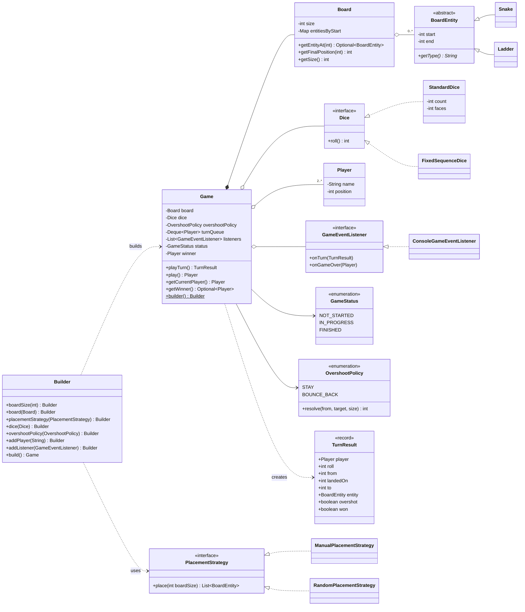
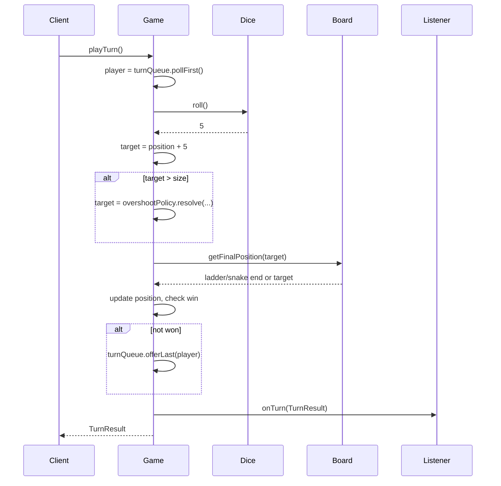

# 🐍🪜 Design Snake and Ladder Game — Low Level Design (Java)


> A classic LLD interview question, solved end-to-end the way you'd do it in a 45-minute
> product-company round: **clarify → entities → classes → patterns → code → test → extend**.

Snake and Ladder is a turn-based board game played on a numbered grid (usually 10×10, cells 1–100).
Players take turns rolling a die and move forward by the rolled value. Landing on the **bottom of a
ladder** lifts you up; landing on the **head of a snake** drags you down. The first player to land
**exactly** on the last cell wins.

> 📚 **Credit:** The section outline of this README follows the publicly listed table of contents
> of [AlgoMaster — Design Snake and Ladder Game](https://algomaster.io/learn/lld/design-snake-and-ladder).
> All explanations, code, diagrams, tests and exercises here are my own original work written for
> personal learning. See [References & Credits](#-references--credits).

---

## 📑 On this page

1. [Clarifying Requirements](#1-clarifying-requirements)
2. [Identifying Core Entities](#2-identifying-core-entities)
3. [Designing Classes and Relationships](#3-designing-classes-and-relationships)
   - [3.1 Class Definitions](#31-class-definitions)
   - [3.2 Key Design Patterns](#32-key-design-patterns)
   - [3.3 Full Class Diagram](#33-full-class-diagram)
   - [Try It Yourself (Exercise)](#-try-it-yourself-exercise)
4. [Code Implementation](#4-code-implementation)
5. [Run and Test](#5-run-and-test)
6. [Extensions](#6-extensions)
   - [6.1 Configurable Dice Count](#61-configurable-dice-count)
   - [6.2 Configurable Board Size and Placement Strategy](#62-configurable-board-size-and-placement-strategy)
7. [Interview Cheat Sheet](#7-interview-cheat-sheet)
8. [References & Credits](#-references--credits)

---

## 1. Clarifying Requirements

In an interview, **never start coding immediately**. Spend the first 3–5 minutes asking questions
that shrink the problem and surface hidden rules.

### 🗣️ Sample conversation

| Candidate asks | Interviewer answers | Design impact |
|---|---|---|
| How big is the board? Always 100? | Default 10×10, but keep it configurable. | `boardSize` is a parameter, not a constant. |
| Who places snakes & ladders? | Configurable; random placement is a nice-to-have. | `PlacementStrategy` interface. |
| How many players? | 2 or more. | Turn queue, not a fixed pair. |
| How many dice? | One six-sided die by default. | `Dice` abstraction; count configurable later. |
| What if a roll overshoots the last cell? | Player must land **exactly**; otherwise stays. | Overshoot rule lives in one place. |
| Can a snake's tail land on a ladder (chains)? | Keep it simple — no chains. | Board validates: no entity ends where another starts. |
| Extra turn on a 6? Three 6s = forfeit? | Out of scope for now. | Mentioned as an extension. |
| Is it a UI / multiplayer network game? | No — model the core game engine. | Console demo + event listener hook. |
| Does the game end at the first winner? | Yes. | `GameStatus.FINISHED` after first winner. |

### ✅ Functional requirements

1. The board has `N` cells numbered `1..N` (default `N = 100`).
2. The board contains **snakes** (head → lower tail) and **ladders** (bottom → higher top).
3. Support **2+ players**; everyone starts off-board at position `0`.
4. Players take turns in a fixed round-robin order.
5. On each turn a player rolls the dice and moves forward by the rolled value.
6. Landing on a snake head / ladder bottom moves the player to its tail / top.
7. A player must land **exactly** on cell `N` to win; an overshooting roll doesn't move them.
8. The game ends as soon as one player wins.

### ⚙️ Non-functional requirements

- **Extensible** — new entity types (portals), dice types, rules or UIs without rewriting the core.
- **Testable** — deterministic dice so every rule can be unit-tested.
- **Valid by construction** — an illegal board (snake on the last cell, loops…) must never be created.
- **Readable** — interview-sized: small classes, single responsibility each.

---

## 2. Identifying Core Entities

A reliable technique: **underline the nouns** in the requirements, then keep the ones that have
state or behavior.

> "The **board** has **cells**… contains **snakes** and **ladders**… **players** take turns…
> roll the **dice**… the **game** ends when one player wins."

| Noun | Keep? | Why |
|---|---|---|
| **Game** | ✅ class | Orchestrates turns, owns status & winner. |
| **Board** | ✅ class | Size + fast lookup "where does cell X lead?". |
| **Snake**, **Ladder** | ✅ classes | Both are "jump from A to B" → share a parent **`BoardEntity`**. |
| **Player** | ✅ class | Name + current position. |
| **Dice** | ✅ interface | Randomness must be swappable for tests. |
| **Cell** | ❌ | A cell has no behavior of its own — an `int` + a `Map` lookup is enough. |
| **Game status** | ✅ enum | `NOT_STARTED → IN_PROGRESS → FINISHED`. |
| **Turn** | ✅ record | `TurnResult` — an immutable snapshot of what happened, for UI/logging. |

> 💡 **Interview tip:** Saying *"I'm deliberately not creating a `Cell` class because it has no
> behavior"* shows judgment. Over-modeling is as bad as under-modeling.

---

## 3. Designing Classes and Relationships

### 3.1 Class Definitions

#### Enum — `GameStatus`
```java
public enum GameStatus { NOT_STARTED, IN_PROGRESS, FINISHED }
```
Makes illegal actions explicit (e.g. `playTurn()` after `FINISHED` throws).

#### Enum — `OvershootPolicy`
`STAY` (classic) or `BOUNCE_BACK`. Each constant carries its own `resolve()` logic —
the **enum-as-strategy** idiom. See [why it exists](#61-configurable-dice-count).

#### Abstract class — `BoardEntity`
| Member | Purpose |
|---|---|
| `int start`, `int end` | Where the jump begins and ends. |
| `abstract String getType()` | "Snake" / "Ladder" for logs & events. |

Subclasses validate direction in their constructors:
- **`Snake(head, tail)`** → requires `tail < head`
- **`Ladder(bottom, top)`** → requires `top > bottom`

> Why an abstract class and not two unrelated classes? The `Board` and `Game` treat both the same
> way (`start → end`). Adding a `Portal` tomorrow = one new subclass, **zero** changes elsewhere
> (**Open/Closed Principle**).

#### `Player`
| Member | Purpose |
|---|---|
| `String name` | Identity (unique per game). |
| `int position` | `0` = not yet on the board. |

#### `Board`
| Member | Purpose |
|---|---|
| `int size` | Number of cells. |
| `Map<Integer, BoardEntity> entitiesByStart` | **O(1)** lookup of the jump at a cell. |
| `getFinalPosition(int cell)` | Where you end up after landing on `cell`. |
| `getEntityAt(int cell)` | The snake/ladder at that cell, if any. |

Constructor enforces invariants — the board is **valid by construction**:
1. Entities start strictly between `1` and `N`, end inside `[1, N]`.
2. At most one entity starts per cell.
3. No entity ends where another starts → **no chains, therefore no infinite loops**.

#### Interface — `Dice`
```java
public interface Dice { int roll(); }
```
- `StandardDice(count, faces)` — real randomness, sums `count` dice.
- `FixedSequenceDice(int... values)` — deterministic, for tests & scripted demos.

#### Interface — `PlacementStrategy`
```java
public interface PlacementStrategy { List<BoardEntity> place(int boardSize); }
```
- `ManualPlacementStrategy` — explicit list (classic board).
- `RandomPlacementStrategy(snakes, ladders, seed)` — random but always valid, reproducible by seed.

#### Interface — `GameEventListener`
```java
default void onTurn(TurnResult result) {}
default void onGameOver(Player winner) {}
```
`ConsoleGameEventListener` prints a play-by-play. A GUI or WebSocket broadcaster would be another implementation.

#### `Game` (+ nested `Builder`)
| Member | Purpose |
|---|---|
| `Board board`, `Dice dice`, `OvershootPolicy` | Collaborators injected by the builder. |
| `Deque<Player> turnQueue` | Round-robin: poll front, move, offer back. |
| `GameStatus status`, `Player winner` | Lifecycle. |
| `List<GameEventListener> listeners` | Observers. |
| `playTurn()` → `TurnResult` | One turn. |
| `play()` → `Player` | Loop turns until a winner. |

### 3.2 Key Design Patterns

| Pattern | Where | Why it matters here |
|---|---|---|
| **Builder** | `Game.builder()...build()` | Many optional parameters (size, dice, strategy, policy, listeners). Validation happens once in `build()`; no telescoping constructors. |
| **Facade** | `Game.play()` / `playTurn()` | Clients don't coordinate Board, Dice, Players and rules themselves. |
| **Strategy** | `Dice`, `PlacementStrategy`, `OvershootPolicy` | Swap randomness, board layout and end-game rule independently. Makes the game **testable**. |
| **Observer** | `GameEventListener` | Output/UI/analytics are decoupled from game logic. |
| **Inheritance + polymorphism** | `BoardEntity → Snake / Ladder` | Uniform handling of "jump" entities (Open/Closed). |

**SOLID mapping**

- **S** — `Board` knows geometry, `Game` knows turns, `Dice` knows randomness, listener knows output.
- **O** — new entity / dice / placement / listener = new class, no edits.
- **L** — any `Dice` or `BoardEntity` subtype works wherever the parent is expected.
- **I** — small interfaces (`Dice` has one method; listener methods are `default`).
- **D** — `Game` depends on `Dice` / `PlacementStrategy` abstractions, not concrete classes.

### 3.3 Full Class Diagram



**Turn sequence**



### 🧠 Try It Yourself (Exercise)

Before reading the code, close this page and try to design these on your own (15 min each):

1. **Bonus turn on a 6** — rolling the max value gives an extra turn; three maxes in a row forfeits
   the turn. *Hint: where does the turn queue get updated? Should this be a new strategy?*
2. **Rank all players** — continue until only one player is left, returning a leaderboard.
   *Hint: the winner simply isn't re-offered to the queue.*
3. **Portal entity** — a two-way teleport. *Hint: can you do it with only one new class?*
4. **Undo last move** — *Hint: `TurnResult` already stores `from`; think Command pattern.*
5. **Thread-safe online game** — multiple requests hit `playTurn()` concurrently. What do you lock?

<details>
<summary>💡 Hints for #1</summary>

Introduce a `TurnPolicy` interface with `boolean grantsExtraTurn(int roll, int consecutiveMax)`.
In `Game.playTurn()`, use `turnQueue.offerFirst(player)` instead of `offerLast` when an extra turn
is granted. Keep a per-player counter of consecutive max rolls.
</details>

<details>
<summary>💡 Hints for #5</summary>

Make `playTurn()` `synchronized` (or guard it with a `ReentrantLock`) — the critical section is the
whole "poll → roll → move → offer" sequence, not individual fields. Validate that the caller is
`getCurrentPlayer()` to reject out-of-turn moves.
</details>

---

## 4. Code Implementation

### 📁 Project structure

```
SnakeAndLadder/
├── pom.xml
├── README.md
└── src
    ├── main/java/com/lld/games/snakeandladder
    │   ├── SnakeAndLadderDemo.java          # entry point
    │   ├── model/
    │   │   ├── BoardEntity.java             # abstract start -> end
    │   │   ├── Snake.java
    │   │   ├── Ladder.java
    │   │   └── Player.java
    │   ├── board/
    │   │   ├── Board.java                   # size + O(1) jump lookup + validation
    │   │   └── placement/
    │   │       ├── PlacementStrategy.java
    │   │       ├── ManualPlacementStrategy.java
    │   │       └── RandomPlacementStrategy.java
    │   ├── dice/
    │   │   ├── Dice.java
    │   │   ├── StandardDice.java
    │   │   └── FixedSequenceDice.java
    │   ├── game/
    │   │   ├── Game.java                    # facade + builder
    │   │   ├── GameStatus.java
    │   │   ├── OvershootPolicy.java
    │   │   └── TurnResult.java
    │   ├── listener/
    │   │   ├── GameEventListener.java
    │   │   └── ConsoleGameEventListener.java
    │   └── exception/
    │       └── InvalidBoardException.java
    └── test/java/com/lld/games/snakeandladder
        ├── GameTest.java
        └── BoardTest.java
```

### 🔑 The heart of the game — `Game.playTurn()`

```java
public TurnResult playTurn() {
    if (status == GameStatus.FINISHED) {
        throw new IllegalStateException("Game is already over. Winner: " + winner.getName());
    }
    status = GameStatus.IN_PROGRESS;

    Player player = turnQueue.pollFirst();
    int roll = dice.roll();
    TurnResult result = move(player, roll);

    if (result.won()) {
        winner = player;
        status = GameStatus.FINISHED;
    } else {
        turnQueue.offerLast(player);          // round-robin
    }

    listeners.forEach(l -> l.onTurn(result)); // Observer
    if (result.won()) {
        listeners.forEach(l -> l.onGameOver(player));
    }
    return result;
}

private TurnResult move(Player player, int roll) {
    int from = player.getPosition();
    int target = from + roll;
    boolean overshot = target > board.getSize();

    if (overshot) {
        target = overshootPolicy.resolve(from, target, board.getSize());
    }

    BoardEntity entity = board.getEntityAt(target).orElse(null);
    int finalPosition = board.getFinalPosition(target);  // O(1) map lookup
    player.setPosition(finalPosition);

    boolean won = finalPosition == board.getSize();
    return new TurnResult(player, roll, from, target, finalPosition, entity, overshot, won);
}
```

### 🛡️ Board validation — invalid boards can't exist

```java
public Board(int size, Collection<? extends BoardEntity> entities) {
    ...
    for (BoardEntity entity : entities) {
        validateBounds(entity);                                        // 1 < start < size
        if (entitiesByStart.putIfAbsent(entity.getStart(), entity) != null) {
            throw new InvalidBoardException("Two entities start at cell " + entity.getStart());
        }
    }
    validateNoChains();                                                // no end == another start
}
```

### 🏗️ Wiring it together — the Builder

```java
Game game = Game.builder()
        .boardSize(100)
        .placementStrategy(new ManualPlacementStrategy(List.of(
                new Snake(17, 7), new Snake(98, 79),
                new Ladder(2, 38), new Ladder(28, 84))))
        .dice(new StandardDice())                     // 1 x d6
        .addPlayer("Alice")
        .addPlayer("Bob")
        .addListener(new ConsoleGameEventListener())
        .build();

Player winner = game.play();
```

👉 Browse the full source in [`src/main/java`](src/main/java/com/lld/games/snakeandladder).

### ⏱️ Complexity

| Operation | Time | Space |
|---|---|---|
| Build board | O(S + L) | O(S + L) |
| One turn | **O(1)** (dice count `k` → O(k)) | O(1) |
| Whole game | O(turns) | O(P) players |

---

## 5. Run and Test

### Prerequisites
- JDK **17+**
- Maven 3.8+ (optional — plain `javac` works too)

### With Maven

```bash
cd Games-and-Puzzles/SnakeAndLadder
mvn test                 # run the 40 unit tests
mvn compile exec:java    # run the demo
```

### Without Maven (plain JDK)

```bash
cd Games-and-Puzzles/SnakeAndLadder
javac -d out $(find src/main -name "*.java")
java -cp out com.lld.games.snakeandladder.SnakeAndLadderDemo
```

### Sample output

```
======================================================================
 Classic game: 100 cells, 1 die, fixed board
======================================================================
Alice    rolled  6 :   0 ->   6
Bob      rolled  4 :   0 ->   4  climbed Ladder(4 -> 14) -> 14
Charlie  rolled  6 :   0 ->   6
...
Bob      rolled  2 :  26 ->  28  climbed Ladder(28 -> 84) -> 84
Charlie  rolled  6 :  15 ->  21  climbed Ladder(21 -> 42) -> 42
...
Bob      rolled  2 :  85 ->  87  bitten by Snake(87 -> 36) -> 36
Alice    rolled  2 :  15 ->  17  bitten by Snake(17 -> 7) -> 7
...
>>> Charlie wins the game! <<<

======================================================================
 Extended game: 150 cells, 2 dice, random placement (seed 42)
======================================================================
...
Priya    rolled  9 : 142 -> 149 (bounced back)  bitten by Snake(149 -> 138) -> 138
...
>>> Dev wins the game! <<<
```

### ✅ What the tests cover

| Test | Verifies |
|---|---|
| `ladderMovesPlayerUp` / `snakeMovesPlayerDown` | Entity jumps. |
| `playersTakeTurnsInOrder` | Round-robin queue. |
| `overshootingLastCellKeepsPlayerInPlace` | Exact-landing rule (`STAY`). |
| `bounceBackPolicyReflectsExcessRoll` / `bounceBackCanLandOnSnake` | `BOUNCE_BACK` rule, incl. landing on a snake. |
| `exactRollWinsAndEndsGame` / `ladderToLastCellWins` | Win detection, no moves after `FINISHED`. |
| `listenersAreNotified` | Observer events and ordering. |
| `builderRejects…` | < 2 players, duplicate names. |
| `rejectsEntityOutsideBoard`, `…OnLastCell`, `…SameCell`, `…Chained` | Board invariants. |
| `randomPlacementAlwaysProducesAValidBoard` (×20) | Random strategy never breaks invariants. |
| `randomPlacementIsReproducibleWithSeed` | Determinism with a seed. |
| `multipleDiceStayInRange` | `StandardDice(3, 6)` ∈ [3, 18]. |

> 🔑 **Testing insight:** `FixedSequenceDice` is the reason every rule is testable. If `Game` had
> called `new Random()` directly, none of these tests could be deterministic. That's the
> **Dependency Inversion Principle** paying off.

---

## 6. Extensions

Interviewers love *"Now what if…?"* follow-ups. A good design absorbs them with **new classes, not edits**.

### 6.1 Configurable Dice Count

**Ask:** "Play with 2 dice." → Already supported:

```java
Game.builder().dice(new StandardDice(2, 6))   // rolls 2..12
```

`StandardDice` sums `count` independent dice. `Game` doesn't change at all because it only knows
the `Dice` interface.

#### ⚠️ The hidden trap (great thing to mention in an interview)

With 2 dice the **minimum roll is 2**. Under the classic "must land exactly, else stay" rule, a
player sitting on cell `N-1` needs a `1` — which is **impossible**. They are stuck forever, and if
everyone gets stuck, **the game never ends**.

Fix: make the overshoot rule a strategy (simplified):

```java
public enum OvershootPolicy {
    STAY        { int resolve(int from, int target, int n) { return from; } },
    BOUNCE_BACK { int resolve(int from, int target, int n) { return Math.max(1, n - (target - n)); } };
}

Game.builder()
    .dice(new StandardDice(2, 6))
    .overshootPolicy(OvershootPolicy.BOUNCE_BACK)   // 149 + 3 on a 150 board -> 148
```

Bounce-back cells still go through `board.getFinalPosition(...)`, so you can bounce onto a snake. 🐍

### 6.2 Configurable Board Size and Placement Strategy

**Ask:** "Make the board 12×12 with random snakes and ladders."

```java
Game.builder()
    .boardSize(144)
    .placementStrategy(new RandomPlacementStrategy(10, 8, 42L))  // 10 snakes, 8 ladders, seed
```

How `RandomPlacementStrategy` stays valid:
- Picks two distinct cells in `[2, N-1]`; the higher one is a snake head / ladder top.
- Tracks every used cell (starts **and** ends) so no two entities touch → no duplicates, no chains.
- Gives up with `InvalidBoardException` after 1 000 attempts per entity (board too small).
- A **seed** makes boards reproducible for replays and tests.

Other strategies you could plug in without touching `Game`:

| Strategy | Idea |
|---|---|
| `DifficultyPlacementStrategy(EASY/HARD)` | More ladders on easy, long snakes near the end on hard. |
| `FilePlacementStrategy(path)` | Load a board from JSON/YAML. |
| `ClassicMiltonBradleyStrategy` | The historical board layout. |

### 🚀 More follow-ups to practice

| Follow-up | Design move |
|---|---|
| Extra turn on max roll | `TurnPolicy` strategy; `offerFirst` instead of `offerLast`. |
| Play until all but one finish | Keep a `List<Player> rankings`; don't re-queue finished players. |
| Power-ups / portals / mines | New `BoardEntity` subclasses. |
| Save / resume | Serialize `Board`, players' positions, queue order, dice seed. |
| Replay a game | Store the `List<TurnResult>` via a listener. |
| REST / multiplayer | Wrap `Game` in a Spring `GameService` keyed by `gameId`; `playTurn()` per request with a lock per game. |
| AI players | `Player` gets a `MoveDecider` if choices exist (e.g. choose which die to use). |

---

## 7. Interview Cheat Sheet

```
1. Clarify    → board size? #players? #dice? overshoot rule? chains? first winner ends?
2. Entities   → Game, Board, Player, Dice, BoardEntity(Snake, Ladder), GameStatus
3. Key call   → Map<Integer, BoardEntity> for O(1) jumps; no Cell class
4. Patterns   → Builder (setup), Facade (play), Strategy (dice/placement/overshoot), Observer (events)
5. Validation → no entity on 1 or N, one per cell, no chains → no infinite loops
6. Testing    → inject deterministic Dice
7. Gotcha     → multi-dice + exact landing = possible deadlock → BOUNCE_BACK
```

---

## 📚 References & Credits

| Resource | How it was used |
|---|---|
| [AlgoMaster.io — Design Snake and Ladder Game (LLD)](https://algomaster.io/learn/lld/design-snake-and-ladder) | Inspiration for the **order of topics** only (requirements → entities → classes → patterns → code → run & test → extensions), taken from the page's public table of contents. |
| [Mermaid — Class & Sequence diagrams](https://mermaid.js.org/) | Diagram syntax rendered natively by GitHub. |
| [JUnit 5 User Guide](https://junit.org/junit5/docs/current/user-guide/) | Unit testing. |

**Originality statement**

- This repository is a **personal learning project** for LLD interview preparation.
- No text, code, diagrams, images or premium/paywalled content from AlgoMaster.io (or any other
  source) has been copied or reproduced here. Only the high-level section headings — which describe
  a standard LLD interview approach — are used as a structural guide.
- All source code, explanations, tables, diagrams, tests and exercises were written independently.
- This project is **not affiliated with or endorsed by** AlgoMaster.io. "AlgoMaster" is the
  property of its respective owner.
- If you want the full original lesson, please support the author by visiting
  [algomaster.io](https://algomaster.io).

---

> ⭐ If this helped your preparation, star the repo and try the exercises above before peeking at the code!
