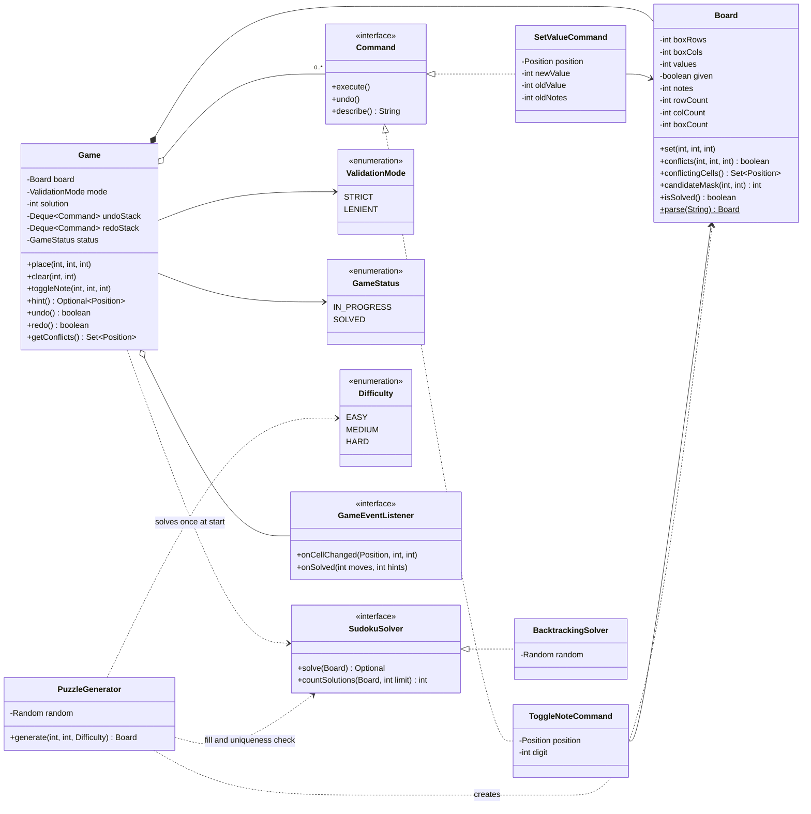
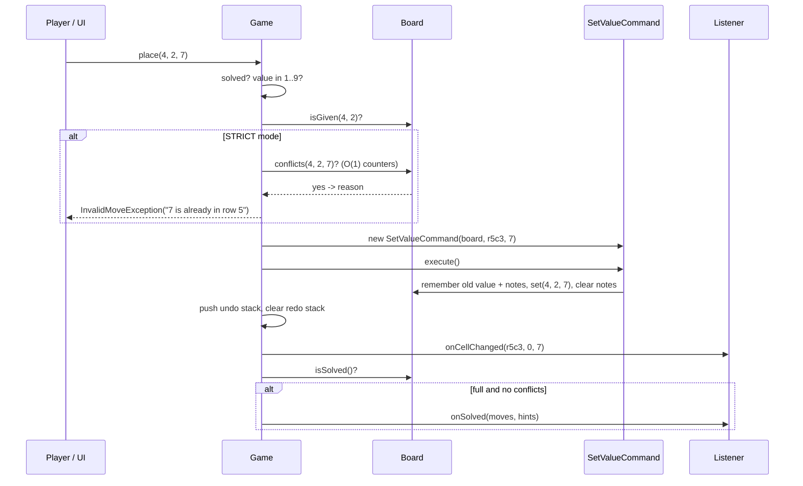
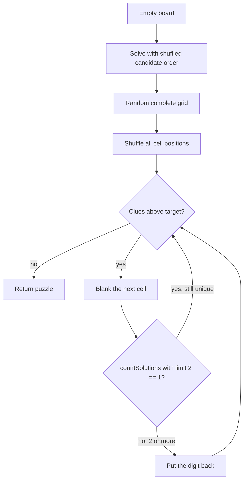

# 🔢 Design Sudoku — Low Level Design (Java)


> A puzzle rather than a two-player game, so the interesting parts are different: **O(1) rule
> checks**, **undo/redo**, a **solver** for hints, and a **generator** that guarantees exactly one
> solution. Solved end-to-end the way you'd do it in a 45–60 minute LLD round:
> **clarify → entities → classes → patterns → code → test → extend**.

Sudoku is played on a 9×9 grid divided into nine 3×3 boxes. Some cells start filled (the
**givens** or **clues**). The player fills the rest so that every **row**, every **column** and
every **box** contains each digit 1–9 exactly once. A well-formed puzzle has **one** solution.

> 📚 **Credit:** Problem inspired by
> [AlgoMaster — Design Sudoku](https://algomaster.io/learn/lld/design-sudoku) (premium lesson,
> **not** accessed). Everything here is my own original work based on the public rules of the
> game. See [References & Credits](#-references--credits).

---

## 📑 On this page

1. [Scoping the Problem](#1-scoping-the-problem)
2. [Finding the Building Blocks](#2-finding-the-building-blocks)
3. [Object Model](#3-object-model)
   - [3.1 Class Responsibilities](#31-class-responsibilities)
   - [3.2 Patterns in Play](#32-patterns-in-play)
   - [3.3 UML Diagrams](#33-uml-diagrams)
   - [Practice Round](#-practice-round)
4. [Implementation Walkthrough](#4-implementation-walkthrough)
5. [Build, Run & Verify](#5-build-run--verify)
6. [Follow-up Scenarios](#6-follow-up-scenarios)
   - [6.1 Undo and Redo with Commands](#61-undo-and-redo-with-commands)
   - [6.2 Solving: Backtracking, Bit Masks and MRV](#62-solving-backtracking-bit-masks-and-mrv)
   - [6.3 Generating Puzzles with a Unique Solution](#63-generating-puzzles-with-a-unique-solution)
7. [Last-Minute Revision](#7-last-minute-revision)
8. [References & Credits](#-references--credits)

---

## 1. Scoping the Problem

"Design Sudoku" can mean a **validator**, a **solver**, a **playable game** or a **generator**.
Ask which one before designing anything.

### 🗣️ Sample conversation

| Candidate asks | Interviewer answers | Design impact |
|---|---|---|
| Playable game, solver, or both? | A playable game; hints need a solver. | `Game` facade + `SudokuSolver` strategy. |
| Only 9×9? | 9×9 mainly; other sizes are a plus. | Board is `boxRows × boxCols` (4×4, 6×6, 9×9, up to 16×16). |
| Where do puzzles come from? | Generate them, with a difficulty level. | `PuzzleGenerator` + `Difficulty`. |
| Must a puzzle have a single solution? | Yes. | The generator checks uniqueness after every removed clue. |
| What if the player enters a clashing digit? | Configurable: reject it, or allow it and highlight it. | `ValidationMode.STRICT / LENIENT`. |
| Pencil marks (notes)? | Yes. | Notes stored per cell as a bit mask. |
| Undo / redo? | Yes. | **Command** pattern with two stacks. |
| Hints? | Yes, reveal one correct cell. | Solution computed once when the game starts. |
| Timer, leaderboard, multiplayer? | Out of scope; mention how. | Observer events. |

### ✅ Functional requirements

1. Load a puzzle from a string, or generate one for EASY / MEDIUM / HARD.
2. Given clues can't be changed.
3. The player can **place**, **clear** and **pencil-mark** digits.
4. Clashes in a row, column or box are either **rejected** with a reason (strict) or **reported** (lenient).
5. **Undo** and **redo** any action. A new action clears the redo history.
6. **Hint**: fixes a wrong entry first, otherwise fills the easiest empty cell.
7. The game is **solved** when every cell is filled with no clash. After that, no more moves are allowed (except undo).

### ⚙️ Non-functional requirements

- **Fast checks**: "can 7 go here?" in O(1), with no row/column/box scans per move.
- **Correct generator**: every generated puzzle has exactly one solution (tested).
- **Pluggable**: the solver, validation policy, renderer and listeners can be swapped.
- **Size-agnostic**: nothing is hard-coded to 9.

---

## 2. Finding the Building Blocks

| Candidate | Keep? | Reasoning |
|---|---|---|
| **Board** | ✅ class | Values, givens, notes, and per-row/column/box digit counters. |
| **Game** | ✅ class | Facade: moves, validation policy, undo/redo, hints, solved state. |
| **Command** → `SetValueCommand`, `ToggleNoteCommand` | ✅ classes | Each action is an object that can undo itself. |
| **SudokuSolver** → `BacktrackingSolver` | ✅ strategy | Used for hints and for the generator's uniqueness check. |
| **PuzzleGenerator** | ✅ class | Fills a random grid, then removes clues while the solution stays unique. |
| **Position** | ✅ record | `(row, col)`, printed as `r5c3`. |
| **Difficulty**, **ValidationMode**, **GameStatus** | ✅ enums | Configuration and state. |
| **Cell** object | ❌ | 81 small objects add nothing; parallel arrays (`values`, `given`, `notes`) are simpler and faster for the solver. |
| **Row / Column / Box** objects | ❌ | A "unit" is just an index. The counters `rowCount[r][d]`, `colCount[c][d]`, `boxCount[b][d]` replace them. |
| **Player** | ❌ | Single-player puzzle; add it only for leaderboards. |

> 💡 **Interview tip:** Explain *why* there's no `Cell`, `Row` or `Box` class. The rules are about
> **counting digits per unit**, so the model stores counts, which makes every rule check O(1).

---

## 3. Object Model

### 3.1 Class Responsibilities

#### `Board`
| Member | Purpose |
|---|---|
| `int[][] values`, `boolean[][] given`, `int[][] notes` | State. Notes are a bit mask: bit *d* = pencil mark *d*. |
| `rowCount[r][d]`, `colCount[c][d]`, `boxCount[b][d]` | How many times digit *d* appears in each unit. |
| `set(r, c, v)` | Write or clear; updates the counters. Refuses to change givens. |
| `conflicts(r, c, v)`, `conflictReason(...)` | **O(1)**: does *v* already appear elsewhere in that row, column or box? |
| `conflictingCells()` | All clashing cells (for lenient mode and `check`). |
| `candidateMask(r, c)` | Digits that fit right now. |
| `isFull()` (O(1)), `isSolved()` | Solved = full and no clashes. |
| `boxIndex(r, c)` | `(r / boxRows) * boxRows + c / boxCols`, which works for rectangular boxes. |
| `parse(...)`, `toLine()`, `toGrid()`, `fromGrid(...)` | Conversions. |

#### `Game`
| Member | Purpose |
|---|---|
| `place(r, c, v)`, `clear(r, c)`, `toggleNote(r, c, d)` | Validate → wrap in a `Command` → execute → push to undo stack → clear redo → check solved. |
| `undo()`, `redo()` | Move commands between the two stacks. |
| `hint()` | Fixes the first wrong entry, else fills the empty cell with the fewest candidates. |
| `getConflicts()`, `getStatus()`, `getMovesMade()`, `getHintsUsed()` | Queries. |
| `int[][] solution` | Solved once, **from the givens only**, when the game starts. |

#### Commands
| Class | `execute()` | `undo()` |
|---|---|---|
| `SetValueCommand` | Remember the old value and notes, write the new value, clear notes | Restore the old value and notes |
| `ToggleNoteCommand` | Flip one bit | Flip it back (toggle is its own inverse) |

#### `SudokuSolver` / `BacktrackingSolver`
`solve(board)` → `Optional<int[][]>` and `countSolutions(board, limit)`. Uses bit masks + the
MRV heuristic ([6.2](#62-solving-backtracking-bit-masks-and-mrv)).

#### `PuzzleGenerator`
`generate(boxRows, boxCols, difficulty)`: fill, then dig ([6.3](#63-generating-puzzles-with-a-unique-solution)).

### 3.2 Patterns in Play

| Pattern | Where | Why here |
|---|---|---|
| **Command** | `SetValueCommand`, `ToggleNoteCommand` + two stacks in `Game` | Undo/redo for every action. Each command knows how to reverse itself. |
| **Strategy** | `SudokuSolver`, `ValidationMode` | Swap the solving algorithm (backtracking → Dancing Links) or the clash policy (strict / lenient). |
| **Facade** | `Game` | The UI calls `place` / `hint` / `undo` and never touches boards, commands or solvers directly. |
| **Observer** | `GameEventListener` | UI refresh, timers and stats hear about every change, including undo and redo. |
| **Value Object** | `Position` record | Immutable, hashable, prints as `r5c3`. |

**SOLID mapping**

- **S**: `Board` = rules and state; `Game` = player flow; `BacktrackingSolver` = search;
  `PuzzleGenerator` = creation; commands = reversible actions; renderer = display.
- **O**: new actions (e.g. "auto-fill notes") are new `Command` classes, and new solvers implement `SudokuSolver`.
- **L**: any `SudokuSolver` works for hints and generation.
- **I**: the `Command` interface has three methods; listeners use `default` methods.
- **D**: `Game` and `PuzzleGenerator` depend on the `SudokuSolver` interface.

### 3.3 UML Diagrams

**Class diagram**



**What happens on `place(4, 2, 7)`**



**How a puzzle is generated**



### 🧠 Practice Round

1. **Auto-notes**: fill every empty cell's notes with its candidates in one action. Is it one
   command or many? *(Hint: a `CompositeCommand` holding a list of commands.)*
2. **Auto-remove notes**: placing 7 should erase the 7 pencil marks in that row, column and box.
   How does undo restore them?
3. **Mistake counter**: three wrong digits (compared with the solution) ends the game. Which
   class owns that rule?
4. **Timer and best times**: record time per difficulty without touching `Game`.
5. **Human-style difficulty**: rate a puzzle by the techniques needed (naked singles, hidden
   singles, pairs…), not by the number of clues.
6. **Killer Sudoku**: add cages with sums. What becomes a new strategy?

<details>
<summary>💡 Hints for #1 and #2</summary>

```java
class CompositeCommand implements Command {
    private final List<Command> parts;
    public void execute() { parts.forEach(Command::execute); }
    public void undo()    { for (int i = parts.size() - 1; i >= 0; i--) parts.get(i).undo(); }
}
```
Undo runs in **reverse order**. For #2, `place` becomes a composite of one `SetValueCommand`
plus one `ToggleNoteCommand` per erased peer note, so a single undo restores them all.
</details>

<details>
<summary>💡 Hints for #5</summary>

Write a `LogicalSolver` that applies only human techniques in order of difficulty and records
the hardest technique it needed. If it gets stuck, the puzzle needs guessing (very hard). Rating =
hardest technique used. The generator can keep digging until the target rating is reached.
</details>

---

## 4. Implementation Walkthrough

### 📁 Project structure

```
Sudoku/
├── pom.xml
├── README.md
└── src
    ├── main/java/com/lld/games/sudoku
    │   ├── SudokuApp.java                     # interactive console game
    │   ├── model/      Position, Difficulty
    │   ├── board/      Board                  # values, givens, notes, O(1) counters
    │   ├── command/    Command, SetValueCommand, ToggleNoteCommand
    │   ├── game/       Game, GameStatus, ValidationMode
    │   ├── solver/     SudokuSolver, BacktrackingSolver
    │   ├── generator/  PuzzleGenerator
    │   ├── listener/   GameEventListener
    │   ├── render/     ConsoleBoardRenderer
    │   └── exception/  InvalidMoveException
    └── test/java/com/lld/games/sudoku
        ├── BoardTest.java
        ├── GameTest.java
        └── SolverAndGeneratorTest.java
```

### ⚡ O(1) rule checks with counters

```java
public boolean conflicts(int row, int col, int value) {
    int self = values[row][col] == value ? 1 : 0;   // don't count the cell against itself
    return rowCount[row][value] - self > 0
        || colCount[col][value] - self > 0
        || boxCount[boxIndex(row, col)][value] - self > 0;
}
```
Counters (instead of booleans) let the board *hold* clashing entries in lenient mode and still
report them correctly. When one of two duplicate 5s is removed, the count drops from 2 to 1 and the
clash disappears.

### ↩️ A reversible command

```java
public void execute() {
    oldValue = board.get(r, c);
    oldNotes = board.getNotesMask(r, c);
    board.set(r, c, newValue);
    if (newValue != 0) board.setNotesMask(r, c, 0);    // placing a digit wipes the pencil marks
}

public void undo() {
    board.set(r, c, oldValue);
    board.setNotesMask(r, c, oldNotes);                 // ...and undo brings them back
}
```

### 🧠 Solver core: MRV + bit masks

```java
int mask = allDigits & ~(rowMask[r] | colMask[c] | boxMask[box(r, c)]);   // candidates
int count = Integer.bitCount(mask);
if (count == 0) return false;                     // dead end: backtrack immediately
if (count < bestCount) { best = (r, c); ... }     // branch on the most constrained cell
```

👉 Browse the full source in [`src/main/java`](src/main/java/com/lld/games/sudoku).

### ⏱️ Complexity (N = 9 for classic Sudoku)

| Operation | Cost |
|---|---|
| `conflicts` / `set` / `isFull` | **O(1)** |
| `candidateMask(cell)` | O(N) |
| `conflictingCells()` / `isSolved()` | O(N²), and `isSolved` only scans once the board is full |
| `undo` / `redo` | O(1) |
| `hint()` | O(N³) worst case (candidates for every empty cell) |
| Solve | Exponential in theory, milliseconds in practice with MRV |
| Generate | about N² uniqueness checks (`countSolutions(…, 2)`) |

---

## 5. Build, Run & Verify

### With Maven

```bash
cd Games-and-Puzzles/Sudoku
mvn test                                            # 38 tests
mvn compile exec:java -Dexec.args="MEDIUM 42"       # difficulty + optional seed
```

### Without Maven (plain JDK 17+)

```bash
cd Games-and-Puzzles/Sudoku
javac -d out $(find src/main -name "*.java")
java -cp out com.lld.games.sudoku.SudokuApp HARD
```

### Commands (rows and columns are 1-based)

| Input | Action |
|---|---|
| `5 3 7` | put 7 at row 5, column 3 |
| `x 5 3` | clear row 5, column 3 |
| `n 5 3 7` | toggle pencil mark 7 |
| `notes 5 3` | show pencil marks |
| `hint` | fill one correct cell |
| `undo` / `redo` | take back / replay |
| `check` | list clashing cells |
| `q` | quit |

### Sample session (EASY, seed 42)

```
Sudoku EASY (41 clues)

     1 2 3   4 5 6   7 8 9
   +-------+-------+-------+
 1 | 5 8 . | 1 . 3 | 2 9 . |
 2 | . . . | . . . | . 3 . |
 3 | 3 2 . | . 9 8 | 4 . 6 |
   +-------+-------+-------+
 4 | 2 6 . | . 5 1 | . . . |
 5 | 8 . . | 4 . . | . 1 . |
 6 | 4 1 9 | 3 6 2 | 8 7 . |
   +-------+-------+-------+
 7 | . 5 3 | . . 4 | 7 . 1 |
 8 | 1 4 . | 2 . . | . 6 . |
 9 | 6 7 . | 9 . 5 | . . . |
   +-------+-------+-------+
> 1 3 5
! Can't place 5 at r1c3: 5 is already in row 1
> 1 1 4
! Cell r1c1 is a given clue and cannot be changed
> n 2 1 7
> n 2 1 9
> notes 2 1
Notes: [7, 9]
> hint
Hint: r1c9 = 7
> undo
Undone
> redo
Redone
> check
No conflicts
```

### ✅ What the tests cover

| Area | Tests |
|---|---|
| Board | parsing and givens; givens protected; row / column / box clashes with reasons; a cell doesn't clash with itself; `conflictingCells` both sides; candidate mask; **6×6 rectangular boxes**; invalid input; renderer |
| Solver | classic puzzle solved and **unique**; a famous 21-clue "hardest" puzzle solved; contradictory givens → no solution; hidden dead end detected; empty board has ≥ 2 solutions |
| Generator | **every generated puzzle has exactly one solution** for 4×4, 6×6 and 9×9 at all difficulties; clue counts near target; same seed → same puzzle |
| Game | place/clear; strict rejects with reason; lenient accepts and reports; undo/redo; new move clears redo; undo restores an overwritten value; notes cleared by a value and restored by undo; hint fixes wrong entries first; last cell → SOLVED + event; full board with clashes is not solved; undo after solving reopens; listener sees move/undo/redo; unsolvable puzzle rejected |

---

## 6. Follow-up Scenarios

### 6.1 Undo and Redo with Commands

**Ask:** "Players want unlimited undo and redo, including for pencil marks."

- Each action is a `Command` with `execute()` and `undo()`.
- `Game` keeps an **undo stack** and a **redo stack**:
  - new action → execute, push onto undo, **clear redo**
  - undo → pop from undo, `undo()`, push onto redo
  - redo → pop from redo, `execute()`, push onto undo
- Hints are commands too, so they can be undone.

> 🗣️ **Command vs Memento (used in the Chess problem in this repo):** Memento snapshots the whole
> state, which is simple but costs O(state) per move. Command stores only the *change*, which is O(1)
> here. Sudoku changes are tiny and well-defined, so Command fits best. Chess moves have many side
> effects (castling, en passant, rights), which is why a snapshot was simpler there.

### 6.2 Solving: Backtracking, Bit Masks and MRV

**Ask:** "How does your hint know the answer?"

The game solves the puzzle **once**, from the givens only, when it starts. Hints just read that
solution. The solver is plain depth-first backtracking with two optimisations:

| Technique | What it does | Effect |
|---|---|---|
| **Bit masks** | Each row, column and box keeps a mask of used digits; candidates = `~(row \| col \| box)` | Candidate lookup is a few CPU instructions |
| **MRV** (minimum remaining values) | Branch on the empty cell with the fewest candidates | Forced cells (1 candidate) are filled with no guessing; dead ends (0) are found immediately |

With both, even the famous 21-clue "world's hardest Sudoku" solves in milliseconds (tested).

> 🗣️ Next step if asked: **Dancing Links (Algorithm X)** treats Sudoku as exact cover. It's faster
> for bulk solving but much more code. Because of the `SudokuSolver` interface, it would be a drop-in replacement.

### 6.3 Generating Puzzles with a Unique Solution

**Ask:** "Generate new puzzles, and make sure each one has exactly one answer."

1. **Fill**: solve an *empty* board with the candidate order shuffled, giving a random complete grid.
2. **Dig**: visit cells in random order and blank each one. Keep the blank only if
   `countSolutions(puzzle, 2) == 1`. Stopping at 2 makes this check fast: we only need to know
   whether a second solution exists, not how many there are.
3. Stop at the difficulty's clue target (for 9×9: EASY ≈ 40, MEDIUM ≈ 32, HARD ≈ 26), or when
   no more cells can be removed.

> ⚠️ **Honest caveat:** clue count is only a rough proxy for difficulty. Some 24-clue puzzles are
> easy and some 30-clue puzzles are brutal. Rating by required solving techniques is the proper way
> (Practice Round #5).

### 🚀 More follow-ups to practice

| Follow-up | Design move |
|---|---|
| Mistake limit | Compare with `solution` in `place`; count; `GameStatus.FAILED` after 3. |
| Timer / leaderboard | `TimerListener` on the first `onCellChanged` and `onSolved`; store best times per `Difficulty`. |
| Save / resume | Persist `toLine()` of the givens + the current values + notes (or the command list). |
| Daily puzzle | `new PuzzleGenerator(date.hashCode())`: everyone gets the same puzzle. |
| Variants (Killer, X-Sudoku, Jigsaw) | Extract `Constraint` objects (`RowConstraint`, `BoxConstraint`, `DiagonalConstraint`, `CageSumConstraint`) and let the board check a list of them. |
| Web / REST | A service with `Map<gameId, Game>` and a lock per game. The core stays plain Java. |

---

## 7. Last-Minute Revision

```
1. Clarify    → play / solve / generate? sizes? unique solution? strict or lenient? notes? undo? hints?
2. Entities   → Board, Game, Command(SetValue, ToggleNote), SudokuSolver, PuzzleGenerator,
                Position, Difficulty, ValidationMode, GameStatus
3. Key calls  → no Cell/Row/Box classes: per-unit digit COUNTERS → O(1) checks, lenient mode works
                givens are protected at the Board level
                solution computed once from GIVENS ONLY → hints
4. Patterns   → Command (undo/redo), Strategy (solver, validation), Facade, Observer
5. Algorithms → backtracking + bit masks + MRV; generator = fill randomly, dig while unique
                uniqueness check = countSolutions(board, 2) == 1
6. Gotchas    → new move clears redo; placing a digit clears notes (undo restores them);
                solved = full AND no conflicts; box index for rectangular boxes
7. Testing    → validate solutions by rules, not by hard-coding answers; every generated puzzle unique
```

---

## 📚 References & Credits

| Resource | How it was used |
|---|---|
| [AlgoMaster.io — Design Sudoku (LLD)](https://algomaster.io/learn/lld/design-sudoku) | Inspiration for the **problem choice** only. The lesson is premium and was **not** accessed. |
| [Sudoku — Wikipedia](https://en.wikipedia.org/wiki/Sudoku) | Public rules of the game; the classic example puzzle used in tests. |
| [Sudoku solving algorithms — Wikipedia](https://en.wikipedia.org/wiki/Sudoku_solving_algorithms) | Public background on backtracking and exact cover. |
| [Mermaid](https://mermaid.js.org/) | Diagrams rendered by GitHub. |
| [JUnit 5 User Guide](https://junit.org/junit5/docs/current/user-guide/) | Unit and parameterized testing. |

**Originality statement**

- This repository is a **personal learning project** for LLD interview preparation.
- The AlgoMaster lesson is premium content that I have not accessed. No text, code, diagrams,
  headings or other material from it (or any paid source) is reproduced here.
- All headings, source code, explanations, tables, diagrams, tests and exercises were written
  independently from the public rules of Sudoku and the public references above.
- This project is **not affiliated with or endorsed by** AlgoMaster.io. "AlgoMaster" is the
  property of its respective owner.
- For the original lesson, please support the author at [algomaster.io](https://algomaster.io).

---

> ⭐ Try the Practice Round before reading the code, then compare your design with this one.
