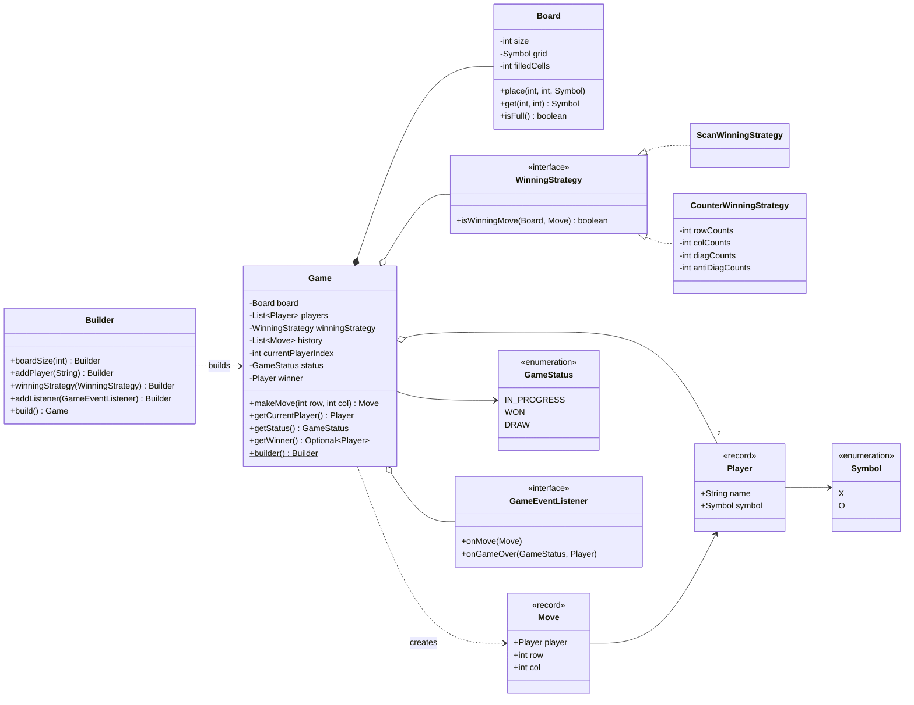
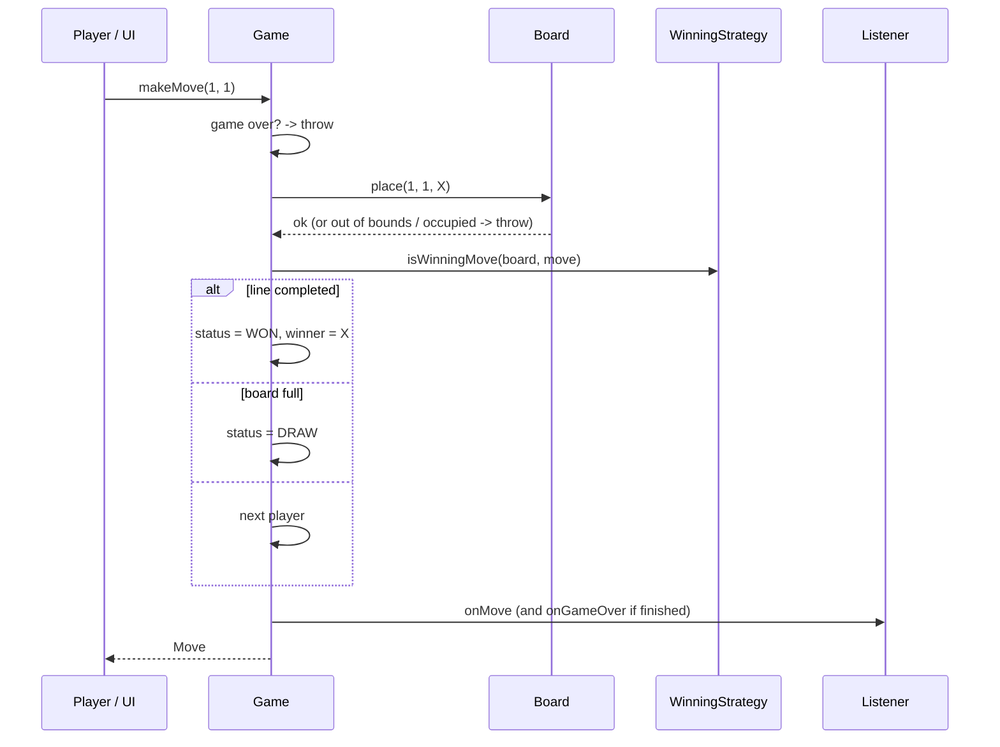

# ❌⭕ Design Tic Tac Toe — Low Level Design (Java)


> Usually the **first** LLD question you'll get, and often a warm-up before a harder one.
> The rules are trivial, so the interviewer is judging **structure**: clean entities, a
> pluggable win check, and whether you can go from O(N) to **O(1) win detection** when asked.

Two players take turns placing their symbol (**X** or **O**) on an N×N grid. The first player to
fill an entire **row**, **column** or **diagonal** with their symbol wins. If the board fills up
with no complete line, the game is a **draw**.

> 📚 **Credit:** Originally written in this repo as a Spring Boot app (see git history,
> commit `774ccd9`), then rewritten in plain Java to match the other problems. Everything here is
> original work based on the public rules of the game. See [References & Credits](#-references--credits).

---

## 📑 On this page

1. [Scoping the Problem](#1-scoping-the-problem)
2. [Finding the Building Blocks](#2-finding-the-building-blocks)
3. [Object Model](#3-object-model)
   - [3.1 Class Responsibilities](#31-class-responsibilities)
   - [3.2 Patterns in Play](#32-patterns-in-play)
   - [3.3 UML Diagrams](#33-uml-diagrams)
   - [Practice Round](#-practice-round)
4. [Implementation Walkthrough](#4-implementation-walkthrough)
5. [Build, Run & Verify](#5-build-run--verify)
6. [Follow-up Scenarios](#6-follow-up-scenarios)
   - [6.1 From O(N) to O(1) Win Detection](#61-from-on-to-o1-win-detection)
   - [6.2 Bigger Boards and K-in-a-Row](#62-bigger-boards-and-k-in-a-row)
   - [6.3 Undo, More Players, and a Web Version](#63-undo-more-players-and-a-web-version)
7. [Last-Minute Revision](#7-last-minute-revision)
8. [References & Credits](#-references--credits)

---

## 1. Scoping the Problem

### 🗣️ Sample conversation

| Candidate asks | Interviewer answers | Design impact |
|---|---|---|
| Only 3×3, or N×N? | Support N×N (3 to 10). | `Board(size)`; win checks work for any N. |
| How many players? | Two: X and O. | `Symbol { X, O }`; the builder assigns symbols in order. |
| Who moves first? | X. | The first player added is X. |
| What counts as a win? | A full row, column or diagonal. | `WinningStrategy`, pluggable. |
| Should the win check be fast? | Start simple; I may ask you to optimise. | Scan (O(N)), then counters (O(1)). |
| Invalid moves? | Reject: off board, occupied, after the game ends. | `InvalidMoveException`; the turn doesn't change. |
| UI? | Console is fine; keep the logic UI-free. | Separate `ConsoleBoardRenderer` + listeners. |
| Undo / AI / online? | Out of scope; mention how. | History list is kept; see follow-ups. |

### ✅ Functional requirements

1. Create a game on an N×N board (3 ≤ N ≤ 10) with two players; X moves first.
2. Players alternate placing their symbol on an empty cell.
3. Reject moves that are off the board, onto an occupied cell, or made after the game has ended.
4. Detect a **win** (full row, column, main diagonal or anti-diagonal) right after the move.
5. Detect a **draw** when the board is full with no winner. A win on the last cell counts as a win.
6. Report the current player, status, winner and move history.

### ⚙️ Non-functional requirements

- **Efficient**: O(1) win and draw detection per move.
- **Extensible**: a new win rule (K-in-a-row), more players or a GUI without rewriting `Game`.
- **Testable**: the win check is verified against a simpler reference implementation.

---

## 2. Finding the Building Blocks

| Candidate | Keep? | Reasoning |
|---|---|---|
| **Game** | ✅ class | Turns, status, winner, history; the facade. |
| **Board** | ✅ class | N×N grid, bounds and occupancy, O(1) "is full". |
| **Player** | ✅ record | Name + symbol. |
| **Symbol** | ✅ enum | `X`, `O`. An empty cell is `null`, not a third "EMPTY" symbol. |
| **Move** | ✅ record | Who played where. Stored in history and passed to the win check and listeners. |
| **GameStatus** | ✅ enum | `IN_PROGRESS`, `WON`, `DRAW`. |
| **WinningStrategy** | ✅ interface | How a win is detected is a separate, swappable decision. |
| **Cell** | ❌ | It would only wrap a `Symbol`, so a `Symbol[][]` grid is enough. |

> 💡 **Design choices compared with the original version in this repo:**
> - `GameStatus.WINNER_X / WINNER_O` became `WON` + `getWinner()`, so a third symbol never needs new enum constants.
> - `Symbol.EMPTY` was removed, so a player can never be created with an "empty" symbol.
> - Public setters on `Game` (`setStatus`, `setCurrentPlayerIndex`) were removed, so outside code can't corrupt the game state.
> - The win check moved from a private method into a pluggable `WinningStrategy`.

---

## 3. Object Model

### 3.1 Class Responsibilities

#### `Board`
| Member | Purpose |
|---|---|
| `Symbol[][] grid` | `null` = empty. |
| `place(row, col, symbol)` | Validates bounds and occupancy, then places the symbol. |
| `get(row, col)`, `isEmpty(row, col)` | Reads. |
| `isFull()` | **O(1)** via a `filledCells` counter. |

#### `Game` (+ `Builder`)
| Member | Purpose |
|---|---|
| `makeMove(row, col)` → `Move` | Place → check win → check draw → next turn → notify. |
| `getCurrentPlayer()`, `getStatus()`, `getWinner()`, `getHistory()` | Queries. |
| `Builder.boardSize(n)`, `addPlayer(name)`, `winningStrategy(s)`, `addListener(l)` | Setup. The builder requires exactly two players. |

#### Interface — `WinningStrategy`
```java
boolean isWinningMove(Board board, Move lastMove);
```
| Implementation | Idea | Cost per move |
|---|---|---|
| `ScanWinningStrategy` | Check only the row, the column, and the diagonals through the last move | O(N) time, O(1) memory |
| `CounterWinningStrategy` (default) | Keep per-symbol counts for every row, column and diagonal | **O(1)** time, O(N) memory |

#### Interface — `GameEventListener`
`onMove(Move)`, `onGameOver(GameStatus, Player winner)`.

#### `ConsoleBoardRenderer`
Draws the grid with row and column numbers.

### 3.2 Patterns in Play

| Pattern | Where | Why here |
|---|---|---|
| **Strategy** | `WinningStrategy` | Swap scanning ↔ counters ↔ K-in-a-row without touching `Game`. |
| **Builder** | `Game.builder()` | Board size, players, strategy and listeners, validated once. |
| **Facade** | `Game.makeMove` | Callers never coordinate board, win check and turn order themselves. |
| **Observer** | `GameEventListener` | Console output, a scoreboard or a web socket plug in from outside. |
| **Value Object** | `Player`, `Move` records | Immutable, safe in history and events. |

**SOLID:** `Board` only knows the grid, the strategy only knows win rules, and `Game` only knows
turns and status (**S**). A new rule is a new class (**O**). Both strategies are interchangeable
(**L**). The interfaces are small (**I**). `Game` depends on the `WinningStrategy` abstraction (**D**).

### 3.3 UML Diagrams

**Class diagram**



**What happens on `makeMove(row, col)`**



### 🧠 Practice Round

1. **K-in-a-row (Gomoku)**: on a 15×15 board, 5 in a row wins. Write `KInARowWinningStrategy`.
   *(Hint: from the last move, count matching symbols in both directions along each of 4 axes.)*
2. **Undo**: add `undo()`. What does `CounterWinningStrategy` need so it can undo too?
3. **Three players** on a 5×5 board with X, O and △. What changes? *(Hint: `Symbol` and the builder's limit.)*
4. **Unbeatable AI**: a `MoveProvider` that uses minimax on 3×3. Why doesn't it scale to 10×10?
5. **Early draw detection**: declare a draw as soon as *no line can still be won*, before the board is full.

<details>
<summary>💡 Hints for #1</summary>

```java
int[][] axes = {{0, 1}, {1, 0}, {1, 1}, {1, -1}};
for (int[] a : axes) {
    int count = 1 + countDir(board, move, a[0], a[1]) + countDir(board, move, -a[0], -a[1]);
    if (count >= k) return true;
}
```
That's O(K) per move and it works on any board size. Only the new strategy class is needed; `Game` doesn't change.
</details>

<details>
<summary>💡 Hints for #5</summary>

With counters, a line is "dead" once it contains both X and O. Track `liveLines`: start with
2N + 2 and decrement when a line first gets its second symbol. If `liveLines == 0`, it's a draw.
</details>

---

## 4. Implementation Walkthrough

### 📁 Project structure

```
TicTacToe/
├── pom.xml
├── README.md
└── src
    ├── main/java/com/lld/games/tictactoe
    │   ├── TicTacToeApp.java                  # interactive console game
    │   ├── model/      Symbol, Player, Move
    │   ├── board/      Board
    │   ├── game/       Game (+Builder), GameStatus
    │   ├── win/        WinningStrategy, ScanWinningStrategy, CounterWinningStrategy
    │   ├── listener/   GameEventListener
    │   ├── render/     ConsoleBoardRenderer
    │   └── exception/  InvalidMoveException
    └── test/java/com/lld/games/tictactoe
        ├── GameTest.java                      # rules, validation, events, rendering
        └── WinningStrategyTest.java           # counter vs scan on 4000 random games
```

### 🎯 The move

```java
public Move makeMove(int row, int col) {
    if (status.isOver()) throw new InvalidMoveException("Game is already over (" + status + ")");
    Player player = getCurrentPlayer();
    board.place(row, col, player.symbol());          // bounds + occupancy checked here

    Move move = new Move(player, row, col);
    history.add(move);

    if (winningStrategy.isWinningMove(board, move)) { status = WON; winner = player; }
    else if (board.isFull())                         { status = DRAW; }
    else                                             { currentPlayerIndex = (currentPlayerIndex + 1) % players.size(); }

    listeners.forEach(l -> l.onMove(move));
    if (status.isOver()) listeners.forEach(l -> l.onGameOver(status, winner));
    return move;
}
```
The win is checked **before** the draw, so completing a line on the last empty cell counts as a win (tested).

👉 Browse the full source in [`src/main/java`](src/main/java/com/lld/games/tictactoe).

### ⏱️ Complexity

| Operation | Scan strategy | Counter strategy |
|---|---|---|
| Win check per move | O(N) | **O(1)** |
| Draw check | O(1) (counter) | O(1) |
| Memory | O(N²) board | O(N²) board + O(N) counters |

---

## 5. Build, Run & Verify

### With Maven

```bash
cd Games-and-Puzzles/TicTacToe
mvn test                                  # 21 tests
mvn compile exec:java -Dexec.args="3"     # play; argument = board size (3..10)
```

### Without Maven (plain JDK 17+)

```bash
cd Games-and-Puzzles/TicTacToe
javac -d out $(find src/main -name "*.java")
java -cp out com.lld.games.tictactoe.TicTacToeApp 4
```

Enter moves as `<row> <col>` (0-based), or `q` to quit.

### Sample session

```
Tic Tac Toe 3x3. Enter moves as: <row> <col>   (q to quit)
Player 1 (X) > 0 0
Player 2 (O) > 0 0
! Cell (0, 0) is already occupied
Player 2 (O) > 1 0
Player 1 (X) > 0 1
Player 2 (O) > 1 1
Player 1 (X) > 0 2
*** Player 1 (X) wins! ***

    0   1   2
0   X | X | X
   -----------
1   O | O |
   -----------
2     |   |
```

### ✅ What the tests cover

| Test | Verifies |
|---|---|
| `xMovesFirstAndTurnsAlternate` | Turn order and symbol placement. |
| `rowWin` / `columnWin` / `mainDiagonalWin` / `antiDiagonalWin` | All four line types. |
| `fullBoardWithoutLineIsDraw` / `winOnLastCellIsAWinNotADraw` | Draw vs win on the final cell. |
| `largerBoardNeedsTheFullLine` | N×N: 3 of 4 isn't enough on 4×4. |
| `occupiedCellIsRejectedAndTurnDoesNotChange` / `outOfBoundsIsRejected` / `noMovesAfterGameOver` | Invalid moves. |
| `boardSizeOutsideRangeIsRejected` (×4) / `exactlyTwoPlayersAreRequired` | Setup validation. |
| `scanStrategyGivesSameResults` | The alternative strategy plugs in. |
| `historyAndListenersRecordEveryMove` | History and Observer events. |
| `rendererDrawsSymbolsAndGrid` | Console output. |
| `counterAndScanAgreeOnRandomGames` | The O(1) strategy matches the O(N) one on **every move of 4000 random games** (sizes 3–10). |
| `counterStrategyCannotBeSharedAcrossBoardSizes` | Guards against reusing a stateful strategy. |

---

## 6. Follow-up Scenarios

### 6.1 From O(N) to O(1) Win Detection

**Ask:** "Your win check scans a whole row and column. Can you do better?"

A line through the last move is complete when it holds **N** of the same symbol. Instead of
counting on demand, count **as moves happen**:

```java
boolean win = ++rowCounts[s][row] == size;
win |= ++colCounts[s][col] == size;
if (row == col)            win |= ++diagCounts[s] == size;
if (row + col == size - 1) win |= ++antiDiagCounts[s] == size;
```

Each move updates at most four counters, so it's O(1). With exactly two players, the well-known
variant uses a **single** array per line (+1 for X, −1 for O) and checks `|count| == N`. The
per-symbol version above also works for more than two players.

> 🧪 **How do we know it's right?** `WinningStrategyTest` plays 4000 random games and compares
> the counter strategy to the simple scan on **every move**. Checking a clever implementation
> against an obviously correct one is a cheap, strong test.

### 6.2 Bigger Boards and K-in-a-Row

**Ask:** "15×15 board, 5 in a row wins (Gomoku)."

- Raise `Board.MAX_SIZE`.
- Add `KInARowWinningStrategy(k)`: from the last move, walk both ways along the 4 axes and count
  matching symbols. That's O(K) per move.
- `Game` is **unchanged**, which shows the Strategy pattern paying off.

### 6.3 Undo, More Players, and a Web Version

| Follow-up | Design move |
|---|---|
| Undo | `history` already records every `Move`. Add `Board.clear(row, col)`, and give the strategy an `undo(move)` that decrements its counters. Restore the turn and status. |
| More players | Add symbols to `Symbol` (or make it a record with a char). The builder limit follows `Symbol.values()`, and turn rotation already uses `players.size()`. |
| Vs computer | `MoveProvider` interface: `HumanConsoleProvider`, `RandomAi`, `MinimaxAi` (only feasible for 3×3). |
| Web / REST | Wrap `Game` in a service with `Map<gameId, Game>`, one lock per game, and endpoints `POST /games`, `POST /games/{id}/move`. The core stays plain Java. |
| Scoreboard across games | A `GameEventListener` that records `onGameOver` results per player name. |

---

## 7. Last-Minute Revision

```
1. Clarify    → N×N? 2 players? who starts? win = full line? invalid moves? UI?
2. Entities   → Game, Board, Player, Symbol, Move, GameStatus, WinningStrategy
3. Key calls  → empty = null (no EMPTY symbol); status WON + winner (not WINNER_X/O);
                no public setters on Game; win checked BEFORE draw
4. Patterns   → Strategy (win rule), Builder, Facade, Observer
5. Algorithm  → scan only lines through the last move O(N) → counters O(1)
6. Follow-ups → K-in-a-row, undo, more players, AI, REST wrapper
7. Testing    → cross-check O(1) strategy against O(N) on random games
```

---

## 📚 References & Credits

| Resource | How it was used |
|---|---|
| This repository's original Spring Boot version (commit `774ccd9`) | Starting point: board, players, symbols, status, last-move win check. |
| [Tic-tac-toe — Wikipedia](https://en.wikipedia.org/wiki/Tic-tac-toe) | Public rules of the game. |
| [Mermaid](https://mermaid.js.org/) | Diagrams rendered by GitHub. |
| [JUnit 5 User Guide](https://junit.org/junit5/docs/current/user-guide/) | Unit and parameterized testing. |

**Originality statement**

- This repository is a **personal learning project** for LLD interview preparation.
- All headings, source code, explanations, tables, diagrams, tests and exercises were written
  independently from the public rules of the game. No paid or premium content is reproduced.

---

> ⭐ Try the Practice Round before reading the code, then compare your design with this one.
