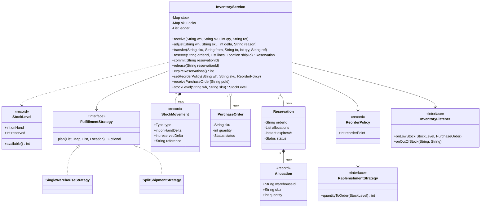
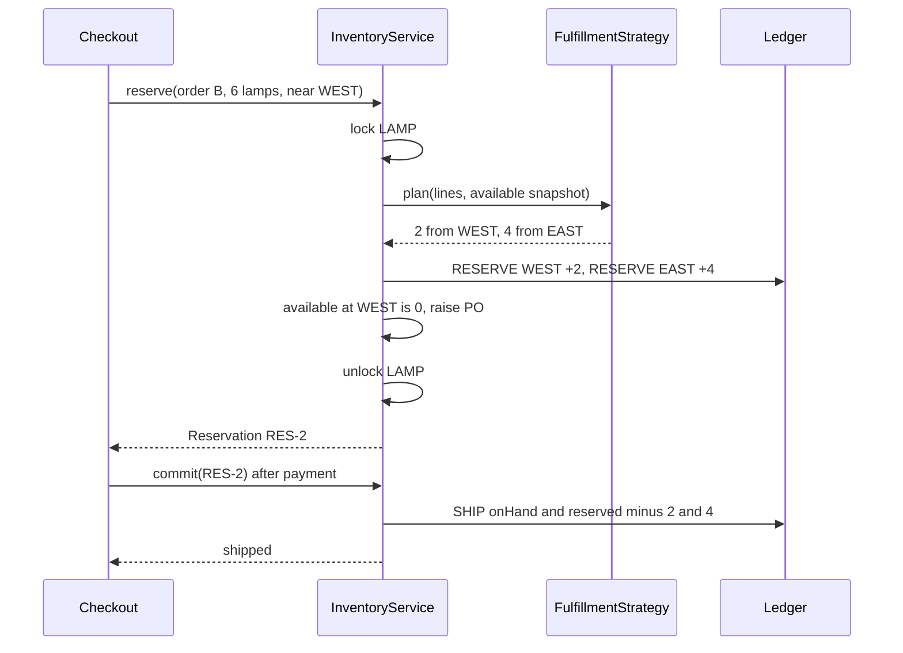
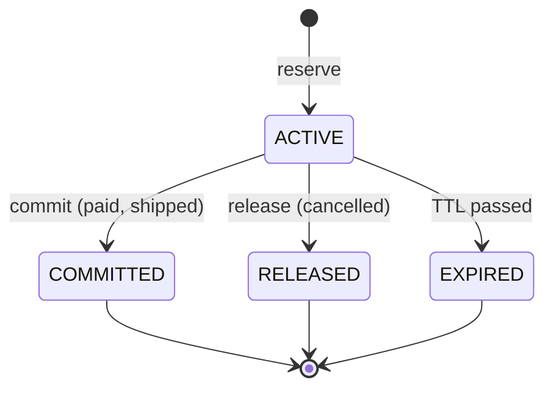

# 📦 Design an Inventory Management System — Low Level Design (Java)


> The question behind every "Add to cart" button. Storing a number per product is trivial; the interview
> is about **never overselling** when many orders race for the last units, **holding** stock during
> checkout without losing it to abandoned carts, choosing **which warehouse** ships, **reordering**
> before the shelf is empty, and being able to **explain every number** with an audit trail.

An online shop sells products stocked in several warehouses. Orders reserve stock at checkout, ship
when paid, or release it when cancelled or abandoned. Staff correct counts and move stock between
warehouses. When a warehouse runs low, a purchase order is raised automatically.

> 📚 **Credit:** Problem inspired by
> [AlgoMaster — Design Inventory Management System](https://algomaster.io/learn/lld/design-inventory-management-system)
> (premium lesson, **not** accessed). Everything here is my own original work, based on common
> warehouse and e-commerce practice and publicly known design patterns. See [References & Credits](#-references--credits).

---

## 📑 On this page

1. [Scoping the Problem](#1-scoping-the-problem)
2. [Finding the Building Blocks](#2-finding-the-building-blocks)
3. [Object Model](#3-object-model)
   - [3.1 Class Responsibilities](#31-class-responsibilities)
   - [3.2 Patterns in Play](#32-patterns-in-play)
   - [3.3 UML Diagrams](#33-uml-diagrams)
   - [Practice Round](#-practice-round)
4. [Implementation Walkthrough](#4-implementation-walkthrough)
5. [Build, Run & Verify](#5-build-run--verify)
6. [Follow-up Scenarios](#6-follow-up-scenarios)
   - [6.1 The Last Unit and a Hundred Buyers](#61-the-last-unit-and-a-hundred-buyers)
   - [6.2 One Parcel or Two?](#62-one-parcel-or-two)
   - [6.3 When to Reorder, and How Much](#63-when-to-reorder-and-how-much)
7. [Last-Minute Revision](#7-last-minute-revision)
- [References & Credits](#-references--credits)

---

## 1. Scoping the Problem

### 🗣️ Sample conversation

| Candidate asks | Interviewer answers | Design impact |
|---|---|---|
| One location or many? | Several warehouses. | Stock per (warehouse, SKU): a **bin**. |
| Do we deduct stock when the order is placed? | Hold it at checkout, deduct when it ships. | `onHand` vs `reserved`; `available = onHand - reserved`. |
| What if the customer never pays? | Holds expire after 15 minutes. | `Reservation` with `expiresAt`; `expireReservations()`. |
| Partial orders? | All lines or nothing. | Lock all SKUs, check, then apply. |
| Which warehouse ships? | Nearest; split only if needed (configurable). | `FulfillmentStrategy`. |
| Reordering? | Per warehouse/SKU: reorder point and order size rule. | `ReorderPolicy` + `ReplenishmentStrategy`, `PurchaseOrder`. |
| Corrections, transfers? | Cycle counts, damage, moves between warehouses. | `adjust`, `transfer`. |
| Audit? | Every change must be explainable. | Append-only **stock ledger**. |
| Traffic? | Flash sales: many orders for the same SKU at once. | Per-SKU locks, sorted lock order. |

### ✅ Functional requirements

1. Manage products (SKU, cost) and warehouses (location).
2. Receive stock; adjust counts (never below reserved); transfer available stock between warehouses.
3. Reserve an order (all-or-nothing, idempotent by order id), commit (ship) or release it; expire old holds.
4. Pick warehouses with a pluggable strategy; explain refusals (which SKU is short, by how much).
5. Raise at most one open purchase order per bin when available stock hits the reorder point.
6. Report stock levels, network availability, stock value and the full ledger.

### ⚙️ Non-functional requirements

- **No overselling**, ever: `0 <= reserved <= onHand` for every bin.
- **Auditability**: the ledger sums to the current levels.
- **Throughput**: orders for different SKUs don't block each other.
- **No deadlocks** with multi-SKU orders.

---

## 2. Finding the Building Blocks

| Noun / verb | Becomes |
|---|---|
| product, SKU | `Product` record |
| warehouse, location | `Warehouse`, `Location` records |
| quantity of a SKU at a warehouse | `Bin` (internal), `StockLevel` snapshot |
| order line, "take 3 from EAST" | `OrderLine`, `Allocation` |
| hold for checkout | `Reservation` (ACTIVE → COMMITTED / RELEASED / EXPIRED) |
| supplier order | `PurchaseOrder` |
| history of changes | `StockMovement` (ledger line) |
| "which warehouse" | `FulfillmentStrategy` → `SingleWarehouseStrategy`, `SplitShipmentStrategy` |
| "when/how much to reorder" | `ReorderPolicy`, `ReplenishmentStrategy` (fixed, top-up) |
| everything else | `InventoryService` (facade), `InventoryListener` |

---

## 3. Object Model

### 3.1 Class Responsibilities

#### `InventoryService` (facade)
- Owns bins (`sku → warehouse → Bin`), reservations, purchase orders and the ledger.
- Every change: lock SKU(s) → validate → update bin → write ledger line → check reorder → unlock → fire events.
- `reserve` asks the strategy for a plan against a snapshot taken **under the locks**, then applies it.

#### `Reservation`
- Order id, allocations, expiry, status. Status only changes while the service holds the SKU locks.

#### `FulfillmentStrategy`
- Pure function: `(lines, available snapshot, warehouses, ship-to) → allocations or empty`.
- `SingleWarehouseStrategy`: nearest warehouse with everything; else refuse.
- `SplitShipmentStrategy`: single if possible; otherwise fill each line from nearest outward.

#### `ReorderPolicy` / `ReplenishmentStrategy`
- Reorder point per bin; `fixed(n)` or `topUpTo(max)` decides the purchase quantity.

#### `StockMovement`
- Type, bin, `onHandDelta`, `reservedDelta`, reference (order, PO, count sheet). Never modified.

### 3.2 Patterns in Play

| Pattern | Where | Why |
|---|---|---|
| **Facade** | `InventoryService` | One place that keeps bins and ledger in step. |
| **Strategy** | `FulfillmentStrategy`, `ReplenishmentStrategy` | Business policies change often; the core doesn't. |
| **Observer** | `InventoryListener` | Low-stock alerts, supplier EDI, "only 2 left" badges. |
| **Event log / ledger** | `StockMovement` | Audit trail and the source of truth for reconstruction. |
| **Lock striping + ordering** | per-SKU `ReentrantLock`, sorted | Parallelism without deadlock. |
| **Idempotency key** | order id in `reserve` | Retries after timeouts don't double-reserve. |

**SOLID check**

- **S**: strategies decide, the service applies, records only hold data.
- **O**: "ship from the store with most stock" = new `FulfillmentStrategy`.
- **L**: any strategy returning a valid plan works; the service re-checks it anyway.
- **I**: listeners implement only the events they need.
- **D**: the service depends on strategy interfaces and `Clock`.

### 3.3 UML Diagrams

#### Class diagram



#### Sequence: checkout to shipment



#### Reservation lifecycle



### 🧠 Practice Round

1. Why keep `reserved` separately instead of subtracting from `onHand` at checkout?
   <details><summary>Hint</summary><code>onHand</code> must match what is physically on the shelf (cycle counts compare against it). Reservations are promises; they can be cancelled or expire without anyone touching a box.</details>
2. Order 1 wants MUG then LAMP; order 2 wants LAMP then MUG. How can this deadlock and how do you prevent it?
   <details><summary>Hint</summary>Each grabs its first lock and waits for the other. Always lock SKUs in sorted order.</details>
3. The checkout service times out and retries <code>reserve</code>. What stops double reservation?
   <details><summary>Hint</summary>The order id is an idempotency key: if an ACTIVE or COMMITTED reservation exists for it, return that one. The check runs under the SKU locks.</details>
4. A purchase order is open and stock keeps falling. Should a second PO be raised?
   <details><summary>Hint</summary>No, one open PO per bin; after it is received, re-evaluate (maybe raise the next one).</details>
5. How would you answer "why do we have 7 mugs in WEST?"
   <details><summary>Hint</summary>Sum the ledger lines for that bin; each has a reference (order, PO, count sheet).</details>

---

## 4. Implementation Walkthrough

### 📁 Project structure

```
InventoryManagementSystem/
├── pom.xml
└── src/
    ├── main/java/com/lld/management/inventory/
    │   ├── InventoryApp.java               # demo shop with two warehouses
    │   ├── model/                          # Product, Warehouse, Location, OrderLine, Allocation, StockLevel,
    │   │                                   # StockMovement, Reservation, PurchaseOrder, InventoryException
    │   ├── core/                           # InventoryService, InventoryListener, ManualClock
    │   ├── fulfillment/                    # FulfillmentStrategy, SingleWarehouseStrategy, SplitShipmentStrategy
    │   └── replenishment/                  # ReorderPolicy, ReplenishmentStrategy
    └── test/java/com/lld/management/inventory/
        └── InventoryServiceTest.java
```

### 🔒 Locking many SKUs safely

```java
private void lock(Collection<String> skus) {
    for (String sku : new TreeSet<>(skus)) {                       // sorted: same order in every thread
        skuLocks.computeIfAbsent(sku, k -> new ReentrantLock()).lock();
    }
}
```

### 🛒 Reserve: snapshot, plan, apply

```java
lock(merged.keySet());
try {
    Reservation existing = reservationByOrder.get(orderId);
    if (existing is ACTIVE or COMMITTED) return existing;                 // idempotent retry
    Map<String, Map<String, Integer>> available = snapshot of these SKUs;
    List<Allocation> plan = fulfillment.plan(wanted, available, warehouses, shipTo)
            .orElseThrow(() -> new InventoryException(explainShortage(...)));
    for (Allocation a : plan) {
        bin.reserved += a.quantity();
        record(RESERVE, ...);                                             // ledger in the same critical section
        afterAvailableDropped(...);                                       // out-of-stock / reorder
    }
} finally {
    unlock(merged.keySet());
}
// events fire here, outside the locks
```

### 🚚 Split plan (nearest first)

```java
for (OrderLine line : lines) {
    int remaining = line.quantity();
    for (Warehouse w : byDistance(warehouses, shipTo)) {
        int take = Math.min(remaining, availableAt(available, line.sku(), w.id()));
        if (take > 0) { plan.add(new Allocation(w.id(), line.sku(), take)); remaining -= take; }
        if (remaining == 0) break;
    }
    if (remaining > 0) return Optional.empty();
}
```

### 🔁 Reorder once, not fifty times

```java
if (policy == null || bin.available() > policy.reorderPoint() || openPurchaseOrderByBin.containsKey(key)) {
    return;
}
```

### ⏱️ Complexity

| Operation | Cost |
|---|---|
| receive / adjust / transfer | O(1) |
| reserve | O(L log L) locking + O(L × W) plan (L lines, W warehouses) |
| commit / release | O(A) allocations |
| expireReservations | O(R) reservations |

---

## 5. Build, Run & Verify

### With Maven

```bash
cd Management-Systems/InventoryManagementSystem
mvn test
mvn compile exec:java
```

### Without Maven (plain JDK 17+)

```bash
cd Management-Systems/InventoryManagementSystem
javac -d out $(find src/main -name "*.java")
java -cp out com.lld.management.inventory.InventoryApp
```

### Demo output (excerpt)

```
> Order A: 2 mugs + 1 lamp, customer near WEST
   RES-1 for A [2xMUG@WEST, 1xLAMP@WEST] [ACTIVE] -> 1 parcel(s)
   retry of order A returns RES-1

> Order B: 6 lamps near WEST (WEST has 2 free, EAST 5)
   [out of stock] LAMP@WEST
   [low stock] LAMP@WEST available 0 -> raised PO-1: 10xLAMP to WEST [OPEN]
   RES-2 for B [2xLAMP@WEST, 4xLAMP@EAST] [ACTIVE] -> 2 parcel(s): no single warehouse had 6 lamps free

> Order C: 20 lamps
   [refused] Not enough stock for order C: LAMP needs 20, 1 available

> Order D: 6 mugs, customer abandons checkout
   [low stock] MUG@WEST available 2 -> raised PO-2: 18xMUG to WEST [OPEN]
   RES-3 for D [6xMUG@WEST] [ACTIVE]
   storefront shows MUG available: 10
   20 min later: expired 1 reservation(s); MUG available: 16
   [refused] RES-3 is EXPIRED

> Ledger for MUG@WEST (the stock level is the sum of these lines)
   #1   RECEIVE      WEST     MUG     onHand  +10 reserved   +0  initial load
   #6   RESERVE      WEST     MUG     onHand   +0 reserved   +2  A
   #10  SHIP         WEST     MUG     onHand   -2 reserved   -2  A
   #14  RESERVE      WEST     MUG     onHand   +0 reserved   +6  D
   #15  RELEASE      WEST     MUG     onHand   +0 reserved   -6  D (expired)
   #16  ADJUST       WEST     MUG     onHand   -3 reserved   +0  count sheet 7/1: 3 broken
   #18  TRANSFER_IN  WEST     MUG     onHand   +5 reserved   +0  TR-1
   #20  RECEIVE      WEST     MUG     onHand  +18 reserved   +0  PO-2
```

### ✅ What the tests cover

After **every** test, a hook checks that the ledger sums to every bin's `onHand` and `reserved`, and
that nothing is negative.

| Area | Tests |
|---|---|
| Basics | receive, unknown SKU/warehouse, bad quantities, duplicate SKU, stock value |
| Reservations | nearest single warehouse; far single beats split; split nearest-first; single-only strategy refuses; all-or-nothing with exact shortage message; merged duplicate lines; idempotent retry; commit once; release idempotent; expiry (boundary at exactly 15 min) and expired commit |
| Corrections | adjust never below reserved; transfer only available stock, not to itself |
| Replenishment | one open PO per bin, top-up size; re-raise when still low after delivery; out-of-stock event |
| Random walk | 2,000 random receive/reserve/commit/release/adjust/transfer/expire operations keep the ledger consistent |
| Concurrency | 200 buyers for 50 units → exactly 50 sold; 400 orders locking two SKUs in opposite order finish without deadlock |

**21 tests, all passing.**

---

## 6. Follow-up Scenarios

### 6.1 The Last Unit and a Hundred Buyers

- **In one process**: per-SKU locks (this design). Hot SKUs serialise, others run in parallel.
- **With a database**: a conditional update is enough for one bin:
  `UPDATE bin SET reserved = reserved + :q WHERE sku = :s AND wh = :w AND on_hand - reserved >= :q`,
  then check the row count. For multi-line orders, run all updates in one transaction, ordering rows by key.
- **Flash sales**: pre-split stock into a counter in Redis (`DECRBY` + check), or a queue per hot SKU so
  requests are processed one by one; reconcile with the database afterwards.
- **Idempotency**: order id as a unique key on the reservation table.

### 6.2 One Parcel or Two?

| Strategy | Pros | Cons |
|---|---|---|
| Single warehouse | One parcel, cheaper shipping | Refuses orders the network could serve |
| Split nearest-first (this repo) | Serves more orders | More parcels; greedy isn't always fewest parcels |
| Minimum parcels | Fewest shipments | Set-cover problem: NP-hard in general, fine for small W |
| Cost-based | Uses real carrier rates and delivery promises | Needs rate tables and SLAs |

### 6.3 When to Reorder, and How Much

- **Reorder point** ≈ demand during supplier lead time + safety stock.
- **Fixed quantity** (e.g. a pallet) vs **top-up to max** (this repo) vs **EOQ** (economic order quantity,
  balancing ordering cost and holding cost).
- Count what is **on order** too: here, "one open PO per bin" avoids duplicates; a richer version uses
  `inventory position = available + on order` against the reorder point.
- **In-transit** transfers: model `TRANSFER_OUT` into an in-transit bin and `TRANSFER_IN` on arrival.

### 🚀 More follow-ups to practice

1. **Batches and expiry dates** (food, medicine): pick FEFO (first expired, first out).
2. **Stock valuation**: FIFO vs weighted average cost for accounting.
3. **Backorders**: accept orders beyond stock and allocate incoming POs to them in order.
4. **Returns**: inspect, then restock (`RECEIVE`) or write off (`ADJUST`).
5. **Serial numbers** for electronics: track individual units instead of counts.
6. **Rebuild from ledger**: replay movements to recover levels at any point in time (event sourcing).

---

## 7. Last-Minute Revision

- Bin = (warehouse, SKU): `onHand`, `reserved`, `available = onHand - reserved`.
- Reserve at checkout, ship on commit, release on cancel, expire abandoned carts.
- All-or-nothing orders: lock every SKU **in sorted order**, snapshot, plan, apply.
- Order id makes `reserve` idempotent.
- Fulfillment and replenishment are **strategies**; low stock raises one PO per bin.
- Every change writes a ledger line in the same critical section; levels = sum of the ledger.
- Events fire after unlocking.

---

## 📚 References & Credits

| Resource | How it was used |
|---|---|
| [AlgoMaster.io — Design Inventory Management System (LLD)](https://algomaster.io/learn/lld/design-inventory-management-system) | Inspiration for the **problem choice** only. The lesson is premium and was **not** accessed. |
| [Reorder point — Wikipedia](https://en.wikipedia.org/wiki/Reorder_point) | Public background on reorder points and safety stock. |
| [Economic order quantity — Wikipedia](https://en.wikipedia.org/wiki/Economic_order_quantity) | Public background for the follow-up. |
| [Refactoring.Guru — Strategy](https://refactoring.guru/design-patterns/strategy), [Observer](https://refactoring.guru/design-patterns/observer), [Facade](https://refactoring.guru/design-patterns/facade) | Public pattern definitions. |
| [Mermaid](https://mermaid.js.org/) | Diagrams rendered by GitHub. |
| [JUnit 5 User Guide](https://junit.org/junit5/docs/current/user-guide/) | Testing. |

**Originality statement**

- This repository is a **personal learning project** for LLD interview preparation.
- The AlgoMaster lesson is premium content that I have not accessed. No text, code, diagrams,
  headings or other material from it (or any paid source) is reproduced here.
- All headings, source code, explanations, tables, diagrams, tests and exercises were written
  independently from publicly known behaviour and the public references above.
- This project is **not affiliated with or endorsed by** AlgoMaster.io. "AlgoMaster" is the
  property of its respective owner.
- For the original lesson, please support the author at [algomaster.io](https://algomaster.io).

---

> ⭐ Try the Practice Round before reading the code, then compare your design with this one.
