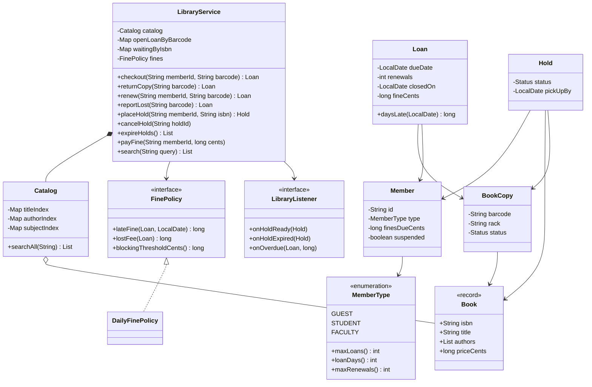
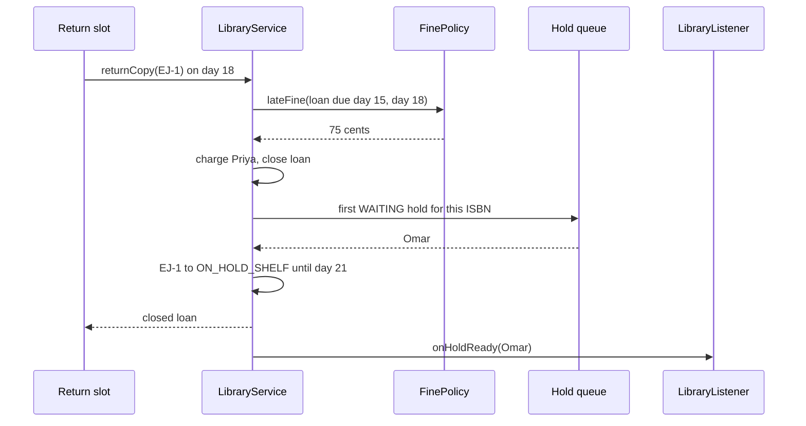
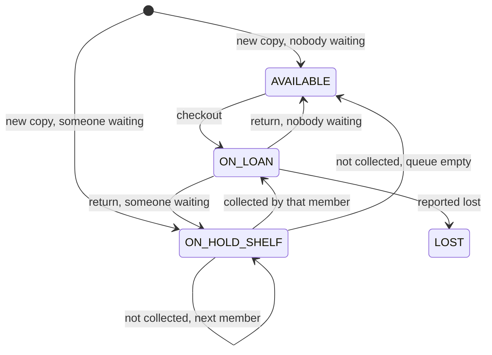

# 📚 Design a Library Management System — Low Level Design (Java)


> A classic that looks like CRUD but isn't. The interview is won on three distinctions and one
> rule: a **book** (title) vs a **copy** (barcode), a **loan** vs a **hold**, **member types** with
> different privileges, and the rule that a returned copy goes to the **next person waiting**, never
> straight back on the shelf.

Members search the catalogue, borrow copies, renew them, place holds on titles that are all out,
collect held copies from the hold shelf, and pay fines for late or lost books. Students, faculty and
guests have different limits.

> 📚 **Credit:** Problem inspired by
> [AlgoMaster — Design Library Management System](https://algomaster.io/learn/lld/design-library-management-system)
> (premium lesson, **not** accessed). Everything here is my own original work, based on how public
> and university libraries commonly work and publicly known design patterns. See [References & Credits](#-references--credits).

---

## 📑 On this page

1. [Scoping the Problem](#1-scoping-the-problem)
2. [Finding the Building Blocks](#2-finding-the-building-blocks)
3. [Object Model](#3-object-model)
   - [3.1 Class Responsibilities](#31-class-responsibilities)
   - [3.2 Patterns in Play](#32-patterns-in-play)
   - [3.3 UML Diagrams](#33-uml-diagrams)
   - [Practice Round](#-practice-round)
4. [Implementation Walkthrough](#4-implementation-walkthrough)
5. [Build, Run & Verify](#5-build-run--verify)
6. [Follow-up Scenarios](#6-follow-up-scenarios)
   - [6.1 Title vs Copy, Loan vs Hold](#61-title-vs-copy-loan-vs-hold)
   - [6.2 Fair Queues for Popular Books](#62-fair-queues-for-popular-books)
   - [6.3 Fines Without Surprises](#63-fines-without-surprises)
7. [Last-Minute Revision](#7-last-minute-revision)
- [References & Credits](#-references--credits)

---

## 1. Scoping the Problem

### 🗣️ Sample conversation

| Candidate asks | Interviewer answers | Design impact |
|---|---|---|
| Can the library own several copies of a book? | Yes. | `Book` (ISBN, metadata) vs `BookCopy` (barcode, rack, status). |
| Search by? | Title, author, subject, any combination of words. | `Catalog` with inverted indexes. |
| Member types? | Students 3 books / 14 days / 1 renewal; faculty 10 / 30 / 2; guests 1 / 7 / 0. | `MemberType` enum holds the limits. |
| If all copies are out? | Members join a queue (hold). First come, first served. | `Hold` per title, FIFO queue. |
| How long is a held copy kept? | 3 days, then it goes to the next person. | `pickUpBy`, `expireHolds()`. |
| Fines? | 25c/day after 1 grace day, max $10; lost = price + $2. Owing $5+ blocks borrowing. | `FinePolicy` strategy. |
| Renewals? | Not if overdue, over the limit, or someone is waiting. | Rules in `renew`. |
| Notices? | Due tomorrow, overdue, hold ready, hold expired. | **Observer** `LibraryListener`. |

### ✅ Functional requirements

1. Catalogue: add books and copies; search by title, author, subject or all fields (AND of words).
2. Checkout within the member type's limits; one copy per title per member.
3. Block members who are suspended, owe at least the threshold, or have overdue books.
4. Return: compute late fine, then hand the copy to the first waiting hold, or back to the shelf.
5. Renew with the rules above; never shorten a loan.
6. Holds: only when no copy is on the shelf; no duplicates; cancel; expire after the pick-up window.
7. Lost copies: charge price + handling + late fine; retire the copy.
8. Daily notices, at most once per loan per day.

### ⚙️ Non-functional requirements

- Consistent: a copy is in exactly one state; a title never has a free copy **and** a waiting queue.
- Policies (fines, limits) changeable without touching the circulation logic.
- Testable with a controllable clock.

---

## 2. Finding the Building Blocks

| Noun / verb | Becomes |
|---|---|
| book, title, ISBN | `Book` record |
| copy, barcode, rack | `BookCopy` (+ `Status`) |
| member, card, type | `Member`, `MemberType` |
| borrowing | `Loan` |
| queue for a title | `Hold` (+ `Status`) |
| search | `Catalog` |
| fine rules | `FinePolicy` → `DailyFinePolicy` |
| notices | `LibraryListener` |
| the desk | `LibraryService` (facade) |

---

## 3. Object Model

### 3.1 Class Responsibilities

#### `LibraryService` (facade)
- Checkout, return, renew, lost, pay; place/cancel/expire holds; notices; queries.
- `route(copy)`: **the** place where a freed copy is assigned: first waiting hold → hold shelf, else shelf.
- One lock for all state (low traffic); notices sent after the lock is released.

#### `Catalog`
- Inverted index per field: word → ISBNs. A query intersects the sets of its words.

#### `BookCopy`, `Loan`, `Hold`, `Member`
- Plain state holders; the service changes them after checking the rules.
- `Loan.daysLate(day)`, `Hold.isActive()`, `MemberType` limits.

#### `FinePolicy`
- `lateFine(loan, returnedOn)`, `lostFee(loan)`, `blockingThresholdCents()`.

### 3.2 Patterns in Play

| Pattern | Where | Why |
|---|---|---|
| **Facade** | `LibraryService` | The desk: one API, all rules. |
| **Strategy** | `FinePolicy` | Fine rules differ by library and change over time. |
| **Observer** | `LibraryListener` | E-mail, SMS, app push without touching circulation. |
| **Enum with data** | `MemberType` | Privileges per type in one table. |
| **Inverted index** | `Catalog` | Fast multi-word search. |
| **State (enums)** | `BookCopy.Status`, `Hold.Status` | Explicit lifecycles, easy to check. |

**SOLID check**

- **S**: `Catalog` searches, `FinePolicy` prices, `LibraryService` coordinates.
- **O**: a "no fines for faculty" rule is a new `FinePolicy`; a new member type is one enum line.
- **L**: any `FinePolicy` works with the service.
- **I**: listeners implement only the notices they send.
- **D**: the service depends on `FinePolicy` and `Clock` abstractions.

### 3.3 UML Diagrams

#### Class diagram



#### Sequence: a late return that serves the hold queue



#### Copy lifecycle



### 🧠 Practice Round

1. Why is a hold placed on a **title** and not on a copy?
   <details><summary>Hint</summary>The member wants the book, not a specific barcode. Whichever copy comes back first should serve the queue.</details>
2. A copy is returned while three people are waiting. Where does it go, and why not the shelf?
   <details><summary>Hint</summary>To the hold shelf for the first person. If it went on the open shelf, a walk-in could take it and jump the queue.</details>
3. Why refuse a hold when a copy is on the shelf?
   <details><summary>Hint</summary>It keeps the invariant simple: "free copy" and "someone waiting" never co-exist. The member can just borrow it.</details>
4. How do you search "gamma patterns" across fields quickly?
   <details><summary>Hint</summary>Per word: union of title/author/subject index hits; then intersect the words' sets.</details>
5. Faculty should pay no fines. What changes?
   <details><summary>Hint</summary>A new <code>FinePolicy</code> that returns 0 when <code>loan.member().type() == FACULTY</code>, or a per-type fine rate. Nothing in the service changes.</details>

---

## 4. Implementation Walkthrough

### 📁 Project structure

```
LibraryManagementSystem/
├── pom.xml
└── src/
    ├── main/java/com/lld/management/library/
    │   ├── LibraryApp.java              # a month at a university library
    │   ├── model/                       # Book, BookCopy, Member, MemberType, Loan, Hold, LibraryException
    │   ├── catalog/                     # Catalog (inverted indexes)
    │   ├── policy/                      # FinePolicy, DailyFinePolicy
    │   └── core/                        # LibraryService, LibraryListener, ManualClock
    └── test/java/com/lld/management/library/
        └── LibraryServiceTest.java
```

### 🔀 One place decides where a free copy goes

```java
private void route(BookCopy copy, List<Runnable> events) {
    Hold next = waiting(copy.book().isbn()).pollFirst();
    if (next == null) {
        copy.setStatus(BookCopy.Status.AVAILABLE);
        return;
    }
    next.ready(copy, today().plusDays(holdPickupDays));
    copy.setStatus(BookCopy.Status.ON_HOLD_SHELF);
    readyHoldByBarcode.put(copy.barcode(), next);
    events.add(() -> listeners.forEach(l -> l.onHoldReady(next)));
}
```

Called from `returnCopy`, `addCopy`, `cancelHold` (ready hold) and `expireHolds`.

### 🧾 Checkout checks, in order

```java
requireGoodStanding(member);                 // suspended? owes >= $5? anything overdue?
if (open.size() >= member.type().maxLoans()) throw ...;
if (already has a copy of this title) throw ...;
switch (copy.status()) {
    case AVAILABLE -> { }
    case ON_HOLD_SHELF -> { must be this member's READY hold; mark it FULFILLED }
    case ON_LOAN, LOST -> throw ...;
}
```

### 💰 Fines

```java
long late = loan.daysLate(returnedOn);
if (late <= graceDays) return 0;
return Math.min(capCents, late * centsPerDay);
```

### 🔎 Search

```java
for (String w : tokens(query)) {                       // "Design Patterns" -> design, patterns
    result = intersect(result, index.getOrDefault(w, Set.of()));
}
```

### ⏱️ Complexity

| Operation | Cost |
|---|---|
| checkout / return / renew | O(k) member's loans (+ O(1) queue ops) |
| search | O(sum of matching postings) |
| expireHolds / sendNotices | O(ready holds) / O(open loans) |

---

## 5. Build, Run & Verify

### With Maven

```bash
cd Management-Systems/LibraryManagementSystem
mvn test
mvn compile exec:java
```

### Without Maven (plain JDK 17+)

```bash
cd Management-Systems/LibraryManagementSystem
javac -d out $(find src/main -name "*.java")
java -cp out com.lld.management.library.LibraryApp
```

### Demo output

```
> Search
   'design' -> ['Design Patterns' by Erich Gamma, Richard Helm, Ralph Johnson, John Vlissides]
   author 'gamma johnson' -> ['Design Patterns' by Erich Gamma, Richard Helm, Ralph Johnson, John Vlissides]
   'programming code' -> ['Clean Code' by Robert C. Martin]

> Day 1: borrowing
   L1 EJ-1 'Effective Java' to Priya, due 2026-09-15
   L2 CC-1 'Clean Code' to Priya, due 2026-09-15
   [refused] Priya already has a copy of 'Clean Code' by Robert C. Martin
   L3 DP-1 'Design Patterns' to Dr. Chen, due 2026-10-01
   [refused] EJ-1 is already on loan

> Omar joins the queue for Effective Java; Dr. Chen too
   H1 Omar for 'Effective Java' [WAITING]
   H2 Dr. Chen for 'Effective Java' [WAITING]
   [refused] 1 copy(ies) of 'Clean Code' by Robert C. Martin on the shelf; borrow one directly
   [refused] 2 member(s) waiting for 'Effective Java' by Joshua Bloch

> Day 14: reminders
   [notice to Priya] Effective Java is due tomorrow
   [notice to Priya] Clean Code is due tomorrow
   L2 CC-1 'Clean Code' to Priya, due 2026-09-28

> Day 18: Priya returns Effective Java 3 days late
   [notice to Priya] Effective Java is 3 day(s) late
   [notice to Omar] 'Effective Java' is waiting for you until 2026-09-21
   L1 EJ-1 'Effective Java' to Priya, due 2026-09-15, closed 2026-09-18, fine $0.75
   [refused] EJ-1 is on the hold shelf for someone else

> Day 22: Omar never collected it
   [notice to Omar] your hold H1 expired
   [notice to Dr. Chen] 'Effective Java' is waiting for you until 2026-09-25
   L4 EJ-1 'Effective Java' to Dr. Chen, due 2026-10-22

> Day 22: Priya lost Clean Code, is blocked, then settles up
   L2 CC-1 'Clean Code' to Priya, due 2026-09-28, closed 2026-09-22, fine $40.00
   Priya owes $40.75
   [refused] Priya owes $40.75; pay fines first
   paid in full
   H3 Priya for 'Design Patterns' [WAITING]
```

### ✅ What the tests cover

| Area | Tests |
|---|---|
| Catalogue | AND search across fields, any word order, case-insensitive, per-field search |
| Checkout | loan period per type, loan limit, one copy per title, copy must be free, blocks (suspended, overdue, owing ≥ $5) and unblock after paying |
| Fines | 7 parameterised cases: early, on time, grace day, per day, cap; lost = price + handling + late; payment bounds |
| Renewals | extends from today, limit per type, never shortens, refused when late / someone waiting / not yours |
| Holds | FIFO to the hold shelf, only the holder can collect, expiry passes to next then shelf (pick-up day inclusive), cancel ready/waiting, hold rules, a new copy serves the queue at once |
| Notices | due-soon once, overdue once per day |
| Concurrency | two members scanning the last copy at the same moment, 50 rounds: exactly one wins |

**27 tests, all passing.**

---

## 6. Follow-up Scenarios

### 6.1 Title vs Copy, Loan vs Hold

- **Book** is catalogue data (shared by all copies); **BookCopy** is the physical thing with a barcode.
  Loans point to copies (you return a barcode); holds point to titles (any copy will do).
- The same split appears elsewhere: product vs unit (inventory), movie vs seat (booking), room type vs room (hotel).

### 6.2 Fair Queues for Popular Books

- FIFO per title; the copy goes to the **hold shelf** with a pick-up deadline.
- Variants: priority for faculty (priority queue by type, then time), limits on active holds per member,
  "freeze" a hold while travelling (skip without losing your place), and choosing the **pickup branch**
  in a multi-branch system (then a returned copy may need a transfer).
- Suspended or blocked members: skip them when routing and notify them.

### 6.3 Fines Without Surprises

- Grace period + daily rate + cap is a common scheme; count **calendar days** with `LocalDate`, not hours.
- Closed days (holidays) can be excluded via a calendar service injected into the policy.
- Blocking threshold instead of blocking on any fine keeps small debts from stopping borrowing.
- Lost then found: refund the replacement cost, keep the late fine.

### 🚀 More follow-ups to practice

1. **Multiple branches**: copies have a home branch; holds pick a pickup branch; transfers in transit.
2. **E-books** with a licence limit of N concurrent loans and automatic return on expiry.
3. **Reference-only** copies that can't leave the building (a flag checked at checkout).
4. **Membership expiry** dates and renewal of the card itself.
5. **Recommendations**: "members who borrowed X also borrowed Y" from loan history.
6. **Scale**: search moves to a search engine; circulation to a DB with row locks per copy.

---

## 7. Last-Minute Revision

- Book (ISBN) ≠ BookCopy (barcode). Loans → copies; holds → titles.
- `MemberType` enum holds max loans, loan days, renewals.
- Good standing = not suspended, owes < threshold, nothing overdue.
- Returned/new/unclaimed copy → **first waiting hold** (hold shelf, pick-up deadline) else shelf.
- Holds only when no copy is free; renew refused if late, at limit, or someone waits.
- Fines via `FinePolicy` (grace, per day, cap; lost = price + fee).
- Catalogue = inverted index; query = intersection of words.

---

## 📚 References & Credits

| Resource | How it was used |
|---|---|
| [AlgoMaster.io — Design Library Management System (LLD)](https://algomaster.io/learn/lld/design-library-management-system) | Inspiration for the **problem choice** only. The lesson is premium and was **not** accessed. |
| [Library circulation — Wikipedia](https://en.wikipedia.org/wiki/Library_circulation) | Public background on loans, holds and fines. |
| [Inverted index — Wikipedia](https://en.wikipedia.org/wiki/Inverted_index) | Public background for catalogue search. |
| [Refactoring.Guru — Strategy](https://refactoring.guru/design-patterns/strategy), [Observer](https://refactoring.guru/design-patterns/observer), [Facade](https://refactoring.guru/design-patterns/facade) | Public pattern definitions. |
| [Mermaid](https://mermaid.js.org/) | Diagrams rendered by GitHub. |
| [JUnit 5 User Guide](https://junit.org/junit5/docs/current/user-guide/) | Testing. |

**Originality statement**

- This repository is a **personal learning project** for LLD interview preparation.
- The AlgoMaster lesson is premium content that I have not accessed. No text, code, diagrams,
  headings or other material from it (or any paid source) is reproduced here.
- All headings, source code, explanations, tables, diagrams, tests and exercises were written
  independently from publicly known behaviour and the public references above.
- Book titles in the demo are real books used only as sample catalogue data.
- This project is **not affiliated with or endorsed by** AlgoMaster.io. "AlgoMaster" is the
  property of its respective owner.
- For the original lesson, please support the author at [algomaster.io](https://algomaster.io).

---

> ⭐ Try the Practice Round before reading the code, then compare your design with this one.
