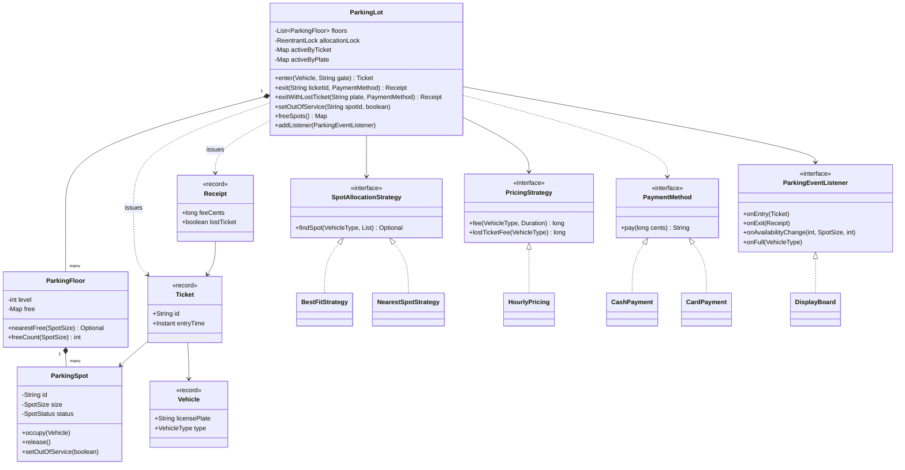
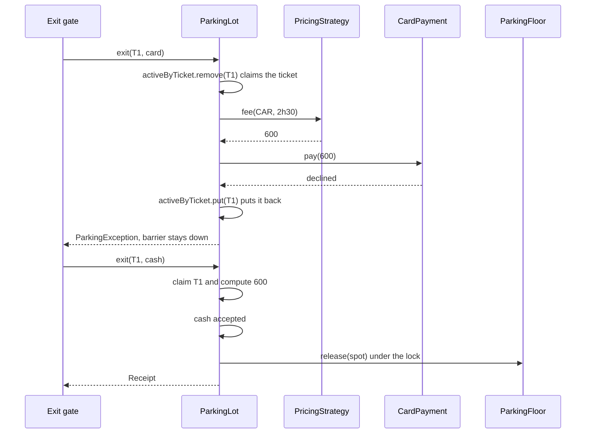
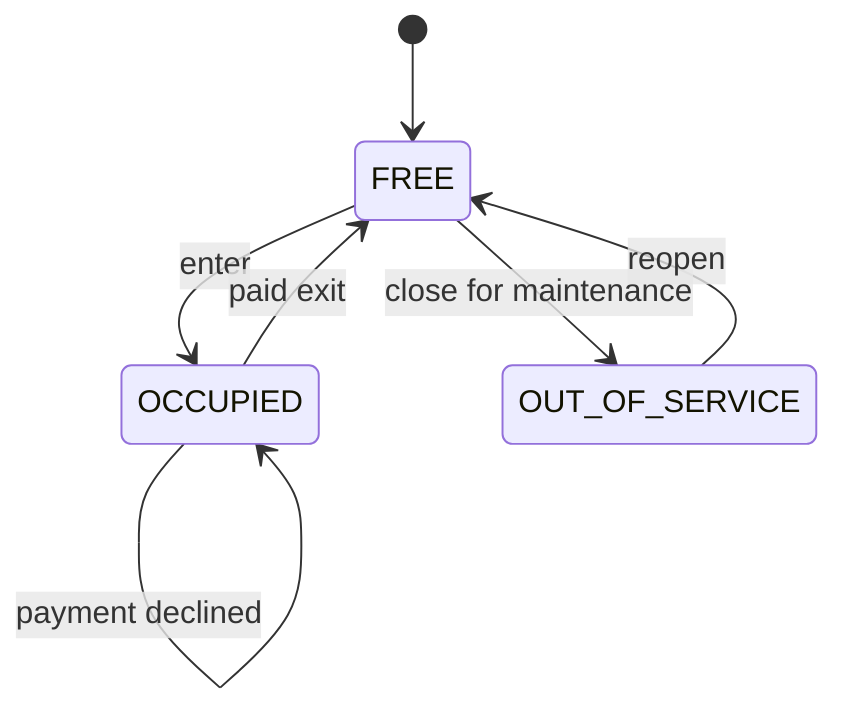

# 🅿️ Design a Parking Lot — Low Level Design (Java)


> The **most asked** LLD question. The class diagram is easy (lot, floors, spots, vehicles, tickets);
> the interview is decided by the parts people skip: **which spot** a vehicle gets, **how the fee is
> calculated**, what happens when **payment fails**, and why two entry gates can **never hand out the
> same spot**.

A multi-floor garage has spots of four sizes (motorcycle, compact, EV-charging, large). Vehicles enter
through a gate, get a ticket and a spot, and pay by the hour at the exit, with a grace period and a
daily maximum. Display boards show free spaces per floor. Several gates work at the same time.

> 📚 **Credit:** Problem inspired by
> [AlgoMaster — Design Parking Lot](https://algomaster.io/learn/lld/design-parking-lot)
> (premium lesson, **not** accessed). Everything here is my own original work, based on how real
> garages work and publicly known design patterns. See [References & Credits](#-references--credits).

---

## 📑 On this page

1. [Scoping the Problem](#1-scoping-the-problem)
2. [Finding the Building Blocks](#2-finding-the-building-blocks)
3. [Object Model](#3-object-model)
   - [3.1 Class Responsibilities](#31-class-responsibilities)
   - [3.2 Patterns in Play](#32-patterns-in-play)
   - [3.3 UML Diagrams](#33-uml-diagrams)
   - [Practice Round](#-practice-round)
4. [Implementation Walkthrough](#4-implementation-walkthrough)
5. [Build, Run & Verify](#5-build-run--verify)
6. [Follow-up Scenarios](#6-follow-up-scenarios)
   - [6.1 Many Gates, One Free Spot](#61-many-gates-one-free-spot)
   - [6.2 Best Fit or Nearest?](#62-best-fit-or-nearest)
   - [6.3 Getting the Money Right](#63-getting-the-money-right)
7. [Last-Minute Revision](#7-last-minute-revision)
- [References & Credits](#-references--credits)

---

## 1. Scoping the Problem

### 🗣️ Sample conversation

| Candidate asks | Interviewer answers | Design impact |
|---|---|---|
| Which vehicles, which spot sizes? | Motorcycle, car, electric car, van, truck. Spots: motorcycle, compact, EV, large. | `VehicleType.allowedSpots()` lists fitting sizes **in preference order**. |
| Can a small vehicle use a bigger spot? | Yes, but keep big spots for big vehicles when possible. | Allocation is a **Strategy** (best fit by default). |
| Can a normal car park in an EV spot? | No, charging bays are for EVs. EVs may fall back to compact. | `CAR → [COMPACT, LARGE]`, `ELECTRIC_CAR → [EV, COMPACT, LARGE]`. |
| How is parking charged? | Per started hour, rate per vehicle type, a daily maximum, first 15 min free. Lost ticket pays a full day. | `PricingStrategy` → `HourlyPricing`. |
| How do drivers pay? | Cash or card. Cards can be declined. | `PaymentMethod`; a decline must **not** release the spot. |
| Multiple gates? | Yes, several entry and exit gates at the same time. | Spot assignment must be **atomic**. |
| Show free spaces? | A board at the entrance per floor and size. | **Observer** events. |
| Maintenance? | A spot can be closed (out of service). | `SpotStatus.OUT_OF_SERVICE`. |

### ✅ Functional requirements

1. Multiple floors, each with spots of different sizes.
2. On entry: refuse if the same plate is already inside; otherwise assign a suitable spot and issue a ticket, or refuse with **FULL**.
3. On exit: compute the fee from the stay, take payment, free the spot, issue a receipt.
4. A ticket works **once**. A declined payment keeps the ticket valid and the vehicle inside.
5. Lost ticket: find the vehicle by plate, charge at least the lost-ticket fee.
6. Close/reopen spots for maintenance.
7. Display boards show free spots per floor and size.

### ⚙️ Non-functional requirements

- **Correctness under concurrency:** no spot ever given to two vehicles, no ticket paid twice.
- **Fast allocation:** O(log n) per floor, not a scan of every bay.
- **Extensible:** new pricing, new allocation rules, new payment types without touching `ParkingLot`.
- **Testable:** time comes from an injected `Clock`.

---

## 2. Finding the Building Blocks

Underline the nouns and verbs in the requirements:

| Noun / verb | Becomes |
|---|---|
| garage, gates | `ParkingLot` (facade: `enter`, `exit`, `exitWithLostTicket`) |
| floor | `ParkingFloor` (spots + free index) |
| spot, size, closed | `ParkingSpot`, `SpotSize`, `SpotStatus` |
| vehicle, plate, type | `Vehicle` (record), `VehicleType` |
| ticket, receipt | `Ticket`, `Receipt` (immutable records) |
| "which spot" | `SpotAllocationStrategy` → `BestFitStrategy`, `NearestSpotStrategy` |
| "how much" | `PricingStrategy` → `HourlyPricing` |
| "pay" | `PaymentMethod` → `CashPayment`, `CardPayment` |
| free-space sign | `DisplayBoard` implements `ParkingEventListener` |
| time | `java.time.Clock` (`ManualClock` in tests and the demo) |

---

## 3. Object Model

### 3.1 Class Responsibilities

#### `ParkingLot` (facade)
- Owns the floors, the active tickets (by ticket id **and** by plate), receipts and revenue.
- `enter(vehicle, gate)`: duplicate check → strategy picks a spot → occupy → ticket. All under **one lock**.
- `exit(ticketId, payment)`: *claims* the ticket (removes it from the active map), computes the fee,
  charges **outside** the lock, then frees the spot under the lock. On decline, puts the ticket back.
- Notifies listeners about entries, exits, availability changes and "full".

#### `ParkingFloor`
- Creates its spots from a layout (`size → count`); lower number = nearer the ramp.
- Keeps a `NavigableSet<ParkingSpot>` of **free** spots per size → `nearestFree(size)` is `first()`.
- Not thread-safe by itself; only the lot calls it, holding the lock.

#### `ParkingSpot`
- Id like `F0-C02` (floor 0, compact, number 2). Status `FREE / OCCUPIED / OUT_OF_SERVICE`.
- Guards its own rules: can't occupy a non-free spot, can't park a truck in a compact spot, can't close an occupied spot.

#### Strategies
- `BestFitStrategy`: for each allowed size (smallest first), the lowest floor that has one.
- `NearestSpotStrategy`: the lowest floor with anything that fits, the lowest-numbered spot there.
- `HourlyPricing`: grace period → free; otherwise started hours × rate, capped per 24 h.

### 3.2 Patterns in Play

| Pattern | Where | Why |
|---|---|---|
| **Facade** | `ParkingLot` | Gates see three calls; floors, strategies and maps stay hidden. |
| **Strategy** | `SpotAllocationStrategy`, `PricingStrategy`, `PaymentMethod` | The three things interviewers ask you to change. Swapped by constructor injection. |
| **Observer** | `ParkingEventListener`, `DisplayBoard` | Boards, analytics or an app are updated by events; the lot doesn't know them. |
| **Value objects** | `Vehicle`, `Ticket`, `Receipt` records | Immutable, safe to share across threads. |
| **Dependency injection** | `Clock` | Tests move time by hours instantly. |

**SOLID check**

- **S**: pricing doesn't know about spots; floors don't know about money.
- **O**: a weekend tariff is a new `PricingStrategy`; no edits to `ParkingLot`.
- **L**: any `PaymentMethod` either returns a reference or throws; the lot treats them the same.
- **I**: `ParkingEventListener` has default methods; a board only overrides `onAvailabilityChange`.
- **D**: `ParkingLot` depends on the three interfaces, not on concrete classes.

### 3.3 UML Diagrams

#### Class diagram



#### Sequence: exit with a declined card, then cash



#### Spot lifecycle



### 🧠 Practice Round

Try these before reading the code.

1. Two cars arrive at two gates at the same moment and there is one spot left. Walk through what stops both getting it.
   <details><summary>Hint</summary>Find-a-spot and mark-it-occupied must be one atomic step: both happen inside <code>allocationLock</code>. The second car's strategy call then sees no free spot and gets FULL.</details>
2. A driver's card is declined at the exit. What must be true afterwards?
   <details><summary>Hint</summary>The vehicle is still inside, the spot is still occupied, the ticket is still usable, revenue did not change. The code claims the ticket first and puts it back on failure.</details>
3. Why keep free spots in a sorted set per size instead of scanning all spots?
   <details><summary>Hint</summary>A big garage has thousands of bays. <code>first()</code> on a <code>TreeSet</code> gives the nearest free spot in O(log n); occupy/release are also O(log n).</details>
4. How would you add "EV spots charge extra per kWh"?
   <details><summary>Hint</summary>A decorator around <code>PricingStrategy</code> that adds the energy cost, or a richer fee input (a <code>Stay</code> object with duration and energy). <code>ParkingLot</code> stays untouched.</details>
5. How do you find the car if the ticket is lost?
   <details><summary>Hint</summary>A second index: active tickets by <b>normalised</b> plate. "ka-01 ab" and "KA01AB" must be the same key.</details>

---

## 4. Implementation Walkthrough

### 📁 Project structure

```
ParkingLot/
├── pom.xml
└── src/
    ├── main/java/com/lld/management/parkinglot/
    │   ├── ParkingLotApp.java              # console demo on a simulated clock
    │   ├── model/                          # Vehicle, VehicleType, SpotSize, SpotStatus,
    │   │                                   # ParkingSpot, Ticket, Receipt, ParkingException
    │   ├── lot/                            # ParkingLot, ParkingFloor, DisplayBoard,
    │   │                                   # ParkingEventListener, ManualClock
    │   ├── allocation/                     # SpotAllocationStrategy, BestFitStrategy, NearestSpotStrategy
    │   ├── pricing/                        # PricingStrategy, HourlyPricing
    │   └── payment/                        # PaymentMethod, CashPayment, CardPayment
    └── test/java/com/lld/management/parkinglot/
        └── ParkingLotTest.java
```

### 🚗 Which vehicle fits where

```java
public enum VehicleType {
    MOTORCYCLE(List.of(SpotSize.MOTORCYCLE, SpotSize.COMPACT, SpotSize.LARGE)),
    CAR(List.of(SpotSize.COMPACT, SpotSize.LARGE)),
    ELECTRIC_CAR(List.of(SpotSize.EV, SpotSize.COMPACT, SpotSize.LARGE)),
    VAN(List.of(SpotSize.LARGE)),
    TRUCK(List.of(SpotSize.LARGE));
    // allowedSpots() returns them in preference order; fits(size) checks membership
}
```

One table answers "can a car use an EV bay?" and "where does a motorcycle go?". No `if` chains.

### 🎯 Best fit in a few lines

```java
for (SpotSize size : type.allowedSpots()) {          // smallest suitable size first
    for (ParkingFloor floor : floors) {              // then the lowest floor
        Optional<ParkingSpot> spot = floor.nearestFree(size);
        if (spot.isPresent()) return spot;
    }
}
return Optional.empty();
```

### 🔒 Entry: one small critical section

```java
allocationLock.lock();
try {
    if (activeByPlate.containsKey(vehicle.licensePlate())) throw new ParkingException("... already inside");
    spot = allocation.findSpot(vehicle.type(), floors).orElse(null);
    if (spot == null) { listeners.forEach(l -> l.onFull(vehicle.type())); throw new ParkingException("FULL ..."); }
    floorOf(spot).occupy(spot, vehicle);
    ticket = new Ticket("T" + ticketSequence.incrementAndGet(), vehicle, spot, gate, clock.instant());
    activeByTicket.put(ticket.id(), ticket);
    activeByPlate.put(vehicle.licensePlate(), ticket);
    notifyAvailability(spot);
} finally {
    allocationLock.unlock();
}
```

### 💳 Exit: claim, pay outside the lock, then release

```java
Ticket ticket = activeByTicket.remove(ticketId);     // atomic claim: a copy of the ticket fails now
...
try {
    reference = fee == 0 ? "FREE (grace period)" : payment.pay(fee);   // may be slow, may fail
} catch (RuntimeException declined) {
    activeByTicket.put(ticket.id(), ticket);         // still parked, barrier stays down
    throw declined;
}
allocationLock.lock();
try { floorOf(ticket.spot()).release(ticket.spot()); activeByPlate.remove(...); notifyAvailability(...); }
finally { allocationLock.unlock(); }
```

A card processor can take seconds. Holding the allocation lock during payment would freeze every entry gate.

### 🧮 The fee

```java
if (stay.compareTo(grace) <= 0) return 0;
long fullDays = stay.toDays();
Duration rest = stay.minusDays(fullDays);
long seconds = rest.getSeconds() + (rest.getNano() > 0 ? 1 : 0);
long startedHours = (seconds + 3599) / 3600;           // every started hour counts
return fullDays * dailyCap + Math.min(dailyCap, startedHours * rate);
```

All money is in **cents** (`long`). Never use `double` for money.

### ⏱️ Complexity

| Operation | Cost |
|---|---|
| `enter` | O(S × F × log n): S allowed sizes (≤ 3), F floors, TreeSet lookup |
| `exit` | O(log n) + payment |
| `exitWithLostTicket` | O(1) plate lookup + exit |
| `freeSpots` | O(F × sizes) |

---

## 5. Build, Run & Verify

### With Maven

```bash
cd Management-Systems/ParkingLot
mvn test
mvn compile exec:java
```

### Without Maven (plain JDK 17+)

```bash
cd Management-Systems/ParkingLot
javac -d out $(find src/main -name "*.java")
java -cp out com.lld.management.parkinglot.ParkingLotApp
```

### Demo output

```
City Centre Garage, free spaces at opening:
   Floor 0: MOTORCYCLE=1  COMPACT=3  EV=1  LARGE=1
   Floor 1: MOTORCYCLE=2  COMPACT=3  EV=1  LARGE=1
   IN  CAR KA01AB1234 -> F0-C02 (T1)
   IN  ELECTRIC_CAR EV777 -> F0-E05 (T2)
   IN  MOTORCYCLE MH12BK42 -> F0-M01 (T3)
   IN  TRUCK TRK9 -> F0-L06 (T4)
   IN  TRUCK TRK10 -> F1-L07 (T5)
   IN  TRUCK TRK11 [refused] FULL for TRUCK
   IN  CAR KA01AB1234 [refused] KA01AB1234 is already inside

   Floor 0: MOTORCYCLE=FULL  COMPACT=2  EV=FULL  LARGE=FULL
   Floor 1: MOTORCYCLE=2  COMPACT=3  EV=1  LARGE=FULL

> motorcycle leaves after 10 min (grace period)
   T3 MH12BK42 parked 0h10m, paid $0.00 (FREE (grace period))

> car pays by card: declined
   [refused] Card declined

> car pays $10 cash after 2h30
   T1 KA01AB1234 parked 2h30m, paid $6.00 (CASH, change 400c)

> same ticket used again
   [refused] Unknown or already used ticket T1

> truck after 11h30 (daily cap)
   T4 TRK9 parked 11h30m, paid $40.00 (CARD card-1111)

> EV driver lost the ticket
   T2 EV777 parked 11h30m, paid $20.00 [lost ticket] (CASH, change 3000c)
   (ticket T2 can no longer be used)

Revenue: $66.00 from 4 exits, 1 vehicles still inside
   Floor 0: MOTORCYCLE=1  COMPACT=3  EV=1  LARGE=1
   Floor 1: MOTORCYCLE=2  COMPACT=3  EV=1  LARGE=FULL
```

Note the second "KA-01-AB-1234" written as "KA01AB1234" is recognised as the same car.

### ✅ What the tests cover

| Area | Tests |
|---|---|
| Allocation | best fit keeps large spots free; nearest takes a large spot for a car; best fit goes upstairs rather than waste a large spot; EV → EV then compact; cars never take EV bays; motorcycle order |
| Entry & exit | FULL + `onFull` event; duplicate plate (different spelling); spot reuse; re-entry after leaving; ticket used twice; declined card and short cash keep the car inside; lost ticket by plate; multi-day lost ticket; out-of-service spots |
| Pricing | 13 parameterised cases: grace edge, started hours, per-type rates, daily cap, multiple days; 1-second / 1-nanosecond rounding; validation; grace exit never charges the card |
| Observers | display board counts after entry, exit and closing a spot; event order |
| Concurrency | 200 drivers through 8 gates for 50 spots: no spot twice, exactly 150 refused; every ticket presented twice at once: each paid exactly once, all spots free again |

**34 tests, all passing.**

---

## 6. Follow-up Scenarios

### 6.1 Many Gates, One Free Spot

- **Single process:** one `ReentrantLock` around find + occupy. The section is microseconds long, so
  one lock is fine even with dozens of gates. Payment happens outside it.
- **Finer locks:** a lock per floor or per size, but then "best fit across floors" must lock several
  floors in a fixed order (deadlock-free), which is more complex than it is worth here.
- **Distributed (many garages, one backend):** allocate in the database with a conditional update
  (`UPDATE spot SET status='OCCUPIED' WHERE id=? AND status='FREE'`) and retry the next candidate if
  0 rows changed. Optimistic, no global lock.
- **Double exit:** `ConcurrentHashMap.remove(ticketId)` is the atomic "claim". Only one caller gets
  the ticket back; the other gets `null`.

### 6.2 Best Fit or Nearest?

| | Best fit | Nearest |
|---|---|---|
| Goal | Keep big spots for big vehicles | Shortest walk / drive |
| Risk | Car sent upstairs while a large spot sits empty below | Trucks turned away while cars sit in large spots |
| Good for | Mixed traffic, trucks and vans | Mostly cars, customer comfort |

Other strategies to discuss: **per-gate nearest** (distance from the gate used), **reserved spots**
(disabled, staff, pre-booked), **spread load** across floors to avoid ramp congestion.

### 6.3 Getting the Money Right

- Money in **cents** as `long`; no floating point.
- **Grace period** is inclusive (15:00 is free, 15:01 is not); test the edge.
- **Every started hour** counts: 1 h 0 m 1 s is 2 hours.
- **Daily cap** applies per 24-hour block, so 3 days cost 3 caps, not 1.
- **Lost ticket** = `max(real fee, lost-ticket fee)`, so losing the ticket after 3 days is not a discount.
- **Payment failure** never frees the spot. Charge first, release second.
- **Idempotency** for card payments: in production pass the ticket id as an idempotency key so a
  network retry does not charge twice.

### 🚀 More follow-ups to practice

1. **Reservations:** book a spot for 2–4 pm. (A spot gets time slots; allocation checks overlaps.)
2. **EV charging:** charge per kWh on top of time; free the charger when charging ends (Decorator on pricing).
3. **Monthly passes:** some plates pay nothing (a `PricingStrategy` wrapper that checks a pass list).
4. **Dynamic pricing:** higher rates when occupancy > 80% (strategy reads `freeSpots()`).
5. **Entry by number-plate camera** instead of paper tickets (the plate index already supports it).
6. **Multiple garages** in a city app: nearest garage with space, from each lot's `hasSpaceFor`.

---

## 7. Last-Minute Revision

- `ParkingLot` facade → floors → spots. Tickets and receipts are immutable records.
- `VehicleType.allowedSpots()` = which sizes fit, in preference order. Cars never take EV bays.
- Free spots per size in a **sorted set** → nearest free spot in O(log n).
- **Three strategies**: allocation (best fit / nearest), pricing (hourly + grace + daily cap), payment (cash / card).
- **One lock** for find + occupy; **payment outside** the lock.
- Ticket claimed by `remove` → a ticket can't exit twice; put back if payment fails.
- Lost ticket: lookup by normalised plate; fee = max(real fee, one day).
- Display boards are **observers** fed inside the lock, so counts are never stale or out of order.
- Money in cents, time from an injected `Clock`.

---

## 📚 References & Credits

| Resource | How it was used |
|---|---|
| [AlgoMaster.io — Design Parking Lot (LLD)](https://algomaster.io/learn/lld/design-parking-lot) | Inspiration for the **problem choice** only. The lesson is premium and was **not** accessed. |
| [Multistorey car park — Wikipedia](https://en.wikipedia.org/wiki/Multistorey_car_park) | Public background on garage layout and operation. |
| [Refactoring.Guru — Strategy](https://refactoring.guru/design-patterns/strategy), [Observer](https://refactoring.guru/design-patterns/observer), [Facade](https://refactoring.guru/design-patterns/facade) | Public pattern definitions. |
| [Java `ConcurrentHashMap`](https://docs.oracle.com/en/java/javase/17/docs/api/java.base/java/util/concurrent/ConcurrentHashMap.html) / [`ReentrantLock`](https://docs.oracle.com/en/java/javase/17/docs/api/java.base/java/util/concurrent/locks/ReentrantLock.html) | Concurrency building blocks. |
| [Mermaid](https://mermaid.js.org/) | Diagrams rendered by GitHub. |
| [JUnit 5 User Guide](https://junit.org/junit5/docs/current/user-guide/) | Testing. |

**Originality statement**

- This repository is a **personal learning project** for LLD interview preparation.
- The AlgoMaster lesson is premium content that I have not accessed. No text, code, diagrams,
  headings or other material from it (or any paid source) is reproduced here.
- All headings, source code, explanations, tables, diagrams, tests and exercises were written
  independently from publicly known behaviour and the public references above.
- This project is **not affiliated with or endorsed by** AlgoMaster.io. "AlgoMaster" is the
  property of its respective owner.
- For the original lesson, please support the author at [algomaster.io](https://algomaster.io).

---

> ⭐ Try the Practice Round before reading the code, then compare your design with this one.
