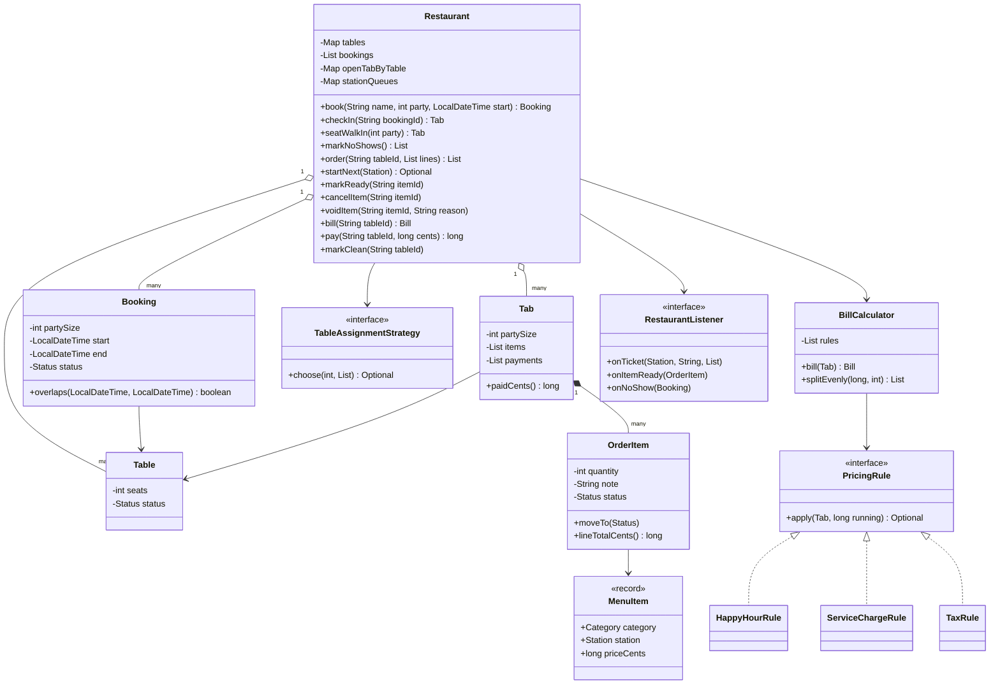
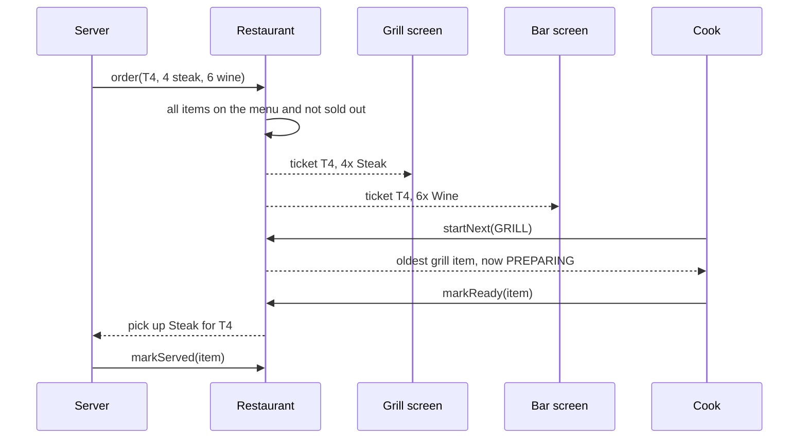
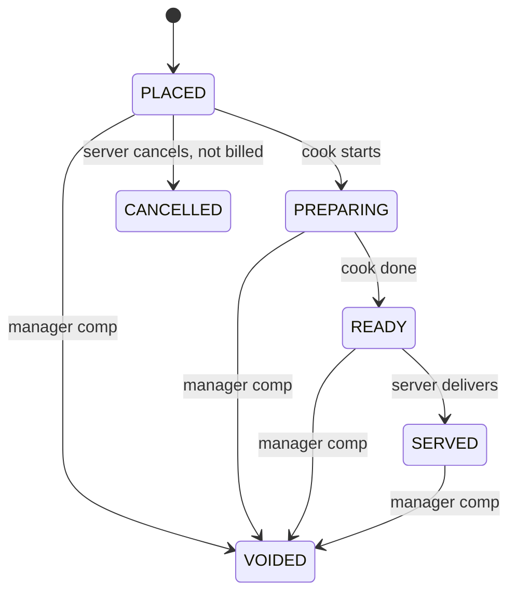

# 🍽️ Design a Restaurant Management System — Low Level Design (Java)


> Three systems in one building: the **host stand** (bookings, walk-ins, no-shows), the **kitchen**
> (tickets routed to stations, each working first in, first out) and the **cashier** (a bill built from
> ordered rules, split payments). The interview is about keeping them consistent: never double-book a
> table, never charge for a cancelled dish, never close a bill while food is still coming.

> 📚 **Credit:** Problem inspired by
> [AlgoMaster — Design Restaurant Management System](https://algomaster.io/learn/lld/design-restaurant-management-system)
> (premium lesson, **not** accessed). Everything here is my own original work, based on how restaurants
> commonly operate and publicly known design patterns. See [References & Credits](#-references--credits).

---

## 📑 On this page

1. [Scoping the Problem](#1-scoping-the-problem)
2. [Finding the Building Blocks](#2-finding-the-building-blocks)
3. [Object Model](#3-object-model)
   - [3.1 Class Responsibilities](#31-class-responsibilities)
   - [3.2 Patterns in Play](#32-patterns-in-play)
   - [3.3 UML Diagrams](#33-uml-diagrams)
   - [Practice Round](#-practice-round)
4. [Implementation Walkthrough](#4-implementation-walkthrough)
5. [Build, Run & Verify](#5-build-run--verify)
6. [Follow-up Scenarios](#6-follow-up-scenarios)
   - [6.1 Tables as Time Slots](#61-tables-as-time-slots)
   - [6.2 From Order to Plate](#62-from-order-to-plate)
   - [6.3 Bills That Add Up](#63-bills-that-add-up)
7. [Last-Minute Revision](#7-last-minute-revision)
- [References & Credits](#-references--credits)

---

## 1. Scoping the Problem

### 🗣️ Sample conversation

| Candidate asks | Interviewer answers | Design impact |
|---|---|---|
| Reservations or walk-ins? | Both. A booking holds a table for 2 hours. | `Booking` with a slot `[start, end)`; overlap checks. |
| Which table does a party get? | The smallest one that fits. | `TableAssignmentStrategy`. |
| Late guests? | 15 minutes grace, then it's a no-show. | `checkIn` refuses late arrivals; `markNoShows()`. |
| How does the kitchen get orders? | Each station (grill, cold, pastry, bar) has its own screen. | One ticket per station; station queues. |
| Can orders be changed? | Cancel before cooking; after that a manager voids (comps) it. | `OrderItem` lifecycle: CANCELLED vs VOIDED. |
| Dish runs out? | Mark it sold out; orders with it are refused. | `setSoldOut`. |
| Bill? | Happy hour 50% off drinks 17–19h, 10% service for 6+, 8% tax. | Ordered `PricingRule` chain. |
| Split bills? | Yes, evenly or any amounts; overpayment is a tip. | Partial payments on a `Tab`. |
| Table turnover? | Paid → cleaning → free. | `Table.Status`. |

### ✅ Functional requirements

1. Menu with prices, categories and kitchen stations; mark items sold out.
2. Book a table for a slot; cancel; check in (within grace, table must be free); mark no-shows.
3. Seat walk-ins only at tables free now and not booked in the next slot.
4. Order (all lines or none); route to stations; cooks take the oldest item; ready → served.
5. Cancel items not yet started; managers void items with a reason.
6. Bill with configurable rules; partial payments; close only when paid and nothing is in progress.
7. Cleaning frees the table for the next party.

### ⚙️ Non-functional requirements

- No double-booked tables; no item cooked twice by two cooks; totals always exact to the cent.
- New pricing rules or seating preferences without touching the core.
- Screens and handhelds updated by events.

---

## 2. Finding the Building Blocks

| Noun / verb | Becomes |
|---|---|
| menu, dish, station | `MenuItem` (+ `Category`, `Station`) |
| table | `Table` (+ `Status`) |
| reservation | `Booking` (+ `Status`) |
| a party's visit | `Tab` |
| ordered line | `OrderItem` (+ lifecycle) |
| "which table" | `TableAssignmentStrategy` |
| "how much" | `BillCalculator` + `PricingRule`s → `Bill`, `BillLine` |
| screens, handhelds | `RestaurantListener` |
| everything | `Restaurant` (facade) |

---

## 3. Object Model

### 3.1 Class Responsibilities

#### `Restaurant` (facade)
- Host stand: `book`, `cancelBooking`, `checkIn`, `seatWalkIn`, `markNoShows`.
- Kitchen: `order`, `startNext(station)`, `markReady`, `markServed`, `cancelItem`, `voidItem`.
- Cashier: `bill`, `pay`, `markClean`.
- One lock for all state; events after the lock.

#### `OrderItem`
- Owns its lifecycle table (`next()`), so illegal moves throw regardless of who calls.

#### `BillCalculator` + `PricingRule`
- Item lines (cancelled hidden, voided at $0), then each rule in order on the running total.
- `splitEvenly` shares that differ by at most 1 cent and add up exactly.

#### `TableAssignmentStrategy`
- `smallestFit()` (default) or `firstAvailable()`; the restaurant filters candidates first.

### 3.2 Patterns in Play

| Pattern | Where | Why |
|---|---|---|
| **Facade** | `Restaurant` | One API for host, servers, cooks and cashier. |
| **Strategy** | `TableAssignmentStrategy` | Seating preference is a business choice. |
| **Chain of Responsibility** | `PricingRule` list | Discounts → service → tax, each on the result of the previous. |
| **Observer** | `RestaurantListener` | Kitchen display, handhelds, host stand. |
| **State (table-driven)** | `OrderItem.Status.next()`, `Table.Status`, `Booking.Status` | Explicit lifecycles. |
| **Producer–consumer** | station queues | Servers produce, cooks consume FIFO. |

**SOLID check**

- **S**: rules price, strategy seats, facade coordinates.
- **O**: "Tuesday 2-for-1 desserts" is a new `PricingRule`.
- **L**: any `PricingRule` returns a line or nothing.
- **I**: listeners only override the screens they drive.
- **D**: the facade depends on strategy/calculator abstractions and `Clock`.

### 3.3 UML Diagrams

#### Class diagram



#### Sequence: order to table



#### Order item lifecycle



### 🧠 Practice Round

1. A table is free right now. Why might a walk-in still not get it?
   <details><summary>Hint</summary>Someone booked it for 18:00 and the walk-in would sit for 2 hours. Check <code>[now, now + slot)</code> against active bookings.</details>
2. What is the difference between cancelling and voiding an item?
   <details><summary>Hint</summary>Cancel: nothing was cooked, it disappears. Void: food was made (cost to the business) but not charged, recorded with a reason for reporting and fraud checks.</details>
3. Why does the order of pricing rules matter?
   <details><summary>Hint</summary>Tax on the discounted amount vs the full price gives different totals; service charge may or may not be taxed. The rules list encodes that policy.</details>
4. Six guests split $184.14. How do you make sure the shares add up?
   <details><summary>Hint</summary>Integer cents: base = total / n, and the first total % n people pay one cent more.</details>
5. Two cooks press "next" on the grill screen at the same instant. How do you stop both getting the same steak?
   <details><summary>Hint</summary><code>pollFirst</code> and the status change happen under the same lock: the item leaves the queue for exactly one cook.</details>

---

## 4. Implementation Walkthrough

### 📁 Project structure

```
RestaurantManagementSystem/
├── pom.xml
└── src/
    ├── main/java/com/lld/management/restaurant/
    │   ├── RestaurantApp.java           # one evening at a bistro
    │   ├── model/                       # MenuItem, Table, Booking, Tab, OrderItem, RestaurantException
    │   ├── seating/                     # TableAssignmentStrategy
    │   ├── billing/                     # BillCalculator, PricingRule, HappyHourRule, ServiceChargeRule, TaxRule, Bill, BillLine
    │   └── core/                        # Restaurant, RestaurantListener, ManualClock
    └── test/java/com/lld/management/restaurant/
        └── RestaurantTest.java
```

### 🪑 Walk-ins respect upcoming bookings

```java
List<Table> candidates = tables.values().stream()
        .filter(t -> t.status() == Table.Status.FREE && t.seats() >= partySize)
        .filter(t -> !bookedDuring(t, now, now.plus(slot)))
        .toList();
Table table = seating.choose(partySize, candidates).orElseThrow(...);
```

### 🍳 One order, one ticket per station

```java
for (Line l : lines) {
    OrderItem item = new OrderItem(..., m, l.quantity(), l.note(), now);
    tab.add(item);
    stationQueues.get(m.station()).addLast(item);
    tickets.computeIfAbsent(m.station(), k -> new ArrayList<>()).add(item);
}
// after the lock: one onTicket(station, table, items) per station
```

### 🧮 Bill = items, then rules on the running total

```java
long running = subtotal;
for (PricingRule rule : rules) {
    Optional<BillLine> line = rule.apply(tab, running);
    if (line.isPresent()) { adjustments.add(line.get()); running += line.get().amountCents(); }
}
```

Percentages are in **basis points** (800 = 8%) and rounded half up in integer cents:
`(amount * bps + 5000) / 10000`.

### 💳 Closing the tab

```java
if (cents >= due && anything still PLACED/PREPARING/READY) throw ...;   // food still coming
tab.addPayment(cents);
if (tab.paidCents() >= total) { close tab; table -> CLEANING; booking -> COMPLETED; }
```

### ⏱️ Complexity

| Operation | Cost |
|---|---|
| book / walk-in | O(T × B) tables × bookings (index bookings per table to reduce) |
| order | O(L) lines |
| startNext / markReady | O(1) |
| bill | O(I × R) items × rules |

---

## 5. Build, Run & Verify

### With Maven

```bash
cd Management-Systems/RestaurantManagementSystem
mvn test
mvn compile exec:java
```

### Without Maven (plain JDK 17+)

```bash
cd Management-Systems/RestaurantManagementSystem
javac -d out $(find src/main -name "*.java")
java -cp out com.lld.management.restaurant.RestaurantApp
```

### Demo output (excerpt)

```
> 17:30 bookings
   B1 Rao x6 at T4 18:00-20:00 [BOOKED]
   B2 Kim x2 at T1 18:00-20:00 [BOOKED]
   B3 Silva x3 at T3 19:00-21:00 [BOOKED]
   B4 Ivanova x6 at T4 20:00-22:00 [BOOKED]
   [refused] No table for 5 at 19:00

> 17:30 walk-ins (T1 is booked at 18:00, T3 at 19:00, T4 at 18:00)
   TAB1 at T2 for 2, seated 17:30
   [refused] No free table for 4 right now

> Kitchen works its stations first in, first out
   GRILL starts I2 1x Bistro burger (no onions) [PREPARING]
   COLD starts I3 1x Tomato soup [PREPARING]
   BAR starts I1 2x Glass of red [PREPARING]
   [refused] Bistro burger is already PREPARING; ask a manager to void it
   manager voided I2 1x Bistro burger (no onions) [VOIDED]

> 18:20 Kim is a no-show
   [host] no-show: B2 Kim x2 at T1 18:00-20:00 [NO_SHOW]

> Bill for T4 (party of 6, split six ways)
   4x Steak frites                                 $96.00
   2x Bistro burger                                $32.00
   6x Glass of red                                 $54.00
   Subtotal                                       $182.00
   Happy hour 50% off drink                       -$27.00
   Service 10.0% (party of 6)                      $15.50
   Tax 8.0%                                        $13.64
   TOTAL                                          $184.14
   shares: $30.69 $30.69 $30.69 $30.69 $30.69 $30.69
   settled; T4 is CLEANING

> 20:00 the Ivanovas arrive, but T4 hasn't been bussed yet
   [refused] T4 is still CLEANING; please wait at the bar
   T4 bussed: FREE
   TAB4 at T4 for 6, seated 20:00
```

### ✅ What the tests cover

| Area | Tests |
|---|---|
| Seating | smallest fit, overlapping slots, back-to-back slots, oversize party, past times; first-available wastes big tables; walk-ins avoid soon-booked tables; check-in grace and no-shows; cancel frees the slot; booked table still occupied/cleaning means wait; a completed booking frees the rest of its slot |
| Kitchen | one ticket per station, FIFO per station, sold-out rejects the whole order, lifecycle enforcement, cancel before cooking / void after with reason, ordering needs a seated party |
| Billing | discount → service → tax on the running total (happy hour by order time), cancelled vs voided lines, 7 rounding cases, even split sums exactly, split payments + tip + cleaning, can't settle while food is coming |
| Concurrency | 6 cooks draining 200 grill items: every item taken exactly once |

**26 tests, all passing.**

---

## 6. Follow-up Scenarios

### 6.1 Tables as Time Slots

- A booking is an interval; two bookings conflict when `a.start < b.end && b.start < a.end`.
- Index bookings per table (sorted by start, e.g. a `TreeMap`) to check overlaps in O(log n).
- **Combining tables** for large parties: candidates become sets of adjacent tables (a small search).
- Variable dining time by party size or time of day; a buffer between slots for cleaning.
- **Waitlist** for walk-ins with estimated wait times, notified when a table is freed (`onTableFree`).

### 6.2 From Order to Plate

- **Courses**: hold mains until starters are served ("fire mains" command per table).
- **Priorities**: allergies or VIP tables jump the queue (priority queue per station).
- **Timing**: a steak takes 15 minutes, a salad 3; start them so they're ready together (backward scheduling).
- **Inventory**: decrement ingredients per dish and auto-mark sold out (see the Inventory Management System in this folder).
- Kitchen screens on separate devices: the queue lives in a service; screens subscribe to events.

### 6.3 Bills That Add Up

- Integer cents and basis points everywhere; round once per line, half up.
- Rule order is policy: tax before or after service charge differs by country.
- **Split by items**: each guest's share = their items + a proportional share of adjustments; give the
  rounding remainder to the largest share so the total stays exact.
- Voids and comps are reported separately (they cost money even if not charged).

### 🚀 More follow-ups to practice

1. **Loyalty points** earned per dollar and redeemed as a `PricingRule`.
2. **Online ordering / delivery**: tabs without tables, a packing station.
3. **Shift management**: servers assigned to sections of tables; tips pooled.
4. **Menu versions**: lunch vs dinner menus by time of day.
5. **Reports**: covers per hour, table turn time, top dishes, void rate per server.

---

## 7. Last-Minute Revision

- Facade `Restaurant`: host stand, kitchen, cashier.
- Bookings are slots; overlap rule; walk-ins must not collide with upcoming bookings; 15-min grace then no-show.
- `TableAssignmentStrategy.smallestFit()` keeps big tables for big parties.
- Order → one ticket per station → FIFO queues → PREPARING → READY → SERVED.
- Cancel (not cooked, not billed) vs void (comped, shown at $0, needs a reason).
- Bill = items + ordered `PricingRule`s on the running total; cents + basis points.
- Tab closes only when paid **and** nothing in progress; then CLEANING → FREE.

---

## 📚 References & Credits

| Resource | How it was used |
|---|---|
| [AlgoMaster.io — Design Restaurant Management System (LLD)](https://algomaster.io/learn/lld/design-restaurant-management-system) | Inspiration for the **problem choice** only. The lesson is premium and was **not** accessed. |
| [Kitchen display system — Wikipedia](https://en.wikipedia.org/wiki/Kitchen_display_system) | Public background on station screens. |
| [Refactoring.Guru — Chain of Responsibility](https://refactoring.guru/design-patterns/chain-of-responsibility), [Strategy](https://refactoring.guru/design-patterns/strategy), [Observer](https://refactoring.guru/design-patterns/observer) | Public pattern definitions. |
| [Mermaid](https://mermaid.js.org/) | Diagrams rendered by GitHub. |
| [JUnit 5 User Guide](https://junit.org/junit5/docs/current/user-guide/) | Testing. |

**Originality statement**

- This repository is a **personal learning project** for LLD interview preparation.
- The AlgoMaster lesson is premium content that I have not accessed. No text, code, diagrams,
  headings or other material from it (or any paid source) is reproduced here.
- All headings, source code, explanations, tables, diagrams, tests and exercises were written
  independently from publicly known behaviour and the public references above.
- This project is **not affiliated with or endorsed by** AlgoMaster.io. "AlgoMaster" is the
  property of its respective owner.
- For the original lesson, please support the author at [algomaster.io](https://algomaster.io).

---

> ⭐ Try the Practice Round before reading the code, then compare your design with this one.
