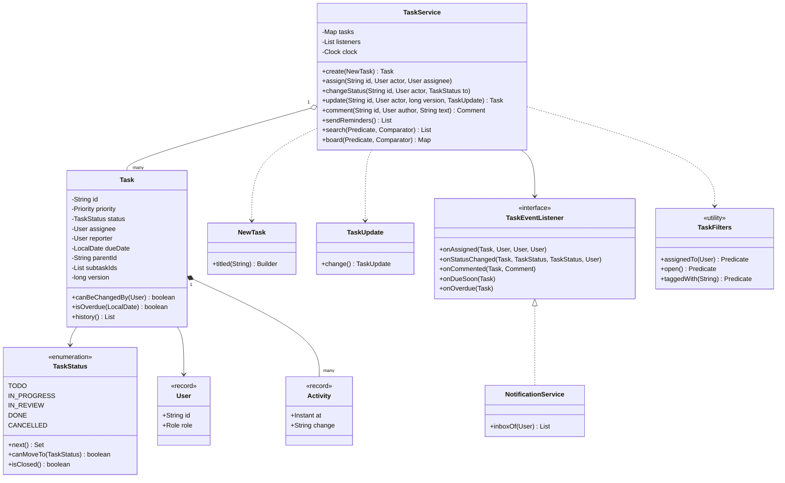
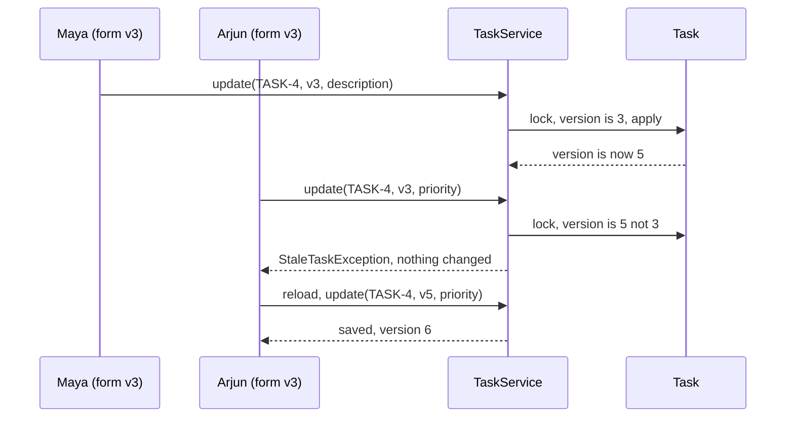
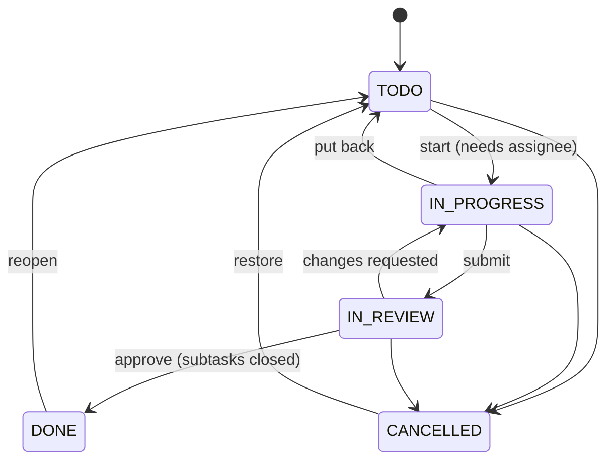

# ✅ Design a Task Management System — Low Level Design (Java)


> Think Jira, Asana or Trello, stripped down to the core. CRUD on tasks is easy; the interview is about the
> **rules**: which status can follow which, **who** may change a task, what a **subtask** means for its
> parent, how **search** stays flexible without a method per screen, and what happens when **two people
> save the same task** at the same time.

A team creates tasks with a priority, due date and tags, assigns them, moves them across a workflow
(TODO → IN_PROGRESS → IN_REVIEW → DONE), splits them into subtasks, comments and @mentions each other,
and gets reminders before and after a due date. Every change is kept in an audit history.

> 📚 **Credit:** Problem inspired by
> [AlgoMaster — Design Task Management System](https://algomaster.io/learn/lld/design-task-management-system)
> (premium lesson, **not** accessed). Everything here is my own original work, based on how common issue
> trackers behave and publicly known design patterns. See [References & Credits](#-references--credits).

---

## 📑 On this page

1. [Scoping the Problem](#1-scoping-the-problem)
2. [Finding the Building Blocks](#2-finding-the-building-blocks)
3. [Object Model](#3-object-model)
   - [3.1 Class Responsibilities](#31-class-responsibilities)
   - [3.2 Patterns in Play](#32-patterns-in-play)
   - [3.3 UML Diagrams](#33-uml-diagrams)
   - [Practice Round](#-practice-round)
4. [Implementation Walkthrough](#4-implementation-walkthrough)
5. [Build, Run & Verify](#5-build-run--verify)
6. [Follow-up Scenarios](#6-follow-up-scenarios)
   - [6.1 Two Saves, One Task](#61-two-saves-one-task)
   - [6.2 Parents, Subtasks and Lock Order](#62-parents-subtasks-and-lock-order)
   - [6.3 Search That Scales](#63-search-that-scales)
7. [Last-Minute Revision](#7-last-minute-revision)
- [References & Credits](#-references--credits)

---

## 1. Scoping the Problem

### 🗣️ Sample conversation

| Candidate asks | Interviewer answers | Design impact |
|---|---|---|
| What does a task hold? | Title, description, priority, status, assignee, reporter, due date, tags. | `Task` + a **Builder** (`NewTask`) since most fields are optional. |
| Is the workflow fixed? | TODO, In progress, In review, Done, Cancelled. No skipping to Done. | Transition table in `TaskStatus`. |
| Who may change a task? | Its reporter and assignee; managers may change anything. Anyone may comment. | `Task.canBeChangedBy(user)` checked in one place. |
| Subtasks? | One level is enough; a parent can't be Done while a subtask is open. | `parentId` + `subtaskIds`, rule in the service. |
| Search? | By assignee, status, priority, tag, due date, text; sorted by urgency or due date. | Composable `Predicate<Task>` filters + `Comparator` sorts. |
| Notifications? | Assignment, status change, comments, @mentions, due-soon and overdue reminders. | **Observer**: `TaskEventListener`, `NotificationService`. |
| Several people editing? | Yes, via web forms. | **Optimistic locking** with a version number. |
| History? | Every change must be traceable. | Append-only `Activity` list per task. |

### ✅ Functional requirements

1. Create tasks (optionally as subtasks), edit, assign, comment.
2. Move tasks only along allowed transitions; starting requires an assignee.
3. Permission rules for changes; anyone can pick up an **unassigned** task for themselves.
4. Parent can't be DONE while any subtask is open; subtasks can't be added to, or reopened under, a closed parent.
5. Search with any combination of filters and a chosen order; a kanban board view.
6. Reminders for tasks due today/tomorrow and for overdue tasks, once per day.
7. Notifications to the people involved (not the person acting) and to @mentioned users.

### ⚙️ Non-functional requirements

- **Safe under concurrent use**: no lost updates, no half-applied rule checks, no deadlocks.
- **Extensible**: new filters, sorts or notification channels without touching the service.
- **Auditable**: every change recorded with who and when.
- **Testable**: an injected `Clock`.

---

## 2. Finding the Building Blocks

| Noun / verb | Becomes |
|---|---|
| task, subtask | `Task` (with `parentId`, `subtaskIds`) |
| create with many optional fields | `NewTask.Builder` |
| edit a form | `TaskUpdate` (partial change) + expected version |
| status, workflow | `TaskStatus` (enum with a transition table) |
| priority | `Priority` (ordered enum) |
| user, manager | `User` record with `Role` |
| comment, history | `Comment`, `Activity` records |
| "move", "assign", "remind" | `TaskService` (facade) |
| "find tasks where..." | `TaskFilters` (Specification), `TaskSort` (Strategy) |
| "notify" | `TaskEventListener` → `NotificationService` |

---

## 3. Object Model

### 3.1 Class Responsibilities

#### `TaskService` (facade)
- The only way to change a task. Checks **permission → workflow → hierarchy → version**, then applies.
- Publishes events **after** the change and **outside** locks.
- `search`, `board`, `sendReminders` (idempotent per day).

#### `Task`
- Holds state; getters are public, setters are package-private (only the service can call them).
- Every setter writes an `Activity` and bumps the `version`.
- All methods `synchronized`: the service holds the same monitor for check-then-change.

#### `TaskStatus`
- `next()` returns the allowed targets; `canMoveTo` and `isClosed` (DONE or CANCELLED).

#### `NewTask`, `TaskUpdate`
- Builder for creation (title + reporter required, sensible defaults), partial update for edits.

#### `TaskFilters`, `TaskSort`
- Tiny predicates (`assignedTo`, `open`, `priorityAtLeast`, `taggedWith`, `dueBy`, `overdue`, `text`...) that combine with `and` / `or` / `negate`; comparators with a stable tie-breaker.

#### `NotificationService`
- Listener that turns events into inbox messages for the right people.

### 3.2 Patterns in Play

| Pattern | Where | Why |
|---|---|---|
| **Facade** | `TaskService` | One entry point enforcing every rule. |
| **Builder** | `NewTask.Builder` | Many optional fields, readable call sites, validation at `build()`. |
| **Specification** | `TaskFilters` | Filters are objects that compose; no `searchByAssigneeAndStatusAndTag(...)`. |
| **Strategy** | `TaskSort` comparators | Ordering chosen by the caller. |
| **Observer** | `TaskEventListener`, `NotificationService` | E-mail, Slack, webhooks become new listeners. |
| **State (table-driven)** | `TaskStatus.next()` | Workflow rules in data, not scattered `if`s. |
| **Optimistic locking** | `version` + `StaleTaskException` | Detects lost updates without holding locks while a user types. |

**SOLID check**

- **S**: `Task` stores, `TaskService` decides, `NotificationService` informs.
- **O**: new filter = new static method; new channel = new listener.
- **L**: every `TaskEventListener` can be plugged in; all methods have safe defaults.
- **I**: listeners override only the events they care about.
- **D**: the service depends on `Clock` and the listener interface, not on concrete notifiers.

### 3.3 UML Diagrams

#### Class diagram



#### Sequence: a stale save



#### Workflow



### 🧠 Practice Round

1. Why keep transitions in a table instead of `if (status == X && target == Y)` checks inside the service?
   <details><summary>Hint</summary>One source of truth: the error message can list the allowed moves, the UI can grey out buttons with <code>next()</code>, and a parameterised test checks all 25 pairs.</details>
2. Two people open the same task, both edit, both save. What should happen?
   <details><summary>Hint</summary>First save wins; the second gets "changed by someone else" and must reload. Compare the version the form was loaded with against the current one, under the task's lock.</details>
3. Closing a parent checks its subtasks; reopening a subtask checks its parent. How do you avoid deadlock?
   <details><summary>Hint</summary>Always lock the parent before the child, whichever task the request is about.</details>
4. The product team wants "my open bugs due this week" on the home page. What changes in the service?
   <details><summary>Hint</summary>Nothing. <code>assignedTo(me).and(open()).and(taggedWith("bug")).and(dueBy(sunday))</code>.</details>
5. Should a comment make an open edit form stale?
   <details><summary>Hint</summary>No: comments don't change fields the form shows, so they don't bump the version here.</details>

---

## 4. Implementation Walkthrough

### 📁 Project structure

```
TaskManagementSystem/
├── pom.xml
└── src/
    ├── main/java/com/lld/management/tasks/
    │   ├── TaskManagerApp.java          # one sprint week on a simulated clock
    │   ├── model/                       # Priority, TaskStatus, User, Comment, Activity, exceptions
    │   ├── core/                        # Task, TaskService, NewTask, TaskUpdate, TaskEventListener, ManualClock
    │   ├── search/                      # TaskFilters, TaskSort
    │   └── notify/                      # NotificationService
    └── test/java/com/lld/management/tasks/
        └── TaskServiceTest.java
```

### 🚦 The workflow is data

```java
public Set<TaskStatus> next() {
    return switch (this) {
        case TODO -> EnumSet.of(IN_PROGRESS, CANCELLED);
        case IN_PROGRESS -> EnumSet.of(TODO, IN_REVIEW, CANCELLED);
        case IN_REVIEW -> EnumSet.of(IN_PROGRESS, DONE, CANCELLED);
        case DONE, CANCELLED -> EnumSet.of(TODO);
    };
}
```

### 🔐 One status change, every rule

```java
private TaskStatus applyStatus(Task task, Task parent, User actor, TaskStatus target) {
    requireCanChange(task, actor);                                   // permission
    TaskStatus from = task.status();
    if (!from.canMoveTo(target)) throw ...;                          // workflow
    if (target == IN_PROGRESS && task.assignee() == null) throw ...; // ownership
    if (target == DONE && any subtask open) throw ...;               // hierarchy (down)
    if (parent != null && from.isClosed() && parent.status().isClosed()) throw ...; // hierarchy (up)
    task.setStatus(target, actor, clock.instant());                  // history + version++
    return from;
}
```

Called while holding `synchronized (parent) { synchronized (task) { ... } }`.

### 🧾 Optimistic locking

```java
synchronized (task) {
    requireCanChange(task, actor);
    if (task.version() != expectedVersion) {
        throw new StaleTaskException(taskId, expectedVersion, task.version());
    }
    // apply only the fields present in the TaskUpdate
}
```

### 🔎 Composable search

```java
service.search(assignedTo(arjun).and(open()).and(priorityAtLeast(HIGH)), TaskSort.BY_URGENCY);
```

### ⏰ Reminders without spamming

```java
if (remindersSent.add(task.id() + "|overdue|" + today)) {   // Set.add is false if already sent today
    listeners.forEach(l -> l.onOverdue(task));
}
```

### ⏱️ Complexity

| Operation | Cost |
|---|---|
| create, assign, comment, update | O(1) (+ O(k) tags) |
| changeStatus to DONE | O(s) subtasks |
| search / board | O(n log n) over all tasks (see 6.3 for indexes) |
| sendReminders | O(n) |

---

## 5. Build, Run & Verify

### With Maven

```bash
cd Management-Systems/TaskManagementSystem
mvn test
mvn compile exec:java
```

### Without Maven (plain JDK 17+)

```bash
cd Management-Systems/TaskManagementSystem
javac -d out $(find src/main -name "*.java")
java -cp out com.lld.management.tasks.TaskManagerApp
```

### Demo output (excerpt)

```
> Maya plans the week
   [TODO]
     TASK-4   CRITICAL  TODO        Fix login timeout            (unassigned)  due 2026-06-02
     TASK-1   HIGH      TODO        New checkout page            (unassigned)  due 2026-06-05
     TASK-2   MEDIUM    TODO        Card form                    @Lena  due 2026-06-03
     TASK-3   MEDIUM    TODO        Payment API client           @Arjun  due 2026-06-04
     TASK-5   LOW       TODO        Update README                (unassigned)

> Rules that say no
   Lena moves Arjun's API task: [refused] Lena may not change TASK-3 (only its reporter, assignee or a manager)
   Arjun jumps TODO -> DONE: [refused] Can't move TASK-3 from TODO to DONE (allowed: [IN_PROGRESS, CANCELLED])
   Maya starts the parent (no assignee): [refused] Assign TASK-1 before starting it

> Two people edit the same task from stale screens
   Arjun saves his older form: [refused] Task TASK-4 was changed by someone else (you had version 3, it is now 5)
   Arjun reloads version 5 and saves again

> Thursday: the card form is late
   reminder sent for TASK-2 (overdue)
   reminder sent for TASK-3
   reminder sent for TASK-4 (overdue)
   Maya closes the parent early: [refused] TASK-1 has open subtasks [TASK-3]
   Lena reopens the finished card form: [refused] Parent TASK-1 is DONE; reopen it first

> History of TASK-4
   2026-06-01T09:00:00Z Arjun: created
   2026-06-01T09:00:00Z Arjun: assignee nobody -> Arjun
   2026-06-01T09:00:00Z Arjun: status TODO -> IN_PROGRESS
   2026-06-01T09:00:00Z Maya: description edited
   2026-06-01T09:00:00Z Maya: tag +auth
   2026-06-01T09:00:00Z Arjun: priority CRITICAL -> HIGH
   2026-06-02T09:00:00Z Arjun: status IN_PROGRESS -> IN_REVIEW
   2026-06-04T09:00:00Z Arjun: status IN_REVIEW -> DONE

> Inboxes
   Lena:
     - Maya assigned you TASK-2 'Card form'
     - Reminder: TASK-2 is due 2026-06-03
     - Arjun mentioned you on TASK-4
     - OVERDUE: TASK-2 was due 2026-06-03
```

### ✅ What the tests cover

| Area | Tests |
|---|---|
| Creation | builder defaults, ids, required fields, case-insensitive tags, unknown ids |
| Workflow | full path with history; **every one of the 25 from/to pairs** checked against the table; starting needs an assignee |
| Permissions | reporter/assignee/manager only; self-pickup of unassigned tasks only; anyone comments; closed tasks can't be reassigned |
| Subtasks | parent blocked by open subtasks (cancelled counts as closed); no subtasks under / reopening under a closed parent |
| Editing | partial update, stale version rejected with nothing changed, comments don't cause staleness, no-op edits keep the version |
| Search | composed filters, three sort orders, board columns |
| Reminders & inbox | once per day, only open + assigned; right recipients, never the actor, no duplicate for mentions |
| Concurrency | 16 simultaneous saves with the same version → exactly 1 winner; parent/child closing race ×50 without deadlock |

**27 tests, all passing.**

---

## 6. Follow-up Scenarios

### 6.1 Two Saves, One Task

- **Pessimistic** ("lock the task while someone edits") blocks others for minutes and leaks locks when a browser closes.
- **Optimistic** (this design): read with a version, write only if the version is unchanged. In SQL:
  `UPDATE task SET ..., version = version + 1 WHERE id = ? AND version = ?` and check the row count.
- **Field-level merge**: if the two edits touched different fields, merge instead of rejecting. Keep the
  base snapshot, diff both sides, reject only true conflicts.
- Workflow actions (start, done) don't need the form version: they re-check the rules under the lock.

### 6.2 Parents, Subtasks and Lock Order

- A rule that spans two objects needs both locked. Pick a **global order** (parent before child) and
  always follow it. Deadlock needs a cycle; a fixed order makes a cycle impossible.
- Deep hierarchies (epic → story → subtask): lock from the root down. Or move hierarchy rules into a
  single transaction in the database.
- Alternative: **auto-complete** the parent when the last subtask closes, or **cascade cancel** to
  children. Both are policy questions to ask the interviewer.

### 6.3 Search That Scales

- In memory, a scan of a few thousand tasks is fine. Beyond that, keep **secondary indexes**
  (`assignee → ids`, `status → ids`, `tag → ids`) updated inside the same lock as the change, and start
  from the smallest matching set.
- Full-text search goes to a search engine (Elasticsearch/OpenSearch), fed by the same events the
  notification service listens to.
- Paging: sort by a stable key (`BY_URGENCY` ends with the task number) and use cursor pagination.

### 🚀 More follow-ups to practice

1. **Custom workflows per project** (e.g. add QA): load the transition table from configuration instead of the enum.
2. **Dependencies** ("B blocked by A"): a graph; refuse cycles with a DFS; can't start B until A is done.
3. **Recurring tasks**: a template + schedule that creates a new task when the previous one is done.
4. **Undo**: record each change as a command with an inverse (Command pattern + Memento).
5. **Watchers**: users who follow a task without owning it; add them to `involved()`.
6. **Time tracking / story points** and sprint burndown from the activity history.

---

## 7. Last-Minute Revision

- Facade `TaskService`; `Task` setters are package-private.
- Workflow = transition table in the enum; IN_PROGRESS needs an assignee.
- Permission: reporter, assignee or manager; self-pickup only when unassigned.
- Parent DONE only when all subtasks closed; lock **parent before child**.
- Every change → `Activity` + `version++`; form edits check the version (**optimistic locking**).
- Search = composable predicates + comparators (Specification + Strategy).
- Events after the change, outside the lock; notifications skip the actor; reminders once per day.

---

## 📚 References & Credits

| Resource | How it was used |
|---|---|
| [AlgoMaster.io — Design Task Management System (LLD)](https://algomaster.io/learn/lld/design-task-management-system) | Inspiration for the **problem choice** only. The lesson is premium and was **not** accessed. |
| [Optimistic concurrency control — Wikipedia](https://en.wikipedia.org/wiki/Optimistic_concurrency_control) | Public background on version-based conflict detection. |
| [Specification pattern — Wikipedia](https://en.wikipedia.org/wiki/Specification_pattern) | Public background on composable filters. |
| [Refactoring.Guru — Builder](https://refactoring.guru/design-patterns/builder), [Observer](https://refactoring.guru/design-patterns/observer) | Public pattern definitions. |
| [Mermaid](https://mermaid.js.org/) | Diagrams rendered by GitHub. |
| [JUnit 5 User Guide](https://junit.org/junit5/docs/current/user-guide/) | Testing. |

**Originality statement**

- This repository is a **personal learning project** for LLD interview preparation.
- The AlgoMaster lesson is premium content that I have not accessed. No text, code, diagrams,
  headings or other material from it (or any paid source) is reproduced here.
- All headings, source code, explanations, tables, diagrams, tests and exercises were written
  independently from publicly known behaviour and the public references above.
- This project is **not affiliated with or endorsed by** AlgoMaster.io. "AlgoMaster" is the
  property of its respective owner.
- For the original lesson, please support the author at [algomaster.io](https://algomaster.io).

---

> ⭐ Try the Practice Round before reading the code, then compare your design with this one.
