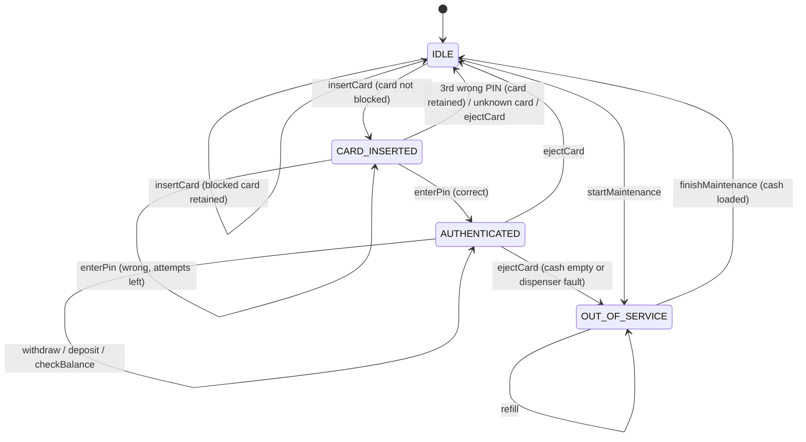
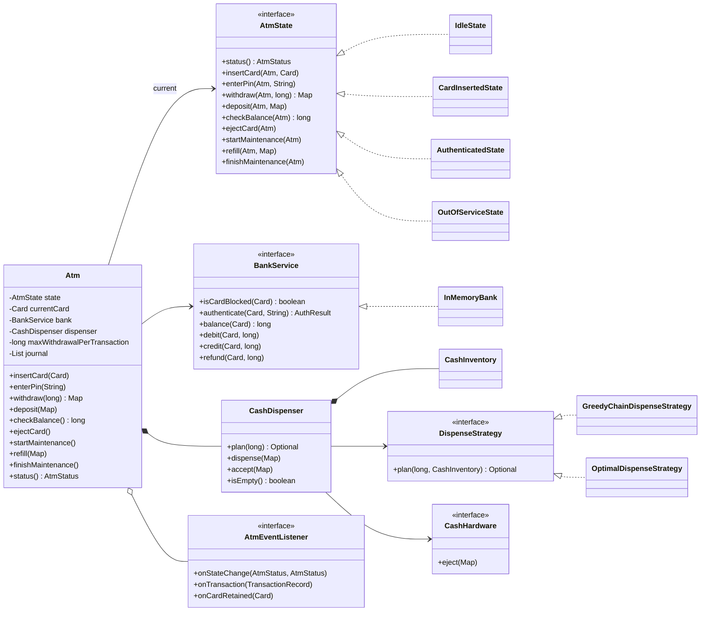
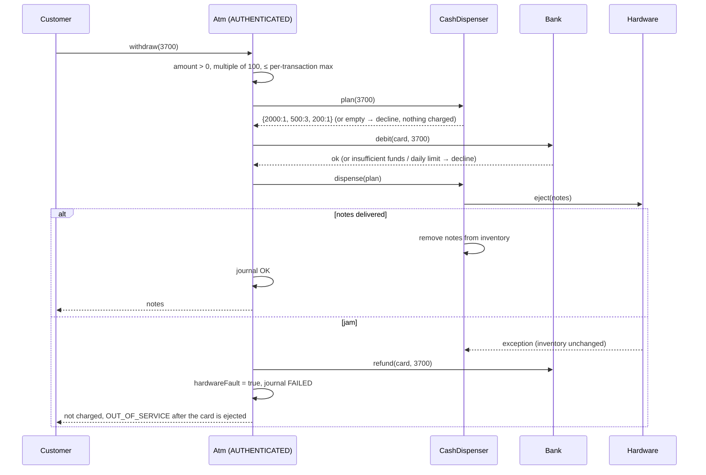

# 🏧 Design an ATM — Low Level Design (Java)


> The classic **State pattern** interview question. An ATM behaves completely differently depending
> on what screen it's on: you can't withdraw before entering a PIN, can't insert a second card, and
> can't take the machine offline mid-session. The interviewer wants to see those rules expressed as
> **states**, not as `if (state == ...)` checks scattered through every method, plus sensible
> handling of **money**: PIN security, limits, and what happens when the cash jams *after* the
> account was charged.

A customer inserts a card, enters a PIN, and performs transactions (withdraw, deposit, balance)
before taking the card back. The machine talks to the bank, holds a limited stock of notes, and goes
out of service when it runs dry or breaks.

> 📚 **Credit:** Problem inspired by
> [AlgoMaster — Design ATM](https://algomaster.io/learn/lld/design-atm) (premium lesson,
> **not** accessed). Everything here is my own original work, based on how ATMs publicly work.
> See [References & Credits](#-references--credits).

---

## 📑 On this page

1. [Scoping the Problem](#1-scoping-the-problem)
2. [Finding the Building Blocks](#2-finding-the-building-blocks)
3. [Object Model](#3-object-model)
   - [3.1 Class Responsibilities](#31-class-responsibilities)
   - [3.2 Patterns in Play](#32-patterns-in-play)
   - [3.3 UML Diagrams](#33-uml-diagrams)
   - [Practice Round](#-practice-round)
4. [Implementation Walkthrough](#4-implementation-walkthrough)
5. [Build, Run & Verify](#5-build-run--verify)
6. [Follow-up Scenarios](#6-follow-up-scenarios)
   - [6.1 States Instead of Flags](#61-states-instead-of-flags)
   - [6.2 Dispensing Notes: Greedy Chain vs Optimal](#62-dispensing-notes-greedy-chain-vs-optimal)
   - [6.3 When Things Fail Mid-Transaction](#63-when-things-fail-mid-transaction)
7. [Last-Minute Revision](#7-last-minute-revision)
8. [References & Credits](#-references--credits)

---

## 1. Scoping the Problem

### 🗣️ Sample conversation

| Candidate asks | Interviewer answers | Design impact |
|---|---|---|
| Which operations? | Withdraw, deposit, balance inquiry. Transfer is optional. | Three transaction types; transfer as a follow-up. |
| How is the user verified? | Card + 4-digit PIN; 3 wrong attempts block the card. | `CARD_INSERTED` state; bank counts failures; card retained. |
| Who holds the money and the PIN? | The bank. The ATM only asks. | `BankService` interface; the ATM never stores PINs or balances. |
| Limits? | Per-withdrawal max at the ATM; daily limit per account. | ATM config + bank-side daily counter. |
| Which notes? | 2000 / 500 / 200 / 100, limited stock. | `CashInventory` + a dispense strategy. |
| What if the machine can't pay the exact amount? | Decline *before* charging. | Plan notes first, then debit. |
| What if cash jams after charging? | Customer must not lose money. | Refund (compensating transaction), then go out of service. |
| Maintenance? | Staff refill cash; the ATM goes offline when empty. | `OUT_OF_SERVICE` state; refill only there. |
| Several transactions per session? | Yes, until the card is taken. | `AUTHENTICATED` loops on itself. |

### ✅ Functional requirements

1. Insert card → enter PIN → withdraw / deposit / check balance (any number of times) → eject card.
2. Wrong PIN: show attempts left; the 3rd failure **blocks and retains** the card. A blocked card inserted later is also retained.
3. Withdrawal: positive, a multiple of the smallest payable unit, ≤ per-transaction max, ≤ balance, ≤ daily limit, and payable with the notes in the machine.
4. Deposit: accepted notes only; credited to the account; notes added to the cassettes.
5. Journal of every transaction (success or failure) with a masked card number.
6. Out of service when empty or broken; staff refill and bring it back, **never mid-session**.

### ⚙️ Non-functional requirements

- **Correct money handling**: never charge without paying out; never overdraw, even with several ATMs on one account.
- **Security**: PINs stored salted and hashed, compared in constant time; card numbers masked in logs.
- **Readable rules**: each screen's allowed actions live in one class.

---

## 2. Finding the Building Blocks

| Candidate | Keep? | Reasoning |
|---|---|---|
| **Atm** | ✅ | The context of the State pattern and the facade customers use. |
| **AtmState** + Idle / CardInserted / Authenticated / OutOfService | ✅ | One class per screen; each allows only its own actions. |
| **BankService** / `InMemoryBank` | ✅ | Authentication, balances, limits. Behind an interface because the real one is a remote system. |
| **CashDispenser** | ✅ facade | Inventory + note selection + hardware. |
| **CashInventory** | ✅ | Notes per denomination. |
| **DispenseStrategy** (greedy chain / optimal) | ✅ | *Which* notes to give is a separate, swappable decision. |
| **CashHardware** | ✅ | The physical mechanism; can fail independently, and tests simulate a jam. |
| **Card**, **TransactionRecord**, **AtmException** | ✅ | Value objects and error reporting. |
| **Account** in the ATM | ❌ | The ATM never owns account data; it asks the bank. |
| **Customer / User** | ❌ | The card *is* the identity at an ATM. |
| **Screen / Keypad** classes | ❌ | UI concerns; listeners and the demo cover them. |

---

## 3. Object Model

### 3.1 Class Responsibilities

#### States: what each screen allows

| Action ↓ / State → | IDLE | CARD_INSERTED | AUTHENTICATED | OUT_OF_SERVICE |
|---|---|---|---|---|
| `insertCard` | ✅ (retains blocked cards) | ❌ | ❌ | ❌ |
| `enterPin` | ❌ | ✅ | ❌ | ❌ |
| `withdraw` / `deposit` / `checkBalance` | ❌ | ❌ | ✅ | ❌ |
| `ejectCard` | ❌ | ✅ | ✅ | ❌ |
| `startMaintenance` | ✅ | ❌ | ❌ (no interrupting customers) | ✅ (no-op) |
| `refill` / `finishMaintenance` | ❌ | ❌ | ❌ | ✅ |

`AtmState` declares every action with a **default that throws "not allowed"**, so each state class
overrides only its ✅ cells. States hold no data and are shared singletons.

#### `Atm` (context)
| Member | Purpose |
|---|---|
| Public actions | Forward to `state.xxx(this, ...)`. |
| `transitionTo(state)` | Change state and notify listeners. |
| `endSession()` | Card out → `IDLE`, or `OUT_OF_SERVICE` if empty or faulty. |
| `performWithdrawal / performDeposit / performBalanceInquiry` | The business logic the `AUTHENTICATED` state calls. |
| `journal()`, `status()`, `cashAvailable()` | Queries. |

#### `BankService` (interface) / `InMemoryBank`
`isCardBlocked`, `authenticate` → `AuthResult(SUCCESS / WRONG_PIN / CARD_BLOCKED / UNKNOWN_CARD, attemptsLeft)`,
`balance`, `debit` (funds + daily limit, atomic per account), `credit`, `refund`.

#### Cash
`CashInventory` (denomination → count), `DispenseStrategy` (`GreedyChainDispenseStrategy`,
`OptimalDispenseStrategy`), `CashHardware` (eject or throw), `CashDispenser` (facade: plan, dispense, accept).

### 3.2 Patterns in Play

| Pattern | Where | Why here |
|---|---|---|
| **State** | `AtmState` + 4 states, `Atm` as context | Allowed actions depend entirely on the current screen. Each state is a class; adding a state doesn't touch the others. |
| **Singleton (stateless states)** | `IdleState.INSTANCE`, … | States carry no data, so one shared instance each. |
| **Chain of Responsibility** | `GreedyChainDispenseStrategy.NoteHandler` | Classic dispenser: each denomination pays what it can and passes the rest on. |
| **Strategy** | `DispenseStrategy` | Swap greedy for optimal (or "prefer small notes") without touching the ATM. |
| **Facade** | `Atm`, `CashDispenser` | Callers see a few simple actions; the coordination is hidden. |
| **Observer** | `AtmEventListener` | Screen updates, receipts, fraud alerts on retained cards. |
| **Dependency inversion** | `BankService`, `CashHardware`, `Clock` | Remote bank, physical hardware and time are all swappable, which makes jams and day changes testable. |

**SOLID:** each state handles one screen, the bank handles accounts, and the dispenser handles
notes (**S**). A new state (e.g. `SELECTING_LANGUAGE`) is a new class (**O**). All states honour the
`AtmState` contract (**L**). `Atm` depends on interfaces for the bank, hardware and strategy (**D**).

### 3.3 UML Diagrams

**State diagram**



**Class diagram**



**Withdrawal, including the jam path**



### 🧠 Practice Round

1. **Add a state**: `SELECTING_LANGUAGE` between card insertion and PIN entry. Which classes change?
2. **Session timeout**: return (or retain) the card after 30 s of inactivity. Where does the timer
   live, and what does each state do on timeout?
3. **Transfer between accounts**: design `transfer(toAccount, amount)` so that a failure halfway
   never loses money.
4. **Prefer small notes**: some customers want 500s, not 2000s. Add a strategy.
5. **Mini statement**: last 5 transactions from the bank, printed. Which interface changes?
6. **Concurrent sessions**: why does `Atm` need no locks, while `InMemoryBank` does?

<details>
<summary>💡 Hints for #1</summary>

Add `SelectingLanguageState` implementing `insertCard`-free actions: `chooseLanguage(atm, lang)`
moves on to `CardInsertedState`. Change `IdleState.insertCard` to transition there instead. No other
state changes. That's the Open/Closed benefit of the State pattern.
</details>

<details>
<summary>💡 Hints for #3</summary>

Debit the source, then credit the target; if the credit fails, refund the source (compensation, as
with the dispenser jam). In a real bank both happen in one database transaction, or through a saga
with an idempotency key so a retried request can't transfer twice.
</details>

---

## 4. Implementation Walkthrough

### 📁 Project structure

```
ATM/
├── pom.xml
├── README.md
└── src
    ├── main/java/com/lld/states/atm
    │   ├── AtmApp.java                     # scripted walk-through of every state
    │   ├── model/    Card, TransactionType, TransactionRecord, AtmException
    │   ├── bank/     BankService, InMemoryBank, AuthResult
    │   ├── cash/     CashInventory, CashDispenser, CashHardware,
    │   │             DispenseStrategy, GreedyChainDispenseStrategy, OptimalDispenseStrategy
    │   └── machine/  Atm (context), AtmState, IdleState, CardInsertedState,
    │                 AuthenticatedState, OutOfServiceState, AtmStatus, AtmEventListener
    └── test/java/com/lld/states/atm
        ├── AtmTest.java                    # states, PINs, limits, jam + refund, journal
        └── CashAndBankTest.java            # dispensing vs brute force, concurrent debits
```

### 🔀 The State pattern in two snippets

```java
// Context: every action goes to the current state
public Map<Integer, Integer> withdraw(long amount) {
    return state.withdraw(this, amount);
}

// Interface: "not allowed" is the default for every action
default Map<Integer, Integer> withdraw(Atm atm, long amount) {
    throw AtmException.invalidState("withdraw", status().name());
}
```

```java
final class CardInsertedState implements AtmState {
    public void enterPin(Atm atm, String pin) {
        AuthResult result = atm.bank().authenticate(atm.currentCard(), pin);
        switch (result.status()) {
            case SUCCESS      -> atm.transitionTo(AuthenticatedState.INSTANCE);
            case WRONG_PIN    -> throw declined("Wrong PIN. " + result.attemptsLeft() + " attempt(s) left.");
            case CARD_BLOCKED -> { atm.retainCard(atm.currentCard()); atm.endSession(); throw declined(...); }
            case UNKNOWN_CARD -> { atm.endSession(); throw declined(...); }
        }
    }
    public void ejectCard(Atm atm) { atm.endSession(); }
    // everything else: inherited "not allowed"
}
```

### 💵 Withdrawal: order of operations

```java
Map<Integer, Integer> plan = dispenser.plan(amount).orElseThrow(...);   // 1. can we pay it? (before charging)
bank.debit(currentCard, amount);                                        // 2. funds + daily limit, atomic
try {
    dispenser.dispense(plan);                                           // 3. hardware
} catch (RuntimeException jam) {
    bank.refund(currentCard, amount);                                   // 4. compensate
    hardwareFault = true;                                               //    offline after this session
    throw AtmException.declined("Cash could not be dispensed; your account was not charged");
}
```

### 🔐 PIN storage

```java
byte[] salt = new byte[16];  random.nextBytes(salt);
byte[] hash = SHA-256(salt + pin);                         // stored; the PIN itself never is
...
boolean ok = MessageDigest.isEqual(stored, SHA-256(salt + attempt));   // constant-time comparison
```

👉 Browse the full source in [`src/main/java`](src/main/java/com/lld/states/atm).

### ⏱️ Complexity

| Operation | Cost |
|---|---|
| State dispatch | O(1) virtual call |
| PIN check | one SHA-256 |
| Greedy plan | O(D), D = denominations |
| Optimal plan | O(D · U · C), U = amount / gcd, C = notes of a denomination usable (≤ U) |
| Debit / credit | O(1) under the account's lock |

---

## 5. Build, Run & Verify

### With Maven

```bash
cd Managing-States/ATM
mvn test                 # 27 tests
mvn compile exec:java    # scripted walk-through
```

### Without Maven (plain JDK 17+)

```bash
cd Managing-States/ATM
javac -d out $(find src/main -name "*.java")
java -cp out com.lld.states.atm.AtmApp
```

### Demo output (abridged)

```
ATM-042 loaded with 18000

> Alice tries to withdraw before entering a PIN
      [not allowed] Cannot withdraw while CARD_INSERTED
> Alice enters a wrong PIN
      [declined] Wrong PIN. 2 attempt(s) left.
> Alice enters the right PIN
      [screen] CARD_INSERTED -> AUTHENTICATED
> Alice withdraws 3,700
      notes: {2000=1, 500=3, 200=1}
> Alice withdraws 150 (not a multiple of 100)
      [declined] Amount must be a multiple of 100
> Alice takes her card
      [screen] AUTHENTICATED -> IDLE

> Bob enters PIN 3333
      [alert] card **** 0004 retained
      [screen] CARD_INSERTED -> IDLE
      [declined] Too many wrong PINs. Your card has been blocked and retained.

> Staff take the ATM offline
      [screen] IDLE -> OUT_OF_SERVICE
> A customer tries to use it
      [not allowed] Cannot insert a card while OUT_OF_SERVICE

Journal:
  #1 **** 1111 WITHDRAWAL          3700 OK (balance 46300)
  #2 **** 1111 WITHDRAWAL           150 FAILED: Amount must be a multiple of 100
  #3 **** 1111 DEPOSIT             1000 OK (balance 47300)
  #4 **** 1111 BALANCE_INQUIRY        0 OK (balance 47300)

Why the dispenser is not greedy: 600 from {500 x 1, 200 x 3}
  greedy (chain of responsibility): cannot pay
  optimal (dynamic programming):    {200=3}
```

### ✅ What the tests cover

| Area | Tests |
|---|---|
| **State machine** | Happy path transitions (via listener); **every state rejects the actions that don't belong to it** (14 checks); cancel before PIN; several transactions per session. |
| **PINs** | Attempts left; 3 failures block **and retain** (listener) and a blocked card is retained on re-insertion; success resets the counter; unknown card returned, not kept; branch unblock. |
| **Withdrawals** | Fewest notes; validation (0, not a multiple, over max) charges nothing; insufficient funds dispenses nothing; **daily limit across sessions, reset next day** (fake clock); amounts the machine can't pay are declined before charging. |
| **Failure handling** | **Jam → refund, cassettes untouched, OUT_OF_SERVICE after eject**; the refund also restores the daily allowance. |
| **Deposits / journal** | Account and cassette totals; unknown notes rejected; journal ids, success flags, balances, masked card. |
| **Out of service** | Emptying the cash goes offline only **after** the customer leaves; can't resume without cash; built-empty ATM starts offline. |
| **Dispensing** | Greedy with plenty of notes; **greedy fails / optimal succeeds**; fewest notes; **optimal = brute force on 300 random inventories**. |
| **Bank concurrency** | 8 threads × 100 debits on one account: **exactly** 100 approved, balance ends at 0 (never negative). |

---

## 6. Follow-up Scenarios

### 6.1 States Instead of Flags

**Ask:** "Why not just keep `boolean cardInserted, pinVerified, outOfService`?"

Flags give 2³ = 8 combinations, but only 4 are valid. Every method would need checks like
`if (!cardInserted || !pinVerified || outOfService) throw ...`. Adding a rule means editing every
method, and it's easy to miss one. With the State pattern:

- **Illegal combinations can't exist**: there is exactly one current state.
- **Rules are local**: to know what the PIN screen allows, read `CardInsertedState`.
- **Safe defaults**: a new action is "not allowed" everywhere until a state opts in.
- **Transitions are explicit and observable** (`transitionTo` → listeners, and the diagram above).

### 6.2 Dispensing Notes: Greedy Chain vs Optimal

The textbook design is a **Chain of Responsibility**: 2000-handler → 500-handler → 200-handler →
100-handler, each paying what it can and passing the rest on. It's simple and works when the
cassettes are well stocked.

With a **limited** stock it can fail when an answer exists:

```
Stock: 500 × 1, 200 × 3.  Request 600.
Greedy: take 500 → 100 left → no 100s → FAIL.
Actual answer: 200 × 3.
```

`OptimalDispenseStrategy` solves **bounded coin change** with dynamic programming: amounts are divided
by the gcd of the denominations (100), so the table is tiny, and it returns the **fewest notes** or
"impossible". The test `optimalMatchesBruteForceOnRandomInventories` checks it against every
combination for 300 random stocks. Both strategies share one interface, so the ATM picks either.

### 6.3 When Things Fail Mid-Transaction

**Ask:** "The bank approved the withdrawal, then the notes jammed. Now what?"

| Step | If it fails… |
|---|---|
| Validate the amount | Decline; nothing happened. |
| **Plan the notes** | Decline **before** touching the account. |
| Debit the bank | Decline (funds or limit); nothing to undo. |
| **Dispense** | **Refund** the debit (compensating action), mark a hardware fault, and go out of service when the card is taken. |

In a real network the refund must itself be reliable: the ATM logs a *reversal* message and retries
it until the bank acknowledges it, using a transaction id so a repeated reversal is applied only once.

### 🚀 More follow-ups to practice

| Follow-up | Design move |
|---|---|
| Session timeout | A timer resets on each action; on expiry the state's `timeout()` ejects (or retains) the card. |
| Transfers / bill payment | New transaction types in `AuthenticatedState`; compensation or a single bank-side transaction. |
| Cardless withdrawal (OTP / QR) | New entry state: `IDLE → OTP_ENTERED → AUTHENTICATED`. |
| Multiple currencies | Inventory per currency; strategy per currency. |
| Remote monitoring | A listener that reports low cash, faults and retained cards to operations. |
| Fraud detection | A listener on `onTransaction` flags patterns (many failures, unusual amounts). |

---

## 7. Last-Minute Revision

```
1. Clarify    → operations? PIN rules? limits (per txn / daily)? notes & stock? failures? maintenance?
2. States     → IDLE → CARD_INSERTED → AUTHENTICATED (loops) → IDLE;  OUT_OF_SERVICE for empty/fault/maintenance
                interface with "not allowed" defaults; each state overrides only its own actions
3. Security   → bank owns PINs (salted hash, constant-time compare); 3 strikes → block + retain; mask card numbers
4. Withdrawal → validate → PLAN notes → DEBIT bank → DISPENSE → on jam REFUND + go offline after session
5. Dispensing → Chain of Responsibility (greedy) is the classic; fails with limited stock (600 = 3 × 200)
                → bounded coin change DP for fewest notes
6. Concurrency→ ATM serves one customer (no locks); bank locks per account (no overdraft across ATMs)
7. Patterns   → State, Chain of Responsibility, Strategy, Facade, Observer, DI for bank/hardware/clock
```

---

## 📚 References & Credits

| Resource | How it was used |
|---|---|
| [AlgoMaster.io — Design ATM (LLD)](https://algomaster.io/learn/lld/design-atm) | Inspiration for the **problem choice** only. The lesson is premium and was **not** accessed. |
| [Automated teller machine — Wikipedia](https://en.wikipedia.org/wiki/Automated_teller_machine) | Public background on ATM behaviour (card retention, PIN tries, cash cassettes). |
| [Change-making problem — Wikipedia](https://en.wikipedia.org/wiki/Change-making_problem) | Public background on why greedy fails and the DP alternative. |
| [Mermaid](https://mermaid.js.org/) | Diagrams rendered by GitHub. |
| [JUnit 5 User Guide](https://junit.org/junit5/docs/current/user-guide/) | Testing. |

**Originality statement**

- This repository is a **personal learning project** for LLD interview preparation.
- The AlgoMaster lesson is premium content that I have not accessed. No text, code, diagrams,
  headings or other material from it (or any paid source) is reproduced here.
- All headings, source code, explanations, tables, diagrams, tests and exercises were written
  independently from publicly known ATM behaviour and the public references above.
- This project is **not affiliated with or endorsed by** AlgoMaster.io. "AlgoMaster" is the
  property of its respective owner.
- For the original lesson, please support the author at [algomaster.io](https://algomaster.io).

---

> ⭐ Try the Practice Round before reading the code, then compare your design with this one.
