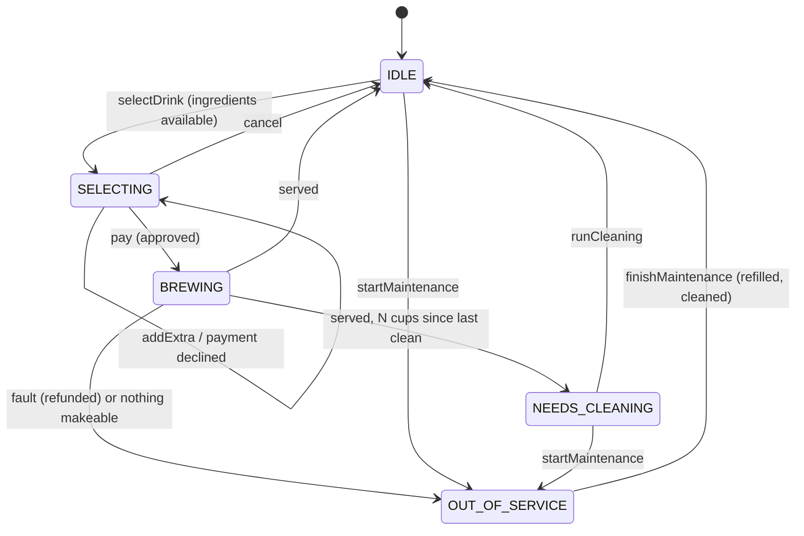
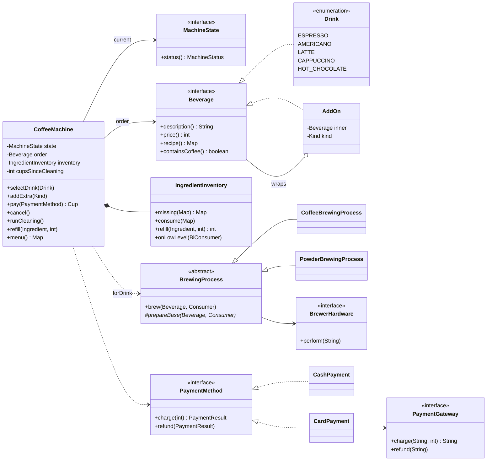
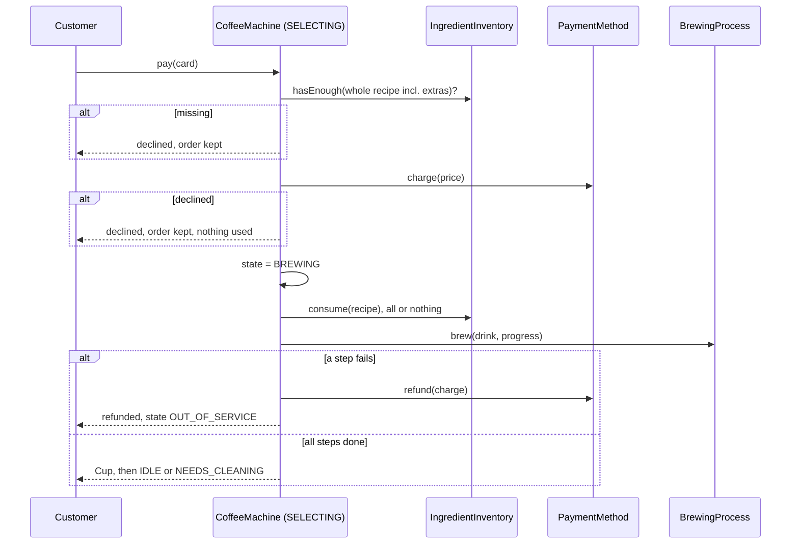

# ☕ Design a Coffee Vending Machine — Low Level Design (Java)


> The snack [Vending Machine](../VendingMachine/README.md) is about **money and stock**; the coffee
> machine is about **making things**. It adds three ideas interviewers like to see together:
> customisation with the **Decorator** pattern (extra shot, milk, sugar), a fixed sequence of brewing
> steps with the **Template Method** pattern, and **ingredients** that must all be available before
> anything is used, plus the usual **State** machine, including a cleaning cycle every N cups.

The customer picks a drink, optionally adds extras, and pays by coins or card. The machine checks it
has every ingredient, charges, brews step by step, and serves. It raises alerts when an ingredient
runs low, demands cleaning every few cups, and refunds if brewing fails.

> 📚 **Credit:** Problem inspired by
> [AlgoMaster — Design Coffee Vending Machine](https://algomaster.io/learn/lld/design-coffee-vending-machine)
> (premium lesson, **not** accessed). Everything here is my own original work, based on how coffee
> machines publicly work. See [References & Credits](#-references--credits).

---

## 📑 On this page

1. [Scoping the Problem](#1-scoping-the-problem)
2. [Finding the Building Blocks](#2-finding-the-building-blocks)
3. [Object Model](#3-object-model)
   - [3.1 Class Responsibilities](#31-class-responsibilities)
   - [3.2 Patterns in Play](#32-patterns-in-play)
   - [3.3 UML Diagrams](#33-uml-diagrams)
   - [Practice Round](#-practice-round)
4. [Implementation Walkthrough](#4-implementation-walkthrough)
5. [Build, Run & Verify](#5-build-run--verify)
6. [Follow-up Scenarios](#6-follow-up-scenarios)
   - [6.1 Customising Drinks with Decorators](#61-customising-drinks-with-decorators)
   - [6.2 Ingredients: All or Nothing](#62-ingredients-all-or-nothing)
   - [6.3 Cleaning Cycles and Brewing Faults](#63-cleaning-cycles-and-brewing-faults)
7. [Last-Minute Revision](#7-last-minute-revision)
8. [References & Credits](#-references--credits)

---

## 1. Scoping the Problem

### 🗣️ Sample conversation

| Candidate asks | Interviewer answers | Design impact |
|---|---|---|
| Which drinks? | Espresso, Americano, Latte, Cappuccino, Hot Chocolate. | `Drink` enum with price + recipe. |
| Customisation? | Extra shot, extra milk, sugar, chocolate drizzle. Can repeat, within reason. | Decorators that stack; max 3 of each. |
| Ingredients? | Water, milk, beans, chocolate, sugar, each with a capacity. | `IngredientInventory`; menu shows what can be made now. |
| What if milk runs out mid-order? | Never start a drink that can't be finished. | Check the **whole** recipe, consume **all or nothing**. |
| Payment? | Coins or card. | `PaymentMethod` strategy (`CashPayment`, `CardPayment`). |
| Brewing? | Heat, grind/extract or mix, milk, sugar, pour. | Template Method with coffee / powder variants. |
| Maintenance? | Clean every N cups; staff refill. | `NEEDS_CLEANING` and `OUT_OF_SERVICE` states. |
| Grinder jams? | Customer gets their money back. | Refund through the same payment method, machine offline. |

### ✅ Functional requirements

1. Show a menu with availability based on current ingredient levels.
2. Select a drink, add extras (bounded), cancel, or pay.
3. Pay by cash (with change) or card (through a gateway); a declined payment keeps the order.
4. Brew in a fixed sequence of steps, reported for a progress display.
5. Alert when an ingredient drops below its threshold (once, until refilled).
6. Require a cleaning cycle every N cups; go offline when nothing can be made; staff refill and restore.
7. Refund and go offline if brewing fails.

### ⚙️ Non-functional requirements

- **Extensible menu**: new drinks and extras without touching the machine or the states.
- **No half-made drinks**: ingredient checks and consumption are atomic.
- **No lost payments**: charge only after checks; refund on any brewing failure.

---

## 2. Finding the Building Blocks

| Candidate | Keep? | Reasoning |
|---|---|---|
| **CoffeeMachine** | ✅ | State-pattern context and facade. |
| **MachineState** × 5 | ✅ | Idle, Selecting, Brewing, NeedsCleaning, OutOfService. |
| **Beverage** interface | ✅ | Shared by base drinks and add-ons. |
| **Drink** enum | ✅ | Base menu: name, price, recipe. |
| **AddOn** decorator | ✅ | Wraps a beverage; adds price, ingredients, description. |
| **IngredientInventory** | ✅ | Levels, capacities, atomic consume, low-level alerts. |
| **BrewingProcess** (+ Coffee / Powder) | ✅ | Template Method for the steps. |
| **BrewerHardware** | ✅ interface | Boiler/grinder; can fail, and tests simulate it. |
| **PaymentMethod** (+ Cash / Card), **PaymentGateway** | ✅ | Strategy for how money is taken and returned. |
| A subclass per combination (`LatteWithExtraShotAndSugar`) | ❌ | That's the class explosion Decorator avoids. |
| `Order` entity | ❌ (kept simple) | The current `Beverage` *is* the order; there's one customer at a time. |

---

## 3. Object Model

### 3.1 Class Responsibilities

#### What each state allows

| Action ↓ / State → | IDLE | SELECTING | BREWING | NEEDS_CLEANING | OUT_OF_SERVICE |
|---|---|---|---|---|---|
| `selectDrink` | ✅ | ❌ | ❌ | ❌ | ❌ |
| `addExtra` / `pay` / `cancel` | ❌ | ✅ | ❌ | ❌ | ❌ |
| `runCleaning` | ❌ | ❌ | ❌ | ✅ → IDLE | ✅ |
| `startMaintenance` | ✅ | ❌ | ❌ | ✅ | ✅ no-op |
| `refill` / `finishMaintenance` | ❌ | ❌ | ❌ | ❌ | ✅ |

#### Beverages
- `Beverage`: `description()`, `price()`, `recipe()`, `containsCoffee()`.
- `Drink` (enum): the five base drinks.
- `AddOn(Beverage inner, Kind kind)`: `EXTRA_SHOT` (+60c, water, beans), `EXTRA_MILK` (+40c, milk),
  `SUGAR` (free, sugar), `CHOCOLATE_DRIZZLE` (+50c, chocolate). `AddOn.count(beverage, kind)` enforces limits.

#### `IngredientInventory`
`missing(recipe)`, `hasEnough(recipe)`, `consume(recipe)` (all or nothing), `refill`, `fillAll`,
`levels`, and `onLowLevel(listener)` (threshold 20% of capacity, one alert until refilled).

#### `BrewingProcess` (Template Method)
`brew(drink, progress)` is **final**: heat → `prepareBase` → steam milk? → sugar? → pour.
`CoffeeBrewingProcess.prepareBase` = grind + extract; `PowderBrewingProcess.prepareBase` = mix powder.

#### Payment
`PaymentMethod.charge(amount)` → `PaymentResult(approved, charged, change, reference, message)`, and
`refund(result)`. `CardPayment` uses a `PaymentGateway` (`InMemoryPaymentGateway` for demo and tests).

### 3.2 Patterns in Play

| Pattern | Where | Why here |
|---|---|---|
| **State** | `MachineState` × 5 in `States` | The same button means different things per mode; illegal actions are refused. |
| **Decorator** | `AddOn` wraps `Beverage` | Any combination of extras without a subclass per combination; price, recipe and name compose. |
| **Template Method** | `BrewingProcess.brew` (final) + `prepareBase` | The step order is fixed and shared; only the base preparation differs. |
| **Strategy** | `PaymentMethod` (cash / card) | The machine charges and refunds the same way for any payment type. |
| **Observer** | `CoffeeMachineListener`, inventory low-level callback | Progress display, supplier alerts, sales. |
| **Factory method** | `BrewingProcess.forDrink(drink, hw)` | Picks coffee or powder process from the drink. |

**SOLID:** drinks, extras, ingredients, brewing and payment each change for their own reasons (**S**);
a new drink is an enum constant and a new extra is a `Kind` (**O**); every `AddOn` is a valid `Beverage`
(**L**); small interfaces (`Beverage`, `PaymentMethod`, `BrewerHardware`) (**I**); the machine depends
on abstractions for payment and hardware (**D**).

### 3.3 UML Diagrams

**State diagram**



**Class diagram**



**Paying and brewing**



### 🧠 Practice Round

1. **Sizes**: Small / Medium / Large change price and quantities. Decorator or a separate dimension?
2. **Recipes from configuration**: load drinks from JSON so the menu changes without a deploy.
3. **Loyalty**: every 10th drink is free. Where does that rule live?
4. **Pre-orders from a phone app**: pay in the app, collect with a QR code. Which state is new?
5. **Remove an extra** before paying. How do you "unwrap" a decorator?
6. **Descaling**: every 500 cups, a longer cycle that needs a staff key. How do the states change?

<details>
<summary>💡 Hints for #1</summary>

Size multiplies the recipe and price rather than adding a fixed amount, so it's a different kind of
change from an add-on. A clean option is `SizedDrink(Beverage base, Size size)` applied **first**,
before the extras: `new AddOn(new SizedDrink(LATTE, LARGE), SUGAR)`. Or make size a field of the
order and scale the base recipe. Either way, don't create `LargeLatte` classes.
</details>

<details>
<summary>💡 Hints for #5</summary>

Decorators are immutable layers, so "removing" means rebuilding. Keep the list of chosen `Kind`s next
to the base drink and recreate the chain when the list changes. The chain stays a pure description of
the drink, and the list is the editable order.
</details>

---

## 4. Implementation Walkthrough

### 📁 Project structure

```
CoffeeVendingMachine/
├── pom.xml
├── README.md
└── src
    ├── main/java/com/lld/states/coffee
    │   ├── CoffeeMachineApp.java           # scripted walk-through
    │   ├── ingredient/  Ingredient, IngredientInventory
    │   ├── beverage/    Beverage, Drink, AddOn (decorator)
    │   ├── brewing/     BrewingProcess (template), CoffeeBrewingProcess, PowderBrewingProcess, BrewerHardware
    │   ├── payment/     PaymentMethod, CashPayment, CardPayment, PaymentGateway, InMemoryPaymentGateway, PaymentResult
    │   └── machine/     CoffeeMachine, MachineState, States (5 states), MachineStatus,
    │                    Cup, CoffeeMachineListener, CoffeeMachineException
    └── test/java/com/lld/states/coffee
        └── CoffeeMachineTest.java          # 21 tests
```

### 🎀 Decorator: extras that stack

```java
public final class AddOn implements Beverage {
    private final Beverage inner;
    private final Kind kind;

    public String description() { return inner.description() + " + " + kind.label; }
    public int price()          { return inner.price() + kind.price; }
    public Map<Ingredient, Integer> recipe() {
        Map<Ingredient, Integer> total = new EnumMap<>(Ingredient.class);
        total.putAll(inner.recipe());
        kind.extra.forEach((i, amount) -> total.merge(i, amount, Integer::sum));
        return total;
    }
}
// new AddOn(new AddOn(Drink.LATTE, EXTRA_SHOT), SUGAR)  →  "Latte + extra shot + sugar", 310c
```

### 🧾 Template Method: fixed steps, one variable step

```java
public final void brew(Beverage drink, Consumer<String> progress) {
    step(progress, "Heating water");
    prepareBase(drink, progress);                          // coffee: grind + extract | powder: mix
    if (drink.recipe().containsKey(MILK))  step(progress, "Steaming ... ml milk");
    if (drink.recipe().containsKey(SUGAR)) step(progress, "Adding ... g sugar");
    step(progress, "Pouring " + drink.description());
}
```

### 💳 Paying safely

```java
if (!inventory.hasEnough(drink.recipe())) throw declined(...);   // 1. whole order, extras included
PaymentResult charge = payment.charge(drink.price());           // 2. charge
if (!charge.approved()) throw declined(...);                    //    order kept, nothing used
transitionTo(BREWING);
try {
    inventory.consume(drink.recipe());                          // 3. all or nothing
    BrewingProcess.forDrink(drink, hardware).brew(drink, ...);  // 4. template method
} catch (RuntimeException failure) {
    payment.refund(charge);                                     // 5. same method refunds
    fault = true; transitionTo(OUT_OF_SERVICE); throw declined("... refunded");
}
```

👉 Browse the full source in [`src/main/java`](src/main/java/com/lld/states/coffee).

### ⏱️ Complexity

All operations are O(ingredients + extras): tiny constants. The design questions here are about
structure, not algorithms.

---

## 5. Build, Run & Verify

### With Maven

```bash
cd Managing-States/CoffeeVendingMachine
mvn test                 # 21 tests
mvn compile exec:java    # scripted walk-through
```

### Without Maven (plain JDK 17+)

```bash
cd Managing-States/CoffeeVendingMachine
javac -d out $(find src/main -name "*.java")
java -cp out com.lld.states.coffee.CoffeeMachineApp
```

### Demo output (abridged)

```
> Latte + extra shot + 2 sugars, paid with coins (400c)
      order: Latte + extra shot + sugar + sugar = 310c
      ... Heating water
      ... Grinding 36 g beans
      ... Extracting 2 shot(s)
      ... Steaming 180 ml milk
      ... Adding 10 g sugar
      ... Pouring Latte + extra shot + sugar + sugar
      served: Latte + extra shot + sugar + sugar (310c, change 90c)

> Hot chocolate, card with too little money
      [declined] Payment declined: Card declined
> Same order, a different card
      ... Mixing chocolate powder
      served: Hot Chocolate (220c)

> Cappuccino + extra milk
      [declined] Not enough [MILK] for that extra
> Customer keeps the plain cappuccino and pays
      [alert] MILK low: 50 ml left
      [display] BREWING -> NEEDS_CLEANING
      served: Cappuccino (240c, change 60c)

> Try to order: cleaning is due after 3 cups
      [not allowed] Cannot select a drink while NEEDS_CLEANING
> Run the cleaning cycle
      [display] NEEDS_CLEANING -> IDLE
> Try a latte now: is there enough milk?
      [declined] Latte is unavailable (low on [MILK])
      menu now: {ESPRESSO=true, AMERICANO=true, LATTE=false, CAPPUCCINO=false, HOT_CHOCOLATE=false}
> Staff refill milk
      [display] IDLE -> OUT_OF_SERVICE
      [display] OUT_OF_SERVICE -> IDLE
```

### ✅ What the tests cover

| Area | Tests |
|---|---|
| **Decorator** | Stacked price, recipe, description, add-on counting; an extra shot makes hot chocolate a coffee drink. |
| **States** | Order transitions via the listener; each state rejects foreign actions; **buttons pressed while BREWING are refused**; cancel uses nothing and charges nothing. |
| **Paying** | Cash change and whole-recipe consumption; short cash keeps the order; card charged via the gateway; declined card uses no ingredients; extras capped at 3 per kind. |
| **Ingredients** | Unavailable drinks declined and shown on the menu; an extra that would run out is refused; **consume is all or nothing**; low-level alert fires once until refilled; running out of everything goes offline and needs a refill to resume. |
| **Template / faults / cleaning** | **Exact step sequence** for coffee and powder drinks; **grinder fault refunds the card** and goes offline; cash refunded on a fault; cleaning due after N cups uses 200 ml water and resets the counter; configuration validation. |

---

## 6. Follow-up Scenarios

### 6.1 Customising Drinks with Decorators

**Ask:** "Customers want any combination of extra shots, milk and sugar."

Subclassing every combination explodes: 5 drinks × (4 extras, up to 3 each) is hundreds of classes.
With **Decorator**, every extra wraps a `Beverage` and is itself a `Beverage`:

```
AddOn(SUGAR) → AddOn(EXTRA_SHOT) → LATTE
price:  0 + 60 + 250 = 310c
recipe: sugar 5g + (water 30, beans 18) + (water 30, beans 18, milk 180)
```

The machine never checks "which extras?". It asks the outermost beverage for its price and recipe,
and the layers add themselves up. New extras are one enum constant.

### 6.2 Ingredients: All or Nothing

**Ask:** "What if the milk runs out halfway through a latte?"

It mustn't be possible. Three rules:

1. **Check the whole order** (base + every extra) before charging.
2. **`consume` checks every ingredient first, then takes all of them**. If anything is short, nothing is taken.
3. Re-check at payment time: another cup may have used the ingredients since the drink was selected.

Low-level alerts fire once when an ingredient crosses 20% of capacity, and reset on refill, so a
supplier isn't spammed after every cup.

### 6.3 Cleaning Cycles and Brewing Faults

| Situation | Behaviour |
|---|---|
| N cups since the last clean | After serving, go to `NEEDS_CLEANING`; orders refused until `runCleaning` (uses 200 ml water). |
| A brewing step fails | Refund through the **same** payment method, go `OUT_OF_SERVICE`; staff fix and `finishMaintenance` (which also cleans). |
| No drink can be made | `OUT_OF_SERVICE` right after serving; can't come back until something is makeable. |

### 🚀 More follow-ups to practice

| Follow-up | Design move |
|---|---|
| Sizes | `SizedDrink` wrapper applied before extras, or scale factor on the base recipe. |
| Menu from config | Load `Drink`-like records from JSON; keep `Beverage` as the interface. |
| Promotions / loyalty | `PricingStrategy` consulted in `pay`, e.g. every 10th cup free. |
| App pre-orders | New entry state `PREPAID` (QR scanned) that skips `SELECTING` payment. |
| Remote telemetry | Listener publishing ingredient levels, faults and sales. |

---

## 7. Last-Minute Revision

```
1. Clarify    → drinks? extras (repeatable, limits)? ingredients? payment types? cleaning? faults?
2. States     → IDLE → SELECTING → BREWING → IDLE | NEEDS_CLEANING (every N cups) | OUT_OF_SERVICE
3. Decorator  → AddOn wraps Beverage: price, recipe, description add up; no class explosion
4. Template   → brew() final: heat → prepareBase (coffee: grind+extract | powder: mix) → milk? → sugar? → pour
5. Strategy   → PaymentMethod: charge before brewing, refund on failure through the same method
6. Inventory  → check WHOLE recipe; consume all-or-nothing; re-check at pay time; one low alert until refill
7. Patterns   → State, Decorator, Template Method, Strategy, Observer, factory method
```

---

## 📚 References & Credits

| Resource | How it was used |
|---|---|
| [AlgoMaster.io — Design Coffee Vending Machine (LLD)](https://algomaster.io/learn/lld/design-coffee-vending-machine) | Inspiration for the **problem choice** only. The lesson is premium and was **not** accessed. |
| [Coffee vending machine — Wikipedia](https://en.wikipedia.org/wiki/Coffee_vending_machine) | Public background on how these machines work. |
| [Decorator pattern — Wikipedia](https://en.wikipedia.org/wiki/Decorator_pattern) / [Template method pattern — Wikipedia](https://en.wikipedia.org/wiki/Template_method_pattern) | Public pattern definitions. |
| [Mermaid](https://mermaid.js.org/) | Diagrams rendered by GitHub. |
| [JUnit 5 User Guide](https://junit.org/junit5/docs/current/user-guide/) | Testing. |

**Originality statement**

- This repository is a **personal learning project** for LLD interview preparation.
- The AlgoMaster lesson is premium content that I have not accessed. No text, code, diagrams,
  headings or other material from it (or any paid source) is reproduced here.
- All headings, source code, explanations, tables, diagrams, tests and exercises were written
  independently from publicly known behaviour and the public references above.
- This project is **not affiliated with or endorsed by** AlgoMaster.io. "AlgoMaster" is the
  property of its respective owner.
- For the original lesson, please support the author at [algomaster.io](https://algomaster.io).

---

> ⭐ Try the Practice Round before reading the code, then compare your design with this one.
