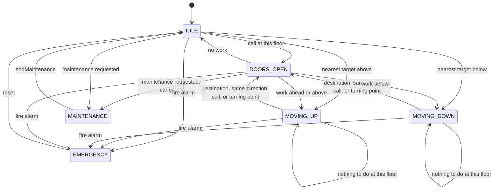
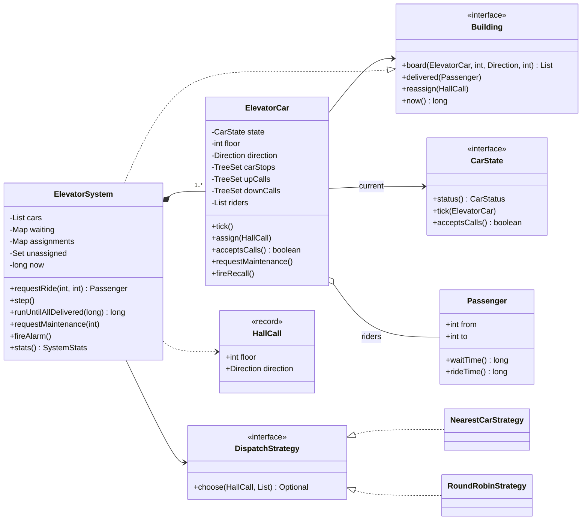
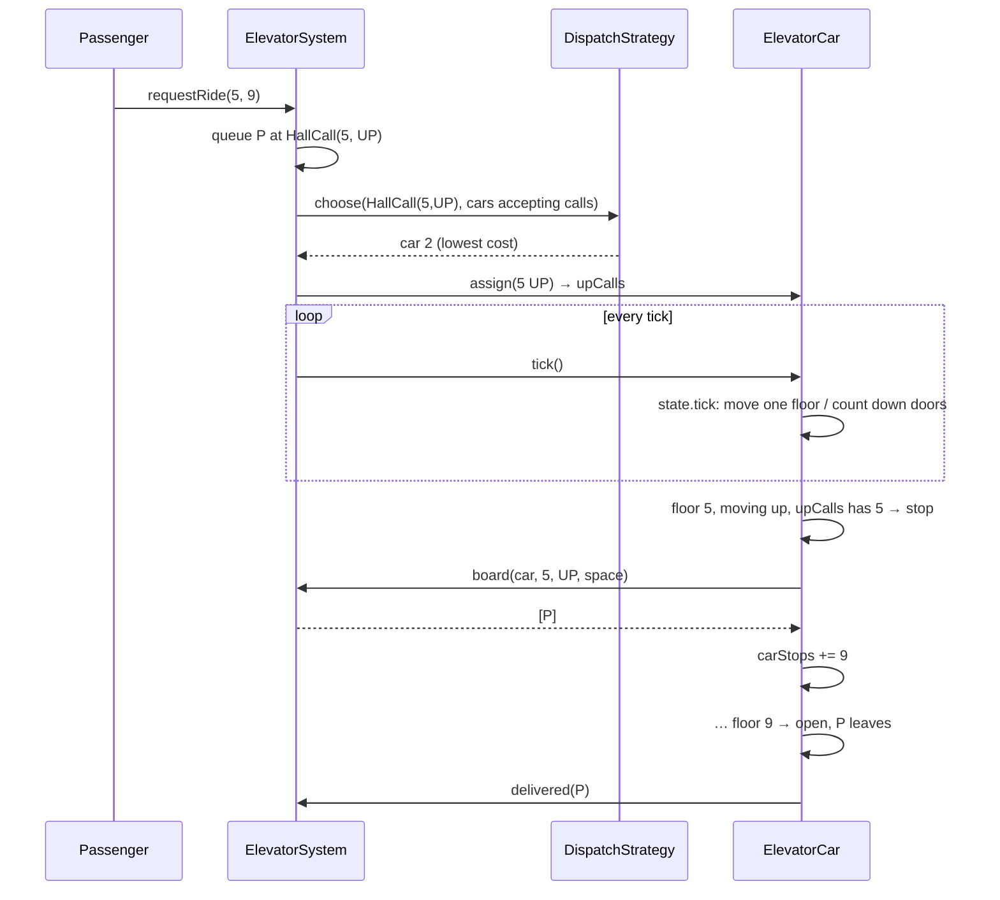

# 🛗 Design an Elevator System — Low Level Design (Java)


> A favourite because it has **two** hard parts: each car is a **state machine** (idle, moving,
> doors open, maintenance, emergency), and the building must decide **which car answers which call**
> and **in what order a car visits floors**. A strong answer names the algorithm (**LOOK**), explains
> why a car going up doesn't stop for someone going down, and compares dispatch strategies with numbers.

People press **hall buttons** (up/down) on floors; the controller assigns each call to a car. Inside
a car they press their **destination**. Cars sweep up and down, stopping for destinations and for
callers going the same way, until everyone arrives.

> 📚 **Credit:** Problem inspired by
> [AlgoMaster — Design Elevator System](https://algomaster.io/learn/lld/design-elevator-system)
> (premium lesson, **not** accessed). Everything here is my own original work, based on publicly
> known elevator behaviour and scheduling algorithms. See [References & Credits](#-references--credits).

---

## 📑 On this page

1. [Scoping the Problem](#1-scoping-the-problem)
2. [Finding the Building Blocks](#2-finding-the-building-blocks)
3. [Object Model](#3-object-model)
   - [3.1 Class Responsibilities](#31-class-responsibilities)
   - [3.2 Patterns in Play](#32-patterns-in-play)
   - [3.3 UML Diagrams](#33-uml-diagrams)
   - [Practice Round](#-practice-round)
4. [Implementation Walkthrough](#4-implementation-walkthrough)
5. [Build, Run & Verify](#5-build-run--verify)
6. [Follow-up Scenarios](#6-follow-up-scenarios)
   - [6.1 Which Floor Next? The LOOK Algorithm](#61-which-floor-next-the-look-algorithm)
   - [6.2 Which Car? Dispatch Strategies](#62-which-car-dispatch-strategies)
   - [6.3 Capacity, Maintenance and Fire Recall](#63-capacity-maintenance-and-fire-recall)
7. [Last-Minute Revision](#7-last-minute-revision)
8. [References & Credits](#-references--credits)

---

## 1. Scoping the Problem

### 🗣️ Sample conversation

| Candidate asks | Interviewer answers | Design impact |
|---|---|---|
| How many floors and cars? | Configurable, e.g. 20 floors, 4 cars. | `ElevatorSystem(lowest, highest, cars, …)`. |
| Hall buttons: up/down, or destination dispatch? | Classic up/down buttons; car buttons inside. | `HallCall(floor, direction)` + car stops. |
| In what order does a car serve floors? | Efficiently, no starvation. | **LOOK** sweep per car. |
| Who decides which car answers? | A central controller. | `DispatchStrategy` (nearest-car, round-robin). |
| Capacity? | Yes, e.g. 8 people. | Full cars take no new calls; people left behind are re-dispatched. |
| Maintenance? | Take a car out of service without stranding riders. | Finish riders, hand calls back, then park. |
| Emergencies? | Fire alarm: all cars to the lobby. | `EMERGENCY` state; requests refused. |
| Real time or simulation? | Model it so it can be tested. | Discrete **ticks**: 1 tick = one floor of travel. |

### ✅ Functional requirements

1. `requestRide(from, to)` presses the hall button; a car is assigned by the dispatcher.
2. Cars follow **LOOK**: continue while there is work ahead, stop for destinations and same-direction callers, turn around when nothing is ahead.
3. Doors stay open a configurable number of ticks; people leave, then those going the car's way board (up to capacity).
4. Calls no car can take now are kept pending and retried every tick.
5. Maintenance per car; building-wide fire recall and reset.
6. Statistics: wait time, ride time, distance travelled.

### ⚙️ Non-functional requirements

- **No starvation**: every request is eventually served (tested with thousands of random riders).
- **Deterministic tests**: tick-based simulation, no threads or sleeps.
- **Pluggable dispatch**: strategies are compared on identical traffic.

---

## 2. Finding the Building Blocks

| Candidate | Keep? | Reasoning |
|---|---|---|
| **ElevatorSystem** | ✅ facade | Buttons, waiting passengers, dispatching, the clock. |
| **ElevatorCar** | ✅ | Floor, direction, stops, riders: the State-pattern context and the LOOK logic. |
| **CarState** × 6 | ✅ | Idle, MovingUp, MovingDown, DoorsOpen, Maintenance, Emergency. |
| **HallCall**, **Direction** | ✅ | Floor + UP/DOWN; car direction includes IDLE. |
| **Passenger** | ✅ | From, to, timestamps, used for boarding rules and statistics. |
| **DispatchStrategy** | ✅ | Nearest-car cost function vs round-robin baseline. |
| **Building** interface | ✅ | What a car needs from the building (boarding, delivery), so cars don't depend on the concrete system. |
| `Floor` / `Button` / `Door` classes | ❌ | Floors are ints; buttons are calls; the door is a timer inside the car. |
| A thread per car | ❌ | Ticks give the same behaviour with deterministic, testable timing. |

---

## 3. Object Model

### 3.1 Class Responsibilities

#### Car states

| State | On each tick | Takes new calls? |
|---|---|---|
| `IDLE` | If a stop is assigned: open here, or choose a direction and start moving. | ✅ |
| `MOVING_UP` / `MOVING_DOWN` | Move one floor; stop if LOOK says so; reverse or idle if nothing is ahead. | ✅ |
| `DOORS_OPEN` | Count down; when closed: reopen for a call here, move on, go idle, or park for maintenance. | ✅ |
| `MAINTENANCE` | Nothing. | ❌ |
| `EMERGENCY` | Move to the lobby, ignoring everything; evacuate; stay open. | ❌ |

#### `ElevatorCar` (context)
| Member | Purpose |
|---|---|
| `carStops`, `upCalls`, `downCalls` | Three sorted sets: destinations and assigned hall calls. |
| `shouldStopHere()` | LOOK stop rule. |
| `chooseDirection()` | Keep going if anything is ahead; else reverse; if idle, go to the nearest target. |
| `openDoors()` | Riders leave; serve the hall call matching the next direction; newcomers press destinations. |
| `requestMaintenance()`, `fireRecall()` | Operational modes. |
| `acceptsCalls()` | Not full, not in maintenance or emergency. |

#### `ElevatorSystem` (facade, implements `Building`)
`requestRide`, `step`, `runUntilAllDelivered`, `requestMaintenance` / `endMaintenance`,
`fireAlarm` / `resetFireAlarm`, `stats`. It keeps queues of waiting passengers per `HallCall`, the
assignment of each call to a car, and a pending set for calls no car could take yet.

#### Dispatch
`NearestCarStrategy` cost (in floors): idle → distance; heading towards the caller in the caller's
direction → distance; otherwise → |turning floor − here| + |turning floor − caller|; plus load as a tie-breaker.
`RoundRobinStrategy` is the baseline.

### 3.2 Patterns in Play

| Pattern | Where | Why here |
|---|---|---|
| **State** | `CarState` × 6 in `CarStates`; `ElevatorCar` is the context | A car's reaction to a tick depends entirely on its mode. |
| **Strategy** | `DispatchStrategy` | Swap dispatch policies and compare them on the same traffic. |
| **Facade** | `ElevatorSystem` | Callers press buttons and advance time; assignment and retries are hidden. |
| **Observer** | `onCarStatusChange` | Floor indicators, logging, tests recording stops. |
| **Dependency inversion** | `Building` interface | Cars depend on an abstraction of the building, not on `ElevatorSystem`. |

### 3.3 UML Diagrams

**Car state diagram**



**Class diagram**



**From button press to arrival**



### 🧠 Practice Round

1. **SCAN vs LOOK**: SCAN always travels to the top/bottom floor before reversing. Why is LOOK better for elevators?
2. **Destination dispatch**: people type their floor in the lobby and are told which car to take. What changes?
3. **Peak modes**: morning up-peak (everyone from the lobby) and evening down-peak. Which strategy helps?
4. **Express zones**: cars 1–2 serve floors 0–20, cars 3–4 serve 0 and 21–40. How do you model it?
5. **VIP / freight car**: one car can be reserved and ignores hall calls. Which state or flag?
6. **Energy**: park idle cars at the lobby in the morning, spread them out in the afternoon.

<details>
<summary>💡 Hints for #2</summary>

Destination dispatch knows each person's destination **before** assigning a car, so the dispatcher can
group people going to nearby floors into the same car. `requestRide(from, to)` already carries both
floors. A `DestinationDispatchStrategy` would score cars by how many extra stops the new rider adds,
and return the chosen car id to display on the lobby screen.
</details>

<details>
<summary>💡 Hints for #3</summary>

In up-peak, idle cars should return to the lobby automatically. Add an `IdlePolicy` strategy
(`STAY`, `RETURN_TO_LOBBY`, `SPREAD_OUT`) consulted when a car becomes idle, and switch it by time of day.
</details>

---

## 4. Implementation Walkthrough

### 📁 Project structure

```
ElevatorSystem/
├── pom.xml
├── README.md
└── src
    ├── main/java/com/lld/states/elevator
    │   ├── ElevatorApp.java                  # traced LOOK run, strategy comparison, fire recall
    │   ├── model/     Direction, HallCall, Passenger
    │   ├── car/       ElevatorCar (context + LOOK), CarState, CarStates (6 states), CarStatus, Building
    │   ├── dispatch/  DispatchStrategy, NearestCarStrategy, RoundRobinStrategy
    │   └── system/    ElevatorSystem (facade), SystemStats
    └── test/java/com/lld/states/elevator
        └── ElevatorSystemTest.java           # 16 tests
```

### 🔄 LOOK: when to stop, where to go

```java
boolean shouldStopHere() {
    if (carStops.contains(floor)) return true;                          // someone gets out
    if (direction == UP && upCalls.contains(floor)) return true;          // caller going our way
    if (direction == DOWN && downCalls.contains(floor)) return true;
    boolean nothingAhead = direction == UP ? !hasTargetsAbove() : !hasTargetsBelow();
    return nothingAhead && (upCalls.contains(floor) || downCalls.contains(floor));  // turning point
}

Direction chooseDirection() {
    if (direction == UP)   return above ? UP : below ? DOWN : IDLE;    // keep going while work is ahead
    if (direction == DOWN) return below ? DOWN : above ? UP : IDLE;
    return nearest target;                                             // idle: closest first
}
```

### 🚪 Doors open: who gets in?

```java
riders destined here leave → delivered
Direction serve = serviceDirectionHere();       // the way the car will continue (or any, if it has no work)
if (serve != IDLE) {
    remove the hall call for (floor, serve);
    for (Passenger p : building.board(this, floor, serve, capacity - riders.size())) {
        riders.add(p);  carStops.add(p.to());   // they press their destination
    }
}
```
Someone waiting to go **down** is not taken on a car that will continue **up**. Their call stays
in `downCalls` and is served on the way back.

### 🧮 Nearest-car cost

```java
if (car idle)                                        floors = |here − caller|
else if (caller ahead && same direction as car)      floors = |caller − here|
else                                                 floors = |turn − here| + |turn − caller|
cost = floors * 2 + car.load()
```

👉 Browse the full source in [`src/main/java`](src/main/java/com/lld/states/elevator).

### ⏱️ Complexity (per tick)

| Operation | Cost |
|---|---|
| Car tick | O(log S): sorted-set lookups, S = stops |
| Dispatch a call | O(cars) |
| Boarding | O(people boarding) |

---

## 5. Build, Run & Verify

### With Maven

```bash
cd Managing-States/ElevatorSystem
mvn test                 # 16 tests
mvn compile exec:java    # demo
```

### Without Maven (plain JDK 17+)

```bash
cd Managing-States/ElevatorSystem
javac -d out $(find src/main -name "*.java")
java -cp out com.lld.states.elevator.ElevatorApp
```

### Demo output

```
1) One car, floors 0-9, doors open 1 tick. LOOK in action.
   t=1   car1 DOORS_OPEN  at floor 0  riders=1 stops=[7]
   t=2   car1 MOVING_UP   at floor 0  riders=1 stops=[7]
   t=7   car1 DOORS_OPEN  at floor 5  riders=2 stops=[7, 9]      ← picks up the UP caller on the way
   t=8   car1 MOVING_UP   at floor 5  riders=2 stops=[7, 9]
   t=10  car1 DOORS_OPEN  at floor 7  riders=1 stops=[9]
   t=11  car1 MOVING_UP   at floor 7  riders=1 stops=[9]
   t=13  car1 DOORS_OPEN  at floor 9  riders=0 stops=[]
   t=14  car1 MOVING_DOWN at floor 9  riders=0 stops=[]
   t=19  car1 DOORS_OPEN  at floor 4  riders=1 stops=[1]         ← the DOWN caller, on the way back
   t=20  car1 MOVING_DOWN at floor 4  riders=1 stops=[1]
   t=23  car1 DOORS_OPEN  at floor 1  riders=0 stops=[]
   P1(0->7) waited 1, rode 9
   P3(5->9) waited 7, rode 6
   P2(4->1) waited 19, rode 4

2) 4 cars, floors 0-19, ~300 random passengers over 600 ticks (same traffic for both)
   RoundRobinStrategy   delivered 319, avg wait 22.4 ticks (max 93), avg ride 14.4 ticks, car travel 1640 floors
   NearestCarStrategy   delivered 319, avg wait 14.0 ticks (max 78), avg ride 15.6 ticks, car travel 1443 floors

3) Fire alarm while cars are busy
   before: [Car1[floor 4, MOVING_UP, riders 2, stops [6, 9]], Car2[floor 0, IDLE, riders 0, stops []]]
   after:  [Car1[floor 0, EMERGENCY, riders 0, stops []], Car2[floor 0, EMERGENCY, riders 0, stops []]]
   evacuated at the lobby: [P1(0->9), P2(0->6)]
   new request: Fire alarm: elevators are out of service, use the stairs
```

**Nearest-car cuts average waiting by 37%** (22.4 → 14.0 ticks) and moves the cars 12% less, on
identical traffic.

### ✅ What the tests cover

| Area | Tests |
|---|---|
| **LOOK** | Single ride timing; destinations visited in sweep order (0 → 2 → 5 → 8, not request order); **opposite-direction caller skipped on the way and served on return**; same-direction caller picked up on the way; turning at the highest DOWN call; goes idle when done. |
| **Capacity** | 5 people, capacity 2: all delivered in 3 trips; left-behind people are re-dispatched. |
| **Dispatch** | Nearest idle car chosen; a car already heading there in the right direction beats an idle one; **nearest-car beats round-robin** on the same random traffic. |
| **Robustness** | **5 random runs × 1000 ticks × up to 2 riders/tick: everyone arrives, no ride faster than physically possible.** |
| **Operations** | Maintenance finishes riders, refuses new calls, parks, and resumes; assigned calls are handed to another car; **fire alarm: every car at the lobby, empty, requests refused, reset works**; state sequence; input validation. |

---

## 6. Follow-up Scenarios

### 6.1 Which Floor Next? The LOOK Algorithm

**Ask:** "A car is at floor 5 going up with riders for 8 and 2, and a caller at 7 going down. Order?"

| Algorithm | Order | Problem |
|---|---|---|
| FIFO (request order) | 8, 2, 7… zig-zag | Lots of wasted travel. |
| Nearest floor first (SSTF) | whatever is closest | Far floors can **starve**. |
| SCAN | up to the **top floor**, then down | Travels to floors nobody asked for. |
| **LOOK** (used here) | 8 → (turn) → 7 → 2 | Turns as soon as nothing is ahead; no starvation. |

The caller at 7 wants to go down, so the car doesn't stop for them on the way up. They board on the way
back, which avoids taking someone up when they want to go down.

### 6.2 Which Car? Dispatch Strategies

The dispatcher assigns each hall call to one car when the button is pressed:

| Strategy | Idea | Trade-off |
|---|---|---|
| Round robin (baseline) | Cars in turn | Ignores position; long waits. |
| **Nearest car** (used) | Estimated floors until the car can reach the caller | Much shorter waits; simple cost function. |
| Destination dispatch | Group people by destination before assigning | Best in busy towers; needs keypads in the lobby. |
| Zoning | Cars own floor ranges | Great for tall buildings; less flexible. |

A call no car can accept right now (all full or offline) goes to a **pending set** and is retried
every tick, which is why nobody is ever forgotten.

### 6.3 Capacity, Maintenance and Fire Recall

| Situation | Behaviour |
|---|---|
| Car full at a floor | Boards as many as fit; the rest press the button again → another car (or this one later). A full car takes no new calls. |
| Maintenance requested | Stops accepting calls, **hands its assigned hall calls to other cars**, delivers current riders, then parks in `MAINTENANCE`. |
| Fire alarm | Every car drops all requests and goes straight to the lobby, opens, and stays in `EMERGENCY`; waiting passengers are sent to the stairs; new requests are refused until reset. |

### 🚀 More follow-ups to practice

| Follow-up | Design move |
|---|---|
| Door obstruction sensor | `DOORS_OPEN` restarts its timer when blocked; after N retries, close slowly and alarm. |
| Weight sensor instead of head count | Capacity in kg; boarding stops when the next person would exceed it. |
| Real-time operation | Replace ticks with a scheduler; each tick handler becomes a timed event. |
| Monitoring | Listener feeding a dashboard: car positions, queue lengths, average wait. |

---

## 7. Last-Minute Revision

```
1. Clarify    → floors, cars, capacity, hall up/down + car buttons, maintenance, emergency, simulate?
2. Car states → IDLE, MOVING_UP, MOVING_DOWN, DOORS_OPEN, MAINTENANCE, EMERGENCY (tick → state.tick)
3. LOOK       → keep direction while work is ahead; stop for destinations + SAME-direction calls;
                turn at the last target; opposite-direction callers wait for the return trip
4. Stops      → carStops, upCalls, downCalls as sorted sets (TreeSet): O(log n) "next above/below"
5. Dispatch   → Strategy; nearest-car cost = distance, or detour via the turning floor; round-robin baseline
6. Safety     → full cars take no calls; pending calls retried every tick (no starvation)
                maintenance hands calls back; fire recall → lobby, evacuate, refuse requests
7. Testing    → deterministic ticks; recorded stop order; random load: everyone delivered
```

---

## 📚 References & Credits

| Resource | How it was used |
|---|---|
| [AlgoMaster.io — Design Elevator System (LLD)](https://algomaster.io/learn/lld/design-elevator-system) | Inspiration for the **problem choice** only. The lesson is premium and was **not** accessed. |
| [Elevator algorithm — Wikipedia](https://en.wikipedia.org/wiki/Elevator_algorithm) | Public background on SCAN/LOOK scheduling. |
| [Destination dispatch — Wikipedia](https://en.wikipedia.org/wiki/Destination_dispatch) | Public background for the follow-ups. |
| [Mermaid](https://mermaid.js.org/) | Diagrams rendered by GitHub. |
| [JUnit 5 User Guide](https://junit.org/junit5/docs/current/user-guide/) | Testing. |

**Originality statement**

- This repository is a **personal learning project** for LLD interview preparation.
- The AlgoMaster lesson is premium content that I have not accessed. No text, code, diagrams,
  headings or other material from it (or any paid source) is reproduced here.
- All headings, source code, explanations, tables, diagrams, tests and exercises were written
  independently from publicly known behaviour and the public references above.
- This project is **not affiliated with or endorsed by** AlgoMaster.io. "AlgoMaster" is the
  property of its respective owner.
- For the original lesson, please support the author at [algomaster.io](https://algomaster.io).

---

> ⭐ Try the Practice Round before reading the code, then compare your design with this one.
