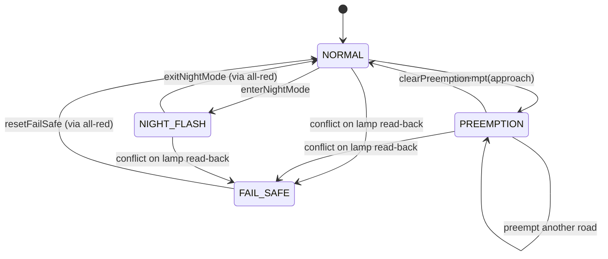
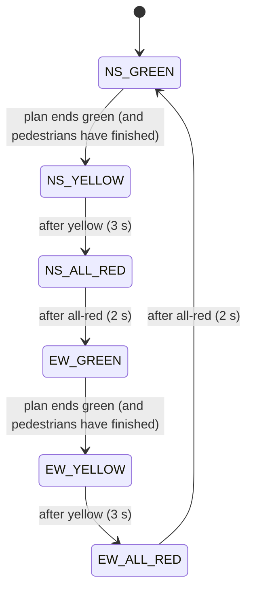
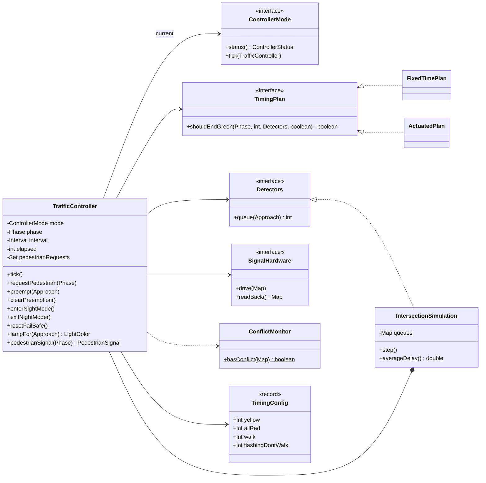

# 🚦 Design a Traffic Control System — Low Level Design (Java)


> A **safety-critical state machine**. Anyone can cycle red-yellow-green; the interview is about what
> must **never** happen (two crossing roads green at once, green jumping to red without yellow),
> how the controller changes **mode** (normal, emergency preemption, night flash, fail-safe), and how
> the timing **adapts** to traffic.

A four-way intersection has two **phases**: North-South and East-West. Each phase runs
**green → yellow → all-red**, then the other phase gets green. Pedestrians push a button to get a
WALK signal, an ambulance can take over the intersection, the controller flashes at night, and a
conflict monitor drops everything to flashing red if the lamps ever disagree with safety.

> 📚 **Credit:** Problem inspired by
> [AlgoMaster — Design Traffic Control System](https://algomaster.io/learn/lld/design-traffic-control-system)
> (premium lesson, **not** accessed). Everything here is my own original work, based on publicly known
> traffic signal practice. See [References & Credits](#-references--credits).

---

## 📑 On this page

1. [Scoping the Problem](#1-scoping-the-problem)
2. [Finding the Building Blocks](#2-finding-the-building-blocks)
3. [Object Model](#3-object-model)
   - [3.1 Class Responsibilities](#31-class-responsibilities)
   - [3.2 Patterns in Play](#32-patterns-in-play)
   - [3.3 UML Diagrams](#33-uml-diagrams)
   - [Practice Round](#-practice-round)
4. [Implementation Walkthrough](#4-implementation-walkthrough)
5. [Build, Run & Verify](#5-build-run--verify)
6. [Follow-up Scenarios](#6-follow-up-scenarios)
   - [6.1 Safety First: Intervals and the Conflict Monitor](#61-safety-first-intervals-and-the-conflict-monitor)
   - [6.2 Fixed-Time vs Actuated Timing](#62-fixed-time-vs-actuated-timing)
   - [6.3 Pedestrians, Emergency Vehicles and Night Mode](#63-pedestrians-emergency-vehicles-and-night-mode)
7. [Last-Minute Revision](#7-last-minute-revision)
8. [References & Credits](#-references--credits)

---

## 1. Scoping the Problem

### 🗣️ Sample conversation

| Candidate asks | Interviewer answers | Design impact |
|---|---|---|
| One intersection or a city? | One four-way intersection; mention coordination. | `TrafficController` per intersection. |
| Which movements? | Two phases: North-South and East-West (no turn arrows). | `Phase` enum; turn phases are a follow-up. |
| Timings? | Yellow 3 s, all-red 2 s; greens configurable. | `TimingConfig` (safety) separate from `TimingPlan` (green lengths). |
| Fixed or sensor-based? | Both; compare them. | `FixedTimePlan` and `ActuatedPlan` strategies. |
| Pedestrians? | Push buttons; WALK then flashing DON'T WALK. | Requests per phase; green extended to finish the crossing. |
| Emergency vehicles? | Ambulance gets green on its road. | `PREEMPTION` mode with safe clearance. |
| Night? | Main road flashing yellow, side road flashing red. | `NIGHT_FLASH` mode. |
| Failures? | Never show conflicting greens. | Conflict monitor reads the lamps back → `FAIL_SAFE`. |

### ✅ Functional requirements

1. Cycle phases with green → yellow → all-red, timed by a pluggable plan.
2. Pedestrian push buttons: WALK and flashing DON'T WALK alongside the matching phase.
3. Emergency preemption for any approach; resume normal operation afterwards.
4. Night flashing mode; restart through all-red.
5. Fail-safe all-way flashing red on a detected conflict, until a technician resets it.

### ⚙️ Non-functional requirements

- **Safety invariant**: crossing phases never both allow traffic (tested on every tick of 25,000 random ticks with random events).
- **No skipped intervals**: green is always followed by yellow, and yellow by all-red.
- **Measurable**: simulate traffic and compare timing plans by average delay.

---

## 2. Finding the Building Blocks

| Candidate | Keep? | Reasoning |
|---|---|---|
| **TrafficController** | ✅ | State-pattern context; phase, interval, timers, requests. |
| **ControllerMode** × 4 | ✅ | NORMAL, PREEMPTION, NIGHT_FLASH, FAIL_SAFE. |
| **Phase**, **Approach**, **Interval** | ✅ enums | Which roads, which part of the cycle. |
| **LightColor**, **PedestrianSignal** | ✅ enums | What the heads show. |
| **TimingPlan** | ✅ strategy | Fixed vs actuated green lengths. |
| **TimingConfig** | ✅ record | Safety intervals, which no plan may shorten. |
| **Detectors** | ✅ interface | Queue lengths from road sensors (the simulation provides them). |
| **SignalHardware** + **ConflictMonitor** | ✅ | Drive lamps, read them back, check independently. |
| **IntersectionSimulation** | ✅ | Random arrivals, departures on green, delay statistics. |
| A `TrafficLight` object per pole with its own timer | ❌ | Independent lights can drift into a conflict. One controller decides all lamps together. |

> 💡 **Interview tip:** Saying *"lights are outputs of one controller, never independent objects with
> their own timers"* shows you've thought about safety.

---

## 3. Object Model

### 3.1 Class Responsibilities

#### Modes

| Mode | Each tick | Allowed commands |
|---|---|---|
| `NORMAL` | Green → (plan says end) → yellow → all-red → other phase. | pedestrian request, preempt, enter night |
| `PREEMPTION` | Clear the other phase (yellow, all-red), then hold green on the emergency road. | pedestrian (queued), preempt (retarget), clear |
| `NIGHT_FLASH` | Clear safely, then flash: main road yellow, side road red. | exit night |
| `FAIL_SAFE` | Hold all-way flashing red. | reset (technician) |

#### `TrafficController`
| Member | Purpose |
|---|---|
| `tick()` | Mode step → drive lamps → **read back** → conflict check → maybe `FAIL_SAFE`. |
| `phase`, `interval`, `elapsed` | Cycle position. |
| `pedestrianRequests`, `servingPedestrians` | Push buttons and the current WALK service. |
| `lampFor(approach)`, `pedestrianSignal(phase)`, `status()` | Displays. |
| `requestPedestrian`, `preempt`, `clearPreemption`, `enterNightMode`, `exitNightMode`, `resetFailSafe` | Commands, routed through the current mode. |

#### Timing
- `TimingPlan.shouldEndGreen(phase, elapsed, detectors, otherPhaseDemand)`.
- `FixedTimePlan(nsGreen, ewGreen)`: ignores sensors.
- `ActuatedPlan(minGreen, maxGreen)`: rest in green, min green, gap out, max out.
- `TimingConfig(yellow, allRed, walk, flashingDontWalk)`: safety timings no plan can shorten.

### 3.2 Patterns in Play

| Pattern | Where | Why here |
|---|---|---|
| **State** | `ControllerMode` × 4 in `Modes`; `TrafficController` is the context | Commands and tick behaviour depend on the mode; illegal commands are refused (no preemption while in fail-safe). |
| **Nested state machine** | `Interval` inside NORMAL / PREEMPTION | Every phase change goes through GREEN → YELLOW → ALL_RED; the clearance code is shared. |
| **Strategy** | `TimingPlan` | Swap fixed and actuated timing without touching the controller. |
| **Observer** | `TrafficListener` | Logs, central management, tests. |
| **Independent safety check** | `ConflictMonitor` on `SignalHardware.readBack()` | Checks what the lamps *really* show, not what the logic intended. |

### 3.3 UML Diagrams

**Controller mode diagram**



**Interval cycle inside NORMAL**



**Class diagram**



### 🧠 Practice Round

1. **Left-turn arrows**: add protected left-turn phases. What conflicts with what now? *(Hint: a conflict matrix instead of two phases.)*
2. **Green wave**: coordinate five intersections along a main road so cars hit green after green.
3. **Bus priority**: extend green by up to 10 s when a bus is detected. How is that different from preemption?
4. **Countdown timers** on pedestrian heads: what does the controller have to expose?
5. **Red-light cameras**: detect a vehicle entering on red. Which component raises the event?
6. **Clock-based schedule**: night mode from 1 am to 5 am automatically.

<details>
<summary>💡 Hints for #1</summary>

Replace the two-phase rule with a **conflict matrix**: `conflicts[movement][movement] = true` for
movements whose paths cross. The ring-and-barrier design used in practice groups compatible movements
into phases. `ConflictMonitor` then checks every pair of flowing movements against the matrix instead of NS vs EW.
</details>

<details>
<summary>💡 Hints for #3</summary>

Preemption **takes over** (safety: clear everyone, give green, hold). Bus priority only **bends** the
normal timing: extend the current green a little (early green / green extension) and never skip
pedestrian or clearance intervals. It fits as a decorator around `TimingPlan`, not as a new mode.
</details>

---

## 4. Implementation Walkthrough

### 📁 Project structure

```
TrafficControlSystem/
├── pom.xml
├── README.md
└── src
    ├── main/java/com/lld/states/traffic
    │   ├── TrafficApp.java                  # traced cycle, pedestrian, ambulance; plan comparison
    │   ├── model/       Approach, Phase, Interval, LightColor, PedestrianSignal, TimingConfig
    │   ├── timing/      TimingPlan, FixedTimePlan, ActuatedPlan, Detectors
    │   ├── controller/  TrafficController (context), ControllerMode, Modes (4), ControllerStatus,
    │   │                SignalHardware, ConflictMonitor, TrafficListener
    │   └── simulation/  IntersectionSimulation
    └── test/java/com/lld/states/traffic
        └── TrafficControllerTest.java       # 16 tests
```

### ⏱️ One tick

```java
public void tick() {
    tick++;
    mode.tick(this);                                             // NORMAL / PREEMPTION / NIGHT / FAIL_SAFE
    hardware.drive(commandedLamps());
    if (mode != FAIL_SAFE && ConflictMonitor.hasConflict(hardware.readBack())) {
        switchMode(FAIL_SAFE);                                   // trust the lamps, not the logic
        hardware.drive(commandedLamps());                        // all-way flashing red
    }
}
```

### 🔁 The normal cycle

```java
void normalStep() {
    elapsed++;
    switch (interval) {
        case GREEN -> {
            if (servingPedestrians && elapsed < config.pedestrianService()) return;   // finish the crossing
            boolean otherDemand = detectors.queue(phase.next()) > 0 || pedestrianRequests.contains(phase.next());
            if (plan.shouldEndGreen(phase, elapsed, detectors, otherDemand)) setInterval(YELLOW);
        }
        case YELLOW  -> { if (elapsed >= config.yellow()) setInterval(ALL_RED); }
        case ALL_RED -> { if (elapsed >= config.allRed()) startGreen(phase.next()); }
    }
}
```

### 🚑 Preemption reuses the same safe clearance

```java
void preemptionStep() {
    if (phase == preemptTarget && interval == GREEN) { elapsed++; return; }   // hold for the ambulance
    clearanceStep(() -> startGreen(preemptTarget));                         // GREEN → YELLOW → ALL_RED → target
}
```

### 📈 Actuated timing

```java
if (!otherPhaseDemand) return false;                      // rest in green
if (greenElapsed < minGreen) return false;                // min green
return detectors.queue(phase) == 0 || greenElapsed >= maxGreen;   // gap out / max out
```

👉 Browse the full source in [`src/main/java`](src/main/java/com/lld/states/traffic).

---

## 5. Build, Run & Verify

### With Maven

```bash
cd Managing-States/TrafficControlSystem
mvn test                 # 16 tests
mvn compile exec:java    # demo
```

### Without Maven (plain JDK 17+)

```bash
cd Managing-States/TrafficControlSystem
javac -d out $(find src/main -name "*.java")
java -cp out com.lld.states.traffic.TrafficApp
```

### Demo output

```
1) Fixed plan (NS 20 s, EW 15 s), yellow 3 s, all-red 2 s
   t=10   pedestrian presses the button to cross alongside EAST_WEST
   t=20   NORTH_SOUTH YELLOW  lamps={NORTH=YELLOW, SOUTH=YELLOW, EAST=RED, WEST=RED}
   t=23   NORTH_SOUTH ALL_RED lamps={NORTH=RED, SOUTH=RED, EAST=RED, WEST=RED}
   t=25   EAST_WEST   GREEN   lamps={NORTH=RED, SOUTH=RED, EAST=GREEN, WEST=GREEN}
   t=27   EW pedestrian signal: WALK
   t=35   EW pedestrian signal: FLASHING_DONT_WALK
   t=40   EAST_WEST   YELLOW  lamps={NORTH=RED, SOUTH=RED, EAST=YELLOW, WEST=YELLOW}
   t=43   EAST_WEST   ALL_RED lamps={NORTH=RED, SOUTH=RED, EAST=RED, WEST=RED}
   t=45   NORTH_SOUTH GREEN   lamps={NORTH=GREEN, SOUTH=GREEN, EAST=RED, WEST=RED}
   t=45   ambulance approaching from the EAST
   t=45   MODE NORMAL -> PREEMPTION
   t=46   NORTH_SOUTH YELLOW  lamps={NORTH=YELLOW, SOUTH=YELLOW, EAST=RED, WEST=RED}
   t=49   NORTH_SOUTH ALL_RED lamps={NORTH=RED, SOUTH=RED, EAST=RED, WEST=RED}
   t=51   EAST_WEST   GREEN   lamps={NORTH=RED, SOUTH=RED, EAST=GREEN, WEST=GREEN}
   t=55   ambulance has passed
   t=55   MODE PREEMPTION -> NORMAL
   t=66   EAST_WEST   YELLOW  lamps={NORTH=RED, SOUTH=RED, EAST=YELLOW, WEST=YELLOW}
   t=69   EAST_WEST   ALL_RED lamps={NORTH=RED, SOUTH=RED, EAST=RED, WEST=RED}

2) Busy main road (NS 0.4 cars/s each way), quiet side road (EW 0.05), 1 hour
   fixed 30/30   : served 3229, avg delay 22.8 s, max delay 60 s, max queue 31
   actuated 8-60 : served 3246, avg delay 8.7 s, max delay 42 s, max queue 13
```

Notice the ambulance: the North-South green that had just started still gets its **full yellow and
all-red** before East gets green. Preemption is fast, but never unsafe. On unbalanced traffic,
**actuated timing cuts average delay by 62%** (22.8 s → 8.7 s).

### ✅ What the tests cover

| Area | Tests |
|---|---|
| **Safety** | **No conflicting flow on any of 25,000 ticks** (5 seeds × 5,000, random preemptions, night mode and pedestrians, both plans); green always follows all-red and all-red always follows yellow; conflict monitor rules (yellow counts as flowing). |
| **Cycle** | Exact interval timestamps for a fixed plan; lamp colours per interval. |
| **Pedestrians** | WALK → FLASHING DON'T WALK; green held beyond its 4 s to finish the crossing; no WALK without a request; a request made during preemption is served afterwards. |
| **Actuated** | Rests in green with an empty side road; max-out serves the side road; gap-out ends green early; **actuated delay < 60% of fixed** on unbalanced traffic. |
| **Preemption** | Safe clearance then hold (exact timestamps); already-green road just holds; normal timing resumes. |
| **Night / fail-safe** | Night enters via yellow and all-red, flashes, refuses preemption, exits via all-red; **a stuck relay → FAIL_SAFE all-way flashing red within one tick**, commands refused, technician reset restores normal; invalid configuration and commands. |

---

## 6. Follow-up Scenarios

### 6.1 Safety First: Intervals and the Conflict Monitor

**Ask:** "How do you guarantee two crossing roads are never green together?"

Two independent layers:

1. **By construction**: lamps are computed from one `(phase, interval)` pair, so only one phase can be
   green. Every phase change goes GREEN → YELLOW (drivers stop) → ALL_RED (the box clears) → next GREEN.
   Preemption and night mode reuse the same clearance code instead of taking shortcuts.
2. **By monitoring**: after driving the lamps, the controller **reads back** what they really show and
   checks that crossing phases don't both permit flow (green, yellow or flashing yellow). A welded relay
   or wiring fault trips `FAIL_SAFE`: all-way flashing red (every driver treats it as a stop sign)
   until a technician resets it.

### 6.2 Fixed-Time vs Actuated Timing

| Plan | Behaviour | Best for |
|---|---|---|
| **Fixed-time** | Same greens every cycle | Predictable, easy to coordinate along a corridor. |
| **Actuated** (used in the comparison) | Rest in green when nobody waits; min green; end when the queue empties (gap-out); cap at max green (max-out) | Unbalanced or variable traffic: 62% less delay in the demo. |
| Adaptive (city-wide) | Optimise all intersections from live data | Large systems; a follow-up. |

Because timing is a `TimingPlan` strategy, the controller and all its safety logic stay the same.

### 6.3 Pedestrians, Emergency Vehicles and Night Mode

| Situation | Behaviour |
|---|---|
| Pedestrian button | Remembered until the matching phase turns green; WALK (7 s) then FLASHING DON'T WALK (5 s); green is **extended** if the plan wanted to end it earlier. |
| Ambulance from the East | Current green → yellow → all-red → East-West green, **held** until cleared; pedestrians see DON'T WALK; requests are kept for later. |
| Night mode | Clears safely, then main road flashing yellow, side road flashing red; leaving goes through all-red, then main-road green. |

### 🚀 More follow-ups to practice

| Follow-up | Design move |
|---|---|
| Turn arrows / more phases | Conflict matrix; ring-and-barrier phase groups. |
| Corridor coordination | Common cycle length + offsets per intersection (green wave). |
| Transit priority | `TimingPlan` decorator that extends green for buses. |
| Scheduled modes | A scheduler calling `enterNightMode` / `exitNightMode` by time of day. |
| Central management | Listener streaming modes, faults and queue lengths to a traffic centre. |

---

## 7. Last-Minute Revision

```
1. Clarify    → phases (NS/EW), yellow & all-red times, fixed or sensors, pedestrians, emergencies, night, faults
2. Model      → ONE controller computes ALL lamps from (phase, interval); lights are outputs, not objects with timers
3. Cycle      → GREEN → YELLOW → ALL_RED → other phase; nothing skips yellow or all-red
4. Modes      → State: NORMAL, PREEMPTION (clear then hold), NIGHT_FLASH (clear then flash), FAIL_SAFE (all red flash)
5. Timing     → Strategy: fixed vs actuated (rest in green, min green, gap-out, max-out)
6. Safety     → conflict monitor on lamp READ-BACK → fail-safe; property test on every tick
7. Pedestrian → request remembered; WALK + flashing DON'T WALK; green extended to finish the crossing
```

---

## 📚 References & Credits

| Resource | How it was used |
|---|---|
| [AlgoMaster.io — Design Traffic Control System (LLD)](https://algomaster.io/learn/lld/design-traffic-control-system) | Inspiration for the **problem choice** only. The lesson is premium and was **not** accessed. |
| [Traffic light — Wikipedia](https://en.wikipedia.org/wiki/Traffic_light) | Public background on signal phases, all-red and flashing operation. |
| [Traffic signal preemption — Wikipedia](https://en.wikipedia.org/wiki/Traffic_signal_preemption) | Public background on emergency preemption. |
| [Mermaid](https://mermaid.js.org/) | Diagrams rendered by GitHub. |
| [JUnit 5 User Guide](https://junit.org/junit5/docs/current/user-guide/) | Testing. |

**Originality statement**

- This repository is a **personal learning project** for LLD interview preparation.
- The AlgoMaster lesson is premium content that I have not accessed. No text, code, diagrams,
  headings or other material from it (or any paid source) is reproduced here.
- All headings, source code, explanations, tables, diagrams, tests and exercises were written
  independently from publicly known behaviour and the public references above.
- This project is **not affiliated with or endorsed by** AlgoMaster.io. "AlgoMaster" is the
  property of its respective owner.
- For the original lesson, please support the author at [algomaster.io](https://algomaster.io).

---

> ⭐ Try the Practice Round before reading the code, then compare your design with this one.
