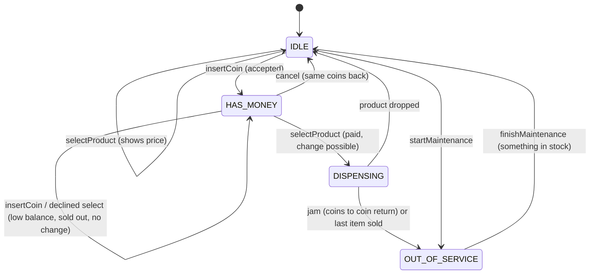
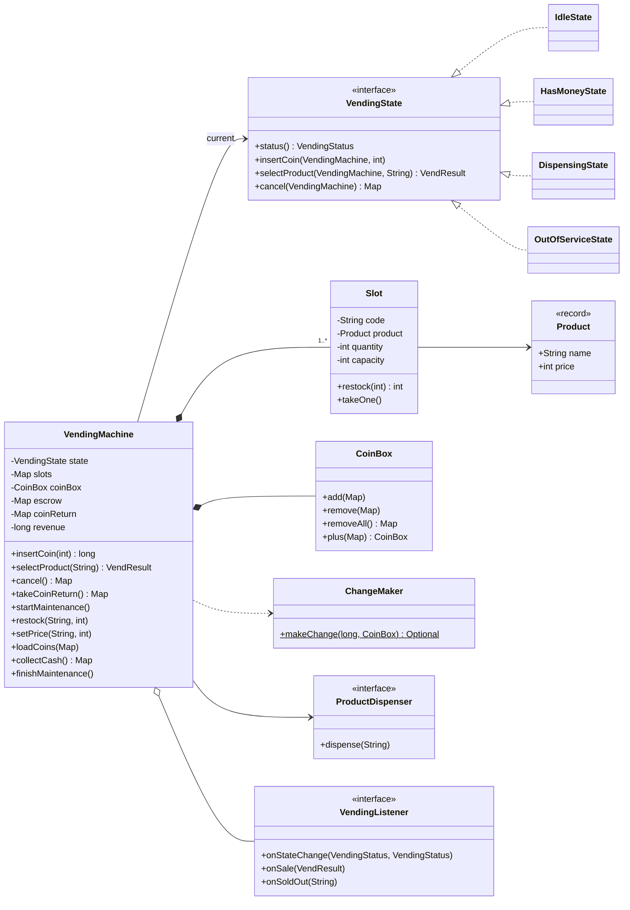
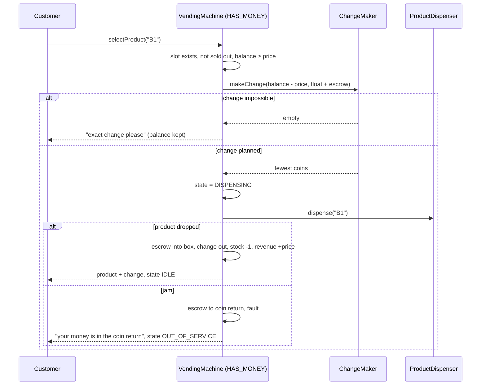

# 🥤 Design a Vending Machine — Low Level Design (Java)


> One of the most common **State pattern** questions. It looks trivial (insert coins, pick a
> snack), but a strong answer handles the money properly: coins held in **escrow** until the sale
> completes, **change planned before dispensing** from a limited coin float, **exact-change-only**
> refusals, refunds when a product **jams**, and operator maintenance that never interrupts a customer.

The customer inserts coins, selects a slot (e.g. `A1`), and receives the product plus change, or
cancels and gets the same coins back. An operator restocks, changes prices, collects cash and
reloads the change float.

> 📚 **Credit:** Problem inspired by
> [AlgoMaster — Design Vending Machine](https://algomaster.io/learn/lld/design-vending-machine)
> (premium lesson, **not** accessed). Everything here is my own original work, based on how vending
> machines publicly work. See [References & Credits](#-references--credits).

---

## 📑 On this page

1. [Scoping the Problem](#1-scoping-the-problem)
2. [Finding the Building Blocks](#2-finding-the-building-blocks)
3. [Object Model](#3-object-model)
   - [3.1 Class Responsibilities](#31-class-responsibilities)
   - [3.2 Patterns in Play](#32-patterns-in-play)
   - [3.3 UML Diagrams](#33-uml-diagrams)
   - [Practice Round](#-practice-round)
4. [Implementation Walkthrough](#4-implementation-walkthrough)
5. [Build, Run & Verify](#5-build-run--verify)
6. [Follow-up Scenarios](#6-follow-up-scenarios)
   - [6.1 Escrow and the Coin Return](#61-escrow-and-the-coin-return)
   - [6.2 Change from a Limited Float](#62-change-from-a-limited-float)
   - [6.3 Jams, Sold-Out and Maintenance](#63-jams-sold-out-and-maintenance)
7. [Last-Minute Revision](#7-last-minute-revision)
8. [References & Credits](#-references--credits)

---

## 1. Scoping the Problem

### 🗣️ Sample conversation

| Candidate asks | Interviewer answers | Design impact |
|---|---|---|
| Coins, notes, cards? | Coins: 5c, 10c, 25c, $1. Cards are a follow-up. | Configurable accepted denominations; amounts in **cents** (no floating-point money). |
| Insert money first or select first? | Either. Selecting first just shows the price. | `IDLE` answers a selection with the price. |
| What if the balance is too low? | Keep the money, ask for more. | Decline without leaving `HAS_MONEY`. |
| Change? | Yes, from the coins the machine has. | Change planned **before** dispensing; exact-change-only when impossible. |
| Cancel? | Return the money. | Escrow: the **same coins** come back. |
| Sold out? | Tell the user; other slots still work. | Per-slot stock; the machine goes offline only when *everything* is sold out. |
| Product stuck? | Refund. | Coins to the coin return, machine out of service. |
| Operator tasks? | Restock, prices, cash collection. | `OUT_OF_SERVICE` state, entered only from `IDLE`. |

### ✅ Functional requirements

1. Accept configured coins; reject others into the coin return.
2. Select a slot: dispense if paid and change is possible; otherwise explain why (price, sold out, insufficient balance, exact change).
3. Give change with the fewest coins available; cancel returns the inserted coins unchanged.
4. Track sales and revenue; notify when a slot becomes empty.
5. Maintenance: restock (up to capacity), set prices, collect cash, load the change float.

### ⚙️ Non-functional requirements

- **Never lose the customer's money**: nothing is kept unless the product actually dropped.
- **Never promise change the machine can't give**.
- **Clear rules per state**; impossible actions are refused, not silently ignored.

---

## 2. Finding the Building Blocks

| Candidate | Keep? | Reasoning |
|---|---|---|
| **VendingMachine** | ✅ | State-pattern context and facade. |
| **VendingState** + Idle / HasMoney / Dispensing / OutOfService | ✅ | One class per mode of the machine. |
| **Slot** | ✅ | Code (`A1`), product, quantity, capacity. |
| **Product** | ✅ record | Name + price in cents. |
| **CoinBox** | ✅ | Float + takings, per denomination. |
| **ChangeMaker** | ✅ | Bounded coin change: fewest coins from what is available. |
| **ProductDispenser** | ✅ interface | The motor; it can jam, and tests simulate that. |
| Escrow / coin return | ✅ fields | Customer coins held apart from the machine's money. |
| `SoldOutState` | ❌ | Sold-out is per **slot**, not the whole machine; the machine goes offline only when every slot is empty. |
| `Coin` class hierarchy | ❌ | A coin is just its value in cents; accepted values are configuration. |

---

## 3. Object Model

### 3.1 Class Responsibilities

#### What each state allows

| Action ↓ / State → | IDLE | HAS_MONEY | DISPENSING | OUT_OF_SERVICE |
|---|---|---|---|---|
| `insertCoin` | ✅ → HAS_MONEY | ✅ | ❌ | ❌ |
| `selectProduct` | shows price / sold out | ✅ buy | ❌ | ❌ |
| `cancel` | ❌ | ✅ → IDLE | ❌ | ❌ |
| `startMaintenance` | ✅ | ❌ (customer has money in) | ❌ | ✅ no-op |
| `restock` / `setPrice` / `loadCoins` / `collectCash` / `finishMaintenance` | ❌ | ❌ | ❌ | ✅ |

`VendingState` gives every action a **"not allowed" default**; each state overrides only its ✅ cells.

#### `VendingMachine` (context)
| Member | Purpose |
|---|---|
| `escrow` | The current customer's coins, kept apart until a sale completes. |
| `coinReturn` | Rejected coins and jam refunds, collected with `takeCoinReturn()`. |
| `performVend(slot)` | Validate → plan change → DISPENSING → commit or refund. |
| `slots()`, `revenue()`, `unitsSold()`, `balance()` | Queries. |
| `Builder` | Accepted coins, slots, change float, dispenser. |

#### Money
`CoinBox` (add, remove, removeAll, plus), `ChangeMaker.makeChange(amount, box)`, and `Money` (format and describe).

### 3.2 Patterns in Play

| Pattern | Where | Why here |
|---|---|---|
| **State** | `VendingState` + 4 states | Behaviour depends on the mode; each mode's rules live in one class. |
| **Singleton (stateless states)** | `IdleState.INSTANCE`, … | States carry no data. |
| **Builder** | `VendingMachine.builder()` | Coins, slots, float and dispenser configured readably. |
| **Facade** | `VendingMachine` | Customers and operators see a few buttons; escrow, change and stock are hidden. |
| **Observer** | `VendingListener` | Display, "slot empty" telemetry, sales reporting. |
| **Dependency inversion** | `ProductDispenser` | Hardware can be swapped or faked; jams are testable. |

### 3.3 UML Diagrams

**State diagram**



**Class diagram**



**A purchase, including the jam path**



### 🧠 Practice Round

1. **Card payments**: add a card reader. Which state handles "card tapped", and how does escrow change?
2. **Timeout**: return the escrowed coins after 60 s of inactivity. Where does the timer live?
3. **Multi-buy**: allow two products in one transaction. What changes in `HAS_MONEY`?
4. **Discounts**: 10% off after 6 pm. Where does pricing belong? *(Hint: a `PricingStrategy`.)*
5. **Remote monitoring**: send stock and cash levels to a server every hour without touching the states.
6. **Coin tubes are full**: the 25c tube holds only 50 coins. What happens to extra quarters?

<details>
<summary>💡 Hints for #1</summary>

Add a `PaymentMethod` strategy. With a card, `HAS_MONEY` becomes `AUTHORISED` (an amount is held on
the card), change is never needed, and a jam means **voiding the authorisation** instead of refunding
coins. The states stay the same shape; only the money handling behind them changes.
</details>

<details>
<summary>💡 Hints for #6</summary>

Real machines route overflow coins to a cash box that can't be used for change. Model two stores:
`changeTubes` (limited, used by `ChangeMaker`) and `cashBox` (unlimited, collection only). When a
tube is full, accepted coins go to the cash box.
</details>

---

## 4. Implementation Walkthrough

### 📁 Project structure

```
VendingMachine/
├── pom.xml
├── README.md
└── src
    ├── main/java/com/lld/states/vending
    │   ├── VendingMachineApp.java           # scripted walk-through
    │   ├── model/    Product, Slot, VendResult, Money, VendingException
    │   ├── money/    CoinBox, ChangeMaker
    │   └── machine/  VendingMachine (context), VendingState, IdleState, HasMoneyState,
    │                 DispensingState, OutOfServiceState, VendingStatus,
    │                 ProductDispenser, VendingListener
    └── test/java/com/lld/states/vending
        └── VendingMachineTest.java          # 18 tests
```

### 🔀 States stay tiny

```java
final class HasMoneyState implements VendingState {
    public void insertCoin(VendingMachine m, int d)          { m.acceptCoin(d); }
    public VendResult selectProduct(VendingMachine m, String s) { return m.performVend(s); }
    public Map<Integer, Integer> cancel(VendingMachine m) {
        Map<Integer, Integer> refund = m.releaseEscrow();
        m.transitionTo(IdleState.INSTANCE);
        return refund;
    }
    // everything else: inherited "not allowed"
}
```

### 💰 The sale, in a safe order

```java
if (slot.isSoldOut())    throw declined("... sold out ...");               // balance kept
if (balance < price)     throw declined("Insert $x more ...");
Map<Integer, Integer> change = ChangeMaker.makeChange(balance - price, coinBox.plus(escrow))
        .orElseThrow(() -> declined("... use exact change or cancel."));     // BEFORE the motor runs

transitionTo(DispensingState.INSTANCE);
try {
    dispenser.dispense(slotCode);
} catch (RuntimeException jam) {
    releaseEscrow() → coin return;  fault = true;  transitionTo(OUT_OF_SERVICE);  throw declined(...);
}
coinBox.add(escrow);  coinBox.remove(change);  escrow.clear();  slot.takeOne();  revenue += price;
transitionTo(allSoldOut() || fault ? OUT_OF_SERVICE : IDLE);
```

👉 Browse the full source in [`src/main/java`](src/main/java/com/lld/states/vending).

### ⏱️ Complexity

| Operation | Cost |
|---|---|
| Insert coin, cancel | O(denominations) |
| Change planning | O(D · A · C): D denominations, A = change / gcd, C = usable coins of a denomination; tiny for vending amounts |
| Select + dispense | O(1) plus change planning |

---

## 5. Build, Run & Verify

### With Maven

```bash
cd Managing-States/VendingMachine
mvn test                 # 18 tests
mvn compile exec:java    # scripted walk-through
```

### Without Maven (plain JDK 17+)

```bash
cd Managing-States/VendingMachine
javac -d out $(find src/main -name "*.java")
java -cp out com.lld.states.vending.VendingMachineApp
```

### Demo output (abridged)

```
Machine: [A1: Cola $1.25 x3, A2: Water $0.90 x1, B1: Chips $1.50 x2]

> Select Cola with no money
      [declined] Cola costs $1.25. Please insert coins.
> Select Cola ($1.25)
      [declined] Insert $0.25 more for Cola
> Select Cola
      [display] HAS_MONEY -> DISPENSING
      [display] DISPENSING -> IDLE
      tray: Cola from A1, change $0.00 [none]
> Insert $1.00 and select Water ($0.90): change 10c
      [telemetry] slot A2 is now empty
      tray: Water from A2, change $0.10 [1 x 10c]
> Cancel: the same coins come back
      returned: 1 x $1.00
> Insert a 1c coin
      [declined] 1c is not accepted; please take it from the coin return
> Insert $1.00 + $1.00 for Chips ($1.50): 50c change needed
      tray: Chips from B1, change $0.50 [2 x 25c]
> Again $2.00 for Chips: can the float still pay 50c?
      [declined] Cannot give change for $0.50. Please use exact change or cancel.
> Customer pays exact change instead
      tray: Chips from B1, change $0.00 [none]
> Operator: restock water, raise the cola price, collect cash
      [display] IDLE -> OUT_OF_SERVICE
      collected: $5.70
      [display] OUT_OF_SERVICE -> IDLE

Sales: {A1=1, A2=1, B1=2}, revenue $5.15
```

The second Chips purchase shows the most important behaviour: the float ran out of quarters, so
the machine refused **before** dispensing and kept the customer's $2.00 safe in escrow.

### ✅ What the tests cover

| Area | Tests |
|---|---|
| **States** | Purchase transitions via the listener; each state rejects foreign actions; **the DISPENSING state blocks buttons pressed while the motor runs**. |
| **Buying** | Price shown in IDLE; low balance keeps the money; change with the fewest coins (the customer's own coin can be change); cancel returns the exact coins; unaccepted coin to the coin return; sold-out slot refused while others work; unknown slot. |
| **Change safety** | **Exact change only** when the float can't pay (nothing dispensed, coins returned on cancel); change built from the customer's own coins; greedy counter-example (30c = 3 × 10c); **ChangeMaker = brute force on 300 random floats**. |
| **Failures / maintenance** | **Jam → coins in the coin return, stock, cash and revenue unchanged, OUT_OF_SERVICE**; last item sold → offline + sold-out event, can't resume until restocked; restock caps at capacity, price change, cash collection and float reload; builder validation. |

---

## 6. Follow-up Scenarios

### 6.1 Escrow and the Coin Return

**Ask:** "A customer inserts coins and presses cancel. What do they get back?"

The **same coins**. Inserted coins are held in `escrow`, separate from the machine's `coinBox`,
until the sale completes. That gives three guarantees:

- **Cancel** returns exactly what was inserted, with no change-making involved.
- A **declined** selection (low balance, sold out, no change) leaves the balance intact.
- A **jam** sends the escrowed coins to the coin return; the machine never kept them.

Coins the machine refuses (wrong denomination) fall straight into the coin return too.

### 6.2 Change from a Limited Float

**Ask:** "What if the machine can't make change?"

Plan the change **before** dispensing, from the float **plus the escrowed coins** (the customer's own
quarter can come back to them). If no combination works, decline with "use exact change", which is
what real machines show as *EXACT CHANGE ONLY*.

Greedy ("largest coin first") is not enough with a limited float:

```
Float: 25c × 1, 10c × 3.  Change needed: 30c.
Greedy: 25c → 5c left → no 5c → FAIL.
Correct: 10c × 3.
```

`ChangeMaker` solves bounded coin change with dynamic programming (fewest coins, only coins in stock)
and is checked against brute force in the tests.

### 6.3 Jams, Sold-Out and Maintenance

| Situation | Behaviour |
|---|---|
| Product jams | Escrow → coin return, fault flag, `OUT_OF_SERVICE`; stock, revenue and cash untouched. |
| One slot sold out | That slot declines; others keep selling. |
| Every slot sold out | Machine goes `OUT_OF_SERVICE` after the sale; can't resume until restocked. |
| Operator arrives | `startMaintenance` only from `IDLE`, never while a customer has money in. |

### 🚀 More follow-ups to practice

| Follow-up | Design move |
|---|---|
| Card / mobile payments | `PaymentMethod` strategy; authorise → capture after dispense, void on jam. |
| Inactivity timeout | Timer resets on each action; on expiry `HAS_MONEY` returns escrow → `IDLE`. |
| Dynamic pricing | `PricingStrategy` (time of day, promotions) consulted at select time. |
| Fleet telemetry | Listener that reports sales, empty slots and low float to a server. |
| Temperature control | A separate component with its own states (cooling / fault); a fault takes the machine offline. |

---

## 7. Last-Minute Revision

```
1. Clarify    → coins accepted? change? cancel? sold out? jams? operator tasks?
2. States     → IDLE → HAS_MONEY → DISPENSING → IDLE;  OUT_OF_SERVICE (maintenance / all sold out / jam)
                interface with "not allowed" defaults; sold-out is per SLOT, not a machine state
3. Money      → cents, not doubles; ESCROW customer coins until the sale completes
                cancel = same coins back; rejected coins / jam refunds → coin return
4. Change     → plan BEFORE dispensing from float + escrow; bounded coin-change DP (greedy fails)
                impossible → "exact change only", balance kept
5. Failures   → jam: refund escrow, go offline, stock/revenue untouched
6. Patterns   → State, Builder, Facade, Observer, DI for the motor
```

---

## 📚 References & Credits

| Resource | How it was used |
|---|---|
| [AlgoMaster.io — Design Vending Machine (LLD)](https://algomaster.io/learn/lld/design-vending-machine) | Inspiration for the **problem choice** only. The lesson is premium and was **not** accessed. |
| [Vending machine — Wikipedia](https://en.wikipedia.org/wiki/Vending_machine) | Public background on vending machine behaviour. |
| [Change-making problem — Wikipedia](https://en.wikipedia.org/wiki/Change-making_problem) | Public background on greedy vs dynamic programming change. |
| [Mermaid](https://mermaid.js.org/) | Diagrams rendered by GitHub. |
| [JUnit 5 User Guide](https://junit.org/junit5/docs/current/user-guide/) | Testing. |

**Originality statement**

- This repository is a **personal learning project** for LLD interview preparation.
- The AlgoMaster lesson is premium content that I have not accessed. No text, code, diagrams,
  headings or other material from it (or any paid source) is reproduced here.
- All headings, source code, explanations, tables, diagrams, tests and exercises were written
  independently from publicly known behaviour and the public references above.
- This project is **not affiliated with or endorsed by** AlgoMaster.io. "AlgoMaster" is the
  property of its respective owner.
- For the original lesson, please support the author at [algomaster.io](https://algomaster.io).

---

> ⭐ Try the Practice Round before reading the code, then compare your design with this one.
