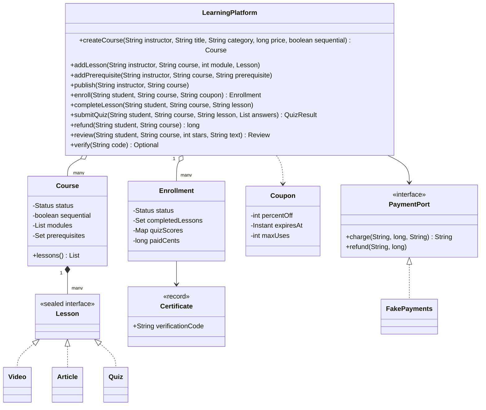
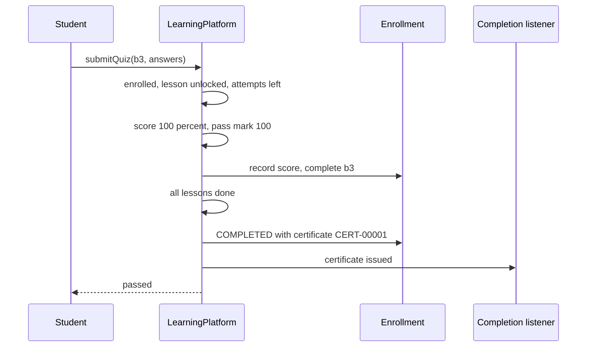
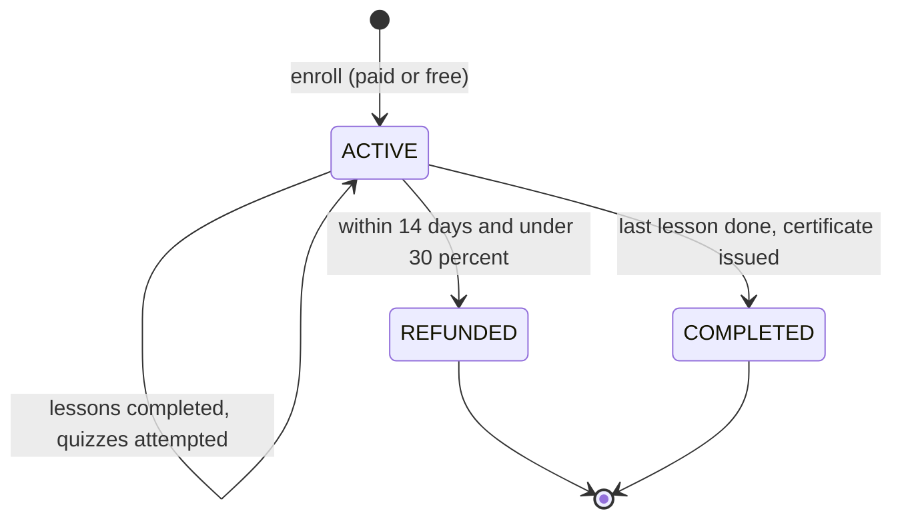

# 🎓 Design an Online Learning Platform — Low Level Design (Java)


> Think Coursera or Udemy. Listing videos is easy; the interview is about the **rules around learning**:
> a course lifecycle that freezes content once students rely on it, **prerequisites** without cycles,
> **locked lessons** in sequential courses, **quizzes** with attempts and pass marks, **certificates**
> that can be verified but not guessed, **refunds** that can't be abused, and honest **reviews**.

> 📚 **Credit:** Problem inspired by
> [AlgoMaster — Design Learning Platform](https://algomaster.io/learn/lld/design-learning-platform)
> (premium lesson, **not** accessed). Everything here is my own original work, based on how public
> online-course platforms behave. See [References & Credits](#-references--credits).

---

## 📑 On this page

1. [Scoping the Problem](#1-scoping-the-problem)
2. [Finding the Building Blocks](#2-finding-the-building-blocks)
3. [Object Model](#3-object-model)
   - [3.1 Class Responsibilities](#31-class-responsibilities)
   - [3.2 Patterns in Play](#32-patterns-in-play)
   - [3.3 UML Diagrams](#33-uml-diagrams)
   - [Practice Round](#-practice-round)
4. [Implementation Walkthrough](#4-implementation-walkthrough)
5. [Build, Run & Verify](#5-build-run--verify)
6. [Follow-up Scenarios](#6-follow-up-scenarios)
   - [6.1 Content That Doesn't Move](#61-content-that-doesnt-move)
   - [6.2 Progress, Quizzes and Certificates](#62-progress-quizzes-and-certificates)
   - [6.3 Money Rules](#63-money-rules)
7. [Last-Minute Revision](#7-last-minute-revision)
- [References & Credits](#-references--credits)

---

## 1. Scoping the Problem

### 🗣️ Sample conversation

| Candidate asks | Interviewer answers | Design impact |
|---|---|---|
| Course structure? | Modules of lessons: video, article, quiz. | `Course` → `Module` → sealed `Lesson`. |
| Can instructors edit a live course? | Not the structure; publish freezes it. | DRAFT → PUBLISHED → ARCHIVED. |
| Prerequisites? | Some courses require others to be completed. | Checked at enrollment; no cycles. |
| Order of lessons? | Some courses unlock lessons one by one. | `sequential` flag + unlock check. |
| Quizzes? | Pass mark and limited attempts; passing completes the lesson. | `Quiz` with `passPercent`, `maxAttempts`. |
| Certificates? | On completion; employers verify by code. | Non-guessable code (SHA-256 with a secret). |
| Payments? | Paid courses, coupons, refunds within 14 days if < 30% done. | `PaymentPort`, `Coupon`, refund rules. |
| Reviews? | Only real students, one each; refunds withdraw them. | Review rules. |

### ✅ Functional requirements

1. Instructors create courses, add modules/lessons/prerequisites (draft only), publish, archive, create coupons.
2. Students enroll (published, prerequisites met, not own course, not already active); pay after coupons.
3. Complete videos/articles; pass quizzes; sequential courses lock later lessons; progress and next lesson.
4. Completing every lesson issues one certificate and notifies listeners; certificates are verifiable.
5. Refund within 14 days and under 30% progress: money back, access removed, review withdrawn.
6. Reviews (1–5 stars) after starting the course, one per student; average rating.
7. Catalog search by title/category, sorted by rating, popularity or newest; instructor stats.

### ⚙️ Non-functional requirements

- No payment without enrollment and no enrollment without payment; coupons never over-used.
- Certificates not forgeable by guessing; deterministic behaviour for tests.

---

## 2. Finding the Building Blocks

| Noun / verb | Becomes |
|---|---|
| teacher, learner | `User` (role by action) |
| course, module, lesson | `Course`, `Course.Module`, `Lesson` (`Video`, `Article`, `Quiz`) |
| buying access | `Enrollment` (paid amount, progress, quiz scores, status) |
| discount | `Coupon` |
| proof | `Certificate` |
| opinion | `Review` |
| payments | `PaymentPort` (`FakePayments` adapter) |
| the site | `LearningPlatform` (facade) |

---

## 3. Object Model

### 3.1 Class Responsibilities

#### `LearningPlatform`
- Authoring guards (owner, draft only, unique lesson ids, no prerequisite cycles).
- Enrollment (status, prerequisites, coupon, payment), learning (unlock, quizzes), completion + certificate,
  refunds, reviews, search, stats.

#### `Course`
- Modules and lessons in order; status; prerequisites; `sequential` flag.

#### `Enrollment`
- Completed lesson ids, quiz scores per quiz, status (ACTIVE / COMPLETED / REFUNDED), certificate.

#### `Lesson` (sealed)
- `Video(minutes)`, `Article(words)`, `Quiz(questions, passPercent, maxAttempts)`.

#### `Coupon`
- Course-specific, percent off, expiry, use count; `problem(course, now)` explains refusals.

### 3.2 Patterns in Play

| Pattern | Where | Why |
|---|---|---|
| **Facade** | `LearningPlatform` | One API for instructors and students. |
| **Sealed types** | `Lesson` | Exhaustive handling of lesson kinds. |
| **Ports & Adapters** | `PaymentPort` | Swap payment providers; fake in tests. |
| **Observer** | completion listeners | E-mail certificates, update profiles. |
| **State (enums)** | `Course.Status`, `Enrollment.Status` | Lifecycle rules. |

**SOLID check**

- **S**: courses hold structure, enrollments hold progress, the facade holds rules.
- **O**: a new lesson type (coding exercise) is a new record in the sealed interface.
- **L**: any `PaymentPort` implementation works.
- **I**: the platform needs only `charge` and `refund` from payments.
- **D**: depends on `PaymentPort` and `Clock`, not a provider.

### 3.3 UML Diagrams

#### Class diagram



#### Sequence: last quiz passed



#### Enrollment lifecycle



### 🧠 Practice Round

1. Why freeze course content after publishing?
   <details><summary>Hint</summary>Progress, completion and certificates refer to a fixed set of lessons. Adding a lesson would silently un-complete finished students. Real platforms version the course instead.</details>
2. How do you stop a prerequisite cycle (A needs B, B needs A)?
   <details><summary>Hint</summary>Before adding "X requires Y", check that Y doesn't (transitively) require X: a DFS over prerequisites.</details>
3. A certificate number is sequential. Why not use it as the verification code?
   <details><summary>Hint</summary>Anyone could enumerate them. Derive the code from a keyed hash (HMAC) of the certificate data.</details>
4. What refund rule prevents "buy, download everything, refund"?
   <details><summary>Hint</summary>Time window + maximum progress consumed.</details>
5. Why take payment before creating the enrollment, and not the other way round?
   <details><summary>Hint</summary>If the charge fails nothing is created; the coupon is only consumed after a successful charge.</details>

---

## 4. Implementation Walkthrough

### 📁 Project structure

```
LearningPlatform/
├── pom.xml
└── src/
    ├── main/java/com/lld/social/learning/
    │   ├── LearningPlatformApp.java        # two Java courses, three students
    │   ├── model/                          # User, Course, Lesson, Enrollment, Certificate, Review, Coupon, LearningException
    │   ├── payment/                        # PaymentPort, FakePayments
    │   └── service/                        # LearningPlatform, ManualClock
    └── test/java/com/lld/social/learning/
        └── LearningPlatformTest.java
```

### 🔓 Sequential unlock

```java
for (Lesson l : c.lessons()) {
    if (l.id().equals(lessonId)) return;                          // everything before it is done
    if (!e.isCompleted(l.id())) throw locked("finish '" + l.title() + "' first");
}
```

### 📝 Quiz

```java
if (used >= quiz.maxAttempts()) throw "No attempts left";
int percent = correct * 100 / questions;
e.recordQuiz(lessonId, percent);
if (percent >= quiz.passPercent()) { e.complete(lessonId); checkCompletion(c, e); }
```

### 💳 Enrollment order of operations

```java
validate status, ownership, duplicates, prerequisites;
price = coupon == null ? price : coupon.apply(price);        // coupon checked, not yet used
reference = price > 0 ? payments.charge(...) : null;          // may throw: nothing created
coupon.use();
enrollments.put(...);
```

### 🪪 Certificate code

```java
SHA-256(secret | certId | student | course) → first 12 hex digits
```

### ⏱️ Complexity

| Operation | Cost |
|---|---|
| enroll | O(prerequisites) |
| completeLesson / submitQuiz | O(lessons) for the unlock check |
| progress | O(1) |
| search / stats | O(courses · enrollments) |

---

## 5. Build, Run & Verify

### With Maven

```bash
cd Social-and-Content-Platform/LearningPlatform
mvn test
mvn compile exec:java
```

### Without Maven (plain JDK 17+)

```bash
cd Social-and-Content-Platform/LearningPlatform
javac -d out $(find src/main -name "*.java")
java -cp out com.lld.social.learning.LearningPlatformApp
```

### Demo output

```
> Ines builds two courses
   [refused] Prerequisites can't form a cycle
   [refused] C2 is PUBLISHED; content is frozen after publishing
   C1 'Java Basics' (Programming, $0.00, 3 lessons) [PUBLISHED]
   C2 'Java Streams in Depth' (Programming, $49.99, 4 lessons) [PUBLISHED]

> Sam: prerequisites, locked lessons, a quiz
   [refused] Complete [Java Basics] first
   [refused] b2 is locked: finish 'Install the JDK' first
   progress 66%, next: Basics quiz
   attempt 1: QuizResult[percent=50, passed=false, attemptsLeft=1]
   [certificate] CERT-00001 for sam in 'Java Basics', verify with code 694757DA1EA2
   attempt 2: QuizResult[percent=100, passed=true, attemptsLeft=0]

> Sam enrolls in the paid course with a coupon
   paid $29.99 instead of $49.99
   [certificate] CERT-00002 for sam in 'Java Streams in Depth', verify with code 2F9E28AC8C62

> Tia and Uma
   [certificate] CERT-00003 for tia in 'Java Basics', verify with code E57F1D8DC6A2
   Tia asks for a refund at 25% progress: $29.99 back
   [refused] b3 is locked: finish 'Install the JDK' first
   [certificate] CERT-00004 for uma in 'Java Basics', verify with code 0CDB59BECCC5
   [refused] coupon LAUNCH40 has been used up

> Catalog, verification and instructor dashboard
   'java' by popularity: [Java Basics, Java Streams in Depth]
   verify 2F9E28AC8C62: sam completed Java Streams in Depth
   verify BOGUS: invalid
   Java Basics: 3 students, 3 completed, revenue $0.00, rating 0.0 (0 reviews)
   Java Streams in Depth: 1 students, 1 completed, revenue $29.99, rating 5.0 (1 reviews)
   payments net: $29.99
```

### ✅ What the tests cover

| Area | Tests |
|---|---|
| Authoring | empty publish refused, bad module, owner only, unique lesson ids, draft-only edits, archive stops enrollment; prerequisite cycles (direct and transitive); quiz validation |
| Enrolling | payment and prerequisites, duplicates, own course; declined payment creates nothing; coupons (wrong course, unknown, discount, not consumed by a declined payment, used up, expiry); 100% coupon skips payment |
| Learning | sequential locking and next lesson; free order in non-sequential courses; quiz scoring, pass mark boundary, attempts, no retake after passing; out of attempts; one certificate, verifiable, unique, 12-char code |
| Refunds & reviews | window boundary (day 14 ok), access removed, re-buy allowed, too late, too much progress; review needs progress, one per student, refund withdraws it, star range |
| Catalog & stats | popularity / newest / rating sorts, category filter, per-course stats |
| Concurrency | 40 parallel enrollments with a 10-use coupon → exactly 10 enrolled and charged |

**16 tests, all passing.**

---

## 6. Follow-up Scenarios

### 6.1 Content That Doesn't Move

- Freeze published content; changes create a **new course version**. Enrollments point at a version;
  students can opt into the new one.
- Archiving hides a course from the catalog but keeps access for existing students.

### 6.2 Progress, Quizzes and Certificates

- Progress here is lesson count; weighting by video minutes is a small change.
- Video progress needs "watched ≥ 90%" events from the player, idempotent and out-of-order safe.
- Question banks with random selection per attempt make retakes meaningful.
- Certificates: keyed hash (HMAC) codes, public verification page, revocation list.

### 6.3 Money Rules

- Payment first, enrollment second; coupon consumption only after success (atomic with the enrollment).
- Refunds reverse the payment through the provider; instructor revenue is reported net of refunds.
- Instructor payouts (revenue share) would use a ledger like the Payment Gateway in the Finance folder.

### 🚀 More follow-ups to practice

1. **Subscriptions** (all courses for a monthly fee) vs per-course purchase.
2. **Live cohorts** with deadlines and graded assignments.
3. **Discussion forums** per lesson (see the Stack Overflow design in this folder).
4. **Recommendations** from enrollment history.
5. **Offline downloads** with DRM and expiry.

---

## 7. Last-Minute Revision

- Course: DRAFT (editable) → PUBLISHED (frozen) → ARCHIVED (no new students).
- Lessons: video, article, quiz (pass mark, attempts); quizzes complete only by passing.
- Enrollment checks: published, prerequisites completed, not own, not already active; coupon then payment.
- Sequential courses lock later lessons; progress = completed / total.
- All lessons done → one certificate (keyed-hash code) + listeners.
- Refund: ≤ 14 days and < 30% progress; access removed, review withdrawn.
- Reviews: after starting, one per student.

---

## 📚 References & Credits

| Resource | How it was used |
|---|---|
| [AlgoMaster.io — Design Learning Platform (LLD)](https://algomaster.io/learn/lld/design-learning-platform) | Inspiration for the **problem choice** only. The lesson is premium and was **not** accessed. |
| [Hexagonal architecture (ports and adapters) — Wikipedia](https://en.wikipedia.org/wiki/Hexagonal_architecture_(software)) | Public background for `PaymentPort`. |
| [HMAC — Wikipedia](https://en.wikipedia.org/wiki/HMAC) | Public background for unforgeable verification codes. |
| [Mermaid](https://mermaid.js.org/) | Diagrams rendered by GitHub. |
| [JUnit 5 User Guide](https://junit.org/junit5/docs/current/user-guide/) | Testing. |

**Originality statement**

- This repository is a **personal learning project** for LLD interview preparation.
- The AlgoMaster lesson is premium content that I have not accessed. No text, code, diagrams,
  headings or other material from it (or any paid source) is reproduced here.
- All headings, source code, explanations, tables, diagrams, tests and exercises were written
  independently from publicly known behaviour and the public references above.
- This project is **not affiliated with or endorsed by** AlgoMaster.io or any learning platform.
- For the original lesson, please support the author at [algomaster.io](https://algomaster.io).

---

> ⭐ Try the Practice Round before reading the code, then compare your design with this one.
