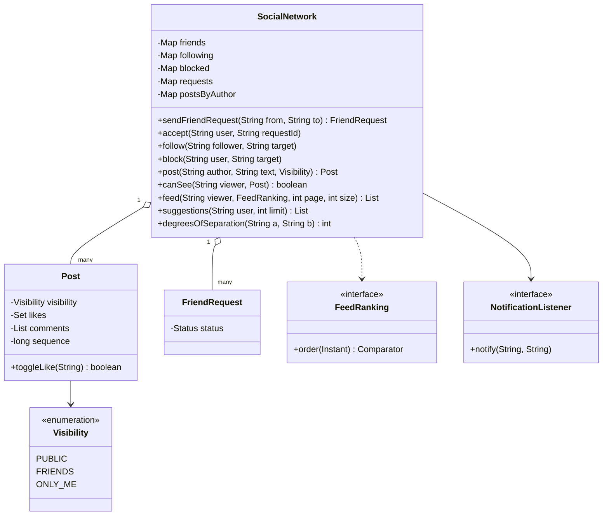
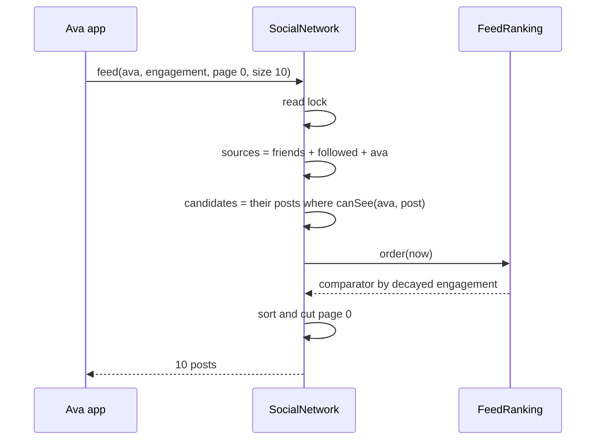
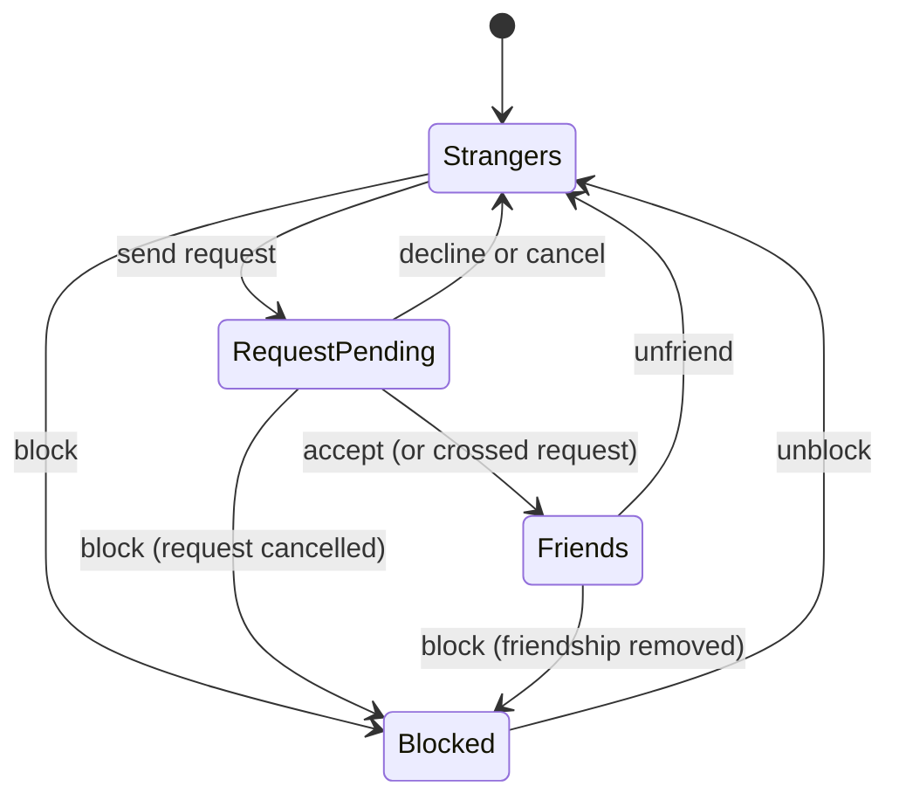

# 👥 Design a Social Network — Low Level Design (Java)


> Friends, posts, a news feed. The interview tests three things: modelling **relationships** (mutual
> friendship vs one-way follow vs block), enforcing **privacy in one place** (who may see which post),
> and building the **feed** (which posts, in what order, one page at a time), plus some **graph**
> questions: mutual friends, "people you may know", degrees of separation.

> 📚 **Credit:** Problem inspired by
> [AlgoMaster — Design Social Network](https://algomaster.io/learn/lld/design-social-network)
> (premium lesson, **not** accessed). Everything here is my own original work, based on how public
> social networks behave and standard graph algorithms. See [References & Credits](#-references--credits).

---

## 📑 On this page

1. [Scoping the Problem](#1-scoping-the-problem)
2. [Finding the Building Blocks](#2-finding-the-building-blocks)
3. [Object Model](#3-object-model)
   - [3.1 Class Responsibilities](#31-class-responsibilities)
   - [3.2 Patterns in Play](#32-patterns-in-play)
   - [3.3 UML Diagrams](#33-uml-diagrams)
   - [Practice Round](#-practice-round)
4. [Implementation Walkthrough](#4-implementation-walkthrough)
5. [Build, Run & Verify](#5-build-run--verify)
6. [Follow-up Scenarios](#6-follow-up-scenarios)
   - [6.1 Building the Feed at Scale](#61-building-the-feed-at-scale)
   - [6.2 Privacy Is One Function](#62-privacy-is-one-function)
   - [6.3 Graph Questions](#63-graph-questions)
7. [Last-Minute Revision](#7-last-minute-revision)
- [References & Credits](#-references--credits)

---

## 1. Scoping the Problem

### 🗣️ Sample conversation

| Candidate asks | Interviewer answers | Design impact |
|---|---|---|
| Friends only, or followers too? | Both: mutual friends, and following public accounts. | Two relations: `friends`, `following`. |
| Who sees a post? | Public, friends only, or only me. | `Visibility` + one `canSee` rule. |
| Blocking? | Hides everything both ways and removes all ties. | Block overrides every rule. |
| Friend requests? | Send, accept, decline, cancel. If both ask, just connect. | `FriendRequest` with statuses. |
| Feed order? | Newest first, or "top" by engagement. | `FeedRanking` strategy. |
| Feed size? | Paged. | `feed(viewer, ranking, page, size)`. |
| Suggestions? | Friends of friends, most mutual friends first. | Counting over the friend graph. |
| Notifications? | Requests, acceptances, likes, comments. | `NotificationListener` + inbox. |

### ✅ Functional requirements

1. Register, search users (never showing blocked people).
2. Friend requests (crossed requests auto-accept), decline, cancel, unfriend; follow/unfollow.
3. Block/unblock: removes friendship, follows and pending requests; hides content both ways.
4. Posts with visibility; like (toggle), comment, delete (author only); profile timeline.
5. Feed from own + friends + followed users, filtered by privacy, ranked, paged.
6. Mutual friends, suggestions, degrees of separation.
7. Notifications to others (never for your own actions).

### ⚙️ Non-functional requirements

- Privacy enforced in one function; hidden posts look like non-existent ones.
- Feeds and graph queries run concurrently with each other (read lock).
- Deterministic ordering.

---

## 2. Finding the Building Blocks

| Noun / verb | Becomes |
|---|---|
| person | `User` |
| friend request | `FriendRequest` |
| status update | `Post` (+ `Visibility`, likes, `Comment`s) |
| feed order | `FeedRanking` |
| bell icon | `NotificationListener`, inbox |
| the site | `SocialNetwork` (facade) |

---

## 3. Object Model

### 3.1 Class Responsibilities

#### `SocialNetwork`
- Relationship maps (friends, following, blocked), requests, posts by author, inboxes.
- `canSee(viewer, post)`: the privacy rule every read goes through.
- `feed`, `timeline`, `suggestions`, `mutualFriends`, `degreesOfSeparation`.

#### `Post`
- Text, visibility, like set (toggle), comments, global sequence (stable ordering).

#### `FeedRanking`
- `chronological()`; `engagement()` = (1 + likes + 2·comments) / (hours + 2)^1.5.

### 3.2 Patterns in Play

| Pattern | Where | Why |
|---|---|---|
| **Facade** | `SocialNetwork` | One API for the app. |
| **Strategy** | `FeedRanking` | Swap ordering without touching feed assembly. |
| **Observer** | `NotificationListener` | Push, e-mail digests, in-app bell. |
| **Graph algorithms** | BFS, friends-of-friends counting | Degrees, suggestions. |
| **Read-write lock** | service | Many readers, exclusive writers. |

**SOLID check**

- **S**: ranking ranks, posts hold engagement, the service enforces rules.
- **O**: a "close friends" visibility is one enum value + one `case` in `canSee`.
- **L**: any `FeedRanking` comparator works with paging.
- **I**: listeners get a single method.
- **D**: time via `Clock`.

### 3.3 UML Diagrams

#### Class diagram



#### Sequence: building a feed page



#### Relationship between two people



### 🧠 Practice Round

1. Where should the privacy check live?
   <details><summary>Hint</summary>In one function used by every read path (timeline, feed, like, comment, delete). Two copies of the rule eventually disagree.</details>
2. A blocked user tries to open a post by ID. What should the error say?
   <details><summary>Hint</summary>The same as a non-existent post: "No post P4". Don't confirm hidden content exists.</details>
3. Fan-out on write or on read for the feed?
   <details><summary>Hint</summary>Read (this design) is simple and always fresh; write (push post ids into followers' feed lists) makes reads fast but celebrities with millions of followers are expensive: hybrid is common.</details>
4. How do you rank "people you may know"?
   <details><summary>Hint</summary>Count mutual friends for each friend-of-friend; exclude existing friends, blocked users and pending requests.</details>
5. How far apart are two users?
   <details><summary>Hint</summary>BFS on the friend graph (unweighted shortest path); bidirectional BFS at scale.</details>

---

## 4. Implementation Walkthrough

### 📁 Project structure

```
SocialNetwork/
├── pom.xml
└── src/
    ├── main/java/com/lld/social/network/
    │   ├── SocialNetworkApp.java           # seven people and a chef
    │   ├── model/                          # User, Post, Comment, Visibility, FriendRequest, SocialException
    │   ├── feed/                           # FeedRanking
    │   └── service/                        # SocialNetwork, NotificationListener, ManualClock
    └── test/java/com/lld/social/network/
        └── SocialNetworkTest.java
```

### 🔒 The privacy rule

```java
if (p.authorId().equals(viewerId)) return true;
if (isBlockedEitherWay(viewerId, p.authorId())) return false;
return switch (p.visibility()) {
    case PUBLIC -> true;
    case FRIENDS -> areFriends(viewerId, p.authorId());
    case ONLY_ME -> false;
};
```

### 📰 Feed (fan-out on read)

```java
Set<String> sources = friends(viewer) ∪ following(viewer) ∪ {viewer};
candidates = posts of sources filtered by canSee(viewer, post);
candidates.sort(ranking.order(now));
return page slice;
```

### 🤝 Suggestions

```java
for (String f : friends(user))
    for (String fof : friends(f))
        if (fof is not user, not a friend, not blocked, no pending request) mutualCount[fof]++;
sort by mutualCount desc, then id
```

### ⏱️ Complexity

| Operation | Cost |
|---|---|
| canSee | O(1) |
| feed | O(P log P) for P candidate posts |
| suggestions | O(Σ friends of friends) |
| degrees | O(V + E) BFS |

---

## 5. Build, Run & Verify

### With Maven

```bash
cd Social-and-Content-Platform/SocialNetwork
mvn test
mvn compile exec:java
```

### Without Maven (plain JDK 17+)

```bash
cd Social-and-Content-Platform/SocialNetwork
javac -d out $(find src/main -name "*.java")
java -cp out com.lld.social.network.SocialNetworkApp
```

### Demo output

```
> Friendships: requests, a crossed request, a decline
   [refused] Already friends
   Ava's friends [ben, cho], Ben's [ava, cho]

> Graph queries
   mutual friends of Ava and Ben: [cho]
   people Ava may know: [dev]
   Ava -> Eli: 3 steps; Ava -> Fin: -1

> Posts with different audiences; Ava follows a public chef
   Dev sees Ben's timeline: []
   Ava sees Ben's timeline: [P2 ben: "Party at mine on Saturday!" [FRIENDS, 0 likes, 0 comments]]
   [refused] No post P2

> Ava's feed
   newest first:
     P4 cho: "Sunrise hike photos" [FRIENDS, 0 likes, 0 comments]
     P2 ben: "Party at mine on Saturday!" [FRIENDS, 1 likes, 1 comments]
     P1 chef: "Tonight: 20-minute risotto" [PUBLIC, 3 likes, 1 comments]
   top posts (engagement decaying with age):
     0.537 P1 chef: "Tonight: 20-minute risotto" [PUBLIC, 3 likes, 1 comments]
     0.500 P2 ben: "Party at mine on Saturday!" [FRIENDS, 1 likes, 1 comments]
     0.354 P4 cho: "Sunrise hike photos" [FRIENDS, 0 likes, 0 comments]

> Cho blocks Ava
   still friends? false; Ava's feed now: [P2, P1]
   [refused] No post P4
   Ava searching 'ch': [Chef Gio]
   [refused] Can't send a request to Cho

> Notifications
   ben: [Ava sent you a friend request, Cho accepted your friend request, Ava liked your post P2, Cho commented on P2: I'll bring snacks]
   chef: [Ava liked your post P1, Cho liked your post P1, Ben liked your post P1, Ava commented on P1: Trying this tonight!]
   (Ben's private diary P3 was never visible to anyone else)
```

### ✅ What the tests cover

| Area | Tests |
|---|---|
| Friendship | request lifecycle and permissions, duplicates, self; crossed requests connect; decline, cancel, unfriend |
| Privacy | the three visibilities for author/friend/stranger; blocking removes ties, hides both ways, blocks requests/follows/search, cancels pending requests, unblock doesn't restore friendship; author-only delete |
| Feed | mix of own/friends/followed-public; paging; engagement beats recency then decays; like toggle; notifications only for others |
| Graph | mutual friends, ranked suggestions excluding blocked and pending; degrees; unreachable; **BFS checked against Floyd–Warshall** on a random 25-user graph |
| Concurrency | 60 users following, liking and reading feeds in parallel |

**14 tests, all passing.**

---

## 6. Follow-up Scenarios

### 6.1 Building the Feed at Scale

- **Fan-out on read** (here): gather followees' recent posts at request time; simple, always fresh,
  slow for users following thousands.
- **Fan-out on write**: on post, push its id into every follower's feed list (Redis list); reads are
  O(page). Celebrities break it: use a **hybrid** (push for normal users, pull for celebrities).
- Cursor pagination (`before sequence`) instead of page numbers so new posts don't shift pages.

### 6.2 Privacy Is One Function

- Every read path calls `canSee`; hidden posts are reported as missing.
- More audiences (close friends, custom lists) extend the enum and the one function.
- Caches must be keyed by viewer or filtered after lookup; never cache a rendered feed across users.

### 6.3 Graph Questions

- Mutual friends: set intersection (sorted lists or bitsets at scale).
- Suggestions: friends-of-friends counts; production adds signals (same school, contacts, interactions).
- Degrees of separation: bidirectional BFS, with a depth limit.

### 🚀 More follow-ups to practice

1. **Groups and pages** with their own membership and moderation.
2. **Shares/reposts** with the original's privacy respected.
3. **Mentions and hashtags** with an index.
4. **Notification batching** ("Ava and 12 others liked your post").
5. **Content moderation** reports and takedowns.

---

## 7. Last-Minute Revision

- Relations: friends (mutual, via requests), following (one-way), blocked (overrides all).
- Crossed requests auto-accept; blocking cancels pending requests and removes ties.
- Visibility PUBLIC / FRIENDS / ONLY_ME; one `canSee`; hidden = "not found".
- Feed = own + friends + followed, filtered, ranked (chronological or decayed engagement), paged.
- Suggestions = friends of friends by mutual count; degrees = BFS.
- Notifications only for other people's actions.

---

## 📚 References & Credits

| Resource | How it was used |
|---|---|
| [AlgoMaster.io — Design Social Network (LLD)](https://algomaster.io/learn/lld/design-social-network) | Inspiration for the **problem choice** only. The lesson is premium and was **not** accessed. |
| [Breadth-first search — Wikipedia](https://en.wikipedia.org/wiki/Breadth-first_search) | Public algorithm description. |
| [Floyd–Warshall algorithm — Wikipedia](https://en.wikipedia.org/wiki/Floyd%E2%80%93Warshall_algorithm) | Oracle used in tests. |
| [Hacker News ranking (public discussions of the formula)](https://news.ycombinator.com/item?id=1781013) | Inspiration for age-decayed engagement scoring. |
| [Mermaid](https://mermaid.js.org/) | Diagrams rendered by GitHub. |
| [JUnit 5 User Guide](https://junit.org/junit5/docs/current/user-guide/) | Testing. |

**Originality statement**

- This repository is a **personal learning project** for LLD interview preparation.
- The AlgoMaster lesson is premium content that I have not accessed. No text, code, diagrams,
  headings or other material from it (or any paid source) is reproduced here.
- All headings, source code, explanations, tables, diagrams, tests and exercises were written
  independently from publicly known behaviour and the public references above.
- This project is **not affiliated with or endorsed by** AlgoMaster.io or any social network.
- For the original lesson, please support the author at [algomaster.io](https://algomaster.io).

---

> ⭐ Try the Practice Round before reading the code, then compare your design with this one.
