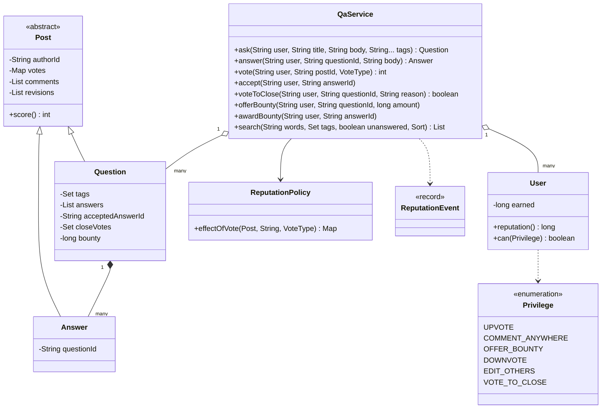
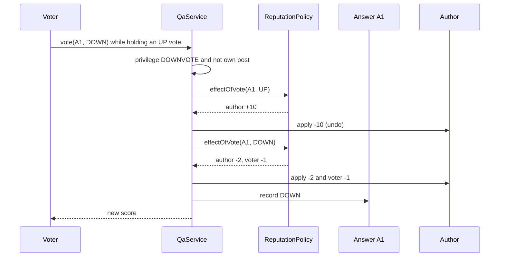
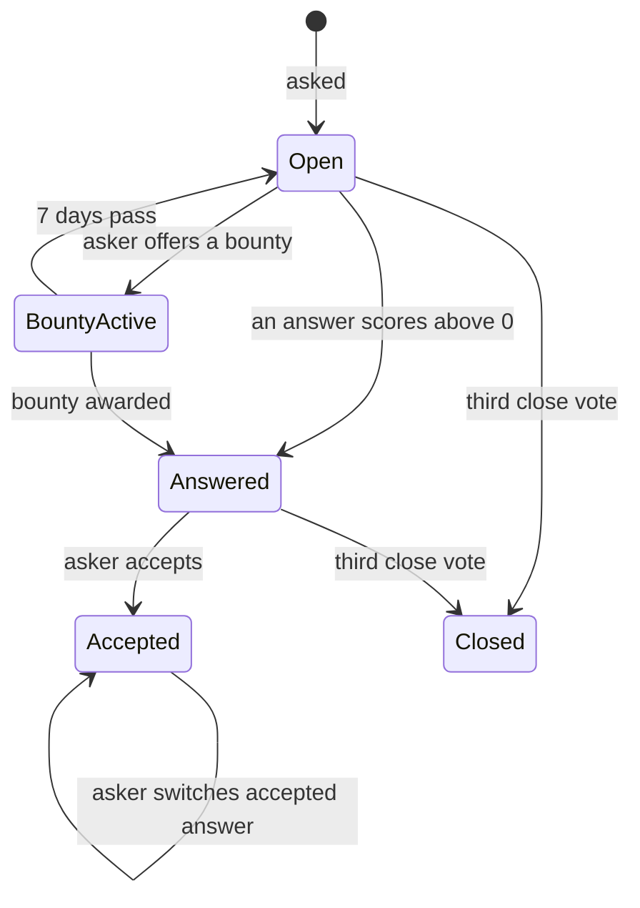

# ❓ Design Stack Overflow (Q&A Platform) — Low Level Design (Java)


%20%7C%20Strategy%20%7C%20Facade-purple)

> Questions, answers, votes. The design interview is about the **economy behind them**: reputation earned
> from others' votes, **privileges** unlocked by reputation, votes that can be **changed or undone
> without breaking anyone's score**, accepted answers, community **closing**, **bounties**, edit history
> and search by words and tags.

> 📚 **Credit:** Problem inspired by
> [AlgoMaster — Design Stack Overflow](https://algomaster.io/learn/lld/design-stack-overflow)
> (premium lesson, **not** accessed). Everything here is my own original work, based on how public Q&A
> sites behave. Reputation numbers are illustrative. See [References & Credits](#-references--credits).

---

## 📑 On this page

1. [Scoping the Problem](#1-scoping-the-problem)
2. [Finding the Building Blocks](#2-finding-the-building-blocks)
3. [Object Model](#3-object-model)
   - [3.1 Class Responsibilities](#31-class-responsibilities)
   - [3.2 Patterns in Play](#32-patterns-in-play)
   - [3.3 UML Diagrams](#33-uml-diagrams)
   - [Practice Round](#-practice-round)
4. [Implementation Walkthrough](#4-implementation-walkthrough)
5. [Build, Run & Verify](#5-build-run--verify)
6. [Follow-up Scenarios](#6-follow-up-scenarios)
   - [6.1 Reputation You Can Undo](#61-reputation-you-can-undo)
   - [6.2 Trust Instead of Roles](#62-trust-instead-of-roles)
   - [6.3 Finding the Right Question](#63-finding-the-right-question)
7. [Last-Minute Revision](#7-last-minute-revision)
- [References & Credits](#-references--credits)

---

## 1. Scoping the Problem

### 🗣️ Sample conversation

| Candidate asks | Interviewer answers | Design impact |
|---|---|---|
| What can be voted on? | Questions and answers, one vote per user, changeable. | `Post` base class with a vote map. |
| How is reputation earned? | +10 per upvote, −2 per downvote received, −1 to downvote an answer, +15/+2 for accept. | `ReputationPolicy` returning per-user deltas. |
| Can votes be undone? | Yes, and reputation must follow exactly. | Apply the negated effect; reputation = 1 + sum of events. |
| Who can do what? | Reputation thresholds: upvote 15, comment 50, downvote 125, edit 2000, close 3000. | `Privilege` enum. |
| Accepted answer? | The asker picks one and can change it. | Move the accept bonus. |
| Duplicates? | Three trusted users vote to close. | Close votes on `Question`. |
| Bounties? | The asker pays reputation to attract answers, awarded within 7 days. | Offer (paid now) / award. |
| Search? | Words, tags, sort by votes / newest / activity, unanswered filter. | Inverted indexes. |

### ✅ Functional requirements

1. Ask (title ≥ 10 chars, 1–5 tags), answer (not on closed questions), comment (privilege outside own thread).
2. Vote up/down; repeat = undo; opposite = switch; not on own posts; privilege checks.
3. Accept / change accepted answer (no reputation for accepting your own).
4. Close by 3 votes from users with the privilege.
5. Bounty: offer 50–500 (asker, affordable), award to someone else's answer within 7 days.
6. Edit with revision history (author or high-reputation users); re-index on edit.
7. Search with all-words matching, tags, sorting, "unanswered"; answers shown accepted → score → age.
8. Per-user reputation history.

### ⚙️ Non-functional requirements

- Reputation always equals the sum of its history (auditable, reversible).
- Votes and their reputation effects change together (atomic).
- Deterministic ordering for listings.

---

## 2. Finding the Building Blocks

| Noun / verb | Becomes |
|---|---|
| member, reputation | `User` |
| question, answer | `Question`, `Answer` extend `Post` |
| vote | `VoteType` in the post's vote map |
| comment, edit | `Comment`, `Revision` |
| reputation rules | `ReputationPolicy`, `ReputationEvent` |
| thresholds | `Privilege` |
| site | `QaService` (facade) |

---

## 3. Object Model

### 3.1 Class Responsibilities

#### `QaService`
- Privilege checks, all writes, reputation application (with history), search indexes.

#### `Post` (abstract) → `Question`, `Answer`
- Shared: author, revisions, comments, votes, score, last activity.
- `Question`: title, tags, answers, accepted answer, close votes, views, bounty.

#### `ReputationPolicy`
- `effectOfVote(post, voter, vote)` → map of user → delta. Undo = negated map.

#### `User`
- Sum of deltas; reputation shown as `max(1, 1 + sum)`; `can(Privilege)`.

### 3.2 Patterns in Play

| Pattern | Where | Why |
|---|---|---|
| **Inheritance for shared behaviour** | `Post` | Votes, comments, edits work the same on questions and answers. |
| **Strategy** | `ReputationPolicy` | Sites tune the numbers. |
| **Facade** | `QaService` | One place for rules. |
| **Event log** | `ReputationEvent` history | Auditable, reversible reputation. |
| **Inverted index** | word/tag → question ids | Fast search. |

**SOLID check**

- **S**: posts hold content, policy prices votes, service enforces rules.
- **O**: new privilege = enum value; new vote effect = new policy.
- **L**: `Question` and `Answer` are interchangeable wherever a `Post` is voted, commented or edited.
- **I**: the policy exposes only what rules need.
- **D**: the service depends on `ReputationPolicy` and `Clock`.

### 3.3 UML Diagrams

#### Class diagram



#### Sequence: switching a vote



#### Question lifecycle



### 🧠 Practice Round

1. A user upvotes, then changes to a downvote, then removes it. How do you keep reputation right?
   <details><summary>Hint</summary>Express each vote as a map of reputation deltas. Undo = apply the negated map of the old vote, then apply the new one.</details>
2. Reputation can't go below 1. How does that interact with undo?
   <details><summary>Hint</summary>Store the raw sum; only the displayed value is floored. Then undo is exact.</details>
3. Why cost the voter 1 point for downvoting an answer?
   <details><summary>Hint</summary>To make downvotes deliberate; questions are exempt so bad questions still get feedback.</details>
4. The asker switches the accepted answer. What happens to the +15 and +2?
   <details><summary>Hint</summary>Reverse the old accept effect, apply the new one: the asker's +2 moves, not doubles.</details>
5. How would you implement "unanswered"?
   <details><summary>Hint</summary>No accepted answer and no answer with a positive score.</details>

---

## 4. Implementation Walkthrough

### 📁 Project structure

```
StackOverflow/
├── pom.xml
└── src/
    ├── main/java/com/lld/social/qa/
    │   ├── QaApp.java                      # a week on a small Q&A site
    │   ├── model/                          # User, Privilege, Post, Question, Answer, Comment, Revision, VoteType, QaException
    │   └── service/                        # QaService, ReputationPolicy, ReputationEvent, ManualClock
    └── test/java/com/lld/social/qa/
        └── QaServiceTest.java
```

### 🗳️ Vote = undo old effect + apply new effect

```java
VoteType previous = p.voteOf(userId).orElse(null);
VoteType next = previous == vote ? null : vote;                  // same vote again = undo
if (previous != null) apply(negate(rep.effectOfVote(p, userId, previous)), "vote undone", p.id());
if (next != null)     apply(rep.effectOfVote(p, userId, next), "upvote/downvote", p.id());
p.setVote(userId, next);
```

### 💯 Reputation as a sum

```java
public synchronized long reputation() { return Math.max(1, 1 + earned); }   // earned = sum of events
```

### 🔎 Search

```java
for (String w : tokens(words))  ids = intersect(ids, wordIndex.get(w));   // all words
for (String t : tags)           ids = intersect(ids, tagIndex.get(t));
if (unansweredOnly) remove questions with an accepted or positively scored answer;
sort by VOTES | NEWEST | ACTIVE, then id
```

### ⏱️ Complexity

| Operation | Cost |
|---|---|
| vote / accept | O(1) |
| ask / edit | O(words) indexing |
| search | O(matching ids · log) |
| answersOf | O(a log a) |

---

## 5. Build, Run & Verify

### With Maven

```bash
cd Social-and-Content-Platform/StackOverflow
mvn test
mvn compile exec:java
```

### Without Maven (plain JDK 17+)

```bash
cd Social-and-Content-Platform/StackOverflow
javac -d out $(find src/main -name "*.java")
java -cp out com.lld.social.qa.QaApp
```

### Demo output

```
> Nia asks; newcomers can ask and answer but not vote yet
   Q1 [+0] Why does HashMap iteration order change? [java, hashmap] answers=0

> Answers, votes and an accepted answer
   [refused] Nia needs 15 reputation to vote UP
   [refused] You can't vote on your own post
   answers as shown: [A2 by omar score 2, A1 by pia score -1]
   Nia 13, Omar 3035, Pia 199

> Changing your mind reverses the reputation exactly
   Omar removes his downvote: Pia 199 -> 201
   Mods-2 switches up -> down: Pia now 199, score -1

> Comments need 50 reputation outside your own threads
   Nia comments under an answer to her own question: C1
   [refused] Nia needs 50 reputation to comment here

> A duplicate question gets closed by three trusted users
   mod1 votes to close -> 1/3
   mod2 votes to close -> 2/3
   mod3 votes to close -> CLOSED
   [refused] Q3 is closed: duplicate of Q1

> Bounty: Pia pays 50 reputation to get a better answer to her question
   Pia 299 -> 249, Omar got +50

> Edits keep history; only authors or 2000+ rep may edit
   [refused] Pia can only edit their own posts
   rev 1 by nia: Why does HashMap iteration order change? (original)
   rev 2 by omar: Why does HashMap iteration order change after adding entries? (clarified title)

> Omar's reputation history
   +3000 association bonus (-)
   +10 upvote (A2)
   +10 upvote (A2)
   -1 downvote (A1)
   +15 accepted answer (A2)
   +1 vote DOWN undone (A1)
   +50 bounty awarded (A3)
```

### ✅ What the tests cover

| Area | Tests |
|---|---|
| Posting | title/tag validation, tag order kept, empty answers; comment privilege vs own thread; edit permission and revisions; unique views |
| Voting | privileges (15 up, 125 down) and own-post rule; exact reputation maths incl. floor at 1; up → down → up → undo returns everyone to the start and reputation = 1 + history; accept moves bonuses; self-accept earns nothing; answer ordering |
| Moderation | 3 trusted close votes, one per user, no answers or votes on closed; bounty validation, payment, award, no self-award, single bounty; expiry after 7 days |
| Search | any-order all-words, tags (case-insensitive), votes/newest/activity sorts, unanswered filter, re-index after edit |
| Properties | 2,000 random votes by 10 users on 3 posts: reputation always equals history, score equals the vote map |
| Concurrency | 100 parallel upvotes → score 100, author +1000 |

**16 tests, all passing.**

---

## 6. Follow-up Scenarios

### 6.1 Reputation You Can Undo

- Keep an **event log** of reputation changes; the balance is derived (cached per user).
- Votes are the source of truth; reputation effects are a pure function of them, so a policy change can
  be re-applied by replaying.
- Real sites add a daily cap (e.g. max reputation per day from votes) and reverse votes from fraud rings.

### 6.2 Trust Instead of Roles

- Privileges are thresholds, not roles: moderation scales with the community.
- Close/reopen needs several votes, preventing single-user abuse; moderators can act alone.
- Edits by others go through review below a threshold (suggested edits queue).

### 6.3 Finding the Right Question

- Inverted index for words, a tag index for filters; production uses a search engine with ranking
  (text relevance × votes × recency) and duplicate detection when asking.
- "Hot" questions: score decaying with age (views, answers, votes per hour).

### 🚀 More follow-ups to practice

1. **Badges** (first answer, 10 accepted answers, famous question) as event listeners.
2. **Reopen votes**, **protected questions**, **locked posts**.
3. **Vote fraud detection** (serial voting between the same users).
4. **Notifications** for answers, comments and mentions.
5. **Caching** hot questions and pagination with cursors.

---

## 7. Last-Minute Revision

- `Post` base for questions/answers: votes (one per user), comments, revisions, score.
- Reputation = 1 + sum of events (floored at 1); vote effects as delta maps; undo = negate.
- Privileges by reputation thresholds; no voting on own posts.
- Accept: asker only, switching moves bonuses; self-accept gives nothing.
- Close with 3 privileged votes; closed questions take no answers.
- Bounty paid upfront, awarded within 7 days to someone else's answer.
- Search: word + tag inverted indexes, all words must match, sort by votes/newest/activity.

---

## 📚 References & Credits

| Resource | How it was used |
|---|---|
| [AlgoMaster.io — Design Stack Overflow (LLD)](https://algomaster.io/learn/lld/design-stack-overflow) | Inspiration for the **problem choice** only. The lesson is premium and was **not** accessed. |
| [Stack Overflow — Help Center: What is reputation?](https://stackoverflow.com/help/whats-reputation) | Public description of reputation and privileges (numbers here are simplified). |
| [Inverted index — Wikipedia](https://en.wikipedia.org/wiki/Inverted_index) | Public background for search. |
| [Mermaid](https://mermaid.js.org/) | Diagrams rendered by GitHub. |
| [JUnit 5 User Guide](https://junit.org/junit5/docs/current/user-guide/) | Testing. |

**Originality statement**

- This repository is a **personal learning project** for LLD interview preparation.
- The AlgoMaster lesson is premium content that I have not accessed. No text, code, diagrams,
  headings or other material from it (or any paid source) is reproduced here.
- All headings, source code, explanations, tables, diagrams, tests and exercises were written
  independently from publicly known behaviour and the public references above.
- "Stack Overflow" is used only as the common name of this interview problem; this project is not
  affiliated with Stack Exchange Inc. or with AlgoMaster.io.
- For the original lesson, please support the author at [algomaster.io](https://algomaster.io).

---

> ⭐ Try the Practice Round before reading the code, then compare your design with this one.
